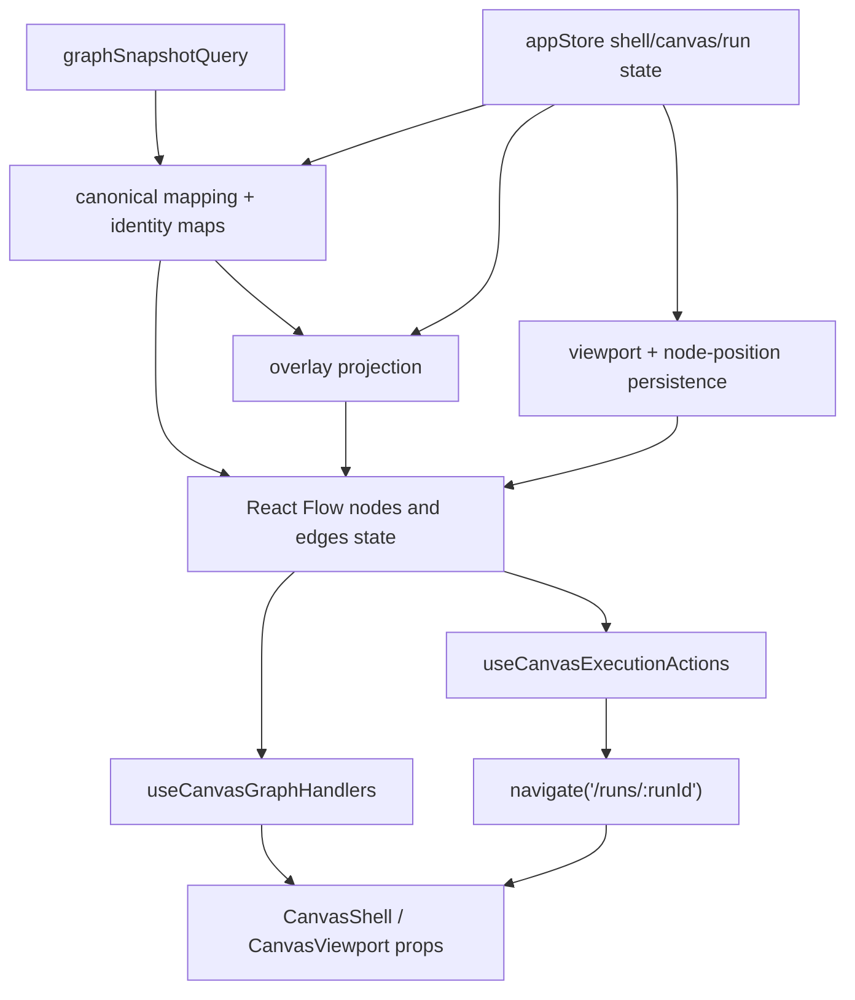
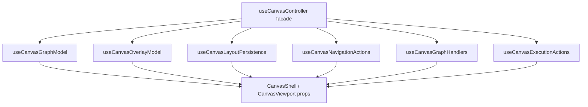
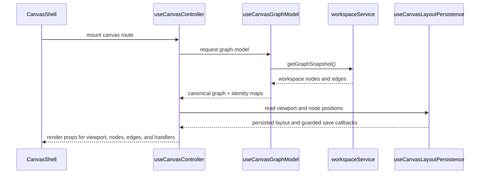
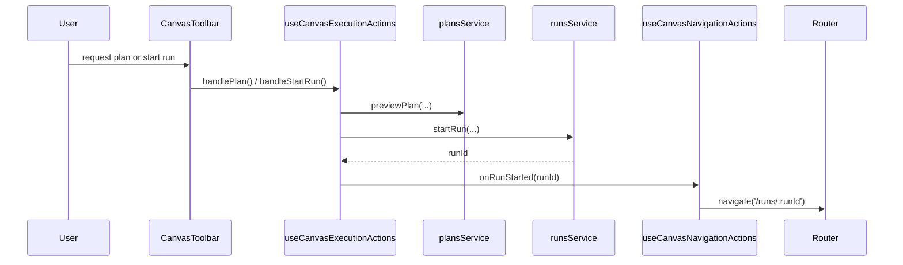

# Canvas Controller Current To Target Architecture

## Purpose

This document freezes the current truth, the remediation target, and the
non-goals for the `useCanvasController` slice in `apps/web`.

It is the focused technical source of truth for the controller hardening chain
under `F-05`.

## Current Code Anchors

Primary implementation anchors:

- [useCanvasController.ts](../../../../apps/web/src/app/views/canvas/useCanvasController.ts)
- [useCanvasGraphHandlers.ts](../../../../apps/web/src/app/views/canvas/useCanvasGraphHandlers.ts)
- [useCanvasExecutionActions.ts](../../../../apps/web/src/app/views/canvas/useCanvasExecutionActions.ts)
- [CanvasShell.tsx](../../../../apps/web/src/app/views/canvas/CanvasShell.tsx)
- [CanvasViewport.tsx](../../../../apps/web/src/app/views/canvas/CanvasViewport.tsx)

## Current Responsibility Inventory

`useCanvasController` currently owns too many concerns in one hook:

| Responsibility                 | Current ownership in controller                                             | Why it matters                                                  |
| ------------------------------ | --------------------------------------------------------------------------- | --------------------------------------------------------------- |
| Query ownership                | Runs the workspace graph query through TanStack Query                       | Server-state acquisition and UI composition are coupled         |
| Canonical mapping              | Maps workspace nodes and edges into canonical graph types and identity maps | Graph truth and rendering prep are mixed                        |
| Overlay projection             | Builds runtime, impact, and cost overlay projections                        | Overlay policy is coupled to graph hydration                    |
| Layout persistence             | Reads persisted viewport and node positions and writes them back            | Persistence rules are mixed with render sync                    |
| Selection and inspector wiring | Binds selected nodes, inspector node, and panel toggles                     | UI coordination is mixed with graph derivation                  |
| Run navigation side effects    | Navigates to `/runs/:runId` after execution start                           | Route side effects are coupled to graph controller state        |
| Execution orchestration        | Composes planning and run-start actions with selection context              | Controller acts as both graph facade and execution orchestrator |

## Current Topology

## Current Architecture Drifts

The hard QA pass identified these active drifts:

- multi-responsibility controller:
  query, mapping, overlay policy, persistence, selection wiring, and navigation
  live in one hook
- graph sync cost:
  node synchronization performs repeated lookup against current node arrays
  instead of using a stable identity map
- runtime diagnostics in hot paths:
  `console.debug` is present in sync and persistence-related paths
- thin invariant coverage:
  tests are mostly happy-path wiring checks and do not freeze pending, error,
  or persistence guards

These are design and maintainability issues first, not new feature work.

## Invariants To Preserve

- overlays never mutate canonical graph truth
- layout persistence never writes while hydration or graph query readiness is
  incomplete
- route navigation remains an explicit side effect owned outside graph
  projection
- the route-facing workbench contract stays explicit and readable instead of
  being hidden behind opaque command bags
- graph query, overlay projection, and layout persistence stay separable enough
  to test independently
- graph handlers and execution actions remain reusable hooks rather than being
  inlined back into the controller

## Target Decomposition

The target state is a slim composition facade:

- `useCanvasGraphModel`
  owns graph query consumption, canonical node or edge mapping, and graph
  identity maps
- `useCanvasOverlayModel`
  owns overlay mode, runtime or cost decoration projection, and overlay
  fallback rules
- `useCanvasLayoutPersistence`
  owns viewport equality checks, node-position persistence, and readiness
  guards
- `useCanvasNavigationActions`
  owns route-only side effects such as post-run navigation
- `useCanvasGraphHandlers`
  remains the owner of graph interaction commands
- `useCanvasExecutionActions`
  remains the owner of plan and run action orchestration
- `useCanvasController`
  becomes a composition facade that assembles the above into route-facing props

## Operational Sequences

### Graph load to render and persistence

### Plan and run to route transition

## Non-Goals For This Remediation

This controller remediation does not:

- complete the full `F-05` store decomposition
- standardize the full `F-06` query-key or invalidation policy
- redesign the canvas UX or add new panels
- change runtime route contracts
- add live-log or execution-console convergence

## Architectural Position

This slice belongs under the `F-05` convergence chain because the actual defect
is responsibility concentration around canvas and store-facing orchestration.

It is not a standalone feature. It is a controller and state-boundary hardening
step that should leave the user workflow intact while making future extraction
and TDD safer.
