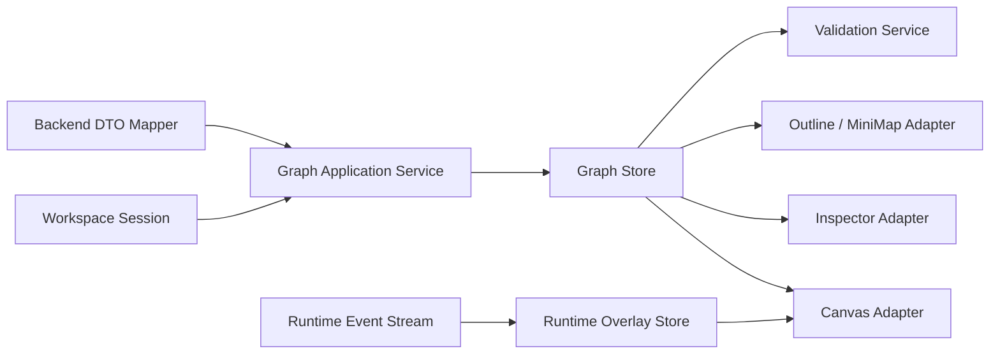
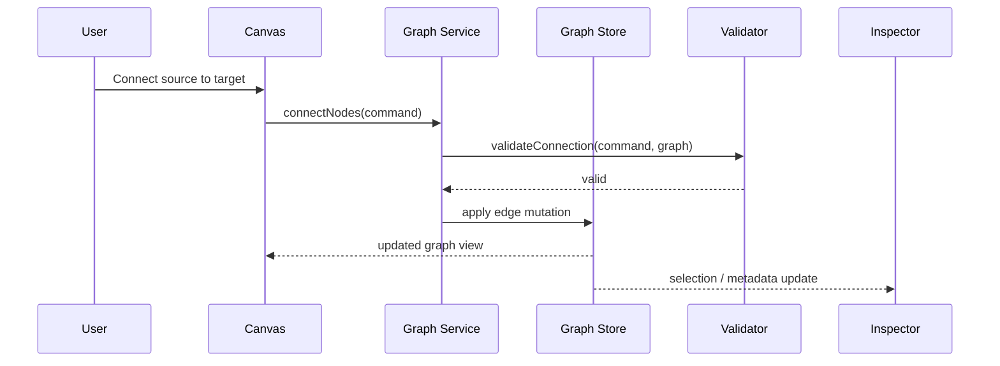
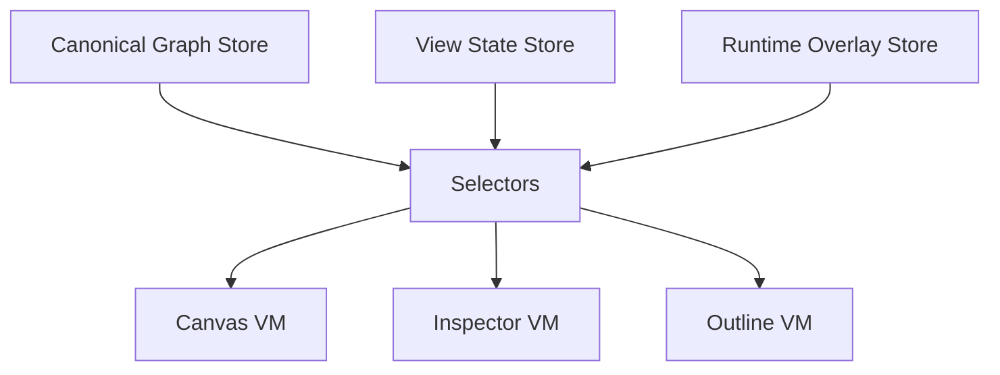

# Graph — Frontend Architecture

## 1. Purpose

The **Graph** is the canonical visual and operational representation of the workflow structure in the frontend. It provides the directed model used by the workspace to:

- represent nodes and edges,
- validate structural correctness,
- drive layout and interaction,
- project execution state into the UI,
- support selection, navigation, filtering, and inspection,
- decouple visual composition from domain and runtime concerns.

The Graph is not the execution engine. It is the **frontend structural model** used to represent, edit, inspect, and reason about workflow topology.

---

## 2. Architectural Role

Within the frontend architecture, the Graph sits between:

- the **workspace session**, which owns the current editing context,
- the **canvas/workbench**, which renders topology,
- the **inspector and side panels**, which read and mutate selected entities,
- the **application services**, which apply commands and enforce invariants,
- the **backend contracts**, which import/export canonical topology.

The Graph must therefore be treated as a **domain-facing UI model**, not as a temporary React Flow-only structure.

---

## 3. Core Responsibilities

### 3.1 Structural Representation

The Graph must represent:

- workflow nodes,
- ports / handles / connection points,
- directed edges,
- grouping or containment relationships if required,
- graph-level metadata.

### 3.2 Editing Support

The Graph must support:

- add/remove node,
- connect/disconnect nodes,
- move nodes,
- update labels and metadata,
- batch changes,
- undo/redo friendly deltas.

### 3.3 Validation Support

The Graph must expose enough information to validate:

- orphan nodes,
- invalid edge directions,
- missing required inputs,
- cycles where forbidden,
- duplicated identifiers,
- incompatible node-to-node contracts.

### 3.4 Projection of Runtime State

The Graph should accept runtime overlays without mutating canonical structure:

- execution status,
- warnings and errors,
- step timing,
- selection/highlight,
- lineage emphasis,
- partial run focus.

This separation is critical: **structure is canonical; runtime decoration is derived**.

---

## 4. Design Principles

### 4.1 Graph Is Domain-Oriented, Not Library-Oriented

React Flow, ELK, dagre, or any other UI/layout library must remain adapter-level concerns. The internal Graph model must not be shaped primarily by a rendering library.

### 4.2 Stable Identity

Every node and edge must have a stable identifier. IDs must not depend on render order, viewport position, or transient UI state.

### 4.3 Immutable Update Path

Changes to the Graph should be applied through explicit commands or reducers, returning new state snapshots or deterministic patches.

### 4.4 Separation of Concerns

The Graph must be split conceptually into:

- **canonical graph model**,
- **view model**,
- **runtime overlays**,
- **interaction state**.

### 4.5 Deterministic Serialization

The Graph should serialize predictably so that diffing, audit, persistence, and Git-based comparison remain clean and meaningful.

---

## 5. Recommended Model

## 5.1 Canonical Graph Model

```ts
export interface GraphModel {
  graphId: string;
  version: string;
  nodes: Record<string, GraphNode>;
  edges: Record<string, GraphEdge>;
  metadata: GraphMetadata;
}

export interface GraphNode {
  id: string;
  type: NodeType;
  name: string;
  position: NodePosition;
  ports: GraphPort[];
  configRef?: string;
  metadata: Record<string, unknown>;
}

export interface GraphEdge {
  id: string;
  sourceNodeId: string;
  sourcePortId: string;
  targetNodeId: string;
  targetPortId: string;
  kind: EdgeType;
  metadata: Record<string, unknown>;
}

export interface GraphPort {
  id: string;
  direction: 'input' | 'output';
  name: string;
  contract?: string;
}

export interface NodePosition {
  x: number;
  y: number;
}

export interface GraphMetadata {
  name?: string;
  description?: string;
  tags?: string[];
}
```

This model is deliberately independent of React Flow.

---

## 5.2 View Model

The view model contains projection-only concerns:

```ts
export interface GraphViewState {
  viewport: Viewport;
  selectedNodeIds: string[];
  selectedEdgeIds: string[];
  collapsedGroups: string[];
  hiddenNodeIds: string[];
  searchQuery?: string;
}
```

This data should never pollute canonical graph persistence.

---

## 5.3 Runtime Overlay

```ts
export interface GraphRuntimeOverlay {
  nodeStatus: Record<string, RuntimeNodeStatus>;
  edgeStatus: Record<string, RuntimeEdgeStatus>;
  runId?: string;
}

export interface RuntimeNodeStatus {
  status: 'idle' | 'queued' | 'running' | 'success' | 'warning' | 'failed';
  startedAt?: string;
  endedAt?: string;
  message?: string;
}

export interface RuntimeEdgeStatus {
  highlighted?: boolean;
  traversed?: boolean;
}
```

---

## 6. Bounded Context Within the Frontend

The Graph should be treated as its own bounded area with explicit interfaces.

### 6.1 Inbound Dependencies

The Graph consumes:

- workflow/project data,
- imported dbt or workflow topology,
- workspace commands,
- backend validation results,
- runtime updates.

### 6.2 Outbound Dependencies

The Graph exposes:

- topology to the canvas,
- selection context to inspector panels,
- structural deltas to application services,
- serialized graph payloads for persistence,
- adjacency/dependency queries for planners or analyzers.

---

## 7. High-Level Component View



---

## 8. Suggested Internal Modules

### 8.1 Graph Domain Types

Holds the canonical interfaces and invariants.

### 8.2 Graph Store

Owns the current graph snapshot and exposes selectors.

### 8.3 Graph Commands

Encapsulates mutations such as:

- createNode,
- removeNode,
- connectNodes,
- disconnectEdge,
- moveNode,
- renameNode,
- applyLayout.

### 8.4 Graph Selectors

Provides derived read access:

- getUpstreamNodes,
- getDownstreamNodes,
- getNodeDegree,
- getRoots,
- getLeaves,
- getConnectedSubgraph,
- getInvalidEdges.

### 8.5 Graph Validators

Performs local structural checks independent of backend execution semantics.

### 8.6 Graph Mappers

Transforms between:

- backend DTOs,
- frontend canonical graph,
- rendering library data structures.

This mapper layer is mandatory if React Flow is used.

---

## 9. Suggested Command Flow



---

## 10. Structural Invariants

The following frontend invariants should be enforced before persistence whenever possible:

1. Node IDs are unique.
2. Edge IDs are unique.
3. An edge always references existing source and target nodes.
4. An edge always references valid ports.
5. Port direction compatibility must be respected.
6. Self-loops are forbidden unless explicitly supported.
7. Duplicate equivalent edges should be rejected unless multi-edge is part of the model.
8. Node type constraints must be enforced locally when known.

These checks reduce invalid states and lower the burden on backend validation.

---

## 11. Interaction Model

The Graph must support several interaction layers without coupling them together:

### 11.1 Structural Interaction

- create,
- connect,
- delete,
- group,
- align,
- layout.

### 11.2 Navigational Interaction

- zoom,
- pan,
- focus node,
- minimap,
- jump to dependency.

### 11.3 Analytical Interaction

- highlight upstream/downstream,
- trace lineage,
- filter by type/state,
- detect disconnected areas,
- inspect subgraph.

### 11.4 Runtime Interaction

- show live status,
- focus running path,
- open failing node,
- inspect logs and metrics.

---

## 12. Relationship With DBT Mode

For DBT mode, the Graph is not authored from scratch in the same way as ETL freeform mode. It is primarily a projection of imported topology from dbt artifacts.

Therefore the architecture should distinguish between:

- **authored graph mode**: user creates and edits structure directly,
- **imported graph mode**: structure is derived from canonical artifacts and only certain layers are editable,
- **hybrid graph mode**: imported core with user-authored overlays or annotations.

This distinction avoids mixing editable UI assumptions with artifact-derived truth.

---

## 13. Risks If Poorly Designed

If the Graph is implemented as a thin React Flow object bag, the likely failures are:

- library lock-in,
- unstable serialization,
- poor diff quality,
- runtime and structure mixed together,
- hard-to-test mutations,
- weak invariants,
- backend DTO drift,
- inability to support multiple modes cleanly.

That would degrade maintainability quickly.

---

## 14. Recommended State Split

A practical split for strict frontend architecture is:



This is preferable to a single monolithic store because it prevents accidental coupling between persistence, UI, and runtime concerns.

---

## 15. Testing Strategy

The Graph area should be tested at four levels.

### 15.1 Domain Tests

Validate invariants and structural rules.

### 15.2 Selector Tests

Validate traversal and derived queries.

### 15.3 Command Tests

Validate deterministic mutations.

### 15.4 Adapter Tests

Validate mapping to/from React Flow or other visual libraries.

At minimum, negative tests should cover:

- invalid source/target,
- duplicate IDs,
- invalid port directions,
- stale references,
- malformed imported topology,
- cycle insertion where forbidden.

---

## 16. Recommended Folder Shape

```text
src/
  modules/
    graph/
      domain/
        GraphModel.ts
        GraphNode.ts
        GraphEdge.ts
        GraphInvariants.ts
      application/
        GraphCommands.ts
        GraphSelectors.ts
        GraphValidationService.ts
      infrastructure/
        ReactFlowGraphMapper.ts
        BackendGraphMapper.ts
      state/
        graphStore.ts
        graphViewStore.ts
        graphRuntimeStore.ts
      tests/
        domain/
        application/
        infrastructure/
```

---

## 17. Position in the Product Roadmap

The Graph is not a cosmetic concern. It is one of the structural cores of the frontend. If it is designed well early:

- DBT mode becomes easier to project,
- ETL mode becomes easier to author,
- observer mode becomes easier to overlay,
- Git diff and audit views become cleaner,
- testing remains tractable,
- future plugins can map into a stable topology contract.

If it is designed poorly, almost every advanced UI mode becomes expensive.

---

## 18. Final Recommendation

The correct approach is to build the Graph as a **first-class frontend domain module** with:

- canonical types,
- explicit commands,
- deterministic selectors,
- separate runtime overlays,
- clear adapters for rendering libraries,
- strong invariant enforcement.

This should be implemented before deep visual sophistication. A visually rich graph on top of a weak model will not scale.
