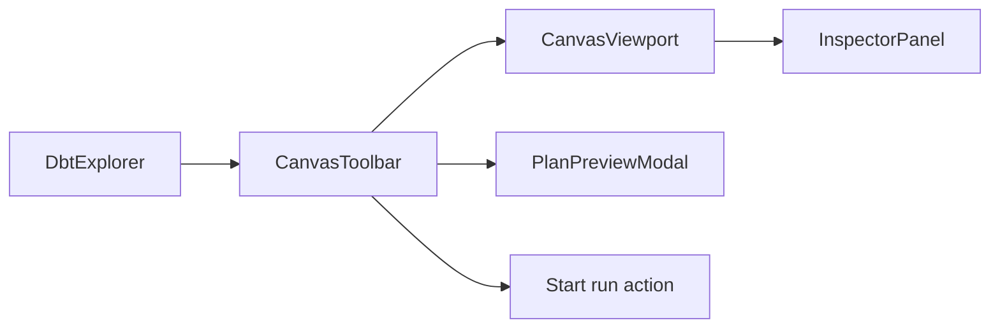

# Graph Frontend Architecture

## Purpose

The Graph surface is the main authoring and structural analysis workspace of the
DVT frontend.

Its current responsibility is to present workflow topology, overlays, and
selection-driven interaction without becoming the source of execution truth.

## Current Implementation

Primary code anchors:

- [Canvas.tsx](../../../../apps/web/src/app/views/Canvas.tsx)
- [CanvasShell.tsx](../../../../apps/web/src/app/views/canvas/CanvasShell.tsx)
- [CanvasViewport.tsx](../../../../apps/web/src/app/views/canvas/CanvasViewport.tsx)
- [CanvasToolbar.tsx](../../../../apps/web/src/app/views/canvas/CanvasToolbar.tsx)
- [useCanvasController.ts](../../../../apps/web/src/app/views/canvas/useCanvasController.ts)
- [canvasNodeMapper.ts](../../../../apps/web/src/app/views/canvas/canvasNodeMapper.ts)
- [graphStrategyRegistry.ts](../../../../apps/web/src/app/plugins/graphStrategyRegistry.ts)

Current route: `/canvas`

Current composition:

## Current Responsibilities

- render the graph through `@xyflow/react`;
- map canonical graph data into canvas nodes and edges;
- keep viewport and node positions persistent per workspace context;
- expose graph overlays such as impact, runtime, and column-level lineage;
- drive selection into the Inspector panel;
- allow plan and run actions from the current graph context.

## UX Rules

- explorer and inspector are optional side surfaces, not required blockers for
  graph interaction;
- graph actions should be available even when side panels are hidden;
- overlays are visual projections over canonical graph state;
- runtime and cost overlays must not mutate topology;
- fit, pan, zoom, minimap, and grid are graph affordances, not product-domain
  state.

## Mature Libraries And References

- rendering primitive:
  [React Flow](https://reactflow.dev/)
- workbench precedent:
  [VS Code](https://github.com/microsoft/vscode)

Use React Flow as a rendering and interaction primitive only. Keep DVT graph
concepts behind canonical types and mappers.

## Current Constraints

- the app store still leaks too much shell and run state into the same global
  store;
- the legacy `GraphCanvas` path still exists in the codebase and should be
  retired so the active graph stack is singular;
- current graph maturity is strongest for dbt topology; broader multi-domain
  graph semantics remain planned.

## Related Pages

- [Main Workspace Views And UX](../main-workspace-views-and-ux.md)
- [UX Implementation Guide](../ux-implementation-guide.md)
- [Library And Open-Source Reference Stack](../library-and-open-source-reference-stack.md)
