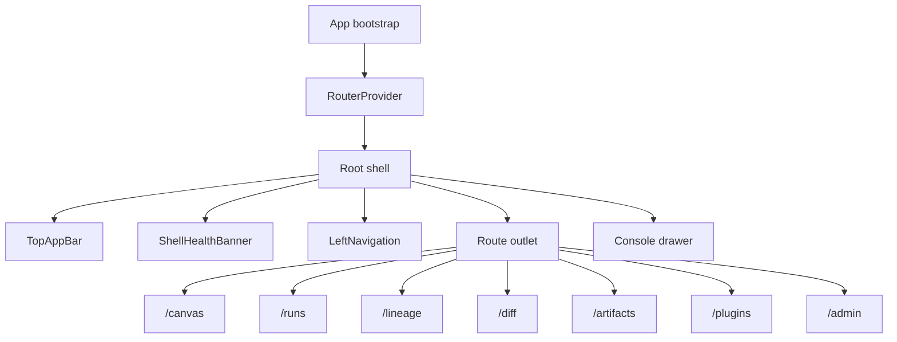

# Frontend Architecture

This page is the canonical entry point for the DVT frontend architecture
surface.

Use it to answer four questions quickly:

1. what the frontend actually ships today;
2. which views make up the main workbench;
3. how those views relate to each other;
4. which libraries and mature open-source patterns the frontend should build on.

## Current Reality

- `apps/web` is a real browser application with a persistent shell, plugin-based
  routing, and working Canvas, Runs, Lineage, Diff, and Artifacts views.
- The shell is partially backend-backed today: platform health is real, while
  several feature views still mix API data and mock-oriented paths.
- The main UX is already workbench-shaped, but the documentation had lagged
  behind the implementation and was too abstract to explain the real product
  behavior.
- The next missing route-level slice is a governed execution-template and
  source-generation workbench for producing execution artifacts such as
  Snowflake tasks, procedures, and ETL scaffolds.

## Current Shell Topology

## Main Views

| View      | Current route           | Current role                                                           |
| --------- | ----------------------- | ---------------------------------------------------------------------- |
| Canvas    | `/canvas`               | Main graph workbench with explorer, viewport, overlays, and inspector  |
| Runs      | `/runs`, `/runs/:runId` | Operational run list and run detail workbench                          |
| Lineage   | `/lineage`              | Dependency and impact analysis surface derived from the graph snapshot |
| Diff      | `/diff`                 | Early change-review surface for graph, SQL, and catalog deltas         |
| Artifacts | `/artifacts`            | Artifact browser and local manifest import surface                     |
| Plugins   | `/plugins`              | Installed-plugin inspection and configuration shell route              |
| Admin     | `/admin`                | Administrative shell route                                             |

## Next Governed Slice

The main workbench still lacks a dedicated source-generation surface.

That future route-level workbench should cover:

- execution-template selection and provider-profile choice;
- parameterized generation of source artifacts such as Snowflake tasks,
  procedures, and ETL scaffolds;
- preview and diff of generated source before export or apply;
- traceability back to the selected template, version, and workflow context.

## Canonical Reading Order

1. [Main Workspace Views And UX](main-workspace-views-and-ux.md)
2. [Screen Manuals And User Stories](screen-manuals-and-user-stories.md)
3. [Frontend Data-Boundary Architecture](frontend-data-boundary-architecture.md)
4. [Frontend Runtime Modes User Manual](frontend-runtime-modes-user-manual.md)
5. [UX Implementation Guide](ux-implementation-guide.md)
6. [Library And Open-Source Reference Stack](library-and-open-source-reference-stack.md)
7. [App Shell](appshell/app-shell.md)
8. [Graph Frontend Architecture](graph/graph-frontend-architecture.md)
9. [Inspector](inspector/inspector-frontend-architecture.md)
10. [Runs](runs/dvt-runs-frontend-architecture.md)
11. [Lineage](lineage/dvt-frontend-lineage.md)
12. [Git Mode Architecture](git/git-mode-architecture.md)
13. [Frontend Observability Architecture](observability/front-observability-architecture-dvt.md)
14. [Frontend Artifacts](artifacts/front-artifacts.md)
15. [apps/web](../components/web-app/index.md)
16. [@dvt/web package surface](../components/web/index.md)

## Current Code Anchors

- App bootstrap:
  [main.tsx](../../../apps/web/src/main.tsx)
- Shell wiring:
  [App.tsx](../../../apps/web/src/app/App.tsx),
  [Root.tsx](../../../apps/web/src/app/Root.tsx),
  [routes.ts](../../../apps/web/src/app/routes.ts)
- Shell chrome:
  [TopAppBar.tsx](../../../apps/web/src/app/components/TopAppBar.tsx),
  [LeftNavigation.tsx](../../../apps/web/src/app/components/LeftNavigation.tsx),
  [Console.tsx](../../../apps/web/src/app/components/Console.tsx)
- Main workbench:
  [Canvas.tsx](../../../apps/web/src/app/views/Canvas.tsx),
  [CanvasShell.tsx](../../../apps/web/src/app/views/canvas/CanvasShell.tsx),
  [useCanvasController.ts](../../../apps/web/src/app/views/canvas/useCanvasController.ts)
- Operational views:
  [RunsView.tsx](../../../apps/web/src/app/views/RunsView.tsx),
  [LineageView.tsx](../../../apps/web/src/app/views/LineageView.tsx),
  [DiffView.tsx](../../../apps/web/src/app/views/DiffView.tsx),
  [ArtifactsView.tsx](../../../apps/web/src/app/views/ArtifactsView.tsx)

## Architecture Rules

- The frontend consumes `apps/api`; it is not a second execution authority.
- Views should consume client services, capabilities, and typed mappers instead
  of reading mock data directly.
- The workbench must separate shell state, view-local UI state, and server
  state. The current global app store is still too broad and remains an active
  cleanup target.
- Mature libraries and open-source precedents should be preferred over
  home-grown primitives for graphing, tables, editors, accessibility,
  observability widgets, and workbench layout patterns.

## Current Gaps

- The shell and workbench are real, but some capability docs were still
  describing target architecture instead of current behavior.
- Several feature views still rely on placeholder or mock-backed data paths.
- The workspace has local frontend tests, but no governed `test` script or
  dedicated CI lane yet.
- The frontend still needs stricter contract alignment with the protected API
  runtime surface, especially around run start and richer run diagnostics.
- The frontend still lacks a first-class execution-template and code-generation
  workbench, so generation intent is not yet modeled as a governed UX surface.

## Related Pages

- [UI / Visualization Domain](../domain-ui.md)
- [DVT Component Map](../component-map.md)
- [System Delivery Status](../system-delivery-status.md)
- [Canonical Doc Code Matrix](../../planning/status/canonical-doc-code-matrix.md)
