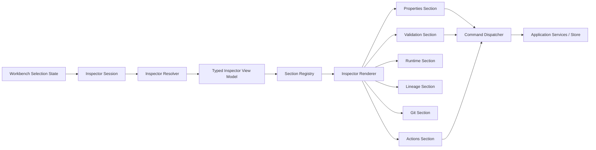
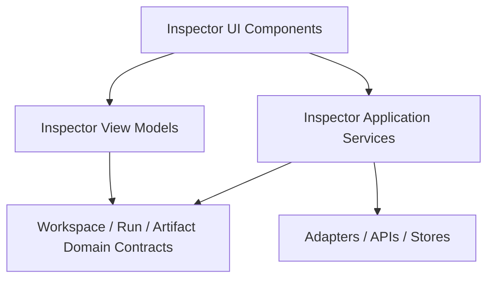
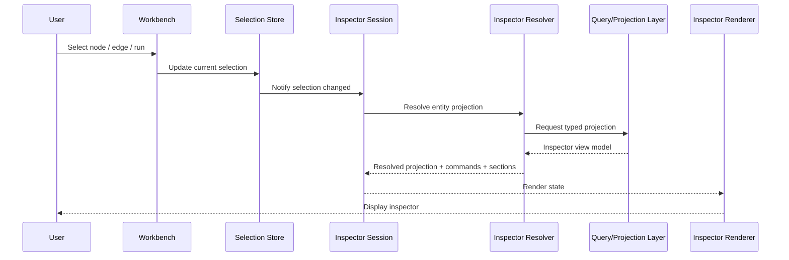
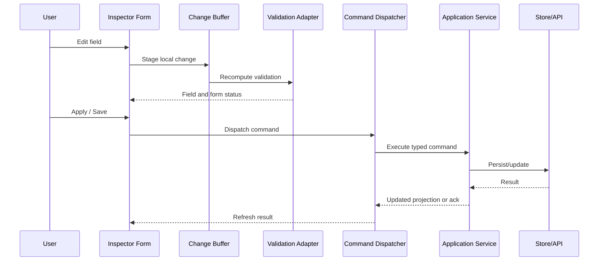
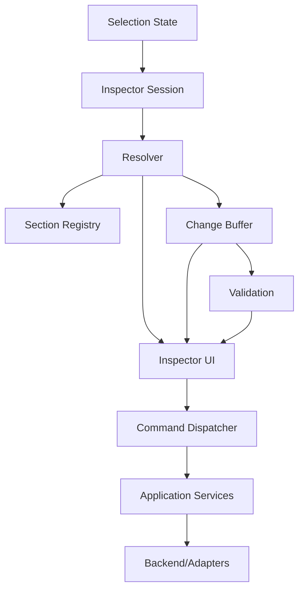

# Inspector

## 1. Purpose

The **Inspector** is the contextual analysis and editing surface of the DVT+ frontend.  
Its responsibility is to expose the **selected object** in the workspace and provide a deterministic, structured and auditable way to:

- inspect metadata
- edit configuration
- view derived state
- validate input
- expose runtime diagnostics
- surface lineage, policy and execution-related information without mixing concerns with the canvas

The Inspector is not the source of truth for execution and it must not contain orchestration logic.  
It is a **projection and command surface** over selected domain entities.

Current implementation posture is tracked in
[Frontend Current Reality Matrix](../review/frontend-current-reality-matrix.md).
This document defines the target Inspector capability, not current
implementation completeness.

---

## 2. Architectural intent

The Inspector exists to solve four problems:

1. **Selection-driven detail view**  
   The canvas and surrounding surfaces operate at graph level; the Inspector operates at entity level.

2. **Safe editing boundary**  
   Changes must be expressed as explicit user intents over a known entity, never as uncontrolled UI mutation.

3. **Mode-aware presentation**  
   The same object may need different perspectives depending on the active mode:
   - ETL
   - dbt
   - Git
   - Room/Observer
   - runtime inspection

4. **Deterministic UI composition**  
   The panel must render from typed descriptors and domain projections, not from ad hoc component branching scattered through the app.

---

## 3. Scope

## In scope

- visualisation of the currently selected entity
- property editing
- validation feedback
- read-only runtime metadata
- inspector tabs/sections
- contextual actions tied to the selected entity
- rendering different schemas by entity type
- controlled command dispatch to application services
- displaying diagnostics and derived read models

## Out of scope

- graph layout
- workflow execution
- persistence rules
- domain planning logic
- background polling strategy as a local panel concern
- direct infrastructure access from leaf components

---

## 4. Core principle

The Inspector should follow this rule:

> **Selection drives projection. Projection drives rendering. User intent drives commands.**

That implies:

- selection state is external to the Inspector
- Inspector components are consumers of typed view models
- edits are translated into commands
- validation is explicit
- save/apply/revert behaviour is modelled, not implicit

---

## 5. What the Inspector inspects

The Inspector should support at least these entity families:

- workflow
- node
- edge
- group / lane / domain area
- artifact
- run
- execution step
- source definition
- target definition
- contract / test / policy attachment
- Git-related object
- observer/runtime object

Each entity type should expose a dedicated **Inspector schema** rather than relying on one oversized generic renderer.

---

## 6. High-level component model



---

## 7. Domain position inside the frontend

The Inspector belongs to the **presentation/application boundary**, but it depends on frontend domain contracts.

### Suggested layering



### Interpretation

- **UI** renders fields, sections and actions
- **View Models** provide typed shape for rendering
- **Application Services** translate UI intent into commands
- **Domain Contracts** define entities and invariants
- **Infrastructure** persists or fetches data through proper adapters

---

## 8. Inspector session

A useful architectural unit is the **Inspector Session**.

It should represent:

- current selected entity id
- current selected entity type
- source context
- mode context
- loaded projection
- dirty state
- validation state
- async loading state
- section expansion state
- command availability

### Example state shape

```ts
type InspectorSessionState = {
  selection: {
    entityId: string | null;
    entityType: InspectorEntityType | null;
  };
  mode: InspectorMode;
  status: 'idle' | 'loading' | 'ready' | 'error';
  dirty: boolean;
  readonly: boolean;
  activeSection: string | null;
  projection: InspectorViewModel | null;
  validation: ValidationSummary;
  availableCommands: InspectorCommandDescriptor[];
};
```

---

## 9. Recommended internal modules

## 9.1 Inspector Resolver

Resolves selection + mode into a typed view model.

Responsibilities:

- identify correct schema for entity type
- retrieve or derive projection
- merge static metadata with dynamic read models
- handle missing or unsupported entities cleanly

## 9.2 Section Registry

Maps entity type and mode to visible sections.

Responsibilities:

- order sections deterministically
- enable feature flags
- avoid hardcoded `if/else` branching across the UI tree

## 9.3 Command Dispatcher

Translates user actions into application-level commands.

Responsibilities:

- validate intent payload shape
- dispatch save/apply/reset/open/diff/reveal actions
- isolate UI from store/API specifics

## 9.4 Validation Adapter

Presents validation results consistently.

Responsibilities:

- field-level validation
- cross-field validation
- server/domain validation feedback
- warning/error severity model

## 9.5 Change Buffer

Tracks editable state before commit.

Responsibilities:

- local staged changes
- diff from original projection
- revert/reset
- dirty flag generation

---

## 10. Suggested inspector sections

The exact composition depends on entity type, but the canonical section families should be:

| Section    | Purpose                                           |
| ---------- | ------------------------------------------------- |
| Overview   | Identity, type, status, summary                   |
| Properties | Editable structured fields                        |
| Schema     | Columns, fields, signatures, contracts            |
| Runtime    | Execution state, timestamps, metrics, diagnostics |
| Lineage    | Inputs, outputs, upstream/downstream references   |
| Validation | Errors, warnings, policy checks                   |
| SQL / Code | Generated or linked code projection               |
| Git        | File mapping, diff status, branch context         |
| History    | Changes, events, derived timeline                 |
| Actions    | Allowed user operations                           |

---

## 11. Selection to render flow



---

## 12. Edit flow



---

## 13. View model strategy

The Inspector should not consume raw backend payloads directly.  
It should render a normalized **InspectorViewModel**.

### Base contract

```ts
type InspectorViewModel = {
  entityId: string;
  entityType: InspectorEntityType;
  title: string;
  subtitle?: string;
  badges: InspectorBadge[];
  summary: InspectorSummaryItem[];
  sections: InspectorSectionViewModel[];
  commandBar: InspectorCommandDescriptor[];
  readonly: boolean;
};
```

### Why this matters

This prevents:

- backend payload leakage into UI
- duplicated rendering rules
- mode-specific hacks in leaf components
- field rendering inconsistency across entity types

---

## 14. Editing model

A robust Inspector should support three editing modes:

1. **Read-only**
   - for runtime entities, immutable artifacts, archived runs

2. **Buffered editing**
   - user edits locally, then applies

3. **Immediate command mode**
   - action toggles dispatch immediately for safe atomic controls

Not all fields should behave the same way.  
For example:

- text fields: buffered
- toggles with low risk: immediate or buffered depending on policy
- destructive actions: explicit command with confirmation boundary
- generated fields: read-only

---

## 15. Validation model

Validation must be layered:

### Client validation

- required fields
- primitive constraints
- format checks
- enum membership

### Domain validation

- invalid combinations
- policy restrictions
- naming conventions
- forbidden mutations by state

### Server validation

- concurrency conflicts
- stale version conflict
- permission denials
- external contract mismatch

The Inspector should surface these separately.  
Do not flatten all failures into one generic error banner.

---

## 16. Inspector and workspace relationship

The Inspector should be decoupled from the canvas, but coordinated through shared session state.

### Key rule

The canvas owns **spatial interaction**.  
The Inspector owns **entity introspection and mutation**.

That means:

- canvas selection changes inspector content
- inspector edits may update canvas labels or status
- neither should directly embed the other's state machine

---

## 17. Recommended frontend contracts

Suggested TypeScript contracts:

```ts
type InspectorEntityType =
  | 'workflow'
  | 'node'
  | 'edge'
  | 'group'
  | 'artifact'
  | 'run'
  | 'step'
  | 'source'
  | 'target';

type InspectorMode = 'default' | 'etl' | 'dbt' | 'git' | 'observer' | 'runtime';

type InspectorCommandDescriptor = {
  id: string;
  label: string;
  kind: 'primary' | 'secondary' | 'danger';
  enabled: boolean;
  reasonDisabled?: string;
};

type ValidationSummary = {
  hasErrors: boolean;
  hasWarnings: boolean;
  errors: number;
  warnings: number;
};
```

---

## 18. UX requirements

The Inspector should satisfy these product requirements:

- deterministic section ordering
- stable keyboard navigation
- no hidden mutation on blur unless explicitly designed
- visible dirty state
- explicit reset/revert
- readable diffs for generated content when applicable
- clear empty state when nothing is selected
- responsive rendering for large metadata payloads
- support for long SQL/code bodies without collapsing the whole panel performance

---

## 19. Empty, unsupported and error states

These states must be first-class.

### Empty state

When no entity is selected:

- show a neutral placeholder
- optionally explain supported selections
- avoid generic “nothing here” UX waste

### Unsupported entity state

When selection type exists but no inspector is registered:

- show explicit unsupported message
- expose entity identity for debugging
- do not crash panel rendering

### Error state

When projection loading fails:

- preserve selected entity context
- show retry if meaningful
- distinguish fetch failure from schema/render failure

---

## 20. Performance considerations

The Inspector can become a silent bottleneck.  
Main risks:

- large schema payloads
- repeated projection recomputation
- monolithic rerenders on every keystroke
- expensive derived diff views
- runtime metrics over-polling

### Mitigations

- memoized section-level rendering
- virtualization for large field lists
- decoupled loading per heavy section
- cached normalized projections
- strict selector usage in store subscriptions
- avoid raw JSON rendering by default for large objects

---

## 21. Security and governance considerations

Because the Inspector can expose operational and structural metadata, it must respect:

- RBAC on visible sections
- field-level edit permissions where needed
- masked secrets
- audit-friendly command paths
- immutable runtime evidence where applicable

The Inspector must never display editable secret values after initial entry unless product policy explicitly permits it.

---

## 22. Risks if designed poorly

| Risk                             | Consequence                              |
| -------------------------------- | ---------------------------------------- |
| Generic catch-all inspector      | Unmaintainable branching and weak typing |
| Direct backend payload rendering | Drift and accidental coupling            |
| No edit buffer                   | Hidden writes and bad UX                 |
| No command abstraction           | UI locked to one store/API approach      |
| Mixed runtime + config logic     | Conceptual confusion and bugs            |
| No state isolation               | Selection race conditions and stale data |
| Overloaded side panel            | Poor usability and performance collapse  |

---

## 23. Recommended roadmap

## Phase 1 — Minimal viable inspector

- selection-driven panel
- overview section
- properties section
- basic typed entity registry
- empty/loading/error states

## Phase 2 — Structured editing

- change buffer
- validation summary
- save/revert flow
- command bar
- mode-aware sections

## Phase 3 — Runtime and diagnostics

- runtime section
- validation diagnostics
- lineage section
- history/timeline projection

## Phase 4 — Advanced capabilities

- Git-aware section
- diff views
- schema virtualization
- plugin section contributions
- inspector extension API

---

## 24. Target architecture summary



---

## 25. Final recommendation

The Inspector should be treated as a **first-class frontend subsystem**, not as a side panel full of miscellaneous forms.

A correct implementation will make the product:

- easier to extend
- easier to validate
- safer to edit
- more deterministic
- more aligned with the overall DVT+ doctrine of explicit state, explicit intent and controlled mutation

A weak implementation will quickly turn it into one of the most expensive parts of the frontend to maintain.

For DVT+, the Inspector should become the **canonical entity detail surface** of the workspace.
