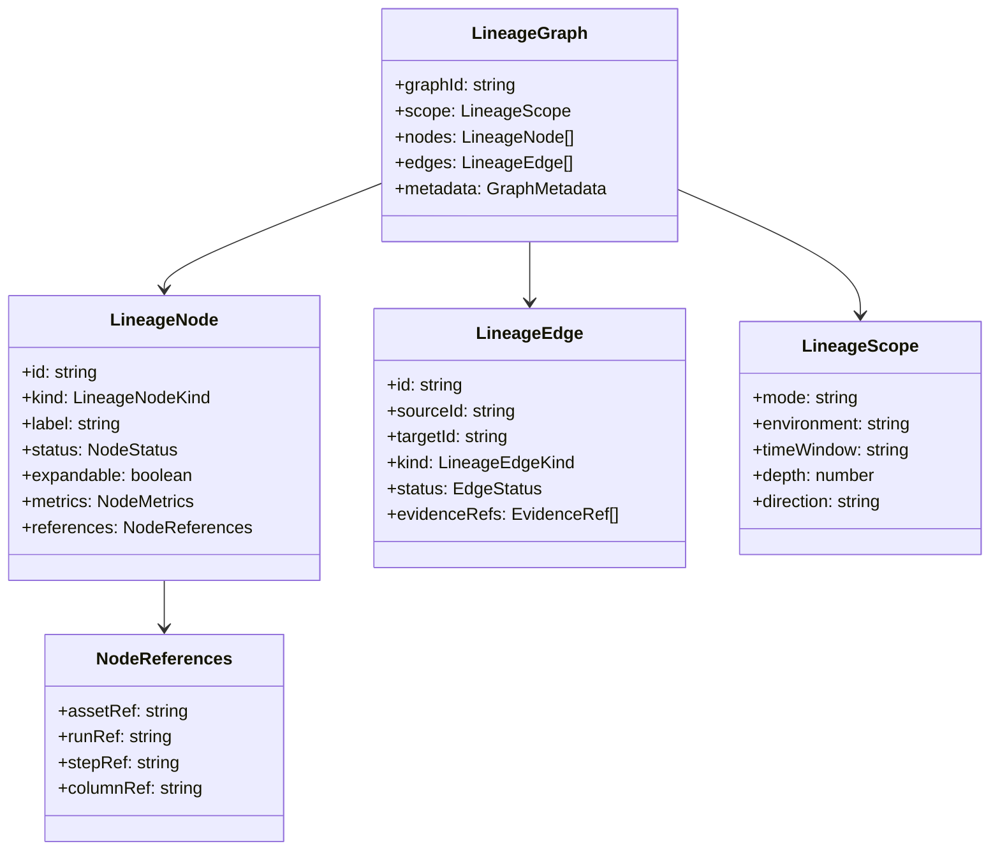
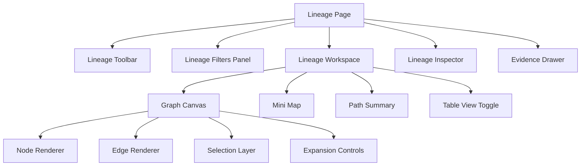
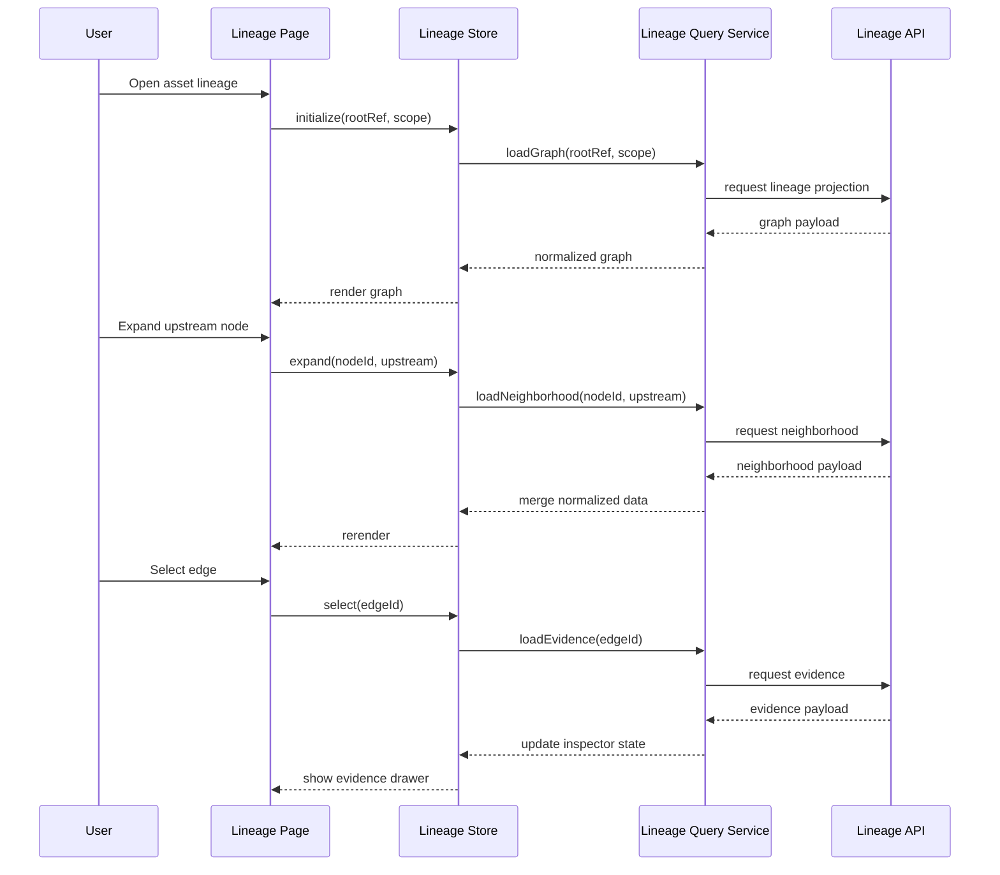
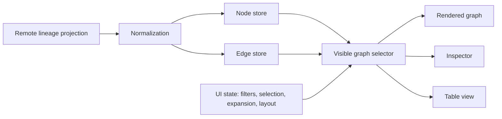
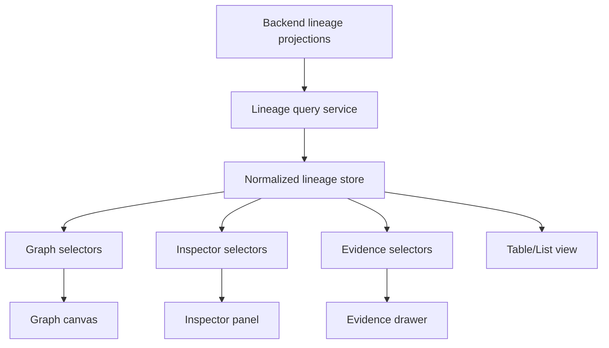

# DVT+ Frontend Lineage

## 1. Purpose

The **Lineage** capability in DVT+ is the frontend surface used to represent how data, execution artifacts, and transformations relate across the platform.

Its purpose is not merely visual. In DVT+, lineage is a **read model for traceability**. It must support:

- understanding upstream and downstream impact,
- navigating dependencies across workflows and assets,
- explaining why a run affected a given object,
- linking execution evidence to structural relationships,
- enabling audit, debugging, and change analysis.

Lineage is therefore a product capability with architectural weight, not a
decorative graph.

Current implementation posture is tracked in
[Frontend Current Reality Matrix](../review/frontend-current-reality-matrix.md).
This document defines the target Lineage capability, not a claim that the full
lineage model is already implemented in code today.

---

## 2. Scope

At frontend level, Lineage should cover four related but distinct views:

1. **Asset lineage**  
   Relationships between data assets such as sources, models, tables, views, snapshots, exports, or derived datasets.

2. **Execution lineage**  
   Relationships between runs, steps, attempts, statuses, and emitted events.

3. **Column lineage**  
   Fine-grained lineage between input and output fields when available.

4. **Operational lineage**  
   Observability-oriented lineage connecting execution, metrics, logs, and failures to assets and edges.

These views share a graph substrate, but they are not the same domain projection and should not be forced into a single flat model.

---

## 3. Architectural intent

The frontend lineage module should follow these principles:

- **Read-only by default**: lineage is primarily an exploration and analysis surface.
- **State-driven UI**: rendering must be driven by normalized graph/query state, not widget-local mutations.
- **Progressive detail**: load summary lineage first, then hydrate node/edge details on demand.
- **Projection-based**: frontend consumes lineage projections, not raw engine internals.
- **Mode-aware**: lineage behavior changes depending on ETL mode, dbt mode, run inspection mode, and observer mode.
- **Deterministic navigation**: graph IDs, filters, and deep links must be stable and shareable.
- **Scalable rendering**: large graphs must degrade gracefully through clustering, expansion, paging, and level-of-detail strategies.

---

## 4. Functional goals

The Lineage surface should allow the user to:

- locate an asset and inspect its immediate neighborhood,
- expand upstream or downstream dependencies,
- pivot from an asset to the runs that produced or consumed it,
- inspect why a dependency exists,
- compare logical lineage vs execution reality,
- identify critical paths and blast radius,
- inspect failed or delayed edges/nodes,
- move between graph view, tabular view, and evidence view,
- deep-link to a selected node, run, or edge,
- filter by environment, tenant, workflow, run, status, time window, or asset type.

---

## 5. Domain model (frontend view)

The frontend should not depend directly on backend-specific payload shapes.  
Instead, it should work with a stable UI-oriented lineage model.

### Recommended node kinds

- source
- model
- seed
- snapshot
- table
- view
- export
- api
- file
- run
- step
- test
- metric
- column
- external-system

### Recommended edge kinds

- reads-from
- writes-to
- transforms-to
- triggers
- materializes
- validates
- emits
- fails
- enriches
- derives-column-from

---

## 6. Separation of concerns

The Lineage module should be split into the following layers:

### 6.1 Query layer

Responsible for fetching lineage projections and node/edge details.

Typical responsibilities:

- graph query by root asset or run,
- neighborhood expansion,
- pagination/windowing,
- lazy hydration of details,
- cache invalidation,
- polling or refresh for run-aware views.

### 6.2 Domain/state layer

Responsible for normalized client state:

- node index,
- edge index,
- selection state,
- expansion state,
- filters,
- active path,
- pinned nodes,
- layout preferences,
- current projection type.

### 6.3 Graph orchestration layer

Responsible for translating domain state into a renderable graph:

- build graph subsets,
- collapse/expand groups,
- apply layout engine,
- compute visibility and importance,
- derive styling flags from status and metrics.

### 6.4 Presentation layer

Responsible for UI composition:

- graph canvas,
- minimap,
- filters panel,
- inspector panel,
- evidence side panel,
- path analysis panel,
- table/list fallback views.

---

## 7. Proposed component structure

### Main UI blocks

- **Lineage Page**: route-level container.
- **Toolbar**: root search, direction, depth, mode, reset, refresh.
- **Filters Panel**: status, asset type, environment, workflow, run, time range.
- **Graph Canvas**: main visual graph.
- **Inspector**: selected node/edge details.
- **Evidence Drawer**: logs, events, metrics, tests, compiled SQL, lineage facets.
- **Table View**: fallback for large or accessibility-heavy analysis.

---

## 8. Interaction model

Key interactions should be explicit and deterministic.

---

## 9. State model

A practical frontend lineage state should separate graph data from UI state.

### Minimum state slices

- `graphById`
- `nodesById`
- `edgesById`
- `rootContext`
- `selection`
- `expandedNodes`
- `collapsedGroups`
- `filters`
- `layoutState`
- `loadingState`
- `errorState`
- `evidenceState`

---

## 10. Layout strategy

Lineage graphs become unreadable quickly if layout is left uncontrolled.  
The UI needs explicit policies.

### Recommended layout policies

- **DAG / layered layout** for standard asset lineage.
- **Execution timeline or layered-by-stage layout** for run lineage.
- **Column lineage localized overlay** rather than full-screen graph by default.
- **Clustered/group layout** for high-fanout systems.
- **Manual pinning** for analyst workflows.

### Practical rule

Do not attempt to render the full universe graph by default.  
Always start from a root and a bounded scope:

- depth,
- direction,
- environment,
- time window,
- node limit.

---

## 11. Scalability constraints

This capability will hit UI scale limits early unless constrained.

### Risks

- large node counts,
- excessive edge crossing,
- layout cost,
- inspector overfetch,
- frontend memory pressure,
- unreadable dense neighborhoods,
- over-eager polling in run-aware mode.

### Mitigations

- neighborhood expansion instead of full recursive expansion,
- edge and node caps,
- virtualized inspectors/tables,
- server-side aggregation,
- collapsed supernodes,
- deferred column lineage loading,
- selective polling only for run-sensitive subgraphs,
- memoized selectors and stable IDs.

---

## 12. Relationship to observability

Lineage in DVT+ should be connected to observability, but not merged blindly.

A node or edge should be able to expose:

- last successful run,
- last failed run,
- duration statistics,
- data volume indicators,
- freshness indicators,
- test status,
- lineage evidence references,
- OpenLineage-related metadata when available.

This enables the graph to answer not only **what depends on what**, but also **what is currently unhealthy**.

---

## 13. Relationship to backend lineage sources

The frontend should be projection-oriented and source-agnostic.  
Possible backend sources include:

- dbt artifacts,
- execution events,
- OpenLineage-derived projections,
- engine-specific lineage resolvers,
- static metadata catalogs.

The frontend must not encode assumptions specific to a single source.  
Instead, adapters or backend projection services should normalize to a stable API contract.

---

## 14. Suggested route and module boundaries

### Suggested routes

- `/lineage`
- `/lineage/assets/:assetId`
- `/lineage/runs/:runId`
- `/lineage/columns/:columnId`
- `/lineage/impact/:assetId`
- `/lineage/diff/:leftRef/:rightRef`

### Suggested frontend modules

- `modules/lineage/domain`
- `modules/lineage/application`
- `modules/lineage/infrastructure`
- `modules/lineage/ui`
- `modules/lineage/components`
- `modules/lineage/routes`

This keeps lineage as a product module rather than scattering graph concerns across the app shell.

---

## 15. View modes

The same lineage engine should support multiple view modes.

| View mode     | Primary goal                      | Main root    |
| ------------- | --------------------------------- | ------------ |
| Asset mode    | dependency analysis               | asset        |
| Run mode      | operational debugging             | run          |
| Column mode   | field-level explanation           | column       |
| Impact mode   | blast radius                      | asset        |
| Observer mode | live health and execution context | run/workflow |

The view mode should alter defaults for:

- layout,
- inspector content,
- filters,
- evidence priorities,
- refresh policy.

---

## 16. UX rules

To keep the feature useful:

1. The selected object must always have a clear inspector.
2. Every visual edge should be explainable.
3. Users must be able to switch from graph to list/table instantly.
4. Expansion must be explicit; do not auto-explode deep graphs.
5. Status and evidence should be visible without overwhelming the canvas.
6. Deep links must preserve filters and selection.
7. Errors and missing lineage should be shown explicitly, not hidden.

---

## 17. Minimum viable lineage for first serious release

A realistic first serious slice should include:

- asset-level lineage graph,
- upstream/downstream expansion,
- filters by type/status/environment,
- node/edge inspector,
- deep links,
- run linkage for selected assets,
- table fallback,
- bounded depth and pagination,
- stable graph contract,
- basic observability badges.

Do **not** start with full column lineage unless the contracts and performance model are already clear.

---

## 18. Recommended phased roadmap

### Phase 1 — Foundational lineage

- asset graph,
- normalized state,
- inspector,
- deep links,
- bounded expansion.

### Phase 2 — Run-aware lineage

- run overlays,
- status badges,
- evidence drawer,
- refresh/polling rules.

### Phase 3 — Impact analysis

- blast radius mode,
- critical path visualization,
- affected assets and runs.

### Phase 4 — Column lineage

- field-level drilldown,
- selective overlay,
- mapping evidence.

### Phase 5 — Cross-source lineage federation

- dbt + engine + external metadata projection merge,
- stronger explanation and provenance model.

---

## 19. Main architectural risks

| Risk                              | Why it matters                  | Mitigation                                 |
| --------------------------------- | ------------------------------- | ------------------------------------------ |
| Mixing asset and execution graphs | leads to incoherent semantics   | keep projection types explicit             |
| Full-graph rendering              | fails at scale                  | root-bounded neighborhoods only            |
| Backend-specific UI assumptions   | causes drift and lock-in        | stable lineage API contract                |
| Overloaded inspector              | makes analysis harder           | progressive disclosure                     |
| Column lineage too early          | high complexity and cost        | defer until contracts are mature           |
| Unstable IDs                      | breaks deep-linking and caching | canonical identifiers                      |
| UI-owned graph truth              | causes inconsistencies          | backend projection remains source of truth |

---

## 20. Target architecture summary

The correct architectural direction is:

- backend owns lineage projection truth,
- frontend owns exploration state and visualization,
- graph rendering is a projection of normalized state,
- evidence is attached on demand,
- scale is managed through bounded expansion and multiple analysis modes.

---

## 21. Conclusion

Lineage should be treated as one of the core analytic surfaces in DVT+, alongside runs, graph/workspace, and app shell navigation.

If designed correctly, it becomes the main interface for:

- dependency reasoning,
- audit investigation,
- failure analysis,
- impact assessment,
- operational understanding.

If designed poorly, it degenerates into an unreadable graph widget.

The difference is architectural discipline: stable contracts, explicit projection types, bounded rendering, and strict separation between query, state, orchestration, and presentation.
