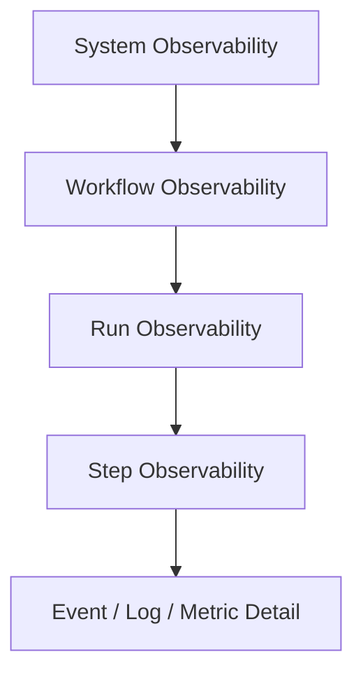
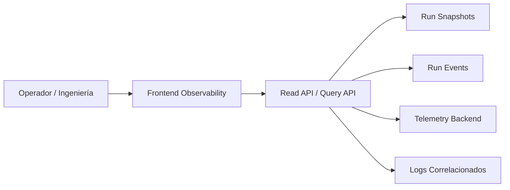
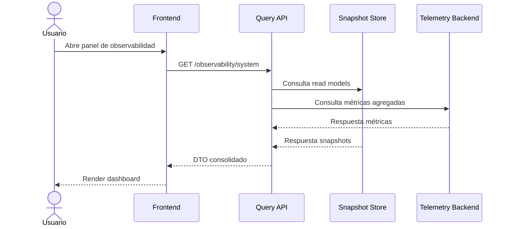
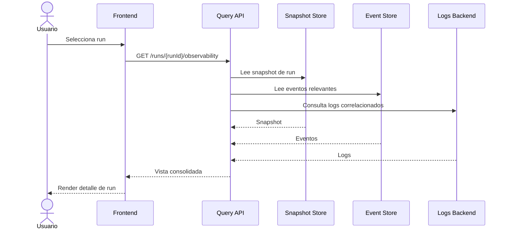

# Arquitectura de Front Observability

## DVT+ — Observabilidad de ejecución de workflows

## 1. Propósito

Este documento define la arquitectura de **Front Observability** en DVT+ entendida como la **capa de visualización, consulta y explotación operativa de métricas de ejecución de workflows**.

Aquí **observability no significa telemetría del navegador** ni analítica de clicks.  
Aquí significa:

- vigilar ejecuciones de workflows;
- seguir el estado de runs y steps;
- exponer métricas operativas;
- detectar cuellos de botella, lag, retries y fallos;
- ofrecer una vista fiable para operación, soporte y análisis.

El frontend **no genera verdad operativa**.  
La verdad operativa reside en el backend, sus eventos, snapshots y sistemas de telemetría.

---

## 2. Objetivos arquitectónicos

### 2.1 Objetivo principal

Construir una capa frontend que funcione como **panel de control auditable de ejecución** para workflows, runs, steps y señales operativas, sin duplicar la lógica del engine.

### 2.2 Objetivos secundarios

- Separar claramente **observación** de **ejecución**.
- Consumir **read models** y no recalcular estado de dominio en cliente.
- Permitir inspección a varios niveles:
  - sistema,
  - workflow,
  - run,
  - step,
  - evento/log asociado.
- Soportar vistas en tiempo casi real sin romper consistencia.
- Preparar una base extensible para métricas de coste, rendimiento, SLA y capacidad.

---

## 3. Principios de diseño

## 3.1 Read-only by design

El frontend observa.  
No decide estado de ejecución.  
No reconstruye el dominio.  
No corrige inconsistencias.

## 3.2 Snapshot-first

La fuente preferente para pintar estado es el **snapshot/read model**.  
Los streams y eventos en vivo complementan, pero no sustituyen, a la vista consistente.

## 3.3 Backend computes, frontend renders

Las métricas, agregaciones, correlaciones y derivaciones deben ocurrir en backend o en el sistema de telemetría.  
El frontend solo:

- consulta,
- filtra,
- ordena,
- representa.

## 3.4 Determinismo visual

La misma entrada debe producir la misma representación visual.  
No debe haber heurísticas ocultas en cliente para “adivinar” estados.

## 3.5 Progressive depth

La UI debe ofrecer observación en capas:

1. resumen global;
2. detalle de run;
3. detalle de step;
4. detalle de evento/log/métrica.

## 3.6 Operational signal over noise

No todo dato merece ser pintado.  
Debe priorizarse:

- estado,
- duración,
- retries,
- lag,
- errores,
- capacidad,
- coste,
- anomalías relevantes.

---

## 4. Alcance

## 4.1 Incluido

- monitorización de runs;
- monitorización de steps;
- timelines de ejecución;
- métricas de duración;
- retries;
- colas / backlog / lag;
- frescura del snapshot;
- errores operativos;
- vistas de logs correlacionados;
- filtros por workflow, entorno, estado, rango temporal.

## 4.2 Excluido

- telemetría de UX pura;
- heatmaps;
- click analytics;
- generación de métricas de dominio en navegador;
- lógica de scheduling;
- lógica de recovery;
- reconciliación de estado del engine.

---

## 5. Stakeholders

| Rol              | Necesidad principal                                     |
| ---------------- | ------------------------------------------------------- |
| Operación        | Ver rápidamente qué falla, qué se retrasa y dónde       |
| Ingeniería       | Inspeccionar runs, steps, eventos y latencias           |
| Arquitectura     | Entender capacidad, cuellos de botella y deriva         |
| Soporte          | Encontrar evidencia de ejecución y correlación temporal |
| Producto técnico | Seguir comportamiento de workflows y su salud operativa |

---

## 6. Modelo conceptual

La observabilidad frontend se articula sobre cuatro capas lógicas:

1. **System Observability**  
   Salud general del sistema, backlog, lag, saturación, staleness.

2. **Workflow Observability**  
   Estado agregado por workflow o familia de workflows.

3. **Run Observability**  
   Vista completa de una ejecución concreta.

4. **Step Observability**  
   Detalle fino de cada paso dentro de la ejecución.



---

## 7. Fuentes de verdad

## 7.1 run_events

Registro append-only de eventos de ejecución.

Uso en frontend:

- timeline detallado;
- visor de eventos;
- auditoría;
- correlación fina.

No debe ser la fuente principal para pintar paneles resumidos masivos.

## 7.2 run_snapshots

Read model materializado de estado actual.

Uso en frontend:

- listados;
- dashboards;
- estado actual de run;
- filtros rápidos;
- tablas de monitorización.

Debe ser la fuente preferente para vistas operativas.

## 7.3 Telemetry backend

Sistemas de métricas, tracing y agregación.

Uso en frontend:

- latencias agregadas;
- series temporales;
- percentiles;
- errores por ventana temporal;
- lag;
- throughput;
- métricas infra o proveedor.

## 7.4 Logs correlacionados

Logs enriquecidos con:

- runId,
- stepId,
- traceId,
- providerRunId,
- environment,
- tenant.

Uso en frontend:

- análisis forense;
- drill-down de errores;
- correlación operativa.

---

## 8. Tipos de métricas

## 8.1 Métricas de run

| Métrica         | Descripción                          |
| --------------- | ------------------------------------ |
| run_status      | Estado actual de la ejecución        |
| started_at      | Inicio                               |
| ended_at        | Fin                                  |
| duration_ms     | Duración total                       |
| total_steps     | Total de steps                       |
| completed_steps | Steps completados                    |
| failed_steps    | Steps fallidos                       |
| retry_count     | Reintentos acumulados                |
| environment     | Entorno                              |
| workflow_id     | Identificador funcional del workflow |

## 8.2 Métricas de step

| Métrica          | Descripción                       |
| ---------------- | --------------------------------- |
| step_status      | Estado del step                   |
| step_duration_ms | Duración del step                 |
| queue_time_ms    | Tiempo en cola antes de ejecución |
| started_at       | Inicio del step                   |
| ended_at         | Fin del step                      |
| retry_count      | Reintentos del step               |
| provider_ref     | Referencia en engine/proveedor    |
| error_code       | Código de error si aplica         |

## 8.3 Métricas sistémicas

| Métrica                      | Descripción                           |
| ---------------------------- | ------------------------------------- |
| outbox_pending_count         | Elementos pendientes en outbox        |
| outbox_oldest_pending_age_ms | Edad del pendiente más antiguo        |
| snapshot_lag_ms              | Desfase del snapshot frente al evento |
| projector_delay_ms           | Retraso de proyección                 |
| active_runs                  | Runs activas                          |
| queued_runs                  | Runs esperando                        |
| failed_runs_window           | Fallos en ventana temporal            |
| retry_rate_window            | Tasa de retries en ventana temporal   |

## 8.4 Métricas de coste y capacidad

| Métrica           | Descripción                         |
| ----------------- | ----------------------------------- |
| compute_time_ms   | Tiempo de cómputo consumido         |
| warehouse_credits | Coste estimado/real de cómputo      |
| parallelism_level | Grado de paralelismo observado      |
| queue_pressure    | Presión en la cola                  |
| execution_density | Intensidad de ejecución por ventana |

---

## 9. Casos de uso principales

## 9.1 Ver estado global del sistema

El operador abre un panel y ve:

- runs activas;
- runs fallidas recientes;
- backlog;
- staleness de snapshots;
- latencias agregadas;
- alertas operativas.

## 9.2 Inspeccionar una run concreta

El usuario selecciona una run y observa:

- timeline;
- steps;
- retries;
- duración total;
- errores;
- logs correlacionados;
- referencias al proveedor de ejecución.

## 9.3 Identificar cuello de botella

El usuario compara:

- queue time;
- duración por step;
- retries;
- lag del sistema;
- patrón temporal de fallos.

## 9.4 Analizar degradación temporal

El usuario consulta series:

- p50/p95 duración;
- fallos por hora;
- backlog;
- snapshot lag;
- throughput.

---

## 10. Vista arquitectónica

## 10.1 Diagrama de contexto



## 10.2 Principio de separación

El frontend no habla directamente con el engine para inferir estado operacional bruto.  
Debe hablar con una **Query API** preparada para consumo de observabilidad.

---

## 11. Componentes frontend propuestos

## 11.1 Observability App Shell

Responsabilidades:

- composición general;
- navegación entre vistas;
- layout persistente;
- filtros globales;
- selección de entorno/tenant/workflow.

## 11.2 System Health Panel

Responsabilidades:

- métricas agregadas de sistema;
- backlog;
- staleness;
- alertas de capacidad;
- tarjetas de salud.

## 11.3 Runs Monitor Grid

Responsabilidades:

- lista paginada de runs;
- estado;
- duración;
- workflow;
- entorno;
- timestamps;
- filtros rápidos;
- ordenación.

## 11.4 Run Detail Workspace

Responsabilidades:

- resumen de run;
- timeline;
- lista de steps;
- métricas;
- visor de logs;
- eventos relacionados.

## 11.5 Step Inspector

Responsabilidades:

- detalle técnico de un step;
- tiempos;
- retries;
- inputs/outputs si son visibles;
- error;
- provider refs;
- correlación con logs y eventos.

## 11.6 Metrics Charts Module

Responsabilidades:

- series temporales;
- histogramas;
- percentiles;
- comparativas entre ventanas.

## 11.7 Logs and Events Viewer

Responsabilidades:

- filtrado por runId, stepId, severity, range;
- paginación;
- render estructurado;
- navegación cruzada hacia run/step.

---

## 12. Modelo de datos frontend

El frontend debe consumir DTOs estables y versionados.

## 12.1 DTO de resumen de run

```json
{
  "runId": "run_123",
  "workflowId": "wf_sales_daily",
  "status": "RUNNING",
  "startedAt": "2026-03-30T10:00:00Z",
  "endedAt": null,
  "durationMs": 182340,
  "totalSteps": 14,
  "completedSteps": 9,
  "failedSteps": 0,
  "retryCount": 2,
  "snapshotVersion": 17
}
```

## 12.2 DTO de step

```json
{
  "stepId": "step_transform_orders",
  "runId": "run_123",
  "status": "SUCCESS",
  "startedAt": "2026-03-30T10:02:00Z",
  "endedAt": "2026-03-30T10:03:10Z",
  "durationMs": 70000,
  "queueTimeMs": 1400,
  "retryCount": 0,
  "providerRef": "temporal:activity:abc",
  "errorCode": null
}
```

## 12.3 DTO de salud sistémica

```json
{
  "timestamp": "2026-03-30T10:05:00Z",
  "activeRuns": 37,
  "queuedRuns": 12,
  "outboxPendingCount": 104,
  "outboxOldestPendingAgeMs": 48000,
  "snapshotLagMs": 2300,
  "projectorDelayMs": 1700
}
```

---

## 13. Flujo de datos

## 13.1 Carga de panel global



## 13.2 Inspección de una run



---

## 14. Estrategia de refresco

## 14.1 Modelo por defecto

Usar **polling controlado** sobre snapshots y endpoints agregados.

Ventajas:

- simplicidad;
- consistencia;
- menor complejidad que streaming full;
- desacoplamiento.

## 14.2 Streaming opcional

Puede incorporarse para:

- runs activas;
- logs en vivo;
- eventos recientes;
- alertas.

Pero debe cumplir:

- reconexión robusta;
- control de backpressure;
- degradación elegante a polling;
- separación clara entre estado estable y señal viva.

## 14.3 Política recomendada

- Dashboard global: polling lento.
- Lista de runs activas: polling medio.
- Detalle de run activa: polling rápido o stream.
- Históricos: sin auto-refresh o refresh manual.

---

## 15. Gestión de estado frontend

## 15.1 Separación de estado

Debe separarse:

### Server state

Datos remotos obtenidos del backend:

- snapshots,
- métricas,
- logs,
- eventos,
- salud sistémica.

### UI state

Estado de interacción:

- panel abierto;
- filtros seleccionados;
- step expandido;
- rango temporal;
- modo tabla o timeline.

## 15.2 Recomendación

- **TanStack Query** o equivalente para server state.
- **Zustand** o store liviano para UI state local.

No mezclar ambos.

Fuente canónica:
[Frontend State Ownership And Persistence Policy](../frontend-state-ownership-and-persistence-policy.md)

Regla canónica adicional:

- usar Workspace stores para coordination state compartido entre capacidades
- mantener filtros, expansiones y toggles como UI state local
- no persistir snapshots, métricas, logs, eventos ni salud sistémica como
  verdad operativa en browser storage
- permitir persistencia solo para estado explícito de sesión/workbench

---

## 16. Diseño de vistas

## 16.1 Dashboard global

Debe responder en segundos a estas preguntas:

- ¿hay fallos ahora?
- ¿hay runs atascadas?
- ¿hay lag?
- ¿qué workflows están peor?
- ¿hay saturación?

## 16.2 Grid de runs

Columnas mínimas:

- runId,
- workflow,
- status,
- duration,
- startedAt,
- endedAt,
- retries,
- environment.

## 16.3 Vista detalle

Zonas:

1. encabezado de run;
2. KPI strip;
3. timeline de ejecución;
4. grid de steps;
5. panel de logs;
6. panel de eventos;
7. gráficas de métricas.

## 16.4 Step inspector

Debe mostrar:

- estado actual e histórico inmediato;
- duración;
- cola;
- retries;
- error;
- referencias a proveedor;
- eventos asociados.

---

## 17. Niveles de consistencia

## 17.1 Consistencia fuerte no necesaria en toda la UI

Para observación operacional suele bastar consistencia eventual controlada.

## 17.2 Zonas que exigen mayor consistencia

- estado visible de la run;
- estado de step;
- marca temporal de snapshot;
- contadores críticos de errores/fallos.

## 17.3 Regla

Siempre mostrar:

- `lastUpdatedAt`,
- `snapshotAgeMs` o equivalente,
- indicador de datos desfasados cuando aplique.

---

## 18. Seguridad y gobierno

## 18.1 RBAC

La observabilidad debe respetar permisos:

- por tenant;
- por entorno;
- por workflow;
- por tipo de detalle.

## 18.2 Multi-tenant

Toda query debe estar acotada por contexto de tenant.  
Nunca debe mezclarse telemetría de tenants en cliente.

## 18.3 Redacción de datos sensibles

Los logs o errores no deben filtrar:

- secrets;
- credenciales;
- payloads sensibles;
- PII no autorizada.

---

## 19. Calidad no funcional

## 19.1 Rendimiento

Objetivos:

- tabla de runs fluida con paginación;
- detalle de run sin bloquear UI;
- charts con ventanas razonables;
- virtualización cuando haya alta densidad.

## 19.2 Escalabilidad

La UI debe soportar:

- miles de runs históricas;
- timelines con muchos steps;
- logs grandes;
- alta cardinalidad de métricas.

## 19.3 Resiliencia

Si una fuente falla:

- degradar módulo concreto;
- no derribar toda la vista;
- mostrar estado parcial con evidencia clara.

## 19.4 Auditabilidad

Toda representación debe ser rastreable a una fuente:

- snapshot,
- evento,
- log,
- métrica backend.

---

## 20. Anti-patrones

No debe hacerse lo siguiente:

1. Reconstruir estado de run en frontend a partir de eventos crudos.
2. Mezclar click analytics con observabilidad operativa.
3. Pintar datos sin timestamp de frescura.
4. Hacer polling agresivo indiscriminado.
5. Cargar logs completos sin paginación o filtros.
6. Recalcular percentiles en cliente a gran escala.
7. Usar la UI como sustituto del sistema de alertado.
8. Inferir causalidad solo por proximidad visual entre eventos.

---

## 21. Roadmap de implementación

## Fase 1 — Base operativa

- endpoint de salud sistémica;
- grid de runs;
- vista detalle de run basada en snapshot;
- polling controlado;
- filtros básicos;
- step list básica.

## Fase 2 — Profundidad diagnóstica

- timeline visual;
- step inspector;
- logs correlacionados;
- eventos relevantes;
- métricas de retries y queue time.

## Fase 3 — Observabilidad avanzada

- charts temporales;
- comparativas entre workflows;
- percentiles;
- capacidad y coste;
- alertas visuales de lag/staleness.

## Fase 4 — Tiempo real y optimización

- streaming opcional;
- drill-down enriquecido;
- bookmarks operativos;
- vistas guardadas;
- análisis comparativo histórico.

---

## 22. Decisiones arquitectónicas recomendadas

## 22.1 Query API dedicada

No exponer al frontend stores internos de forma cruda.  
Crear endpoints orientados a lectura y observabilidad.

## 22.2 Snapshot como base de estado actual

El estado principal debe venir del snapshot, no del log en bruto.

## 22.3 Logs desacoplados

El visor de logs debe ser módulo aparte, no condición para cargar la vista.

## 22.4 DTOs versionados

Toda respuesta consumida por el frontend debe estar versionada.

## 22.5 Métricas agregadas backend-side

Percentiles, series, ratios y agregados deben calcularse fuera del cliente.

---

## 23. Criterios de aceptación

Se considerará que la arquitectura mínima está correctamente implementada cuando:

- existe un dashboard global con salud sistémica;
- existe un grid de runs operativo y filtrable;
- una run puede inspeccionarse sin reconstrucción de estado en cliente;
- los steps muestran duración, estado y retries;
- el usuario puede distinguir snapshot actual de dato desfasado;
- logs y eventos están correlacionados por identificadores estables;
- la UI degrada de forma parcial si una fuente secundaria falla;
- la observabilidad respeta RBAC y tenant isolation.

---

## 24. Resumen ejecutivo

Front Observability en DVT+ debe entenderse como una **superficie de lectura operacional** para workflows en ejecución e históricos.

Su misión no es “medir el frontend”, sino **hacer visible y operable la ejecución**.

La arquitectura correcta se basa en:

- **read models** para estado actual;
- **eventos** para detalle auditable;
- **telemetría backend** para métricas agregadas;
- **logs correlacionados** para análisis forense;
- **frontend desacoplado de la lógica de ejecución**.

El resultado deseado es un panel fiable, extensible y técnicamente disciplinado para vigilar:

- runs,
- steps,
- backlog,
- lag,
- errores,
- retries,
- coste,
- salud operativa del sistema.
