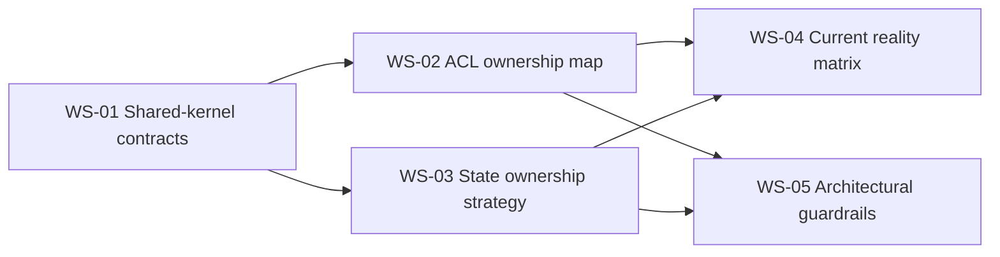
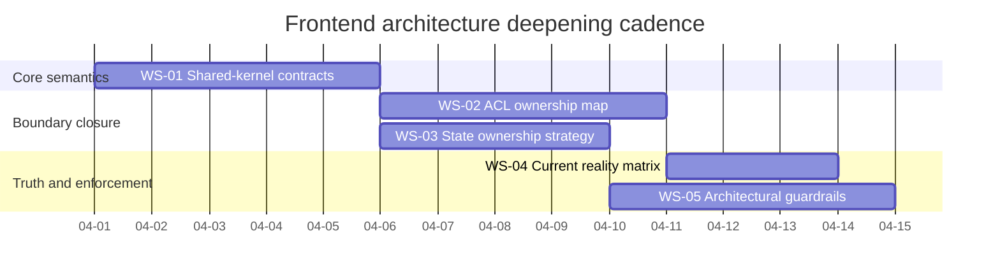

# Frontend Architecture Deepening Work Plan

> Execution-oriented work document for closing the five highest-value frontend
> architecture gaps that remain after the current coverage and decision
> inventory.

## 1. Purpose

This document operationalizes the next five architecture-deepening actions for
the frontend corpus.

It is not a replacement for the DDD target architecture, the execution plan, or
the coverage map. Its role is narrower:

1. turn the five deepening areas into explicit workstreams
2. define sequence, dependencies, and expected outputs
3. provide a planning baseline for staffing and execution
4. keep the next decisions tied to the already-governed architecture baseline

## 2. Governing Sources

- [Frontend Architecture](../index.md)
- [Frontend DDD Target Architecture](../frontend-ddd-target-architecture.md)
- [Frontend Architecture Execution Plan](../frontend-architecture-execution-plan.md)
- [Frontend Coverage Map And Open Decision Register](frontend-coverage-map-and-open-decision-register.md)
- [Workspace Domain Specification](../workspace/workspace-domain-specification.md)
- [Workspace Session Model Specification](../workspace/session/workspace-session-model-specification.md)
- [Workspace Orchestration - Cross-Feature Coordination Mechanism](../workspace/workspace-orchestration.md)
- [Frontend Architecture Review and Critical Action Plan](frontend-architecture-review-and-critical-action-plan.md)
- [Reference Architecture](../../reference-architecture.md)
- [ADR-0034 - Bounded Context Boundaries And Communication Rules](../../../adr/ADR-0034-bounded-context-boundaries-and-communication-rules.md)

## 3. Planning Principles

- Close shared semantics before adding automation.
- Prefer small canonical contracts over repeated prose inside larger documents.
- Keep bounded contexts fixed; deepen them instead of renaming them.
- Use Fowler-style incremental closure: small steps, stable intermediate state,
  no big-bang reclassification.
- Do not let target-state documents stand in for implementation truth.

## 4. Workstream Summary

| ID    | Workstream                            | Priority | Criticality | Effort       | Suggested staffing             | Complexity | Depends on   | Primary outputs                                                               |
| ----- | ------------------------------------- | -------- | ----------- | ------------ | ------------------------------ | ---------- | ------------ | ----------------------------------------------------------------------------- |
| WS-01 | Shared-kernel contracts               | P0       | Critical    | Medium       | 1 author + 1 reviewer          | Medium     | None         | canonical specs for `SelectionContext`, `WorkspaceTab`, and `WorkspaceLayout` |
| WS-02 | ACL ownership map per capability      | P1       | Critical    | Medium-Large | 1 author + 1 domain reviewer   | High       | WS-01        | capability ACL matrix, mapper ownership rules, port-to-adapter map            |
| WS-03 | Frontend state ownership strategy     | P1       | High        | Medium       | 1 author + 1 frontend reviewer | High       | WS-01        | canonical state policy, migration rules, anti-pattern list                    |
| WS-04 | Current reality matrix per capability | P2       | High        | Small-Medium | 1 author                       | Medium     | WS-02, WS-03 | target-vs-current matrix, backend dependency posture, validation baseline     |
| WS-05 | Frontend architectural guardrails     | P3       | High        | Medium-Large | 1 author + 1 maintainer        | High       | WS-02, WS-03 | enforceable rule set, check candidates, adoption sequence                     |

## 5. Recommended Execution Order

### 5.1 WS-01 Shared-kernel contracts

Objective:
Stabilize the shared semantic layer before any broader capability-level
normalization.

Required outputs:

- one canonical spec for `SelectionContext`
- one canonical spec for `WorkspaceTab`
- one canonical spec for `WorkspaceLayout`
- explicit cross-links from the DDD target architecture and workspace specs

Done criterion:
No capability document needs to redefine or locally improvise these contracts.

### 5.2 WS-02 ACL ownership map per capability

Objective:
Make the anti-corruption boundaries explicit for each bounded context that talks
to backend contracts or external provider-shaped data.

Required outputs:

- one matrix for Planning, Runs, Artifacts, Git, Lineage, and Observability
- named ownership for query ports, command ports, gateway ports, and DTO mappers
- an explicit rule for where translation ends and capability models begin

Done criterion:
Every capability can answer "which port owns the backend seam?" without
inference.

### 5.3 WS-03 Frontend state ownership strategy

Objective:
Close the ambiguity between server state, coordination state, and local
interaction state.

Required outputs:

- a canonical rule for TanStack Query, workspace stores, and feature-local state
- a persistence rule for session state versus runtime truth
- an anti-pattern list for mega-stores, duplicated projections, and raw DTO
  rendering

Done criterion:
New frontend work no longer needs to debate where state belongs on each feature.

### 5.4 WS-04 Current reality matrix per capability

Objective:
Separate target architecture from shipped reality so the corpus remains honest
and operationally useful.

Required outputs:

- one compact current-reality matrix for Graph, Planning, Runs, Artifacts, Git,
  Lineage, Inspector, and Observability
- target versus current annotations for mocks, backend reliance, and validation
- a minimal truth baseline for future review and refactor work

Done criterion:
The frontend index and capability docs stop implying that target-state coverage
equals implementation completeness.

### 5.5 WS-05 Frontend architectural guardrails

Objective:
Turn the closed architecture rules into enforceable checks.

Required outputs:

- candidate checks for raw DTO rendering in components
- candidate checks for direct cross-feature store imports
- candidate checks for direct shared-store mutation from component code
- an adoption sequence from advisory checks to enforced checks

Done criterion:
The architecture no longer depends only on reader discipline to remain stable.

## 6. Dependency Graph

## 7. Indicative Planning Cadence

## 8. Recommended Immediate Next Move

Start with WS-01 and keep the scope narrow:

1. publish the three shared-kernel model specs
2. link them from the DDD target architecture and workspace domain documents
3. ratify the allowed field set and invariants for each model

That is the smallest closure slice that unlocks the rest of the program without
reopening already-settled architectural boundaries.

## 9. Relation To Fowler-Aligned Sources

This work plan depends on the exact Fowler and Fowler-site references already
captured in
[Frontend Coverage Map And Open Decision Register](frontend-coverage-map-and-open-decision-register.md).

Those sources justify the separation of bounded contexts, presentation/domain
layering, mapper/gateway boundaries, and incremental refactoring mechanics used
by this plan.
