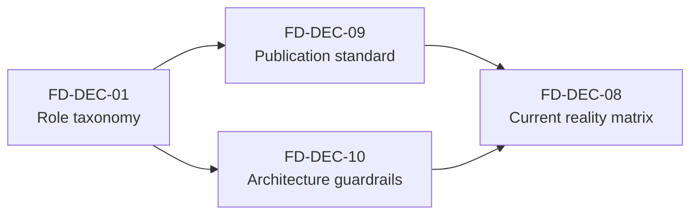

# Frontend Coverage Map And Open Decision Register

> Architecture inventory for the frontend corpus. It states what is already
> covered, which decisions remain open, and the recommended closure path using
> DDD, hexagonal architecture, SOLID-compatible boundaries, and exact
> Fowler-aligned sources.

## 1. Purpose

This document turns the current frontend architecture corpus into an explicit
decision inventory.

It has four jobs:

1. map what is already architecturally covered
2. distinguish partial coverage from unresolved decisions
3. recommend concrete closure decisions
4. tie those recommendations to exact Martin Fowler sources where applicable

## 2. Governing Sources

- [Frontend Architecture](../index.md)
- [Frontend DDD Target Architecture](../frontend-ddd-target-architecture.md)
- [Frontend Architecture Execution Plan](../frontend-architecture-execution-plan.md)
- [Frontend ACL Ownership Map](../frontend-acl-ownership-map.md)
- [Frontend State Ownership And Persistence Policy](../frontend-state-ownership-and-persistence-policy.md)
- [Workspace Domain Specification](../workspace/workspace-domain-specification.md)
- [Workspace Session Model Specification](../workspace/session/workspace-session-model-specification.md)
- [Selection Context Model Specification](../workspace/selection-context-model-specification.md)
- [Workspace Tab Model Specification](../workspace/workspace-tab-model-specification.md)
- [Workspace Layout Model Specification](../workspace/workspace-layout-model-specification.md)
- [Workspace Orchestration - Cross-Feature Coordination Mechanism](../workspace/workspace-orchestration.md)
- [Frontend Architecture Review and Critical Action Plan](frontend-architecture-review-and-critical-action-plan.md)
- [Frontend Documentation Quality Review And Remediation Plan](frontend-documentation-quality-review-and-remediation-plan.md)
- [Reference Architecture](../../reference-architecture.md)
- [ADR-0034 - Bounded Context Boundaries And Communication Rules](../../../adr/ADR-0034-bounded-context-boundaries-and-communication-rules.md)

## 3. Executive Assessment

The frontend corpus is now strong on target architecture and medium on closure.

What is already strong:

- canonical entry point and reading order
- target DDD context map
- workspace as coordination domain
- cross-feature orchestration mechanism
- canonical state ownership and persistence policy
- execution sequencing and refactor sequencing

What is still not closed:

- final canonical role of several capability docs
- current reality versus target per capability
- publication hygiene and frontend-specific guardrails

The main gap is no longer "missing architecture". The main gap is "decision
closure and canonical consistency".

## 4. Coverage Map

| Topic                                                     | Status            | Canonical owner                                                                                                                                                                                                                                                                      | Assessment                                                                                               |
| --------------------------------------------------------- | ----------------- | ------------------------------------------------------------------------------------------------------------------------------------------------------------------------------------------------------------------------------------------------------------------------------------ | -------------------------------------------------------------------------------------------------------- |
| Frontend entry point and reading order                    | Covered           | [Frontend Architecture](../index.md)                                                                                                                                                                                                                                                 | The corpus has a canonical landing page and reading order.                                               |
| Current reality statement                                 | Covered           | [Frontend Architecture](../index.md)                                                                                                                                                                                                                                                 | Current reality is explicitly stated as mock-heavy and partially connected.                              |
| Frontend bounded contexts                                 | Covered           | [Frontend DDD Target Architecture](../frontend-ddd-target-architecture.md)                                                                                                                                                                                                           | Bounded contexts and roles are named clearly.                                                            |
| Shared kernel direction                                   | Covered           | [Frontend DDD Target Architecture](../frontend-ddd-target-architecture.md)                                                                                                                                                                                                           | Core shared concepts are named and scoped.                                                               |
| Cross-context communication rule                          | Covered           | [Frontend DDD Target Architecture](../frontend-ddd-target-architecture.md)                                                                                                                                                                                                           | Workspace-mediated collaboration is explicit.                                                            |
| Cross-feature coordination mechanism                      | Covered           | [Workspace Orchestration](../workspace/workspace-orchestration.md)                                                                                                                                                                                                                   | The mechanism is now chosen, not only implied.                                                           |
| Workspace domain decomposition                            | Covered           | [Workspace Domain Specification](../workspace/workspace-domain-specification.md)                                                                                                                                                                                                     | Session, tabs, layout, context, orchestration are defined.                                               |
| Workspace session concept                                 | Covered           | [Workspace Session Model Specification](../workspace/session/workspace-session-model-specification.md)                                                                                                                                                                               | The model now ratifies the `moduleId` versus `workbenchMode` split and removes single-field ambiguity.   |
| Shared-kernel contracts                                   | Covered           | [Selection Context Model Specification](../workspace/selection-context-model-specification.md), [Workspace Tab Model Specification](../workspace/workspace-tab-model-specification.md), [Workspace Layout Model Specification](../workspace/workspace-layout-model-specification.md) | The shared kernel now has dedicated canonical contracts instead of remaining implied inside larger docs. |
| Capability-level architecture docs                        | Covered           | capability docs under `docs/architecture/frontend/`                                                                                                                                                                                                                                  | All major capability areas have architecture coverage.                                                   |
| ACL direction and DTO translation principle               | Covered           | [Frontend ACL Ownership Map](../frontend-acl-ownership-map.md)                                                                                                                                                                                                                       | The corpus now declares query ports, command ports, gateway ports, and mapper ownership per capability.  |
| Query versus command separation                           | Covered           | [Frontend DDD Target Architecture](../frontend-ddd-target-architecture.md), [Runs](../runs/dvt-runs-frontend-architecture.md), [Planning](../planning/frontend-planning-capability-architecture.md)                                                                                  | The principle is explicit, but implementation contracts are not fully normalized.                        |
| Architecture execution order                              | Covered           | [Frontend Architecture Execution Plan](../frontend-architecture-execution-plan.md)                                                                                                                                                                                                   | Phases and decision gates are explicit.                                                                  |
| Refactor execution order for code                         | Covered           | [Frontend Architecture Review and Critical Action Plan](frontend-architecture-review-and-critical-action-plan.md)                                                                                                                                                                    | The code-level sequence is explicit and incremental.                                                     |
| Canonical/supporting/reference-only role taxonomy per doc | Partially covered | [Frontend Architecture](../index.md)                                                                                                                                                                                                                                                 | The index marks some reference-only notes, but not the full corpus with one role system.                 |
| Current reality versus target per capability              | Partially covered | distributed                                                                                                                                                                                                                                                                          | The landing page states the difference, but not each capability doc.                                     |
| Metadata and editorial hygiene                            | Open              | [Frontend Documentation Quality Review And Remediation Plan](frontend-documentation-quality-review-and-remediation-plan.md)                                                                                                                                                          | The problem is identified, but not yet closed.                                                           |
| Frontend validation and architecture guardrails           | Open              | distributed                                                                                                                                                                                                                                                                          | The frontend still lacks a stable test and guardrail baseline.                                           |

## 5. Open Decision Register

| ID        | Decision still open                            | Why it matters                                                                  | Recommended closure                                                                                                                       |
| --------- | ---------------------------------------------- | ------------------------------------------------------------------------------- | ----------------------------------------------------------------------------------------------------------------------------------------- |
| FD-DEC-01 | Canonical role taxonomy for every frontend doc | Without it, companion specs and exploratory notes still compete for authority.  | Add one explicit role system: `canonical`, `companion`, `review`, `reference-only`. Reflect it in frontmatter and in the frontend index.  |
| FD-DEC-07 | Module/plugin extension contract               | The shell/module seam exists, but the project still needs one stable contract.  | Standardize `WorkspaceModuleContract` and require module-specific adapters to satisfy it without caller special cases.                    |
| FD-DEC-08 | Current reality matrix per capability          | Capability docs read as target-state specs while implementation remains uneven. | Add one compact current-reality matrix for Graph, Planning, Runs, Artifacts, Git, Lineage, Inspector, and Observability.                  |
| FD-DEC-09 | Publication standard for the frontend corpus   | Mixed language, encoding drift, and metadata drift reduce trust.                | Canonical docs in English, UTF-8 clean text, normalized frontmatter, and explicit reclassification of reference-only notes.               |
| FD-DEC-10 | Frontend-specific architectural guardrails     | Architecture will drift if rules remain prose only.                             | Add automated checks for direct DTO rendering, direct cross-feature store imports, and direct shared-store mutation from component files. |

## 6. Recommended Solutions

### 6.1 DDD closure

The DDD direction is already correct. It should now be ratified, not reinvented.

Recommended decisions:

- Keep the frontend bounded contexts fixed as: App Shell, Workspace, Graph,
  Planning, Runs, Artifacts, Inspector, Git, Lineage, and Observability.
- Treat Workspace as the coordination context, never as a feature bag and never
  as a shell utility package.
- Keep the shared kernel small and explicit:
  `EntityRef`, `SelectionContext`, `WorkspaceTab`, `WorkspaceLayout`,
  `ModuleId`, `WorkbenchMode`, `ContextOrigin`.
- Require capability docs to state:
  - what the capability owns
  - what it must not own
  - which shared-kernel types it consumes
  - which ACLs isolate it from backend contracts

DDD consequence:

- direct feature-to-feature control is prohibited
- cross-context effects are mediated through Workspace
- cross-boundary translations are explicit and named

### 6.2 Hexagonal closure

The frontend should use hexagonal boundaries inside each bounded context, not as
one repo-wide top-level folder split.

Recommended structure per capability:

```text
<capability>/
  domain/
  application/
  ports/
    query/
    command/
    gateway/
  adapters/
    http/
    mapper/
    store/
    router/
    view/
```

Recommended port families:

- query ports for read models and projections
- command ports for state-changing intents
- gateway ports for external systems and provider-shaped APIs
- context ports for Workspace-mediated coordination

Recommended adapter rules:

- components never render raw backend DTOs
- DTOs enter through HTTP adapters and are translated by mappers
- application services and workspace actions depend on ports, not transport code
- visualization libraries remain adapters, not domain definitions

### 6.3 SOLID-compatible closure

SOLID is not Fowler's taxonomy. The solutions below are SOLID-compatible and
reinforced by Fowler's layering, DI, gateway, mapper, and refactoring work.

SRP:

- split shell, session, selection, runs, and canvas responsibilities instead of
  continuing a mega-store
- keep each capability doc responsible for one bounded context only

OCP:

- extend modules through `WorkspaceModuleContract`
- extend tab behavior through typed `WorkspaceTab` variants, not ad hoc payloads

LSP:

- every module adapter must satisfy the same shell/module contract without
  forcing caller-specific workarounds
- every capability adapter must preserve the semantics of the port it
  implements

ISP:

- prefer small interfaces such as `SelectionPort`, `TabPort`, `LayoutPort`,
  `RunStatusQueryPort`, `PlanProjectionQueryPort`
- avoid giant stores or giant service facades

DIP:

- components depend on selectors, action functions, and ports
- application services depend on ports
- infrastructure depends inward through adapters and composition root wiring

### 6.4 Fowler-aligned refactoring closure

The preferred delivery style should be Fowler-style refactoring, not big-bang
replacement.

Recommended execution rules:

- characterization tests before structural movement
- moves and renames separate from behavioral edits
- extract by responsibility cluster
- publish one decision at a time and propagate the terminology immediately
- keep each intermediate state shippable

This especially applies to:

- `appStore.ts` decomposition
- session model normalization
- plugin contract tightening
- ACL mapper introduction
- capability doc normalization

Recently closed by canonical publication:

- `FD-DEC-05` - [Frontend State Ownership And Persistence Policy](../frontend-state-ownership-and-persistence-policy.md)
- `FD-DEC-06` - [Frontend State Ownership And Persistence Policy](../frontend-state-ownership-and-persistence-policy.md)

## 7. Decision Dependency Graph



## 8. Exact Fowler And Fowler Site Sources

The following sources are exact, primary references from Martin Fowler's site
and are directly applicable to the proposed frontend closure. Where a catalog
entry is authored by someone else, that is stated explicitly.

- Martin Fowler, [Bounded Context](https://martinfowler.com/bliki/BoundedContext.html)
  - supports the frontend context map and explicit inter-context relationships
- Martin Fowler, [Presentation Domain Data Layering](https://martinfowler.com/bliki/PresentationDomainDataLayering.html)
  - supports UI/domain/data separation and explicitly notes the mapper-based
    variation commonly referred to as hexagonal architecture
- Martin Fowler, [Separated Presentation](https://martinfowler.com/eaaDev/SeparatedPresentation.html)
  - supports the rule that presentation code must not own domain decisions
- Martin Fowler, [Inversion of Control Containers and the Dependency Injection pattern](https://martinfowler.com/articles/injection.html)
  - supports dependency inversion through explicit wiring and separation of
    configuration from use
- Martin Fowler, [Data Mapper](https://martinfowler.com/eaaCatalog/dataMapper.html)
  - supports DTO-to-domain/view-model mapping without leaking transport concerns
- Martin Fowler, [Gateway](https://martinfowler.com/articles/gateway-pattern.html)
  - supports external-system isolation behind frontend-friendly interfaces
- Fowler site catalog entry by Edward Hieatt and Rob Mee,
  [Repository](https://martinfowler.com/eaaCatalog/repository.html)
  - supports concentrating query logic where a capability needs a rich domain
    collection boundary
- Martin Fowler, [Data Transfer Object](https://martinfowler.com/eaaCatalog/dataTransferObject.html)
  - supports batching and explicit serialization boundaries while keeping DTOs
    out of component rendering
- Martin Fowler, [Anemic Domain Model](https://martinfowler.com/bliki/AnemicDomainModel.html)
  - warns against pushing all behavior into service bags while leaving models as
    passive containers
- Martin Fowler, [Data Clump](https://martinfowler.com/bliki/DataClump.html)
  - supports turning repeated primitive bundles into explicit types
- Martin Fowler and Kent Beck, [Refactoring](https://martinfowler.com/books/refactoring.html)
  - supports small, behavior-preserving transformations
- Martin Fowler site, [Refactoring To Patterns](https://martinfowler.com/books/r2p.html)
  - useful for evolving contracts and extension points incrementally

## 9. Recommended Next Closure Slices

The next serious documentation slices should be:

1. close FD-DEC-01 by publishing a full canonical role taxonomy for the
   frontend corpus
2. close FD-DEC-09 by normalizing metadata, language, and encoding
3. close FD-DEC-10 by defining enforceable frontend architectural guardrails
4. add a current-reality matrix per capability so target docs stop standing in
   for implementation truth

If these four slices are closed, the frontend architecture stops behaving like a
promising draft corpus and starts behaving like a governed architecture
baseline.
