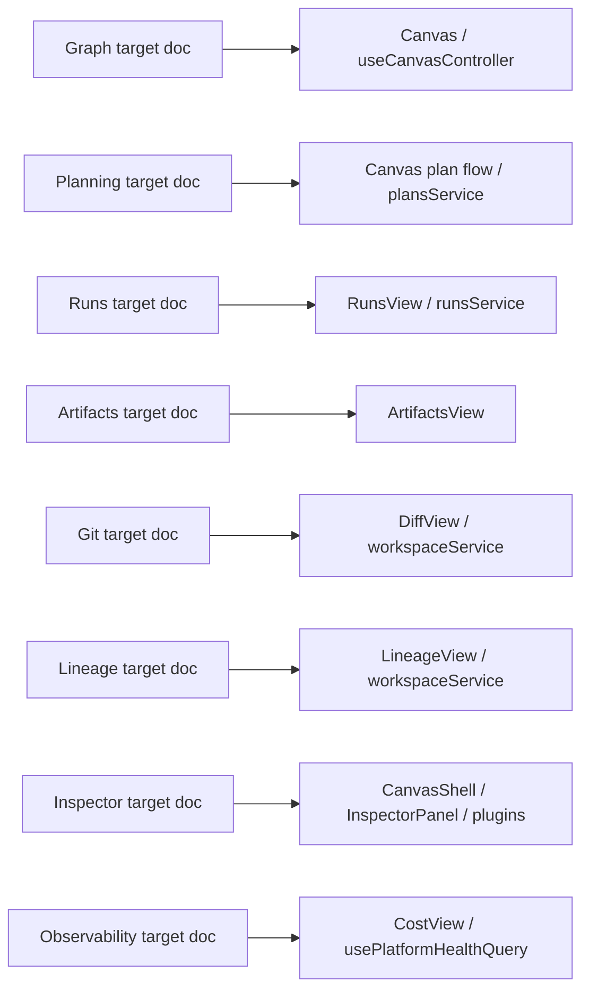
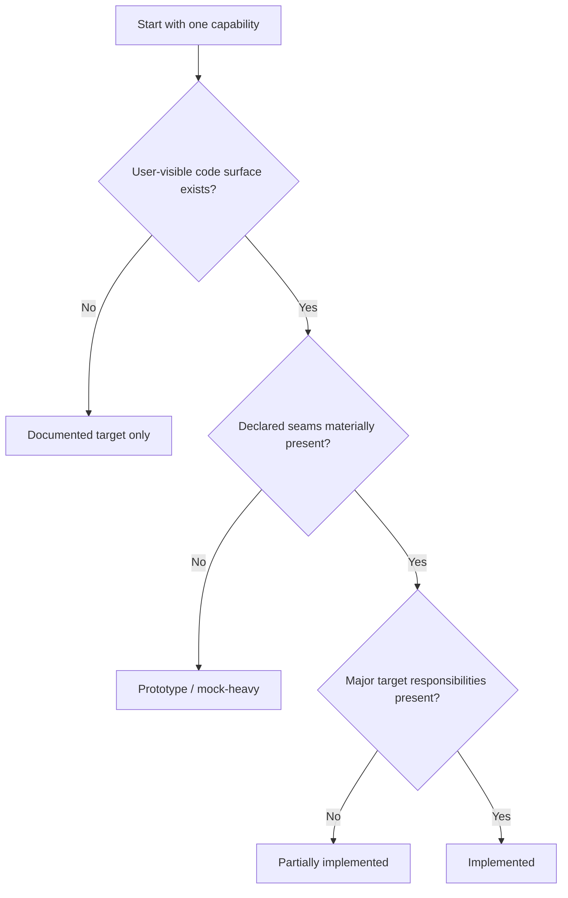
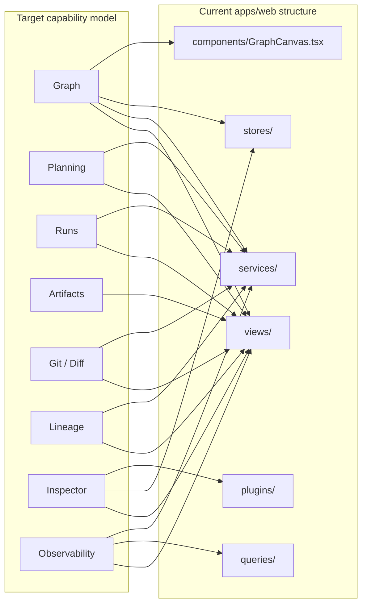
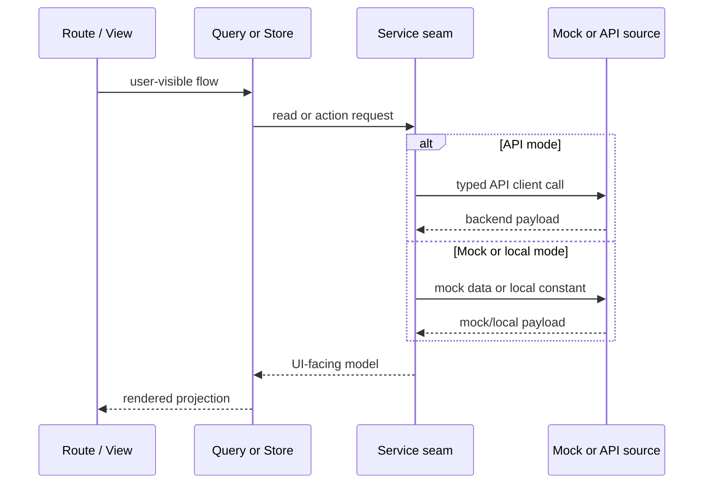
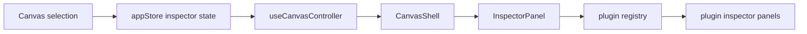
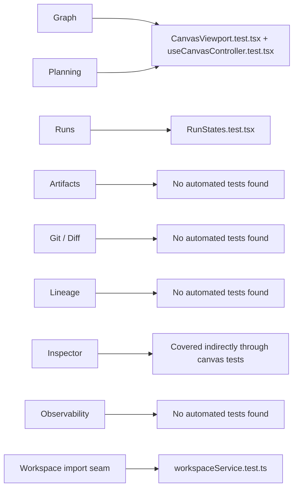
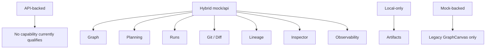
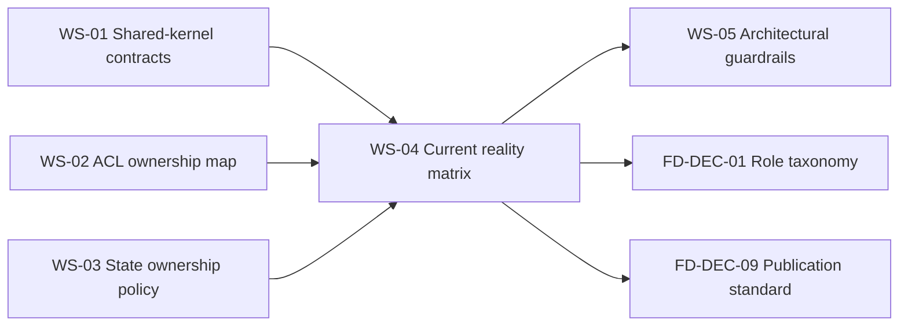

# Frontend Current Reality Matrix

> Canonical current-state map for the frontend. This document answers one
> question only: what exists in `apps/web` today, capability by capability,
> and how far does that reality still drift from the target architecture?

## 1. Purpose

This document closes `FD-DEC-08` by publishing one canonical, evidence-backed
matrix for frontend implementation truth.

Its role is to prevent two recurring failures:

1. target architecture documents being read as if they already described the
   shipped frontend;
2. local implementation facts being scattered across code review notes,
   `apps/web` local docs, and partial architecture drafts.

## 2. Architectural role

This document is the canonical source for:

- current implementation posture by capability;
- target-versus-current drift;
- current mock/API/local-only data-source posture;
- current frontend validation baseline.

It is not the canonical source for target architecture. That authority remains
with the target capability documents and the DDD target architecture.

### 2.1 Capability coverage map

**Evidence classification**

- Repo evidence:
  [graph-frontend-architecture.md](../graph/graph-frontend-architecture.md),
  [frontend-planning-capability-architecture.md](../planning/frontend-planning-capability-architecture.md),
  [dvt-runs-frontend-architecture.md](../runs/dvt-runs-frontend-architecture.md),
  [front-artifacts.md](../artifacts/front-artifacts.md),
  [git-mode-architecture.md](../git/git-mode-architecture.md),
  [dvt-frontend-lineage.md](../lineage/dvt-frontend-lineage.md),
  [inspector-frontend-architecture.md](../inspector/inspector-frontend-architecture.md),
  [front-observability-architecture-dvt.md](../observability/front-observability-architecture-dvt.md),
  [Canvas.tsx](../../../../apps/web/src/app/views/Canvas.tsx),
  [RunsView.tsx](../../../../apps/web/src/app/views/RunsView.tsx),
  [ArtifactsView.tsx](../../../../apps/web/src/app/views/ArtifactsView.tsx),
  [DiffView.tsx](../../../../apps/web/src/app/views/DiffView.tsx),
  [LineageView.tsx](../../../../apps/web/src/app/views/LineageView.tsx),
  [CostView.tsx](../../../../apps/web/src/app/views/CostView.tsx),
  [InspectorPanel.tsx](../../../../apps/web/src/app/components/InspectorPanel.tsx)
- Fowler evidence: `compatible precedent` from
  [Bounded Context](https://martinfowler.com/bliki/BoundedContext.html)
- Repository policy: `local canonical policy` because the mapping from target
  docs to current code surfaces is repository-specific status work

## 3. Reality classification model

The classifications below are fixed vocabulary. Future frontend reviews should
reuse them so status remains comparable over time.

### 3.1 Implementation status labels

- `Implemented`: the capability has a meaningful user-visible surface, current
  code largely follows the declared seams, and major target responsibilities
  are already present.
- `Partially implemented`: the capability has a real user-visible surface and
  some declared seams, but important target responsibilities remain missing or
  collapsed into neighboring capabilities.
- `Prototype / mock-heavy`: the capability has a visible surface, but core
  behavior is still driven primarily by mocks, local-only data, or incomplete
  seams.
- `Documented target only`: no meaningful code surface exists beyond docs or
  placeholders.

**Evidence classification**

- Fowler evidence: `compatible precedent` from
  [Presentation Domain Data Layering](https://martinfowler.com/bliki/PresentationDomainDataLayering.html)
  and
  [Separated Presentation](https://martinfowler.com/eaaDev/SeparatedPresentation.html)
- Repository policy: `local canonical policy` because Fowler does not define
  these exact four frontend status labels

### 3.2 Data-source posture labels

- `API-backed`: the capability primarily consumes backend/API seams in current
  code.
- `Hybrid mock/api`: the capability has API seams, but mock adapters or
  fallback data still materially shape current behavior.
- `Mock-backed`: the capability depends on mock adapters or hard-coded mock
  data as its main runtime input.
- `Local-only`: the capability currently works from browser-local inputs or
  in-view constants rather than a backend/API seam.

**Evidence classification**

- Fowler evidence: `compatible precedent` from
  [Data Mapper](https://martinfowler.com/eaaCatalog/dataMapper.html) and
  [Data Transfer Object](https://martinfowler.com/eaaCatalog/dataTransferObject.html)
- Repository policy: `local canonical policy` because the exact mock/API/local
  posture labels are repository-defined operational status categories

### 3.3 Validation status labels

- `Has targeted tests`: the capability has direct tests against its current
  surface or service seam.
- `Has limited tests`: tests exist nearby or indirectly, but the capability
  lacks focused coverage for its main responsibilities.
- `No automated tests found`: no relevant test files were found under
  `apps/web/src/app` for the capability.

**Evidence classification**

- Repo evidence:
  [workspaceService.test.ts](../../../../apps/web/src/app/services/workspace/workspaceService.test.ts),
  [CanvasViewport.test.tsx](../../../../apps/web/src/app/views/canvas/CanvasViewport.test.tsx),
  [useCanvasController.test.tsx](../../../../apps/web/src/app/views/canvas/useCanvasController.test.tsx),
  [RunStates.test.tsx](../../../../apps/web/src/app/views/runs/RunStates.test.tsx)
- Repository policy: `local canonical policy` because these labels summarize
  repository-local test discovery rather than an external architectural taxonomy

### 3.4 Reality classification model

**Evidence classification**

- Fowler evidence: `compatible precedent` from
  [Separated Presentation](https://martinfowler.com/eaaDev/SeparatedPresentation.html)
  and
  [Presentation Domain Data Layering](https://martinfowler.com/bliki/PresentationDomainDataLayering.html)
- Repository policy: `local canonical policy` because this flowchart is the
  repository's explicit decision rule for WS-04 classification

## 4. Current capability matrix

### 4.1 Target-to-current drift map

**Evidence classification**

- Repo evidence:
  [routes.ts](../../../../apps/web/src/app/routes.ts),
  [services](../../../../apps/web/src/app/services),
  [stores](../../../../apps/web/src/app/stores),
  [plugins](../../../../apps/web/src/app/plugins),
  [queries](../../../../apps/web/src/app/queries),
  [GraphCanvas.tsx](../../../../apps/web/src/app/components/GraphCanvas.tsx)
- Fowler evidence: `compatible precedent` from
  [Bounded Context](https://martinfowler.com/bliki/BoundedContext.html)
- Repository policy: `local canonical policy` because this is a repo-specific
  drift map between target capability docs and current file structure

### 4.2 Frontend runtime composition today

**Evidence classification**

- Repo evidence:
  [Root.tsx](../../../../apps/web/src/app/Root.tsx),
  [usePlatformHealthQuery.ts](../../../../apps/web/src/app/queries/usePlatformHealthQuery.ts),
  [useCapabilitiesQuery.ts](../../../../apps/web/src/app/queries/useCapabilitiesQuery.ts),
  [plansService.ts](../../../../apps/web/src/app/services/plans/plansService.ts),
  [runsService.ts](../../../../apps/web/src/app/services/runs/runsService.ts),
  [workspaceService.ts](../../../../apps/web/src/app/services/workspace/workspaceService.ts)
- Fowler evidence: `compatible precedent` from
  [Presentation Domain Data Layering](https://martinfowler.com/bliki/PresentationDomainDataLayering.html),
  [Data Mapper](https://martinfowler.com/eaaCatalog/dataMapper.html), and
  [Data Transfer Object](https://martinfowler.com/eaaCatalog/dataTransferObject.html)
- Repository policy: `local canonical policy` because the exact route-query-
  service-source composition is measured from current code

### 4.3 Capability matrix

| Capability    | Canonical target document                                                                               | Primary code surface                                                                                                                                                                                                                                                                                                            | Implementation status  | Data-source posture | Backend dependency posture                                                                                                                                                | Validation status        | Main drift from target                                                                                                                                                      | Blocking gaps                                                                                                         | Recommended next move                                                                                                                         |
| ------------- | ------------------------------------------------------------------------------------------------------- | ------------------------------------------------------------------------------------------------------------------------------------------------------------------------------------------------------------------------------------------------------------------------------------------------------------------------------- | ---------------------- | ------------------- | ------------------------------------------------------------------------------------------------------------------------------------------------------------------------- | ------------------------ | --------------------------------------------------------------------------------------------------------------------------------------------------------------------------- | --------------------------------------------------------------------------------------------------------------------- | --------------------------------------------------------------------------------------------------------------------------------------------- |
| Graph         | [Graph - Frontend Architecture](../graph/graph-frontend-architecture.md)                                | [Canvas.tsx](../../../../apps/web/src/app/views/Canvas.tsx), [useCanvasController.ts](../../../../apps/web/src/app/views/canvas/useCanvasController.ts), [workspaceService.ts](../../../../apps/web/src/app/services/workspace/workspaceService.ts), [GraphCanvas.tsx](../../../../apps/web/src/app/components/GraphCanvas.tsx) | Partially implemented  | Hybrid mock/api     | Workspace graph seam exists, but mock workspace data remains active and the legacy mock-only graph component still exists                                                 | Has targeted tests       | Current graph behavior is still canvas-centric and partly mixed with planning/runtime overlays rather than a clean Graph capability boundary                                | Legacy direct-mock graph component, no dedicated graph capability module, no removal of mixed store concerns          | Keep Canvas as the active surface, remove the legacy mock-only graph path, and continue extracting graph-specific state from shared stores    |
| Planning      | [Frontend Architecture - Planning Capability](../planning/frontend-planning-capability-architecture.md) | [useCanvasExecutionActions.ts](../../../../apps/web/src/app/views/canvas/useCanvasExecutionActions.ts), [plansService.ts](../../../../apps/web/src/app/services/plans/plansService.ts), [Canvas.tsx](../../../../apps/web/src/app/views/Canvas.tsx)                                                                             | Partially implemented  | Hybrid mock/api     | API seams exist for `/plans/preview` and `/plans/import`, but the visible planning flow is still embedded inside the canvas modal flow                                    | Has limited tests        | Planning exists as a plan-preview action inside Canvas, not as the broader planning workbench, analysis, diff, and validation capability described in the target doc        | No dedicated planning route/workbench, no plan diff surface, no dedicated planning projections                        | Promote the current plan-preview flow into an explicit planning read-model surface before adding deeper planning features                     |
| Runs          | [Runs Frontend Architecture](../runs/dvt-runs-frontend-architecture.md)                                 | [RunsView.tsx](../../../../apps/web/src/app/views/RunsView.tsx), [runsService.ts](../../../../apps/web/src/app/services/runs/runsService.ts)                                                                                                                                                                                    | Partially implemented  | Hybrid mock/api     | API seams exist for `/runs`, `/runs/:runId`, `/runs/:runId/status`, and `/runs/:runId/events`, but mock run data still remains the fallback baseline                      | Has targeted tests       | Runs is a real surface, but it still uses one broad view/service path and does not yet expose the richer read-model split described in the target architecture              | Limited diagnostics separation, no dedicated event-stream read model in the UI, no focused service tests              | Split run summary, detail, status, and event projections as separate UI-facing models on top of the current service seam                      |
| Artifacts     | [Frontend Artifacts](../artifacts/front-artifacts.md)                                                   | [ArtifactsView.tsx](../../../../apps/web/src/app/views/ArtifactsView.tsx)                                                                                                                                                                                                                                                       | Prototype / mock-heavy | Local-only          | No artifact API seam is consumed today; the view is browser-local import plus static preview data                                                                         | No automated tests found | The current surface is useful for local manifest import, but it is not yet the backend-correlated artifact capability described in the target docs                          | No artifact query seam, no run/artifact correlation, no tests, no ACL boundary in code                                | Define one explicit artifact query seam and keep local import as an adapter, not the capability baseline                                      |
| Git / Diff    | [Git Mode Architecture](../git/git-mode-architecture.md)                                                | [DiffView.tsx](../../../../apps/web/src/app/views/DiffView.tsx), [workspaceService.ts](../../../../apps/web/src/app/services/workspace/workspaceService.ts)                                                                                                                                                                     | Partially implemented  | Hybrid mock/api     | Current code reads `/diff/changes` through the workspace service, but the broader repository command/query model does not yet exist                                       | No automated tests found | The shipped surface is a diff viewer, not the fuller Git mode with repository visibility, staging, commit workflow, and branch operations                                   | No Git command boundary, no repository adapter, no tests, no broader Git state model                                  | Keep diff review as the first Git slice and add explicit Git query/command ports before expanding workflow actions                            |
| Lineage       | [DVT+ Frontend Lineage](../lineage/dvt-frontend-lineage.md)                                             | [LineageView.tsx](../../../../apps/web/src/app/views/LineageView.tsx), [workspaceService.ts](../../../../apps/web/src/app/services/workspace/workspaceService.ts)                                                                                                                                                               | Partially implemented  | Hybrid mock/api     | Current lineage reads the workspace graph snapshot and derives lineage in the client rather than consuming a dedicated lineage projection seam                            | No automated tests found | The surface exists, but it is still graph-derived and local-analysis-heavy compared with the dedicated lineage read-model direction in the target doc                       | No dedicated lineage backend seam, no focused tests, no separate execution-lineage or evidence bridge                 | Introduce a lineage projection seam and keep the current graph-derived traversal as a measured transitional behavior, not the target endpoint |
| Inspector     | [Frontend Architecture - Inspector](../inspector/inspector-frontend-architecture.md)                    | [CanvasShell.tsx](../../../../apps/web/src/app/views/canvas/CanvasShell.tsx), [InspectorPanel.tsx](../../../../apps/web/src/app/components/InspectorPanel.tsx), [PluginManifest.ts](../../../../apps/web/src/app/plugins/contracts/PluginManifest.ts), [registry.ts](../../../../apps/web/src/app/plugins/registry.ts)          | Partially implemented  | Hybrid mock/api     | Inspector depends on current graph/run state and plugin contributions; it does not yet have a dedicated inspector query/command seam                                      | Has limited tests        | Inspector is embedded in the Canvas workbench and state still lives in shared app-store fields rather than an explicit inspector session boundary                           | No dedicated inspector application layer, no focused inspector tests, selection/session split not implemented in code | Preserve the embedded panel model, but extract explicit inspector session and command boundaries from the current Canvas/App Store coupling   |
| Observability | [Frontend Observability Architecture](../observability/front-observability-architecture-dvt.md)         | [CostView.tsx](../../../../apps/web/src/app/views/CostView.tsx), [usePlatformHealthQuery.ts](../../../../apps/web/src/app/queries/usePlatformHealthQuery.ts), [platformClient.ts](../../../../apps/web/src/app/services/platform/platformClient.ts)                                                                             | Partially implemented  | Hybrid mock/api     | Real platform health endpoints exist, but cost and operational views still derive data from workspace/runs services rather than a dedicated observability read-model seam | No automated tests found | Current observability is split between health status and cost dashboards, not the fuller workflow/run/step operational observability capability described in the target doc | No dedicated observability ACL, no richer run/step metrics read models, no tests                                      | Separate platform health from cost-derived dashboards and introduce a dedicated observability query seam before expanding the surface         |

### 4.4 Inspector reality map

**Evidence classification**

- Repo evidence:
  [appStore.ts](../../../../apps/web/src/app/stores/appStore.ts),
  [useCanvasController.ts](../../../../apps/web/src/app/views/canvas/useCanvasController.ts),
  [CanvasShell.tsx](../../../../apps/web/src/app/views/canvas/CanvasShell.tsx),
  [InspectorPanel.tsx](../../../../apps/web/src/app/components/InspectorPanel.tsx),
  [PluginManifest.ts](../../../../apps/web/src/app/plugins/contracts/PluginManifest.ts),
  [registry.ts](../../../../apps/web/src/app/plugins/registry.ts)
- Fowler evidence: `compatible precedent` from
  [Separated Presentation](https://martinfowler.com/eaaDev/SeparatedPresentation.html)
- Repository policy: `local canonical policy` because this diagram describes
  the current embedded Inspector composition rather than a source-authored
  platform contract

## 5. Cross-cutting implementation findings

### 5.1 Validation coverage map

**Evidence classification**

- Repo evidence:
  [workspaceService.test.ts](../../../../apps/web/src/app/services/workspace/workspaceService.test.ts),
  [CanvasViewport.test.tsx](../../../../apps/web/src/app/views/canvas/CanvasViewport.test.tsx),
  [useCanvasController.test.tsx](../../../../apps/web/src/app/views/canvas/useCanvasController.test.tsx),
  [RunStates.test.tsx](../../../../apps/web/src/app/views/runs/RunStates.test.tsx)
- Repository policy: `local canonical policy` because this map reports current
  repo-local test discovery and capability attribution

### 5.2 Data-source posture map

**Evidence classification**

- Repo evidence:
  [README.md](../../../../apps/web/README.md),
  [plansService.ts](../../../../apps/web/src/app/services/plans/plansService.ts),
  [runsService.ts](../../../../apps/web/src/app/services/runs/runsService.ts),
  [workspaceService.ts](../../../../apps/web/src/app/services/workspace/workspaceService.ts),
  [platformClient.ts](../../../../apps/web/src/app/services/platform/platformClient.ts),
  [GraphCanvas.tsx](../../../../apps/web/src/app/components/GraphCanvas.tsx),
  [ArtifactsView.tsx](../../../../apps/web/src/app/views/ArtifactsView.tsx)
- Fowler evidence: `compatible precedent` from
  [Data Mapper](https://martinfowler.com/eaaCatalog/dataMapper.html) and
  [Data Transfer Object](https://martinfowler.com/eaaCatalog/dataTransferObject.html)
- Repository policy: `local canonical policy` because the posture buckets are
  repo-specific status categories

### 5.3 Cross-cutting findings

- Current code is still organized primarily by technical folders such as
  `views/`, `services/`, `stores/`, `plugins/`, and `queries/`, not by the
  target capability modules documented in the frontend DDD corpus.
- The app has a real query boundary:
  [QueryClientProvider](../../../../apps/web/src/app/Root.tsx) wraps the root,
  [useCapabilitiesQuery.ts](../../../../apps/web/src/app/queries/useCapabilitiesQuery.ts)
  and
  [usePlatformHealthQuery.ts](../../../../apps/web/src/app/queries/usePlatformHealthQuery.ts)
  are live, and multiple views use `useQuery`.
- Several services still import mock data directly:
  [plansService.ts](../../../../apps/web/src/app/services/plans/plansService.ts),
  [runsService.ts](../../../../apps/web/src/app/services/runs/runsService.ts),
  [workspaceService.ts](../../../../apps/web/src/app/services/workspace/workspaceService.ts).
- The frontend does have automated tests under `apps/web`, but they are narrow
  and concentrated around canvas behavior, workspace import behavior, and a
  small runs surface.
- Inspector, Planning, and Observability remain embedded in broader workbench
  flows rather than existing as clearly separated capability modules in code.
- The legacy
  [GraphCanvas.tsx](../../../../apps/web/src/app/components/GraphCanvas.tsx)
  component is still a mock-only drift signal even though `Canvas.tsx` and
  `useCanvasController.ts` are the active graph surface.

### 5.4 Decision dependency graph

**Evidence classification**

- Repo evidence:
  [frontend-architecture-deepening-work-plan.md](frontend-architecture-deepening-work-plan.md),
  [frontend-coverage-map-and-open-decision-register.md](frontend-coverage-map-and-open-decision-register.md)
- Repository policy: `local canonical policy` because this is the repo's own
  execution dependency graph for the remaining frontend work

## 6. Architectural precedents and evidence

This document uses two evidence layers deliberately.

### 6.1 Conceptual framing

The architectural need for a current-reality matrix is supported by Fowler's
work on explicit boundaries and separation:

- [Bounded Context](https://martinfowler.com/bliki/BoundedContext.html)
  - `compatible precedent` for keeping target capability boundaries explicit
    even when implementation is still uneven
- [Presentation Domain Data Layering](https://martinfowler.com/bliki/PresentationDomainDataLayering.html)
  - `compatible precedent` for measuring whether the current frontend actually
    separates presentation, domain-facing models, and data access seams
- [Separated Presentation](https://martinfowler.com/eaaDev/SeparatedPresentation.html)
  - `compatible precedent` for identifying where current UI surfaces still mix
    neighboring responsibilities
- [Data Mapper](https://martinfowler.com/eaaCatalog/dataMapper.html)
  - `compatible precedent` for tracking where mock/API payload translation
    remains incomplete or mixed into current services
- [Data Transfer Object](https://martinfowler.com/eaaCatalog/dataTransferObject.html)
  - `compatible precedent` for treating transport payloads and UI-facing models
    as distinct concerns in the status assessment

### 6.2 Implementation truth

Current implementation truth comes from repo evidence only:

- canonical frontend docs;
- `apps/web` local docs;
- the actual `apps/web/src/app` code surface;
- the discovered frontend tests under `apps/web/src/app`.

No capability row in this document is justified by "architectural inference".
Each status decision is anchored in repo-tracked files.

## 7. Repository-local canonical policy

This document makes the following repository-local policy choices explicit:

- this matrix is the canonical source for current frontend implementation
  posture;
- target capability docs remain canonical for target architecture;
- the classification labels in Section 3 are fixed vocabulary for future
  frontend reviews until a later canonical doc supersedes them;
- implementation truth is determined by repo-tracked code and tests, not by the
  most ambitious target doc.

## 8. References

### 8.1 Governing frontend docs

- [Frontend Architecture](../index.md)
- [Frontend DDD Target Architecture](../frontend-ddd-target-architecture.md)
- [Frontend Architecture Execution Plan](../frontend-architecture-execution-plan.md)
- [Frontend ACL Ownership Map](../frontend-acl-ownership-map.md)
- [Frontend State Ownership And Persistence Policy](../frontend-state-ownership-and-persistence-policy.md)
- [Frontend Coverage Map And Open Decision Register](frontend-coverage-map-and-open-decision-register.md)
- [Frontend Architecture Deepening Work Plan](frontend-architecture-deepening-work-plan.md)

### 8.2 Repo evidence

- [apps/web/README.md](../../../../apps/web/README.md)
- [Root.tsx](../../../../apps/web/src/app/Root.tsx)
- [routes.ts](../../../../apps/web/src/app/routes.ts)
- [plansService.ts](../../../../apps/web/src/app/services/plans/plansService.ts)
- [runsService.ts](../../../../apps/web/src/app/services/runs/runsService.ts)
- [workspaceService.ts](../../../../apps/web/src/app/services/workspace/workspaceService.ts)
- [Canvas.tsx](../../../../apps/web/src/app/views/Canvas.tsx)
- [RunsView.tsx](../../../../apps/web/src/app/views/RunsView.tsx)
- [ArtifactsView.tsx](../../../../apps/web/src/app/views/ArtifactsView.tsx)
- [DiffView.tsx](../../../../apps/web/src/app/views/DiffView.tsx)
- [LineageView.tsx](../../../../apps/web/src/app/views/LineageView.tsx)
- [CostView.tsx](../../../../apps/web/src/app/views/CostView.tsx)
- [InspectorPanel.tsx](../../../../apps/web/src/app/components/InspectorPanel.tsx)
- [workspaceService.test.ts](../../../../apps/web/src/app/services/workspace/workspaceService.test.ts)
- [CanvasViewport.test.tsx](../../../../apps/web/src/app/views/canvas/CanvasViewport.test.tsx)
- [useCanvasController.test.tsx](../../../../apps/web/src/app/views/canvas/useCanvasController.test.tsx)
- [RunStates.test.tsx](../../../../apps/web/src/app/views/runs/RunStates.test.tsx)

### 8.3 Fowler sources

- Martin Fowler,
  [Bounded Context](https://martinfowler.com/bliki/BoundedContext.html)
- Martin Fowler,
  [Presentation Domain Data Layering](https://martinfowler.com/bliki/PresentationDomainDataLayering.html)
- Martin Fowler,
  [Separated Presentation](https://martinfowler.com/eaaDev/SeparatedPresentation.html)
- Martin Fowler,
  [Data Mapper](https://martinfowler.com/eaaCatalog/dataMapper.html)
- Martin Fowler,
  [Data Transfer Object](https://martinfowler.com/eaaCatalog/dataTransferObject.html)
