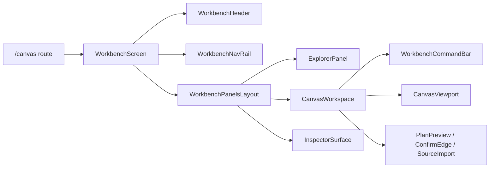
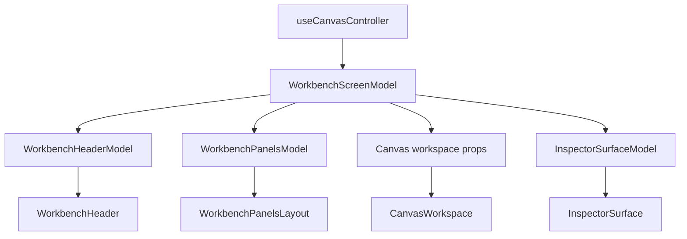
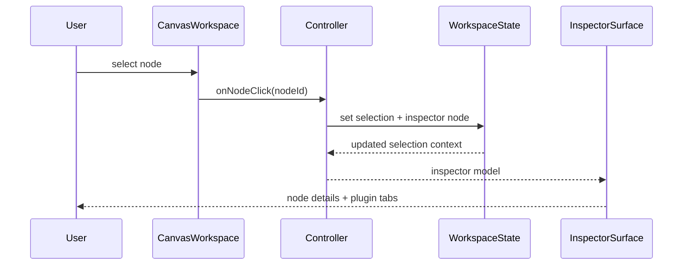
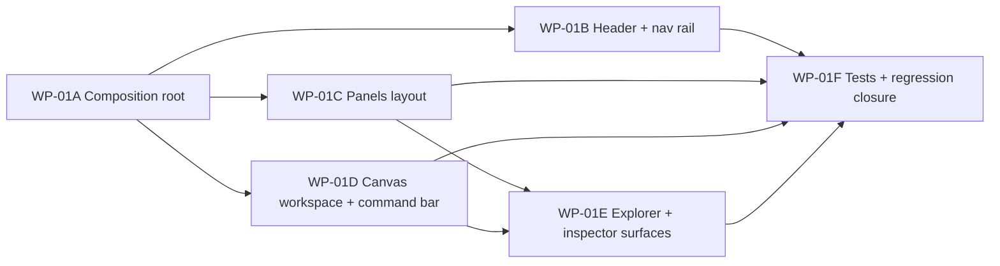

# Frontend Workbench Core Product Componentization Plan

> Product-delivery plan for converting the current `/canvas` experience into a
> stable workbench surface built from reusable product components rather than a
> broad shell-plus-controller composition.

## 1. Purpose

This document saves the implementation plan for `WP-01`.

Its job is to shift the next frontend slice away from documentation-only
governance and into product hardening of the default workbench surface.

The plan is intentionally narrow:

- it targets the workbench core around `/canvas`
- it does not reopen ACL, state, or guardrail decisions already closed in the
  frontend architecture corpus
- it does not refactor Runs, Diff, Lineage, Artifacts, or Cost as first-class
  workstreams in the same slice

## 2. Architectural role

This is a product implementation plan, not a replacement for the canonical
frontend target architecture.

Authority split:

- target architecture remains in
  [Frontend DDD Target Architecture](../frontend-ddd-target-architecture.md)
- current implementation truth remains in
  [Frontend Current Reality Matrix](frontend-current-reality-matrix.md)
- this document defines the next product-facing componentization slice for the
  workbench core

## 3. Governing sources

- [Frontend Architecture](../index.md)
- [Frontend DDD Target Architecture](../frontend-ddd-target-architecture.md)
- [App Shell](../appshell/app-shell.md)
- [Workspace Domain Specification](../workspace/workspace-domain-specification.md)
- [Workspace Orchestration - Cross-Feature Coordination Mechanism](../workspace/workspace-orchestration.md)
- [Frontend State Ownership And Persistence Policy](../frontend-state-ownership-and-persistence-policy.md)
- [Frontend Architecture Guardrails](../frontend-architecture-guardrails.md)
- [Frontend Current Reality Matrix](frontend-current-reality-matrix.md)
- [Workflow / Graph Workbench - Surfaces and Operating Modes](../views/workflow/workflow-graph-workbench-surfaces-and-operating-modes.md)

Primary code anchors for this plan:

- [Root.tsx](../../../../apps/web/src/app/Root.tsx)
- [Canvas.tsx](../../../../apps/web/src/app/views/Canvas.tsx)
- [CanvasShell.tsx](../../../../apps/web/src/app/views/canvas/CanvasShell.tsx)
- [TopAppBar.tsx](../../../../apps/web/src/app/components/TopAppBar.tsx)
- [LeftNavigation.tsx](../../../../apps/web/src/app/components/LeftNavigation.tsx)
- [DbtExplorer.tsx](../../../../apps/web/src/app/components/DbtExplorer.tsx)
- [InspectorPanel.tsx](../../../../apps/web/src/app/components/InspectorPanel.tsx)
- [useCanvasController.ts](../../../../apps/web/src/app/views/canvas/useCanvasController.ts)

## 4. Product scope

In scope:

- shell header
- navigation rail
- explorer panel
- canvas workspace
- inspector panel
- plan/run command surface

Out of scope for this slice:

- route-path changes
- plugin-registry redesign
- backend seam redesign
- new global store creation
- Runs, Diff, Lineage, Artifacts, or Cost refactors beyond shared shell reuse

## 5. Target component model

### 5.1 Target composition

### 5.2 State and interaction boundary

### 5.3 Primary user interaction

### 5.4 Task dependency graph

## 6. Stable product-facing interfaces

The implementation slice should introduce these local frontend product
contracts:

- `WorkbenchScreenModel`
- `WorkbenchHeaderModel`
- `WorkbenchPanelsModel`
- `InspectorSurfaceModel`
- `WorkbenchCommandSet`

Rules:

- these are repository-local UI composition contracts
- they must be derived from existing controller, query, and store state
- they must not become a second source of truth
- they must preserve the current workspace/state ownership rules

## 7. Task breakdown

| ID     | Task                                                                                                                        | Priority | Criticality | Effort       | Suggested staffing  | Complexity | Depends on                     | Main code anchors                                                                                       | Done criterion                                                                                                           |
| ------ | --------------------------------------------------------------------------------------------------------------------------- | -------- | ----------- | ------------ | ------------------- | ---------- | ------------------------------ | ------------------------------------------------------------------------------------------------------- | ------------------------------------------------------------------------------------------------------------------------ |
| WP-01A | Create `WorkbenchScreen` as the `/canvas` composition root and reduce `Canvas.tsx` to a thin route entry                    | P0       | Critical    | Medium       | 1 frontend engineer | Medium     | None                           | `views/Canvas.tsx`, `views/canvas/useCanvasController.ts`                                               | `/canvas` renders through `WorkbenchScreen` and `Canvas.tsx` stops orchestrating the whole surface directly              |
| WP-01B | Replace the current shell chrome with `WorkbenchHeader` and `WorkbenchNavRail` components with stable responsibilities      | P0       | High        | Medium       | 1 frontend engineer | Medium     | WP-01A                         | `Root.tsx`, `components/TopAppBar.tsx`, `components/LeftNavigation.tsx`                                 | header and nav responsibilities are explicit and route/navigation behavior is preserved                                  |
| WP-01C | Introduce `WorkbenchPanelsLayout` to own focus-mode and resizable panel composition                                         | P0       | High        | Medium       | 1 frontend engineer | Medium     | WP-01A                         | `views/canvas/CanvasShell.tsx`, `Root.tsx`                                                              | layout logic moves behind one product component and panel rules stop being spread across shell/view files                |
| WP-01D | Create `CanvasWorkspace` and `WorkbenchCommandBar` backed by a mapped `WorkbenchScreenModel` instead of broad prop drilling | P1       | Critical    | Medium-Large | 1 frontend engineer | High       | WP-01A, WP-01C                 | `views/canvas/CanvasShell.tsx`, `views/canvas/CanvasToolbar.tsx`, `views/canvas/useCanvasController.ts` | the center workbench surface reads as one module and command actions remain wired for plan/run/layout/overlay behavior   |
| WP-01E | Productize `ExplorerPanel`, `InspectorSurface`, and `InspectorTabHost` while preserving plugin contracts                    | P1       | High        | Medium-Large | 1 frontend engineer | High       | WP-01C, WP-01D                 | `components/DbtExplorer.tsx`, `components/InspectorPanel.tsx`, `plugins/registry.ts`                    | explorer and inspector become explicit product surfaces and plugin tabs still render through existing registry contracts |
| WP-01F | Add component-level tests and regression coverage around the new workbench product surface                                  | P0       | Critical    | Medium       | 1 frontend engineer | Medium     | WP-01B, WP-01C, WP-01D, WP-01E | existing `CanvasViewport` and `useCanvasController` tests plus new workbench tests                      | the new shell and workbench components have focused coverage and no route/plugin regression is introduced                |

## 8. Task details

### 8.1 WP-01A Composition root

Deliverables:

- new `WorkbenchScreen` component
- one mapper layer from `useCanvasController` output to `WorkbenchScreenModel`
- `Canvas.tsx` reduced to `ReactFlowProvider` plus `WorkbenchScreen`

Implementation constraints:

- keep `useCanvasController` as the orchestration hook in this slice
- do not redesign plan/run/query/service seams here

### 8.2 WP-01B Header and navigation

Deliverables:

- `WorkbenchHeader`
- `WorkbenchNavRail`
- explicit split between shell controls and route navigation

Implementation constraints:

- `WorkbenchHeader` must not learn graph semantics
- `WorkbenchNavRail` must stay route-and-plugin-view only

### 8.3 WP-01C Panels layout

Deliverables:

- `WorkbenchPanelsLayout`
- explicit focus-mode behavior
- explicit left/right panel visibility behavior

Implementation constraints:

- layout component owns composition, not domain action semantics

### 8.4 WP-01D Canvas workspace

Deliverables:

- `CanvasWorkspace`
- `WorkbenchCommandBar`
- workbench-scoped modal host

Implementation constraints:

- preserve current plan/run behavior
- preserve current viewport and selection interactions
- avoid passing raw controller output deep through the tree

### 8.5 WP-01E Explorer and inspector

Deliverables:

- `ExplorerPanel`
- `InspectorSurface`
- `InspectorTabHost`

Implementation constraints:

- inspector remains embedded, not routed
- selection still comes from workspace/controller state
- plugin inspector contribution contract stays unchanged

### 8.6 WP-01F Tests and regression closure

Required coverage:

- `WorkbenchHeader`
- `WorkbenchNavRail`
- `WorkbenchPanelsLayout`
- `InspectorSurface`
- `WorkbenchScreen`
- retained regression coverage for `CanvasViewport` and
  `useCanvasController`

## 9. Acceptance criteria

- `/canvas` renders through `WorkbenchScreen`
- the workbench shell is split into stable product components
- inspector and explorer are explicit workbench surfaces
- product-facing component contracts replace broad prop-drilled composition
- current route paths remain unchanged
- current plugin registry behavior remains unchanged
- no new global store is introduced
- runtime truth is not moved into browser persistence

## 10. Repository-local implementation policy

This plan is a repository-local product delivery policy.

The component names and screen-model contracts in this document are local
implementation targets, not source-authored architectural terms from Fowler or
an external platform API.

The architectural constraints they must obey remain governed by the existing
frontend corpus:

- state ownership:
  [Frontend State Ownership And Persistence Policy](../frontend-state-ownership-and-persistence-policy.md)
- drift prevention:
  [Frontend Architecture Guardrails](../frontend-architecture-guardrails.md)
- current truth:
  [Frontend Current Reality Matrix](frontend-current-reality-matrix.md)

## 11. References

- [Frontend Architecture](../index.md)
- [Frontend DDD Target Architecture](../frontend-ddd-target-architecture.md)
- [Frontend Current Reality Matrix](frontend-current-reality-matrix.md)
- [Frontend State Ownership And Persistence Policy](../frontend-state-ownership-and-persistence-policy.md)
- [Frontend Architecture Guardrails](../frontend-architecture-guardrails.md)
- [App Shell](../appshell/app-shell.md)
- [Workspace Domain Specification](../workspace/workspace-domain-specification.md)
- [Workspace Orchestration - Cross-Feature Coordination Mechanism](../workspace/workspace-orchestration.md)
