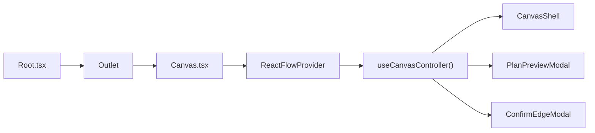
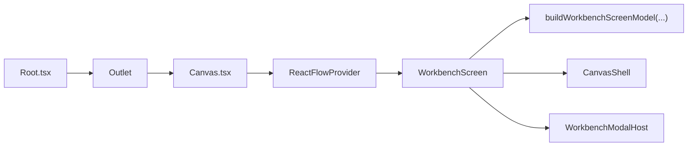
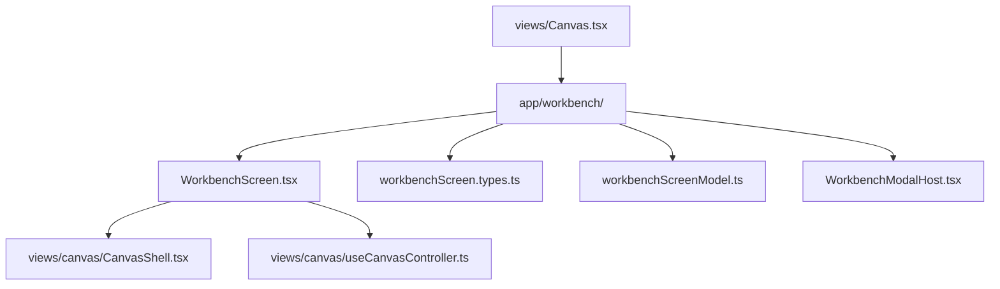
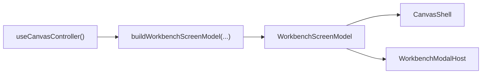
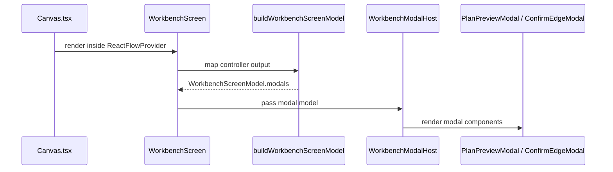

# Frontend Workbench WP-01A Composition Root Spec

## Purpose

This document is the dedicated implementation spec for `WP-01A`.

Its job is to define, in decision-complete form, how the `/canvas`
composition root moves from `Canvas.tsx` into a new workbench module without
changing route paths, plugin contracts, service seams, or state ownership.

This document does not replace the broader product roadmap in
[Frontend Workbench Core Product Componentization Plan](frontend-workbench-core-product-componentization-plan.md).
That plan remains the high-level execution sequence. This document narrows the
scope to the first executable slice.

## Architectural Role

This is a repository-local product component spec.

Authority split:

- target architecture remains in
  [Frontend DDD Target Architecture](../frontend-ddd-target-architecture.md)
- current implementation truth remains in
  [Frontend Current Reality Matrix](frontend-current-reality-matrix.md)
- the broad workbench roadmap remains in
  [Frontend Workbench Core Product Componentization Plan](frontend-workbench-core-product-componentization-plan.md)
- this document is the detailed implementation target for `WP-01A`

Evidence mode for the exact component/module names in this spec:

- `local canonical policy`: `WorkbenchScreen`, `WorkbenchModalHost`, and
  `app/workbench/` are repository-local implementation targets
- `compatible precedent`: keeping route entry, controller orchestration, and
  view composition distinct is compatible with Fowler's
  [Presentation Domain Data Layering](https://martinfowler.com/bliki/PresentationDomainDataLayering.html)
  and
  [Separated Presentation](https://martinfowler.com/eaaDev/SeparatedPresentation.html)
- `exact precedent`: current implementation evidence comes from the code anchors
  listed below, not from external literature

## Governing Sources

Repository governance and architecture sources:

- [AGENTS.md](../../../../AGENTS.md)
- [Governance Document And Rule Inventory](../../../planning/status/governance-document-rule-inventory.md)
- [AI Work Protocol](../../../guides/ai-work-protocol.md)
- [Frontend Architecture](../index.md)
- [Frontend DDD Target Architecture](../frontend-ddd-target-architecture.md)
- [Frontend State Ownership And Persistence Policy](../frontend-state-ownership-and-persistence-policy.md)
- [Frontend Architecture Guardrails](../frontend-architecture-guardrails.md)
- [Frontend Current Reality Matrix](frontend-current-reality-matrix.md)
- [Frontend Workbench Core Product Componentization Plan](frontend-workbench-core-product-componentization-plan.md)

Primary code anchors:

- [Root.tsx](../../../../apps/web/src/app/Root.tsx)
- [Canvas.tsx](../../../../apps/web/src/app/views/Canvas.tsx)
- [CanvasShell.tsx](../../../../apps/web/src/app/views/canvas/CanvasShell.tsx)
- [canvasShell.types.ts](../../../../apps/web/src/app/views/canvas/canvasShell.types.ts)
- [useCanvasController.ts](../../../../apps/web/src/app/views/canvas/useCanvasController.ts)
- [Modals.tsx](../../../../apps/web/src/app/components/Modals.tsx)

## Current Composition Root

Today the `/canvas` route entry is also the local workbench composition root.
`Canvas.tsx` creates the controller, passes a broad prop surface into
`CanvasShell`, and hosts the plan and edge-confirmation modals.

### Current composition



Evidence:

- `exact precedent`: [Root.tsx](../../../../apps/web/src/app/Root.tsx) provides
  the global shell and `<Outlet />`.
- `exact precedent`: [Canvas.tsx](../../../../apps/web/src/app/views/Canvas.tsx)
  owns `ReactFlowProvider`, calls `useCanvasController()`, renders
  `CanvasShell`, and hosts `PlanPreviewModal` and `ConfirmEdgeModal`.
- `exact precedent`: [CanvasShell.tsx](../../../../apps/web/src/app/views/canvas/CanvasShell.tsx)
  is the current center-surface composition.
- `local canonical policy`: `WP-01A` treats this route-level ownership as the
  seam to extract, without changing behavior.

### Current responsibilities that must remain stable

- `Root.tsx` remains the global provider and shell boundary.
- `Canvas.tsx` remains the route entry for `/canvas`.
- `useCanvasController()` remains the orchestration hook in `WP-01A`.
- `CanvasShell` remains the existing workbench body in `WP-01A`.
- `SourceImportWizard` remains inside `CanvasShell` for this slice.
- `TopAppBar` and `LeftNavigation` remain in `Root.tsx` for `WP-01A` only; they
  are explicit extraction candidates for `WP-01B`.

## Target Composition Root

The target for `WP-01A` is to insert a product-level composition root between
the route entry and the current workbench body.

`Canvas.tsx` becomes thin. `WorkbenchScreen` becomes the only place in this
slice where workbench-level composition is assembled.

### Target composition



Evidence:

- `compatible precedent`: composition-root extraction is compatible with
  Fowler's
  [Presentation Domain Data Layering](https://martinfowler.com/bliki/PresentationDomainDataLayering.html)
  because orchestration stays above concrete view components.
- `compatible precedent`: keeping screen composition distinct from controller
  state is compatible with Fowler's
  [Separated Presentation](https://martinfowler.com/eaaDev/SeparatedPresentation.html).
- `exact precedent`: the current route/controller/modal ownership is visible in
  [Canvas.tsx](../../../../apps/web/src/app/views/Canvas.tsx) and
  [useCanvasController.ts](../../../../apps/web/src/app/views/canvas/useCanvasController.ts).
- `local canonical policy`: `WorkbenchScreen` and `WorkbenchModalHost` are the
  chosen extraction boundary for this repository.

### Ownership split locked by this spec

- `Root.tsx`
  - keeps `QueryClientProvider`
  - keeps platform health wiring and connection-status side effect
  - keeps `TopAppBar`, `LeftNavigation`, console drawer, and `<Outlet />`
  - does not gain new workbench-specific composition logic in `WP-01A`
- `Canvas.tsx`
  - keeps `ReactFlowProvider`
  - renders `WorkbenchScreen`
  - stops orchestrating controller and modals directly
- `WorkbenchScreen`
  - calls `useCanvasController()`
  - builds `WorkbenchScreenModel`
  - renders `CanvasShell`
  - renders `WorkbenchModalHost`

## Module Structure

`WP-01A` introduces one new frontend-local module:
`apps/web/src/app/workbench/`.

### Module boundary



Evidence:

- `exact precedent`: [Canvas.tsx](../../../../apps/web/src/app/views/Canvas.tsx)
  is the current route-level entrypoint that can be thinned without changing
  the path.
- `exact precedent`: [CanvasShell.tsx](../../../../apps/web/src/app/views/canvas/CanvasShell.tsx)
  is already the existing body that `WP-01A` preserves.
- `local canonical policy`: the `app/workbench/` folder and its file list are
  repository-local module boundaries for product composition.

### Initial module contents

- `WorkbenchScreen.tsx`
- `workbenchScreen.types.ts`
- `workbenchScreenModel.ts`
- `WorkbenchModalHost.tsx`

No backend services, query hooks, or new stores belong inside this module in
`WP-01A`.

## Interfaces And Models

`WP-01A` introduces the smallest possible set of local UI contracts required to
move the composition root cleanly.

### WorkbenchScreenModel

`WorkbenchScreenModel` is a local composition contract, not a new domain model.
It is derived from the current controller output and does not create a second
source of truth.

```ts
import type { ExecutionPlan } from '../types/dbt';
import type { CanvasShellProps } from '../views/canvas/canvasShell.types';

export type WorkbenchModalModel = {
  planPreview: {
    open: boolean;
    plan: ExecutionPlan | null;
    onClose: () => void;
    onStartRun: () => void;
  };
  confirmEdge: {
    open: boolean;
    edge: { source: string; target: string; type: string } | null;
    onClose: () => void;
    onConfirm: () => void;
  };
};

export type WorkbenchScreenModel = {
  canvas: CanvasShellProps;
  modals: WorkbenchModalModel;
};
```

Evidence:

- `exact precedent`: [canvasShell.types.ts](../../../../apps/web/src/app/views/canvas/canvasShell.types.ts)
  defines the existing `CanvasShellProps` surface that should be preserved in
  `WP-01A`.
- `exact precedent`: [Modals.tsx](../../../../apps/web/src/app/components/Modals.tsx)
  defines the runtime prop shapes for `PlanPreviewModal` and
  `ConfirmEdgeModal`.
- `local canonical policy`: `WorkbenchScreenModel` and `WorkbenchModalModel`
  are repository-local composition contracts.

### WorkbenchModalHost props shape

`WorkbenchModalHost` receives only the modal subset of the screen model.

```ts
type WorkbenchModalHostProps = {
  modals: WorkbenchModalModel;
};
```

### Representative target Canvas.tsx

This is a repository-local implementation example. It is representative code,
not a source-authored external pattern.

```tsx
import { ReactFlowProvider } from '@xyflow/react';

import { WorkbenchScreen } from '../workbench/WorkbenchScreen';

export default function Canvas() {
  return (
    <ReactFlowProvider>
      <WorkbenchScreen />
    </ReactFlowProvider>
  );
}
```

### Representative target WorkbenchScreen.tsx

```tsx
import CanvasShell from '../views/canvas/CanvasShell';
import { useCanvasController } from '../views/canvas/useCanvasController';

import { WorkbenchModalHost } from './WorkbenchModalHost';
import { buildWorkbenchScreenModel } from './workbenchScreenModel';

export function WorkbenchScreen() {
  const controller = useCanvasController();
  const screenModel = buildWorkbenchScreenModel(controller);

  return (
    <>
      <CanvasShell {...screenModel.canvas} />
      <WorkbenchModalHost modals={screenModel.modals} />
    </>
  );
}
```

### Representative buildWorkbenchScreenModel(...)

```ts
import type { ExecutionPlan } from '../types/dbt';
import type { useCanvasController } from '../views/canvas/useCanvasController';

import type { WorkbenchScreenModel } from './workbenchScreen.types';

export function buildWorkbenchScreenModel(
  controller: ReturnType<typeof useCanvasController>
): WorkbenchScreenModel {
  return {
    canvas: {
      focusMode: controller.focusMode,
      explorerPanelVisible: controller.explorerPanelVisible,
      inspectorPanelVisible: controller.inspectorPanelVisible,
      explorerNodes: controller.explorerNodes,
      inspectorNode: controller.inspectorNode,
      activeRunId: controller.activeRunId,
      registeredPlugins: controller.registeredPlugins,
      userPermissions: controller.userPermissions,
      nodesWithImpact: controller.nodesWithImpact,
      edges: controller.edges,
      nodeTypes: controller.nodeTypes,
      gridSize: controller.gridSize,
      viewport: controller.viewport,
      onNodesChange: controller.onNodesChange,
      onNodeDragStop: controller.handleNodeDragStop,
      onEdgesChange: controller.onEdgesChange,
      onConnect: controller.onConnect,
      onNodeClick: controller.handleNodeClick,
      onSelectionChange: controller.onSelectionChange,
      onViewportChange: controller.handleViewportChange,
      onDrop: controller.handleDrop,
      onDragOver: controller.handleDragOver,
      onHideExplorer: controller.hideExplorerPanel,
      onShowExplorer: controller.showExplorerPanel,
      onHideInspector: controller.hideInspectorPanel,
      onShowInspector: controller.showInspectorPanel,
      onAutoLayout: controller.handleAutoLayout,
      onToggleCostOverlay: controller.handleToggleCostOverlay,
      onToggleImpact: controller.toggleImpactOverlay,
      onToggleColumns: controller.toggleColumnLevelLineage,
      onPlan: () => {
        void controller.handlePlan();
      },
      onRun: () => {
        void controller.handleStartRun();
      },
      exclusiveOverlayMode: controller.exclusiveOverlayMode,
      canUseCostOverlay: controller.canUseCostOverlay,
      impactOverlayEnabled: controller.impactOverlayEnabled,
      columnLevelLineageEnabled: controller.columnLevelLineageEnabled,
    },
    modals: {
      planPreview: {
        open: controller.planModalOpen,
        plan: controller.currentPlan as ExecutionPlan | null,
        onClose: () => controller.setPlanModalOpen(false),
        onStartRun: () => {
          void controller.handleStartRun();
        },
      },
      confirmEdge: {
        open: controller.confirmEdgeModal.open,
        edge: controller.confirmEdgeModal.edge,
        onClose: () =>
          controller.setConfirmEdgeModal({
            open: false,
            edge: null,
          }),
        onConfirm: controller.confirmEdgeCreation,
      },
    },
  };
}
```

### Representative WorkbenchModalHost

```tsx
import { ConfirmEdgeModal, PlanPreviewModal } from '../components/Modals';

import type { WorkbenchModalHostProps } from './workbenchScreen.types';

export function WorkbenchModalHost({ modals }: WorkbenchModalHostProps) {
  return (
    <>
      <PlanPreviewModal
        open={modals.planPreview.open}
        onClose={modals.planPreview.onClose}
        plan={modals.planPreview.plan}
        onStartRun={modals.planPreview.onStartRun}
      />

      <ConfirmEdgeModal
        open={modals.confirmEdge.open}
        onClose={modals.confirmEdge.onClose}
        edge={modals.confirmEdge.edge}
        onConfirm={modals.confirmEdge.onConfirm}
      />
    </>
  );
}
```

## Data Flow

`WP-01A` preserves the existing authority model. The controller remains the
source of truth. The mapper is translation-only.

### Controller-to-model flow



Evidence:

- `exact precedent`: [useCanvasController.ts](../../../../apps/web/src/app/views/canvas/useCanvasController.ts)
  already returns the state and callbacks needed by both `CanvasShell` and the
  modals.
- `exact precedent`: [Canvas.tsx](../../../../apps/web/src/app/views/Canvas.tsx)
  already performs the same pass-through manually.
- `compatible precedent`: separating orchestration data from rendered views is
  compatible with Fowler's
  [Separated Presentation](https://martinfowler.com/eaaDev/SeparatedPresentation.html).
- `local canonical policy`: the mapper is translation-only and must not create
  new authority or persistence.

### Modal hosting sequence



Evidence:

- `exact precedent`: [Canvas.tsx](../../../../apps/web/src/app/views/Canvas.tsx)
  currently hosts both modal components directly.
- `exact precedent`: [Modals.tsx](../../../../apps/web/src/app/components/Modals.tsx)
  defines the modal contracts that the host must preserve.
- `local canonical policy`: `PlanPreviewModal` and `ConfirmEdgeModal` move to
  `WorkbenchModalHost`, while `SourceImportWizard` stays in
  [CanvasShell.tsx](../../../../apps/web/src/app/views/canvas/CanvasShell.tsx)
  for `WP-01A`.

### Preserved invariants

- no route-path changes
- no plugin-registry contract changes
- no backend seam changes
- no new store
- no new local persistence
- no behavior drift for plan preview, edge confirmation, selection, or
  navigation to `/runs/:runId`

## Migration Sequence

1. Create `apps/web/src/app/workbench/`.
2. Add `WorkbenchScreen.tsx`, `workbenchScreen.types.ts`,
   `workbenchScreenModel.ts`, and `WorkbenchModalHost.tsx`.
3. Move route-level composition from `Canvas.tsx` into `WorkbenchScreen`.
4. Keep `CanvasShell` unchanged as the current workbench body.
5. Keep `SourceImportWizard` inside `CanvasShell`.
6. Replace the body of `Canvas.tsx` with `ReactFlowProvider` plus
   `WorkbenchScreen`.
7. Add `WorkbenchScreen` tests without breaking existing controller and
   viewport tests.

Rollback boundary:

- if regressions appear, the revert boundary is the new `workbench` module plus
  the thinning change in `Canvas.tsx`
- `Root.tsx`, plugin contracts, and controller-service seams stay untouched in
  `WP-01A`

## Test Strategy

Required coverage for the implementation slice:

- new `WorkbenchScreen` component test
  - renders `CanvasShell` with mapped controller output
  - renders `WorkbenchModalHost`
  - passes plan-preview modal props correctly
  - passes confirm-edge modal props correctly
- preserve current
  [useCanvasController.test.tsx](../../../../apps/web/src/app/views/canvas/useCanvasController.test.tsx)
  coverage
- preserve current
  [CanvasViewport.test.tsx](../../../../apps/web/src/app/views/canvas/CanvasViewport.test.tsx)
  coverage

Acceptance scenarios:

- `/canvas` still renders through `ReactFlowProvider`
- selecting nodes and opening inspector behaves as before
- opening plan preview and starting a run behaves as before
- confirming edge creation behaves as before
- plugin inspector contributions remain unaffected

## References

Repository references:

- [Frontend Architecture](../index.md)
- [Frontend DDD Target Architecture](../frontend-ddd-target-architecture.md)
- [Frontend Current Reality Matrix](frontend-current-reality-matrix.md)
- [Frontend Workbench Core Product Componentization Plan](frontend-workbench-core-product-componentization-plan.md)
- [Root.tsx](../../../../apps/web/src/app/Root.tsx)
- [Canvas.tsx](../../../../apps/web/src/app/views/Canvas.tsx)
- [CanvasShell.tsx](../../../../apps/web/src/app/views/canvas/CanvasShell.tsx)
- [canvasShell.types.ts](../../../../apps/web/src/app/views/canvas/canvasShell.types.ts)
- [useCanvasController.ts](../../../../apps/web/src/app/views/canvas/useCanvasController.ts)
- [Modals.tsx](../../../../apps/web/src/app/components/Modals.tsx)

External architectural references:

- Martin Fowler,
  [Presentation Domain Data Layering](https://martinfowler.com/bliki/PresentationDomainDataLayering.html)
- Martin Fowler,
  [Separated Presentation](https://martinfowler.com/eaaDev/SeparatedPresentation.html)
