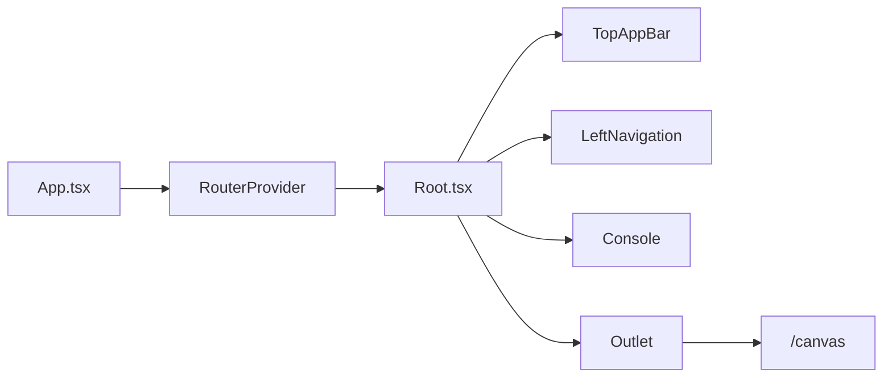
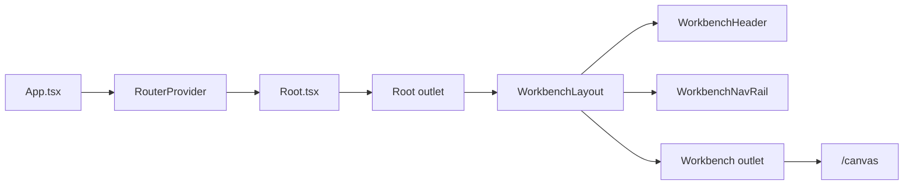
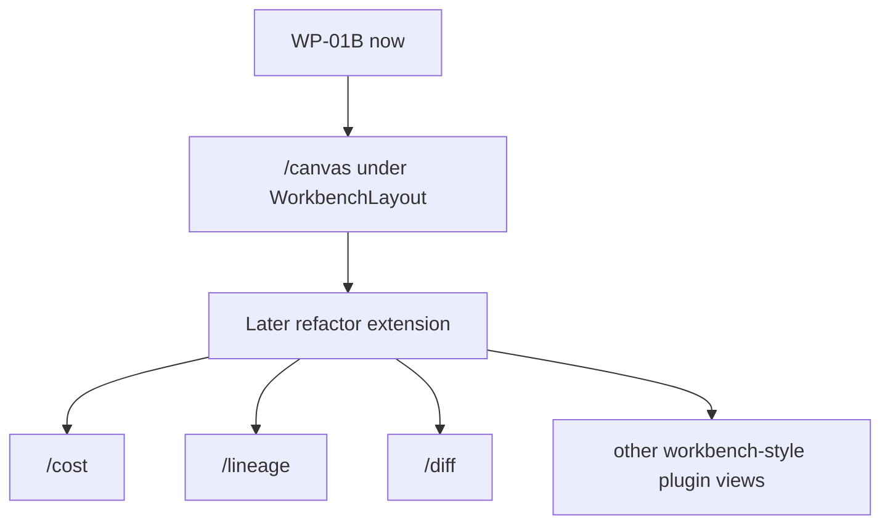
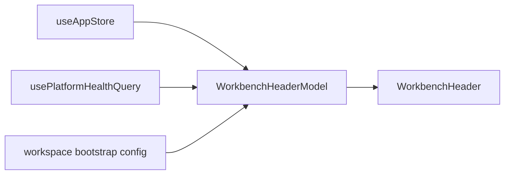
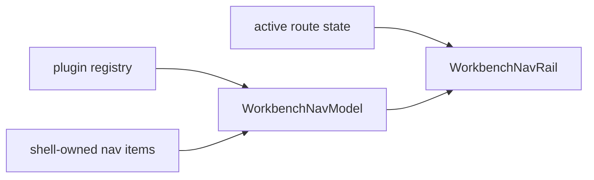

# Frontend Workbench WP-01B Shell Layout Spec

## Purpose

This document is the dedicated implementation spec for `WP-01B`.

Its job is to define, in decision-complete form, how the workbench shell chrome
for `/canvas` moves out of `Root.tsx` and into a nested `WorkbenchLayout`
without changing public route paths, plugin manifest contracts, or current
state ownership rules.

This spec also locks one important repository-local policy:
`WP-01B` is the first **refactor entry point** for a reusable workbench-shell
pattern. It is not a `/canvas`-only special case that future work must undo.

## Architectural Role

This is a repository-local product shell spec.

Authority split:

- target domain boundaries remain in
  [Frontend DDD Target Architecture](../frontend-ddd-target-architecture.md)
- global shell semantics remain in
  [App Shell](../appshell/app-shell.md)
- current implementation truth remains in
  [Frontend Current Reality Matrix](frontend-current-reality-matrix.md)
- `WP-01A` remains the composition-root spec in
  [Frontend Workbench WP-01A Composition Root Spec](frontend-workbench-wp01a-composition-root-spec.md)
- this document defines the next extraction step for workbench header/nav
  ownership

Evidence mode for the exact names in this spec:

- `local canonical policy`: `WorkbenchLayout`, `WorkbenchHeader`, and
  `WorkbenchNavRail` are repository-local implementation targets
- `compatible precedent`: explicit nested shell composition is compatible with
  Fowler's
  [Presentation Domain Data Layering](https://martinfowler.com/bliki/PresentationDomainDataLayering.html)
  and
  [Separated Presentation](https://martinfowler.com/eaaDev/SeparatedPresentation.html)
- `exact precedent`: current shell ownership and route structure are grounded
  in the repo code anchors below

## Governing Sources

Repository governance and architecture sources:

- [AGENTS.md](../../../../AGENTS.md)
- [Governance Document And Rule Inventory](../../../planning/status/governance-document-rule-inventory.md)
- [AI Work Protocol](../../../guides/ai-work-protocol.md)
- [Frontend Architecture](../index.md)
- [Frontend DDD Target Architecture](../frontend-ddd-target-architecture.md)
- [App Shell](../appshell/app-shell.md)
- [Frontend Workbench Core Product Componentization Plan](frontend-workbench-core-product-componentization-plan.md)
- [Frontend Workbench WP-01A Composition Root Spec](frontend-workbench-wp01a-composition-root-spec.md)
- [Frontend State Ownership And Persistence Policy](../frontend-state-ownership-and-persistence-policy.md)
- [Frontend Architecture Guardrails](../frontend-architecture-guardrails.md)
- [Frontend Current Reality Matrix](frontend-current-reality-matrix.md)

Primary code anchors:

- [Root.tsx](../../../../apps/web/src/app/Root.tsx)
- [routes.ts](../../../../apps/web/src/app/routes.ts)
- [TopAppBar.tsx](../../../../apps/web/src/app/components/TopAppBar.tsx)
- [LeftNavigation.tsx](../../../../apps/web/src/app/components/LeftNavigation.tsx)
- [Canvas.tsx](../../../../apps/web/src/app/views/Canvas.tsx)
- [registry.ts](../../../../apps/web/src/app/plugins/registry.ts)

## Current Shell Ownership

Today the global application shell and the `/canvas` workbench chrome are still
collapsed into `Root.tsx`.

### Current shell ownership



Evidence:

- `exact precedent`: [routes.ts](../../../../apps/web/src/app/routes.ts)
  mounts `Root` as the parent route for all current children.
- `exact precedent`: [Root.tsx](../../../../apps/web/src/app/Root.tsx) renders
  `TopAppBar`, `LeftNavigation`, `Console`, and `<Outlet />`.
- `exact precedent`: [TopAppBar.tsx](../../../../apps/web/src/app/components/TopAppBar.tsx)
  already owns workspace selectors, git status, connection state, and shell
  toggles.
- `exact precedent`: [LeftNavigation.tsx](../../../../apps/web/src/app/components/LeftNavigation.tsx)
  already owns plugin and shell navigation items.

### Why this is now a congruence problem

The corpus already says the workbench is becoming a product surface with its
own composition root. If `Root.tsx` continues to own the `/canvas` header and
rail indefinitely, then:

- the workbench product boundary stays split across two layers;
- `WP-01A` and the broader `WP-01` roadmap pull in different directions;
- the App Shell doc is easy to misread as "all header/nav chrome must always be
  global shell chrome".

## Target Shell Layering

`WP-01B` introduces a nested layout boundary for workbench routes.

Chosen defaults:

- route scope: `Canvas first`
- move strategy: `nested layout route`
- future direction: the layout is intentionally reusable so later refactors can
  migrate more workbench-style routes under it

### Target nested layout



Evidence:

- `compatible precedent`: nested route composition is compatible with Fowler's
  [Separated Presentation](https://martinfowler.com/eaaDev/SeparatedPresentation.html)
  because it makes the presentation boundary explicit instead of conditional.
- `exact precedent`: [routes.ts](../../../../apps/web/src/app/routes.ts)
  already centralizes route composition, so a nested route is a natural
  extraction seam.
- `local canonical policy`: `WorkbenchLayout` becomes the workbench-shell
  boundary for routes that opt into this product surface.

### Ownership split locked by this spec

- `Root.tsx`
  - keeps app-global providers and app-level side effects
  - keeps the outer route frame
  - stops owning `/canvas` header/nav chrome
- `WorkbenchLayout`
  - owns workbench shell chrome for opted-in routes
  - renders `WorkbenchHeader`
  - renders `WorkbenchNavRail`
  - exposes a child outlet for workbench views
- `Canvas.tsx`
  - remains the first workbench child route
  - keeps `ReactFlowProvider`
  - keeps `WorkbenchScreen` from `WP-01A`

## Route Scope And Extension Policy

### Current adoption in `WP-01B`

Only `/canvas` migrates under `WorkbenchLayout` in this slice.

This keeps the refactor small enough to validate the pattern without forcing
the rest of the route tree to move at once.

### Future refactor extension map



Evidence:

- `exact precedent`: [registry.ts](../../../../apps/web/src/app/plugins/registry.ts)
  already distinguishes navigation views and default core view resolution.
- `local canonical policy`: `Canvas first` is the initial migration rule, but
  `WorkbenchLayout` is explicitly a pattern-establishing boundary for later
  refactor extension.

### Repository-local rule

This spec must not be read as "the workbench shell is only for `/canvas`".

The correct reading is:

- `/canvas` is the first adopted route
- the layout boundary is reusable by design
- later route migration is a separate slice, not a redesign of the pattern

## Interfaces And Models

`WP-01B` introduces local shell composition contracts. These are frontend-local
product models, not new backend/domain contracts.

### WorkbenchHeaderModel

```ts
export type WorkbenchHeaderModel = {
  workspace: {
    tenant: string;
    project: string;
    environment: string;
    onTenantChange: (value: string) => void;
    onProjectChange: (value: string) => void;
    onEnvironmentChange: (value: string) => void;
  };
  git: {
    branch: string;
    sha: string;
  };
  connection: {
    rest: 'ok' | 'degraded' | 'offline';
    liveEvents: 'ok' | 'degraded' | 'offline';
    detail?: string | null;
  };
  shellControls: {
    focusMode: boolean;
    explorerVisible: boolean;
    inspectorVisible: boolean;
    consoleVisible: boolean;
    gridSize: number;
    onToggleFocusMode: () => void;
    onToggleExplorer: () => void;
    onToggleInspector: () => void;
    onToggleConsole: () => void;
    onSetGridSize: (value: number) => void;
  };
};
```

### WorkbenchNavModel

```ts
export type WorkbenchNavItem = {
  to: string;
  label: string;
  icon: React.ComponentType<{ className?: string }>;
  source: 'plugin' | 'shell';
};

export type WorkbenchNavModel = {
  items: WorkbenchNavItem[];
};
```

### Header data model flow



Evidence:

- `exact precedent`: [TopAppBar.tsx](../../../../apps/web/src/app/components/TopAppBar.tsx)
  already reads from `useAppStore()` and workspace bootstrap config.
- `exact precedent`: [Root.tsx](../../../../apps/web/src/app/Root.tsx)
  already owns platform health query wiring used by the current top bar.
- `local canonical policy`: `WorkbenchHeaderModel` makes that ownership
  explicit for the extracted workbench shell.

### Nav contribution flow



Evidence:

- `exact precedent`: [LeftNavigation.tsx](../../../../apps/web/src/app/components/LeftNavigation.tsx)
  already merges plugin-contributed views with shell-owned nav items.
- `exact precedent`: [registry.ts](../../../../apps/web/src/app/plugins/registry.ts)
  exposes `getNavigationViews(...)` and default-core-view resolution.
- `local canonical policy`: `WorkbenchNavModel` makes the merged rail model
  explicit without changing plugin manifest contracts.

## Representative Route Shape

This is a repository-local implementation example. It illustrates the intended
route boundary, not an externally sourced pattern.

```tsx
export const router = createBrowserRouter([
  {
    path: '/',
    Component: Root,
    children: [
      {
        path: '/',
        Component: WorkbenchLayout,
        children: [
          { index: true, element: <Navigate to="/canvas" replace /> },
          { path: 'canvas', Component: Canvas },
        ],
      },
      { path: 'plugins', Component: PluginsView },
      { path: 'admin', Component: AdminView },
    ],
  },
]);
```

### Representative WorkbenchLayout shape

```tsx
export function WorkbenchLayout() {
  const headerModel = useWorkbenchHeaderModel();
  const navModel = useWorkbenchNavModel();

  return (
    <div className="flex h-full w-full overflow-hidden">
      <WorkbenchNavRail model={navModel} />
      <div className="flex min-w-0 flex-1 flex-col overflow-hidden">
        <WorkbenchHeader model={headerModel} />
        <div className="min-h-0 flex-1 overflow-hidden">
          <Outlet />
        </div>
      </div>
    </div>
  );
}
```

## Migration Sequence

1. Introduce a `WorkbenchLayout` route boundary under `Root`.
2. Migrate only `/canvas` under that nested layout.
3. Extract `WorkbenchHeader` from the semantics currently embedded in
   `TopAppBar.tsx`.
4. Extract `WorkbenchNavRail` from the semantics currently embedded in
   `LeftNavigation.tsx`.
5. Keep plugin registry contracts unchanged; adapt them into `WorkbenchNavModel`.
6. Keep non-workbench routes such as `/plugins` and `/admin` outside the new
   layout for now.
7. Treat later route adoption as a follow-up refactor that reuses the same
   boundary.

## Test Strategy

Required coverage for the implementation slice:

- route test proving `/canvas` renders inside `WorkbenchLayout`
- `WorkbenchHeader` test for workspace selector, git badge, and connection
  state rendering
- `WorkbenchHeader` test proving shell controls still dispatch current actions
- `WorkbenchNavRail` test proving plugin and shell items render in the same
  effective order as today
- regression proving `/plugins` and `/admin` remain outside the workbench shell
  until intentionally migrated

Acceptance scenarios:

- `/canvas` uses `WorkbenchLayout`
- `Root.tsx` no longer directly renders `/canvas` header/nav chrome
- workbench shell still preserves current route behavior
- non-workbench routes still render
- future route migration can reuse the same nested layout boundary

## References

Repository references:

- [Frontend Architecture](../index.md)
- [Frontend DDD Target Architecture](../frontend-ddd-target-architecture.md)
- [App Shell](../appshell/app-shell.md)
- [Frontend Workbench Core Product Componentization Plan](frontend-workbench-core-product-componentization-plan.md)
- [Frontend Workbench WP-01A Composition Root Spec](frontend-workbench-wp01a-composition-root-spec.md)
- [Root.tsx](../../../../apps/web/src/app/Root.tsx)
- [routes.ts](../../../../apps/web/src/app/routes.ts)
- [TopAppBar.tsx](../../../../apps/web/src/app/components/TopAppBar.tsx)
- [LeftNavigation.tsx](../../../../apps/web/src/app/components/LeftNavigation.tsx)
- [Canvas.tsx](../../../../apps/web/src/app/views/Canvas.tsx)
- [registry.ts](../../../../apps/web/src/app/plugins/registry.ts)

External architectural references:

- Martin Fowler,
  [Presentation Domain Data Layering](https://martinfowler.com/bliki/PresentationDomainDataLayering.html)
- Martin Fowler,
  [Separated Presentation](https://martinfowler.com/eaaDev/SeparatedPresentation.html)
