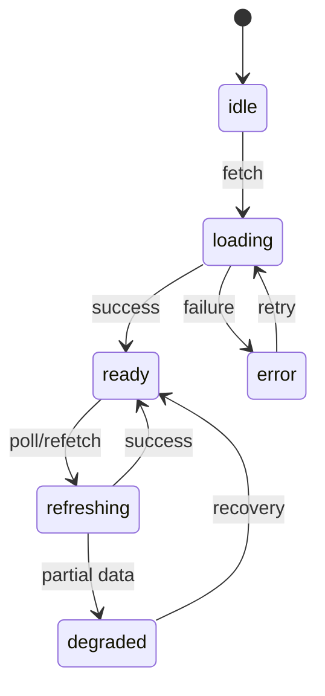
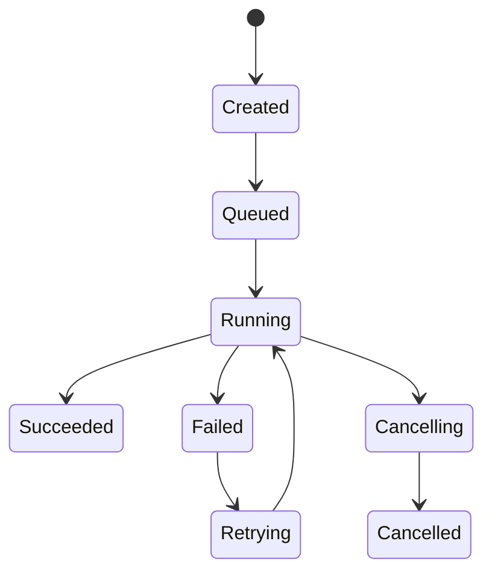
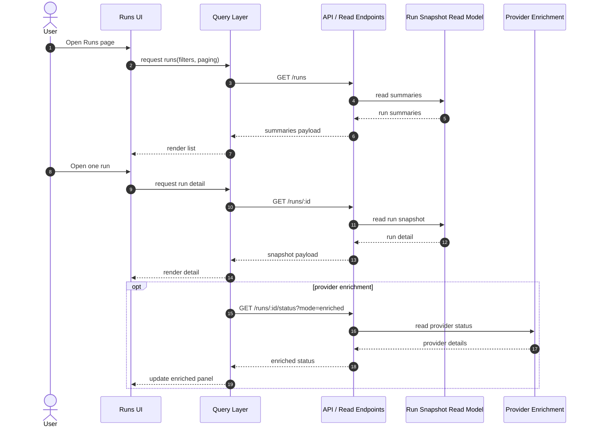
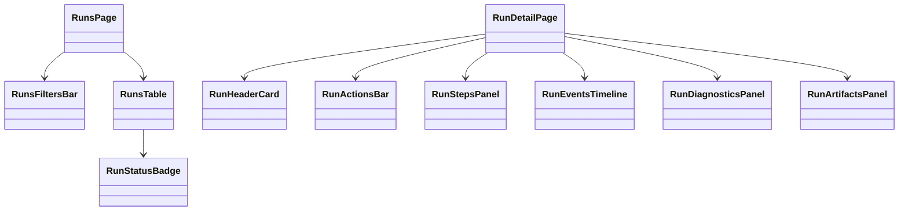

# Runs

## 1. Purpose

The **Runs** area is the operational read surface of DVT+ for execution instances.

Its purpose is to let the user:

- discover and filter historical and active runs,
- inspect the current state of a run,
- understand execution progress, failures, timings, and lineage-relevant signals,
- navigate from a run to its related plan, workflow, artifacts, logs, and events,
- perform only explicit allowed actions such as cancel, retry, resume, or open diagnostics.

The Runs frontend is a **read-heavy operational workbench**, not an execution
engine.

Current implementation posture is tracked in
[Frontend Current Reality Matrix](../review/frontend-current-reality-matrix.md).
This document defines the target Runs capability, not current implementation
completeness.

## 2. Design principle

The frontend for Runs must preserve the system doctrine:

- **UI does not execute business logic**
- **UI does not derive authoritative execution state by itself**
- **UI consumes read models and explicit command endpoints**
- **UI may enrich presentation, but never invent runtime truth**

That means:

- the canonical status comes from server read models,
- provider-specific details are secondary enrichments,
- event streams and snapshots must be visually differentiated,
- optimistic assumptions must be avoided for high-risk actions.

## 3. Scope

The Runs surface should cover:

1. **Runs List**
2. **Run Detail**
3. **Run Timeline / Event Stream**
4. **Run Diagnostics**
5. **Run Actions**
6. **Cross-navigation to plan, workflow, artifacts, lineage, logs**

Out of scope for this slice:

- planning authoring,
- provider workflow editing,
- deep lineage graph editing,
- infrastructure administration screens.

## 4. Primary user needs

The user working on Runs usually wants one of these outcomes:

- find a failed run quickly,
- understand where execution stopped,
- distinguish domain failure vs provider/infrastructure failure,
- assess duration, queueing, retries, and step-level outcomes,
- compare runs across environment, tenant, branch, or workflow,
- open the exact technical evidence needed for diagnosis.

## 5. Core frontend model

The frontend should treat **Run** as a composition of read concerns, not as one overloaded client object.

Recommended view-model split:

```text
RunSummaryVM
RunStatusVM
RunStepVM
RunEventVM
RunDiagnosticsVM
RunActionsVM
RunLinksVM
```

### 5.1 RunSummaryVM

Used by list pages, tables, side panels.

Suggested fields:

- `runId`
- `workflowId`
- `planId`
- `tenantId`
- `environment`
- `status`
- `startedAt`
- `endedAt`
- `durationMs`
- `triggerType`
- `triggeredBy`
- `provider`
- `providerRunId?`
- `hasErrors`
- `hasWarnings`

### 5.2 RunStatusVM

Used in the header/status card of Run Detail.

Suggested fields:

- `runId`
- `lifecycleState`
- `executionState`
- `resultState`
- `statusLabel`
- `statusSource` (`snapshot` | `provider_enriched`)
- `progress`
- `currentStep?`
- `attempt`
- `lastUpdatedAt`
- `stalenessMs`

### 5.3 RunStepVM

Used in step tables and step timelines.

Suggested fields:

- `stepId`
- `stepKind`
- `label`
- `status`
- `attempt`
- `startedAt?`
- `endedAt?`
- `durationMs?`
- `retryable`
- `errorCategory?`
- `artifactRefs[]`
- `metrics?`

### 5.4 RunEventVM

Append-only event visualization.

Suggested fields:

- `seq`
- `eventId`
- `eventType`
- `payloadVersion`
- `timestamp`
- `source`
- `stepId?`
- `message`
- `severity`
- `rawPayloadRef?`

### 5.5 RunDiagnosticsVM

Used to expose actionable debugging evidence without mixing it into main summary UI.

Suggested fields:

- `failureMode`
- `domainError?`
- `providerError?`
- `validationError?`
- `lastSuccessfulStep?`
- `firstFailedStep?`
- `retryContext?`
- `lineageDispatchState?`
- `outboxDeliveryState?`

## 6. UI structure

## 6.1 Runs List

The list should support:

- search by `runId`, `workflowId`, `planId`,
- filters by status, environment, provider, trigger type, date range,
- sorting by start time, duration, status, workflow,
- pagination or virtualized loading,
- saved views for common operational filters.

Recommended columns:

| Column      | Purpose                  |
| ----------- | ------------------------ |
| Run ID      | unique navigation anchor |
| Workflow    | execution source         |
| Status      | current lifecycle/result |
| Started     | temporal ordering        |
| Duration    | operational comparison   |
| Provider    | runtime backend          |
| Trigger     | manual/scheduled/system  |
| Environment | dev/test/prod isolation  |
| Plan        | audit traceability       |

## 6.2 Run Detail

Recommended layout:

1. **Header**
2. **Status and actions strip**
3. **Progress / steps panel**
4. **Events timeline**
5. **Diagnostics tab**
6. **Artifacts / logs / lineage links**
7. **Metadata tab**

This page should be stable under live refresh.

## 6.3 Event timeline

The event timeline should not flatten all events into undifferentiated logs.

It should visually distinguish:

- lifecycle events,
- step transitions,
- retries,
- provider callbacks/signals,
- warnings,
- failures,
- lineage or outbox related events.

## 6.4 Diagnostics pane

Diagnostics should answer:

- what failed,
- where it failed,
- whether retry is meaningful,
- whether state is stale,
- whether provider and snapshot disagree.

## 7. State model in the UI

The UI should model transport/loading states separately from domain run states.

Canonical owner:
[Frontend State Ownership And Persistence Policy](../frontend-state-ownership-and-persistence-policy.md)

### 7.1 Transport/UI state



### 7.2 Run lifecycle projection



The frontend must treat this as a **rendered projection**, not as a local source of truth.

### 7.3 Canonical ownership note

- run snapshots, run detail payloads, diagnostics, and event pages remain
  query-backed server state
- shared selection, active tab, and workbench context belong to Workspace
  coordination state
- action-button loading state, expanded panes, and local filters may live in
  React state or a bounded Runs-local UI store
- run truth, provider-enriched status, and diagnostics must not persist to
  browser storage as authoritative state

## 8. Data flow



## 9. Architectural boundaries

## 9.1 Separation of concerns

Recommended frontend split:

- **Routes**: navigation and page composition
- **Application layer**: use-cases for fetch/refetch/action submission
- **Query layer**: TanStack Query or equivalent server-state management
- **View models**: mapping server DTOs to stable UI contracts
- **Presentational components**: tables, badges, timelines, cards
- **Command handlers**: cancel/retry/resume requests with explicit confirmation flows

## 9.2 Important rule

Do not let presentational components parse raw backend payloads directly.

Use mappers such as:

- `mapRunSummaryDtoToVm`
- `mapRunDetailDtoToVm`
- `mapRunEventDtoToVm`
- `mapRunActionsDtoToVm`

That reduces API drift impact and keeps rendering deterministic.

## 10. Suggested route structure

```text
/runs
/runs/:runId
/runs/:runId/events
/runs/:runId/diagnostics
/runs/:runId/artifacts
```

Where useful, tabs can be URL-driven:

```text
/runs/:runId?tab=overview
/runs/:runId?tab=events
/runs/:runId?tab=diagnostics
/runs/:runId?tab=artifacts
```

## 11. Component decomposition



## 12. Query strategy

Recommended query keys:

```text
['runs', filters, paging, sorting]
['run', runId]
['run', runId, 'events', cursor]
['run', runId, 'diagnostics']
['run', runId, 'artifacts']
['run', runId, 'status', 'enriched']
```

Guidelines:

- list views can poll lightly,
- detail views can poll status more frequently,
- events can use incremental append or cursor paging,
- diagnostics should not refetch unnecessarily unless status changed,
- provider-enriched status should degrade safely if unavailable.

## 13. Live update policy

Not every panel should refresh at the same cadence.

Recommended policy:

| Panel             | Refresh mode                      |
| ----------------- | --------------------------------- |
| Runs list         | interval or manual refresh        |
| Run header status | short polling while active        |
| Steps panel       | short polling while active        |
| Events timeline   | append polling or streaming later |
| Diagnostics       | refetch on status transition      |
| Artifacts         | manual or low-frequency refresh   |

This avoids needless load and prevents flicker.

## 14. Command handling

The UI may expose commands like:

- cancel run,
- retry run,
- resume run,
- open provider execution,
- re-sync status.

But command buttons must follow strict rules:

- visibility based on backend capability flags,
- confirmation for destructive actions,
- no client-side simulation of state transition,
- explicit pending state,
- explicit post-action refresh.

## 15. Failure modes the UI must handle

The Runs frontend should explicitly support these cases:

1. **Snapshot available, provider unavailable**
2. **Provider available, enrichment timeout**
3. **Run exists, events partially loaded**
4. **Status stale beyond threshold**
5. **Action accepted but result pending**
6. **Snapshot and provider disagree**
7. **Unknown event payload version**

For these cases the UI should degrade, not collapse.

## 16. UX requirements for auditability

Because DVT+ is audit-first, the Runs UI should make these facts visible:

- which fields are canonical,
- when the data was last refreshed,
- whether the status comes from snapshot or enrichment,
- whether the event stream is complete,
- direct links to plan, artifacts, and logs.

The user must never be misled into thinking a derived UI guess is authoritative state.

## 17. Minimal API expectations from backend

For the Runs frontend to be sound, these read endpoints are highly desirable:

- `GET /runs`
- `GET /runs/:id`
- `GET /runs/:id/events`
- `GET /runs/:id/diagnostics`
- `GET /runs/:id/actions`
- `POST /runs/:id/cancel`
- `POST /runs/:id/retry`
- `POST /runs/:id/resume`

If the backend does not yet provide these, the frontend should not fake completeness.

## 18. Recommended frontend implementation stack

Aligned with the current direction of the product:

- **React**
- **TanStack Query** for server state
- **Zustand** only for local UI state
- **Typed DTO contracts** shared from contracts package when possible
- **Mapper layer** between DTO and VM
- **URL-driven tabs and filters**
- **Strict TypeScript without `any`**

Browser persistence, when used, is limited to explicit workspace/session state
outside the Runs runtime truth model.

## 19. Quality risks

### 19.1 Common drift risks

- list and detail pages using different status semantics,
- raw API payloads leaking into components,
- provider enrichment overwriting canonical snapshot fields,
- uncontrolled polling causing race conditions,
- event ordering assumptions on the client,
- actions enabled from guessed frontend logic.

### 19.2 Mitigations

- one shared run status mapper,
- explicit source tagging on fields,
- query key discipline,
- capability-driven action rendering,
- typed event payload versions,
- stable date/time formatting policy.

## 20. Acceptance criteria for the Runs slice

A serious first version of Runs should meet these criteria:

### Functional

- user can list runs with filters and sorting,
- user can open a run detail page,
- user can inspect step progression,
- user can inspect event history,
- user can identify failure location,
- user can execute only allowed actions.

### Architectural

- no direct backend DTO rendering in components,
- no `any` in run contracts or mappers,
- no business-state mutation outside explicit command flows,
- canonical snapshot state visually distinct from enrichment state,
- polling policy centralized.

### Operational

- active run page remains stable during refresh,
- degraded provider enrichment does not blank the screen,
- stale data is visibly marked,
- actions are idempotent from the UX perspective.

## 21. Target evolution

The Runs frontend can evolve in phases:

### Phase 1

- list page,
- run detail,
- step panel,
- basic event timeline.

### Phase 2

- diagnostics,
- enriched provider panel,
- action capability model,
- saved filters/views.

### Phase 3

- streaming updates,
- compare two runs,
- run diff against previous successful execution,
- lineage jump-ins,
- artifact preview.

## 22. Final assessment

Runs is one of the most important frontend surfaces in DVT+ because it is where the product proves its operational value.

If this area is weak:

- auditability feels theoretical,
- failures are hard to diagnose,
- provider abstraction becomes opaque,
- the product appears less mature than the backend actually is.

If this area is well designed:

- the execution model becomes understandable,
- failure analysis becomes fast,
- the audit-first posture becomes visible,
- the system feels operationally credible.
