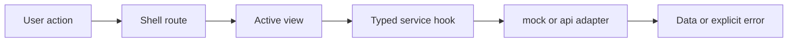

# Screen Manuals And User Stories

This document defines what each main frontend screen is expected to do from a
user perspective.

It works as a lightweight user manual plus a story inventory for the current
frontend surfaces and the next governed route-level slice that still needs
delivery.

## Shell

### User expectation

The user always understands:

- where they are;
- which tenant, project, and environment are active;
- whether the platform is healthy;
- how to reach the main route-level workbenches.

### Primary user stories

- As an operator, I want to see platform health without leaving my current
  screen so I can react to degraded backend conditions quickly.
- As a user, I want tenant, project, and environment to stay visible so I do
  not act in the wrong context.
- As a user, I want a stable shell while moving across screens so the product
  feels like one tool.

### Expected states

- Loading: shell frame visible while route content loads.
- Degraded: health banner explains degraded or offline state.
- Error: route-level errors do not destroy the shell frame.

### F-04 Data source behavior

- Users should not see route-specific wiring differences between `mock` and
  `api`.
- Main routes remain operable in both modes.
- When an API-only capability is not implemented yet, the user gets an explicit
  service error instead of silent fallback behavior.
- Source import remains mock-capable, while API mode reports unimplemented
  backend import support explicitly.
- The console no longer pretends mock log lines are real in `api` mode.

## Canvas

### User expectation

Canvas is the main authoring and topology workspace.

The user expects to:

- inspect the graph;
- open or hide explorer and inspector panels;
- request plan;
- start a run;
- understand visual overlays without changing graph truth accidentally.

### Primary user stories

- As an author, I want to inspect graph topology in one primary surface so I can
  reason about the workflow.
- As an author, I want explorer and inspector panels to be optional so I can
  focus on the graph when needed.
- As an author, I want plan and run actions to stay near the graph so the
  authoring flow is coherent.

### Expected states

- Empty: explain that no graph content is loaded yet.
- Loading: graph shell visible while data arrives.
- Error: keep shell and route context visible, with retry if meaningful.
- Read-only: overlays and inspection remain available while mutation is gated.

## Runs List

### User expectation

The runs landing screen shows past and current executions and acts as the entry
point for execution investigation.

### Primary user stories

- As an operator, I want to find a failed or active run quickly so I can inspect
  it.
- As an operator, I want the list to scale beyond cards when data density
  increases.
- As an operator, I want an empty state to tell me how to create work instead of
  leaving me with a dead screen.

### Expected states

- Empty: send the user back to Canvas to plan and start a run.
- Loading: route frame remains stable while runs load.
- Error: explain that run data could not be loaded and offer retry.

## Run Detail

### User expectation

Run detail behaves like one operational workspace, not several unrelated tabs.

The user expects:

- a stable header;
- progress visibility;
- timeline, steps, events, metrics, and artifacts inside one coherent route.

### Primary user stories

- As an operator, I want to understand where a run is or failed without
  reconstructing execution state myself.
- As an operator, I want events, metrics, and artifacts to stay tied to the same
  run context.
- As an operator, I want degraded or partial data to be obvious so I do not
  mistake stale state for canonical truth.

### Expected states

- Loading: preserve route frame while detail loads.
- Missing: explicit run-not-found state.
- Degraded: stale or partial evidence labeled clearly.

## Lineage

### User expectation

Lineage is a read-only dependency and impact-analysis surface.

The user expects:

- search or focus-driven entry;
- bounded upstream and downstream scope;
- impact summary before deep detail.

### Primary user stories

- As an analyst, I want to see what a node depends on and what it affects so I
  can understand change impact.
- As an analyst, I want column lineage only when metadata exists so the screen
  does not pretend to know more than it does.

### Expected states

- Empty: explain that no lineage focus is available.
- Loading: preserve route frame.
- Missing metadata: explain why column lineage is unavailable.

## Diff

### User expectation

Diff is the review surface for structural, SQL, and catalog changes.

The user expects:

- summary first;
- severity first-class;
- structured tabs instead of one raw blob;
- Monaco-backed diff and structured-text review where payload size and syntax
  complexity justify it.

### Primary user stories

- As a reviewer, I want to see breaking changes before informational changes so
  I can prioritize review.
- As a reviewer, I want SQL and structural diff contexts to stay separate so the
  review stays understandable.

### Expected states

- Empty: explain that no diff data is available.
- Loading: keep shell and route visible.
- Error: preserve compare context and explain failure.

## Artifacts

### User expectation

Artifacts is the read-only browser for manifest and related dbt artifacts.

The user expects:

- local import when useful;
- stable preview panes;
- no accidental editing path;
- Monaco-backed read-only inspection when payload size makes basic viewers weak.

### Primary user stories

- As a user, I want to inspect manifest and artifact content without leaving the
  main shell.
- As a user, I want local artifact import to be explicit and reversible.

### Expected states

- Empty: explain why no artifact is loaded.
- Loading: preserve route frame.
- Invalid import: show why the local file is rejected.

## Execution Templates And Source Generation

### User expectation

This future workbench should let users move from workflow intent to governed
execution scaffolding.

The user expects to:

- pick a template or provider profile;
- provide parameters without editing raw boilerplate first;
- preview generated source through a Monaco-backed review surface before
  exporting or dispatching it;
- generate artifacts such as Snowflake tasks, procedures, or ETL scaffolds
  without losing traceability to the workflow context.

### Primary user stories

- As a data engineer, I want to generate Snowflake tasks and procedures from a
  governed template so I do not handcraft repetitive execution code each time.
- As an ETL designer, I want a code-generation surface tied to the workflow
  context so I can move from design to executable scaffolding without manual
  copy-paste.
- As a reviewer, I want to diff generated source before export or apply so I
  can validate what the template produced.

### Expected states

- Empty: explain that no template profile or workflow context is selected yet.
- Loading: preserve route frame while template catalog or generation preview is
  resolving.
- Validation error: explain which parameters are missing or invalid.
- Preview ready: generated source is visible and clearly marked with template
  provenance and target profile.
- Read-only: allow review and export while mutation or dispatch is gated.

## Tracking Stories As Work

These manuals should be translated into implementation work through Lane E task
tracking, not left as static documentation.

Current related tasks:

- `F-20` per-screen user manuals and story coverage
- `F-15` workbench UX contract
- `F-16` dense operational tables
- `F-17` Monaco embedded review surfaces for Diff, Artifacts, and Templates
- `F-18` console and live-log convergence
- `F-19` Marquez open-data visual direction
- `F-21` execution-template and source-generation workbench
