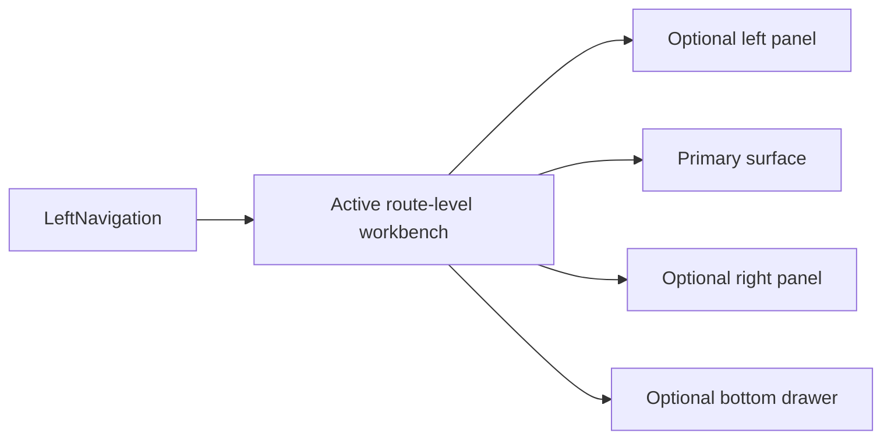

# UX Implementation Guide

## Purpose

This document is the implementation guide for the DVT frontend UX.

Its job is not to describe aspiration. Its job is to define:

- which UX target we are implementing;
- which existing libraries and code paths we reuse;
- which layers own which responsibilities;
- which sequence gets us there without rewriting `apps/web`;
- how execution-template and code-generation surfaces fit without turning the
  frontend into a freeform IDE;
- what "done" means for each major frontend surface.

## Target UX

The operator-facing product should converge on a workbench UX that feels closer
to VS Code than to a collection of unrelated dashboards.

That means:

- one persistent shell;
- one active route-level work surface at a time;
- optional left and right contextual panels;
- an optional bottom drawer for dense supporting context;
- fast transitions between authoring, code generation, review, and monitoring
  surfaces;
- explicit empty, loading, error, degraded, and read-only states.

For open-data or public-data slices, the visual direction may diverge from the
operator workbench. The named design direction for that slice is `Marquez`:
editorial, curated, and explanatory rather than IDE-like. In frontend
architecture docs, `Marquez` here is a design reference, not the OpenLineage
backend product.

## Reuse Strategy

Do not rebuild the frontend from zero.

Use the current stack and deepen it:

| Existing or approved tool | Implementation responsibility                                                   |
| ------------------------- | ------------------------------------------------------------------------------- |
| `@xyflow/react`           | graph viewport, minimap, node/edge interaction                                  |
| TanStack Query            | server-state loading, polling, invalidation                                     |
| Zustand                   | shell, session, graph, run, and status UI state once decomposed                 |
| Radix + shadcn/ui         | shell primitives, menus, tabs, dialogs, drawers, scroll areas                   |
| Recharts                  | current light metrics and cost charts                                           |
| TanStack Table            | dense operational tables for runs, events, diagnostics, and diff lists          |
| Monaco Editor             | SQL, JSON, generated DDL, stored procedure, and diff-heavy read or review panes |
| xterm.js                  | live log or terminal-grade console surface when static panels stop being enough |

## Workbench Contract

Every route-level workbench must fit this shell contract:

Implementation rules:

1. Keep one persistent shell.
2. Keep one active route-level workbench at a time.
3. Use side panels for context, not as hidden second applications.
4. Keep domain semantics in DVT adapters, not in third-party component objects.
5. Reuse mature libraries for hard interaction problems before writing custom
   versions.
6. Treat the per-screen manuals and user stories as the acceptance contract for
   each route-level workbench.

## Ownership Model

### Shell

Owns:

- top bar;
- health banner;
- left navigation;
- route outlet;
- bottom drawer visibility;
- focus mode and global shell controls.

Does not own:

- graph semantics;
- run semantics;
- diff semantics;
- feature-local orchestration.

### Route-Level Workbenches

Own:

- route-specific composition;
- route-specific loading, empty, degraded, and error states;
- route-specific commands;
- route-specific supporting panels and tabs.
- route-specific user-manual expectations and story-level acceptance criteria.

### Libraries

Libraries own primitives, not product semantics:

- React Flow owns graph interaction primitives;
- TanStack Query owns query orchestration;
- TanStack Table owns dense table primitives;
- Monaco owns code-editor and diff-editor primitives;
- xterm.js owns terminal-grade console rendering if justified.

DVT still owns:

- route behavior;
- domain naming;
- state boundaries;
- capability contracts;
- UX acceptance rules.

### Generated Source Rule

The frontend may own:

- template selection;
- parameter capture;
- generated-source preview;
- diff, export, and review UX.

The frontend must not own:

- provider execution semantics;
- freeform string-concatenation code generation inside React components;
- hidden mutation of backend templates from view-local state.

Generation contracts, template semantics, and provider-specific translation
must stay behind governed DVT services and backend contracts.

## Implementation Sequence

### Phase 1. Stabilize the shell grammar

- keep the shell persistent and low-noise;
- formalize left nav, route outlet, optional side panels, and bottom drawer;
- make focus mode and panel recovery consistent.

Primary tasks:

- `F-01`
- `F-15`

### Phase 2. Fix state and query ownership

- decompose `appStore`;
- standardize TanStack Query boundaries and invalidation;
- isolate mock-versus-API behavior behind services and capabilities.

Primary tasks:

- `F-04`
- `F-05`
- `F-06`

### Phase 3. Harden the main route workbenches

- Canvas as the authoring workbench;
- Runs as the operational workbench;
- Lineage, Diff, and Artifacts as supporting workbenches with the same shell
  grammar.

Primary tasks:

- `F-08`
- `F-09`
- `F-10`
- `F-11`

### Phase 4. Upgrade dense surfaces

- move runs and event-heavy views to TanStack Table when cards stop scaling;
- move SQL, JSON, and diff panes to Monaco when basic viewers stop scaling;
- move console and log playback to xterm.js only if the product needs
  terminal-grade streaming.

Primary tasks:

- `F-16`
- `F-17`
- `F-18`

### Phase 5. Add governed source generation

- add a route-level workbench for execution templates and code generation;
- keep parameter input structured and schema-driven;
- preview and diff generated source before export or apply;
- support governed scaffolds such as Snowflake tasks, procedures, and ETL
  execution templates.

Primary task:

- `F-21`

### Phase 6. Separate open-data presentation from operator workbench

- keep the workbench grammar for operator routes;
- use `Marquez` only for public or explanatory open-data surfaces.

Primary task:

- `F-19`

## Definition Of Done By Surface

### Shell

Done when:

- shell frame is persistent;
- secondary shell actions are consolidated;
- left nav and panel recovery are consistent;
- degraded and offline status are visible.

### Canvas

Done when:

- explorer and inspector are optional and recoverable;
- graph commands live in the toolbar;
- run and plan handoff works without route confusion;
- runtime overlays do not mutate graph truth.

### Runs

Done when:

- `/runs` supports real list and filter behavior;
- `/runs/:runId` behaves like one run workspace;
- status, events, and artifacts feel coherent;
- dense tables replace cards where required by scale.

### Diff And Artifacts

Done when:

- users can review SQL, JSON, and structural deltas without placeholder panes;
- Monaco-backed viewers or diff panes are used where complexity justifies them;
- review state stays route-driven and understandable.

### Console

Done when:

- bottom drawer purpose is explicit;
- real event or log playback is modeled;
- xterm.js is used only if structured panels are insufficient.

### Execution Templates And Code Generation

Done when:

- template catalog and provider-profile choice are explicit;
- parameter capture is schema-driven instead of raw boilerplate editing;
- generated source can be previewed and diffed before export or apply;
- artifacts such as Snowflake tasks, procedures, and ETL scaffolds carry
  template provenance and workflow context;
- provider semantics still live in governed backend services, not in React
  component logic.

## Reference Documents

- [Main Workspace Views And UX](main-workspace-views-and-ux.md)
- [Screen Manuals And User Stories](screen-manuals-and-user-stories.md)
- [Library And Open-Source Reference Stack](library-and-open-source-reference-stack.md)
- [Frontend Roadmap - Prototype To Operational UI](../../planning/proposals/frontend-roadmap-20260219.md)
