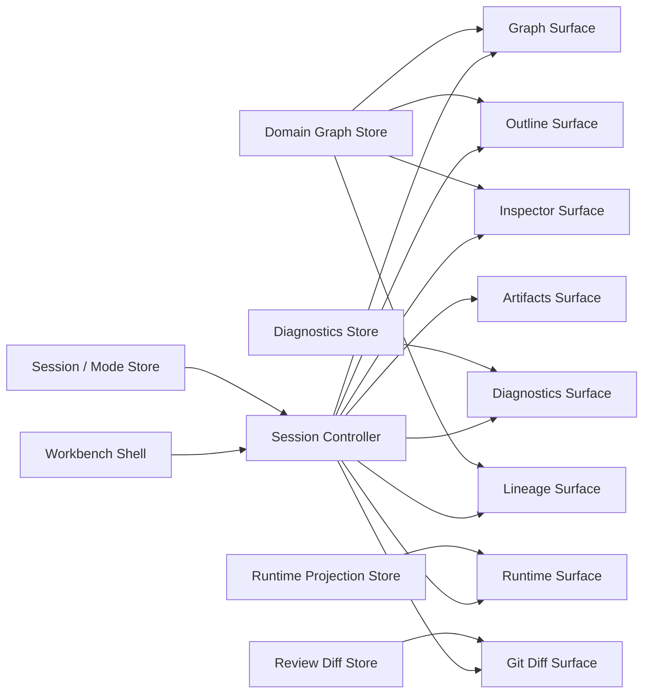
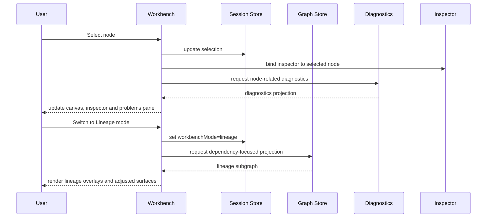

# Workflow / Graph Workbench - Surfaces and Operating Modes

## 1. Purpose

The **Workflow / Graph Workbench** is the core operating surface where users design, inspect, validate, compare, and operate workflow graphs.

It is not only a canvas. It is a **multi-surface workspace** composed of coordinated views around a shared graph session. Each surface exposes a different projection of the same underlying state:

- **Graph editing**
- **Structural inspection**
- **Execution context**
- **Validation and diagnostics**
- **Lineage and dependency understanding**
- **Git-aware change review**
- **Operational observation**

The goal is to provide a workbench that supports both **authoring** and **controlled operation** without mixing concerns.

---

## 2. Architectural intent

The workbench must satisfy these architectural constraints:

1. **One canonical session, many surfaces**  
   All views operate on the same session state, selection state, and graph projection.

2. **Mode-aware behavior**  
   The same graph may be opened in different operating modes with different tools, policies, and editing permissions.

3. **Projection over duplication**  
   Tree, inspector, problems, lineage, runs, and diff views must be projections of shared domain state, not isolated copies.

4. **Deterministic interaction model**  
   UI actions must emit explicit commands/events so the graph state remains auditable and reproducible.

5. **Separation between design-time and run-time**  
   Editing a workflow, validating it, and observing its execution are related but distinct activities.

---

## 3. Core concept

The workbench is best understood as:

> **A coordinated set of domain surfaces around a graph session.**

A session contains at least:

- active workflow/workflows
- active graph revision
- selection and focus state
- viewport state
- open panels and layout state
- active moduleId
- active workbenchMode
- validation state
- optional runtime overlays
- optional git/diff overlays

---

## 4. Primary surfaces

## 4.1 Main graph canvas

The main visual editing and navigation surface.

**Responsibilities**

- render nodes and edges
- support pan / zoom / focus
- selection and multi-selection
- drag, connect, group, align
- inline status overlays
- local interaction feedback

**It should not own**

- business validation rules
- execution state decisions
- persistence orchestration

**Key capabilities**

- node creation from palette or contextual actions
- edge creation with policy checks
- ports / handles
- minimap or overview map
- overlays for errors, warnings, runtime, lineage, git status

---

## 4.2 Structure / outline surface

A structural projection of the graph.

**Responsibilities**

- show ordered or grouped node hierarchy
- expose search, filter, jump-to-node
- show logical groupings, domains, folders, stages, schemas, tags

**Why it matters**
Large graphs become unmanageable if the canvas is the only entry point. The outline provides controlled navigation and a stable textual index.

---

## 4.3 Inspector surface

Contextual detail panel bound to current selection.

**Responsibilities**

- display node, edge, group, or workflow properties
- edit metadata and parameters
- show derived state
- show contracts, schemas, runtime metadata, docs, tags

**Inspector rules**

- selection-driven
- schema-driven forms where possible
- read-only or editable depending on mode and lock state
- must support extension points for plugin-defined node types

---

## 4.4 Problems / diagnostics surface

Centralized validation and issue management surface.

**Responsibilities**

- list errors, warnings, notices
- group by severity, object, rule, source
- deep-link to affected graph objects
- expose quick fixes where safe

**Sources**

- graph structural validation
- config validation
- lint / formatting violations
- semantic workflow rules
- external adapter compatibility checks

---

## 4.5 Lineage / dependency surface

A projection for upstream/downstream understanding.

**Responsibilities**

- show dependency paths
- isolate subgraphs
- inspect impact radius
- switch between workflow view and data lineage view

**Note**
This surface is not merely decorative. It supports safe change analysis and operational reasoning.

---

## 4.6 Runtime / runs surface

Operational context for executions related to the current graph or selected node set.

**Responsibilities**

- show recent runs
- current statuses
- timing, retries, logs, metrics
- execution overlays on the graph
- jump from a node to its execution evidence

**Architectural rule**
Runtime data is an overlay on top of design state. It must not mutate design state implicitly.

---

## 4.7 Git / diff surface

Change-awareness surface for auditable evolution of the workflow.

**Responsibilities**

- show changed nodes/edges/config
- compare revisions
- show branch / commit / author context
- support semantic diff, not just raw text diff

**Usage**

- review before save/commit
- compare local changes with repository version
- inspect generated artifact impact

---

## 4.8 Documentation / artifacts surface

Surface for generated or linked artifacts related to the current workflow.

**Responsibilities**

- generated SQL / code
- docs previews
- manifest-derived metadata
- contracts / schemas
- exportable artifacts

This surface matters because the workbench is not only a diagram editor; it is also a production authoring environment.

---

## 5. Secondary surfaces

These are optional or contextual surfaces that should exist as pluggable capabilities:

- search / command palette
- minimap
- activity log
- collaboration presence
- comments / review annotations
- metrics panels
- test results
- source explorer
- plugin-specific panels

---

## 6. Operating modes

The same workbench should support multiple explicit operating modes. Modes are not just visual presets; they alter permissions, interactions, overlays, and available commands.

## 6.1 Edit mode

Used for authoring and modifying workflows.

**Characteristics**

- full graph editing enabled
- inspector editable
- palette visible
- structural validations active
- runtime overlays optional but secondary

**Primary user intention**
Design and change workflow structure.

---

## 6.2 Graph navigation mode

Used for reading and exploring large graphs with minimal accidental editing risk.

**Characteristics**

- editing reduced or disabled
- focus on navigation, filtering, grouping, lineage traversal
- quick open and structural search emphasized

**Primary user intention**
Understand the system safely.

---

## 6.3 Validation mode

Used to prepare changes for promotion or execution.

**Characteristics**

- diagnostics emphasized
- rule failures and incompatible settings highlighted
- quick fixes and policy checks exposed
- formatting/lint output visible

**Primary user intention**
Decide whether the current graph is acceptable.

---

## 6.4 Lineage mode

Used to reason about impact and dependencies.

**Characteristics**

- graph rendered through dependency emphasis
- hide non-essential authoring controls
- upstream/downstream tracing tools enabled
- blast radius and dependency paths highlighted

**Primary user intention**
Understand what a change affects.

---

## 6.5 Runtime observation mode

Used to observe live or recent executions against the graph.

**Characteristics**

- graph becomes execution-aware
- statuses, progress, timings, retries, logs available
- editing typically disabled or heavily constrained
- node overlays derive from run state

**Primary user intention**
Observe what happened or what is happening.

---

## 6.6 Git / review mode

Used for structured review of changes.

**Characteristics**

- semantic diffs emphasized
- changed objects highlighted
- version metadata exposed
- edit actions reduced
- compare two revisions or worktree vs repository

**Primary user intention**
Review and approve change safely.

---

## 6.7 Plugin/domain mode

Used when the workbench is specialized for a domain profile such as dbt, ETL, ingestion, API orchestration, or observer mode.

**Characteristics**

- surface composition changes by domain
- inspector schema changes
- validations and commands become domain-specific
- same shell, different capability profile

**Primary user intention**
Work efficiently within a domain-specific mental model.

---

## 7. Recommended mode model

A practical model is to define modes as a combination of:

- **interaction policy**
- **surface composition**
- **overlay set**
- **permission profile**
- **command set**

Example:

```ts
type WorkbenchMode = 'edit' | 'navigate' | 'validate' | 'lineage' | 'observe' | 'review' | 'domain';
```

Each mode should configure:

```ts
interface WorkbenchModeDefinition {
  id: WorkbenchMode;
  editable: boolean;
  visibleSurfaces: string[];
  enabledCommands: string[];
  overlays: string[];
  inspectorPolicy: 'hidden' | 'readonly' | 'editable';
}
```

---

## 8. Surface-to-mode matrix

| Surface                |   Edit | Navigate | Validate | Lineage |   Observe |    Review |
| ---------------------- | -----: | -------: | -------: | ------: | --------: | --------: |
| Graph canvas           |   High |     High |   Medium |    High |      High |    Medium |
| Structure / outline    | Medium |     High |   Medium |  Medium |       Low |    Medium |
| Inspector              |   High |   Medium |   Medium |  Medium | Read-only | Read-only |
| Problems / diagnostics | Medium |      Low |     High |  Medium |       Low |    Medium |
| Lineage panel          |    Low |   Medium |   Medium |    High |    Medium |    Medium |
| Runtime / runs         |    Low |      Low |   Medium |     Low |      High |    Medium |
| Git / diff             |    Low |      Low |   Medium |     Low |       Low |      High |
| Docs / artifacts       | Medium |   Medium |   Medium |     Low |    Medium |    Medium |

---

## 9. State model implications

To support the workbench correctly, frontend state should be separated into clear bounded areas.

## 9.1 Session state

- active workflow id
- open tabs
- active moduleId
- active workbenchMode
- layout / dock state
- active revision / compare target

## 9.2 Graph view state

- viewport
- selected ids
- hovered ids
- expanded groups
- local interaction state

## 9.3 Domain graph state

- nodes
- edges
- annotations
- groupings
- domain metadata

## 9.4 Diagnostics state

- rule results
- lint findings
- validation summary

## 9.5 Runtime projection state

- run status by node
- timing
- logs summary
- metrics summary

## 9.6 Review / diff state

- changed objects
- baseline revision
- semantic diff projections

This separation prevents a common failure mode: mixing persisted domain data with ephemeral UI interaction data.

---

## 10. Recommended architectural decomposition



---

## 11. Interaction flow example



---

## 12. UX and product risks

## 12.1 Risk: mode explosion

Too many modes create confusion.

**Mitigation**
Start with a minimal set:

- Edit
- Validate
- Observe
- Review

Treat lineage initially as a strong overlay or submode, not necessarily a full independent mode.

## 12.2 Risk: panel overload

Adding every panel at once creates visual noise.

**Mitigation**
Use a progressive disclosure model:

- default essential surfaces
- optional docked surfaces
- remember layout per mode

## 12.3 Risk: duplicated state

If each panel fetches or stores its own copy of graph state, drift appears quickly.

**Mitigation**
Use shared stores and projections with explicit selectors.

## 12.4 Risk: runtime contaminates design state

Live execution overlays can leak into editable graph data.

**Mitigation**
Runtime must remain read-model data layered on top of immutable design state.

---

## 13. Recommended first implementation slice

A sensible first slice for the workbench is:

1. **Graph canvas**
2. **Inspector**
3. **Structure / outline**
4. **Problems panel**
5. **Two modes only**:
   - Edit
   - Observe

Why this slice:

- enough to author workflows seriously
- enough to inspect a run against the graph
- avoids premature complexity from review and lineage specialization

---

## 14. Evolution path

### Phase 1

- graph canvas
- inspector
- outline
- diagnostics
- edit / observe modes

### Phase 2

- lineage surface
- runtime overlays with node-level evidence
- command palette
- minimap
- layout persistence

### Phase 3

- semantic git diff
- review mode
- artifact/code preview
- plugin-defined surfaces

### Phase 4

- collaboration annotations
- multi-user presence
- domain-specialized workbench profiles
- policy-driven surface composition

---

## 15. Final architectural position

The correct mental model is not:

> “a canvas with some side panels”

The correct mental model is:

> **a mode-driven graph workbench composed of coordinated surfaces over a shared workflow session**

That distinction matters.  
If the product is modeled only as a canvas, it will become a fragile diagram editor.  
If it is modeled as a graph workbench, it can evolve into a serious authoring and operational environment.
