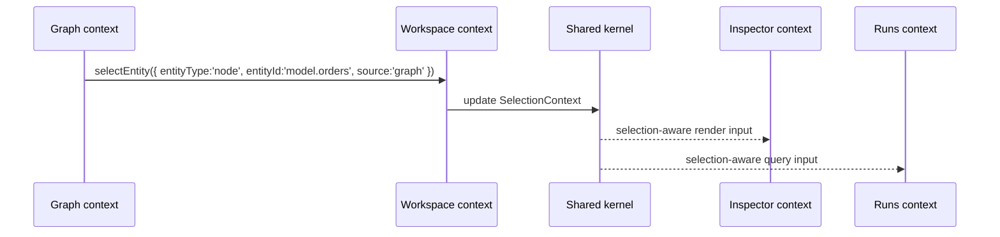

# Selection Context Model Specification

## 1. Purpose

This document defines the canonical `SelectionContext` model for the frontend
shared kernel.

Its role is to stabilize how bounded contexts in the frontend refer to the
currently selected workbench entity without importing each other's private
state or leaking backend payloads into presentation code.

## 2. Architectural role

`SelectionContext` is a shared-kernel contract used by Workspace, Graph,
Inspector, Runs, Artifacts, Git, and Lineage.

DDD role:

- one stable workbench concept shared across bounded contexts
- one explicit ubiquitous-language contract for "what is selected right now"
- one coordination seam owned by Workspace rather than by sibling feature
  coupling

Hexagonal-compatible role:

- this model lives on the domain side of the frontend boundary
- components, stores, and actions consume it
- backend DTOs and transport payloads are translated before they become
  `SelectionContext`

SOLID note:

- SOLID is not Fowler's taxonomy
- this document uses SOLID-compatible responsibilities while grounding the
  evidence in Fowler's layering, mapping, gateway, and DI sources

## 3. Why this model exists

Without a canonical selection contract, the frontend drifts into:

- canvas-local selection arrays
- inspector-only identifiers
- feature-specific "current item" state that cannot be shared cleanly
- raw transport payloads reused as UI coordination objects

That leads directly to cross-feature coupling and inconsistent reactions to the
same user intent.

## 4. Canonical contract

The canonical supporting types are:

```ts
export type SelectionEntityType =
  | 'node'
  | 'edge'
  | 'run'
  | 'artifact'
  | 'git-file'
  | 'lineage-entity';

export type ContextOrigin = 'graph' | 'runs' | 'artifacts' | 'git' | 'lineage' | 'inspector';

export interface EntityRef {
  readonly entityType: SelectionEntityType;
  readonly entityId: string;
}

export interface SelectionContext extends EntityRef {
  readonly source: ContextOrigin;
}
```

`SelectionContext` intentionally stays small. It identifies the selected entity
and the origin of the selection. It does not carry feature payloads, rendered
labels, or remote transport data.

## 5. Invariants

The following invariants define the model.

### 5.1 Single-entity invariant

A `SelectionContext` represents exactly one selected entity.

Bulk selection, compare state, or selection history are separate concerns and
must not be smuggled into this contract.

### 5.2 Stable identity invariant

Every selection must be expressible as a stable `entityType` plus `entityId`
pair.

If a feature cannot express its current focus that way, it does not yet have a
shared-kernel-ready selection model.

### 5.3 Origin invariant

Every selection must declare its `source`.

This is required for orchestration, diagnostics, and mode-aware reactions.

### 5.4 No payload-bag invariant

`SelectionContext` must not embed backend DTOs, component instances, rendered
labels, or arbitrary `data` bags.

Those belong to adapters, view models, or feature-local state.

### 5.5 Closed vocabulary invariant

`SelectionEntityType` and `ContextOrigin` are controlled vocabularies.

New values require an explicit architecture update because every consumer may
need exhaustiveness handling.

## 6. Example interaction



## 7. Architectural precedents and evidence

### 7.1 Exact precedent: workbench selection service

Primary official sources:

- Eclipse Platform API,
  [IWorkbenchSite](https://help.eclipse.org/latest/topic/org.eclipse.platform.doc.isv/reference/api/org/eclipse/ui/IWorkbenchSite.html)
  - defines `getSelectionProvider()` and `setSelectionProvider(...)` for a
    workbench site
- Eclipse Platform API,
  [ISelectionService](https://help.eclipse.org/latest/rtopic/org.eclipse.platform.doc.isv/reference/api/org/eclipse/ui/ISelectionService.html)
  - defines the workbench-level selection service and selection listeners
- Eclipse workbench guide,
  [Perspectives](https://help.eclipse.org/latest/topic/org.eclipse.platform.doc.isv/guide/workbench_perspectives.htm)
  - documents `ShowInContext`, where views typically use the current selection
    as context for navigation and coordination

Precedent classification:

- `exact precedent` for the idea that a workbench exposes a canonical selection
  service, a defined selection-provider boundary, and selection listeners for
  cross-part coordination

### 7.2 Compatible precedent: layered, DTO-safe frontend boundary

Primary sources:

- Martin Fowler, [Bounded Context](https://martinfowler.com/bliki/BoundedContext.html)
- Martin Fowler, [Presentation Domain Data Layering](https://martinfowler.com/bliki/PresentationDomainDataLayering.html)
- Martin Fowler, [Separated Presentation](https://martinfowler.com/eaaDev/SeparatedPresentation.html)
- Martin Fowler, [Data Mapper](https://martinfowler.com/eaaCatalog/dataMapper.html)
- Martin Fowler, [Data Transfer Object](https://martinfowler.com/eaaCatalog/dataTransferObject.html)
- Martin Fowler, [Gateway](https://martinfowler.com/articles/gateway-pattern.html)
- Martin Fowler, [Inversion of Control Containers and the Dependency Injection pattern](https://martinfowler.com/articles/injection.html)

Precedent classification:

- `compatible precedent` for keeping the selection contract small, domain-side,
  explicit, and protected from transport payload leakage

### 7.3 Repository-local canonical policy

The exact repo contract name `SelectionContext` and the exact field set:

- `entityType`
- `entityId`
- `source`

are repository-local canonical policy.

That policy is anchored to the exact Eclipse workbench selection-service
precedent and constrained by the Fowler-compatible layering and DTO-isolation
sources above.

## 8. References

- [Frontend DDD Target Architecture](../frontend-ddd-target-architecture.md)
- [Workspace Domain Specification](workspace-domain-specification.md)
- [Workspace Session Model Specification](session/workspace-session-model-specification.md)
- [Workspace Orchestration - Cross-Feature Coordination Mechanism](workspace-orchestration.md)
