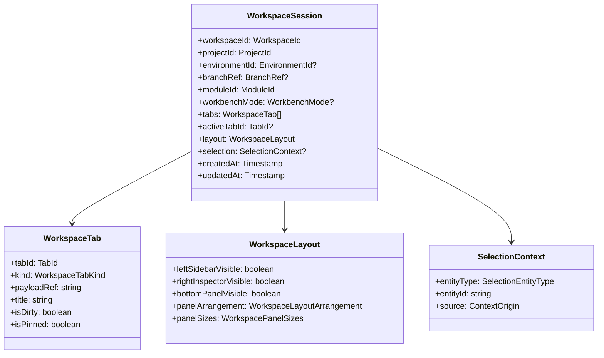
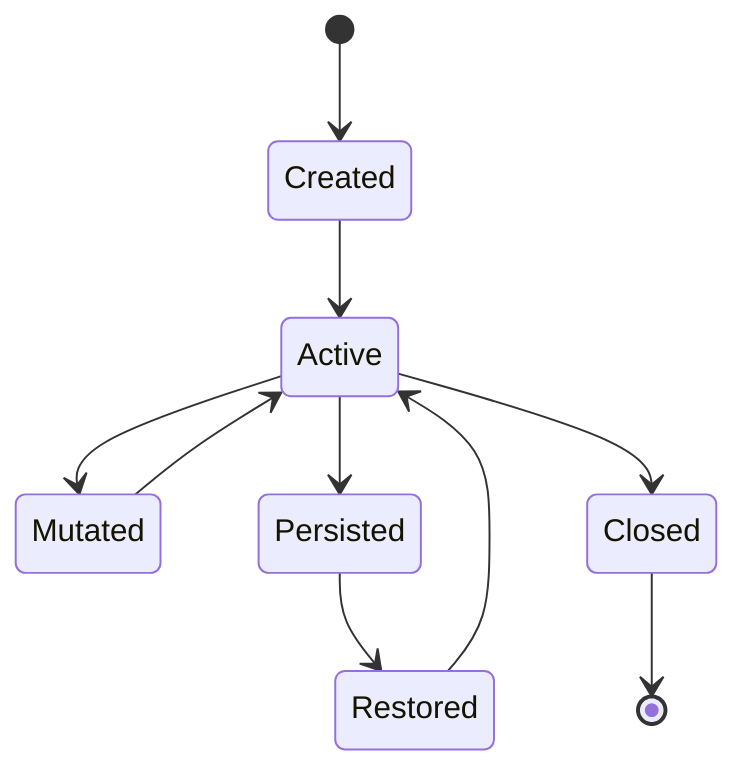
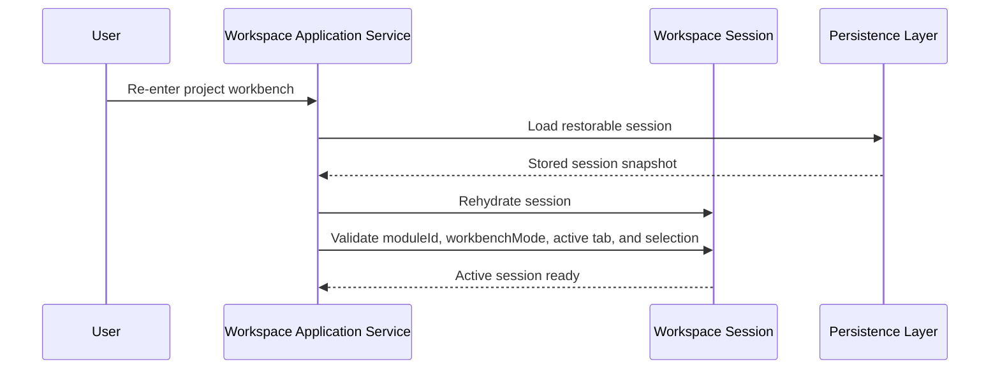

# Workspace Session Model Specification

## 1. Purpose

This document specifies the `WorkspaceSession` model within the DVT+ frontend
`Workspace` domain.

Its purpose is to define what a workspace session is, what it owns, which
invariants must hold, and how it should behave as the canonical representation
of the user's active working context inside the frontend workbench.

This document narrows the broader `Workspace Domain Specification` and should
be treated as the first operational refinement of that domain.

---

## 2. Context

The DVT+ frontend is intended to behave as a workbench rather than as a
conventional route-based web application.

That requires a stable concept capable of representing the user's active
working surface across:

- project context
- environment context
- active shell-level module
- active workbench interaction mode when applicable
- open views
- active view
- panel composition
- shared selection
- local work continuity

That concept is the `WorkspaceSession`.

Without it, the application would fall back to fragmented local state
scattered across routes, components, and individual feature modules.

---

## 3. Definition

A `WorkspaceSession` is the canonical frontend model that represents the
current active work context of a user inside the DVT+ workbench.

It is the top-level state object responsible for expressing:

- where the user is working
- which shell-level product module is active
- which workbench interaction policy is active when a workbench is mounted
- which work surfaces are open
- which surface is active
- what shared context is currently selected
- what layout composition is currently applied

A workspace session is not equivalent to a browser route, a React component
subtree, or a backend session. It is a frontend domain model.

---

## 4. Why this model exists

The `WorkspaceSession` exists to solve a specific frontend architectural
problem: DVT+ requires multiple synchronized projections over shared entities,
and those projections must remain coherent while the user moves across tabs,
panels, modules, and workbench modes.

Without a canonical session model, the frontend would likely drift into:

- route-driven pseudo-state
- duplicated local feature state
- inconsistent view restoration
- multiple competing notions of current selection
- accidental coupling between graph, inspector, runs, artifacts, and git
  surfaces
- poor recoverability of the user's work context

The workspace session provides a single, explicit representation of the current
working environment.

---

## 5. Responsibilities

The `WorkspaceSession` should own the following responsibilities.

### 5.1 Work context identity

The session identifies the work context in which the user is currently
operating.

This includes:

- workspace session identity
- project identity
- optional environment identity
- optional branch or source-control context
- active `moduleId`
- active `workbenchMode` when applicable

This context allows the rest of the frontend to interpret open surfaces and
commands consistently.

### 5.2 Surface continuity

The session owns the continuity of the active workbench surface.

This includes:

- which tabs are open
- which tab is active
- whether certain views should be restored
- whether layout state is preserved
- whether the session should be restorable after refresh or re-entry

### 5.3 Shared contextual focus

The session owns the current shared contextual focus.

This includes:

- current selection
- current focused entity
- optional active compare context
- active artifact context
- active run context
- active cross-surface context

This is what allows several frontend surfaces to react coherently to the same
work state.

### 5.4 Layout attachment

The session owns the layout that is currently applied to the workbench for that
active session.

This includes:

- visible panels
- docked panels
- split sizes
- active panel arrangement
- module-aware and workbench-mode-aware layout presets

### 5.5 Session restoration

The session owns the information required to restore the workbench meaningfully
after:

- reload
- navigation return
- app re-entry
- session recovery flows

This does not imply that every detail must always be persisted, but the session
model must support restoration as a domain concern.

---

## 6. Non-responsibilities

The `WorkspaceSession` should not own feature-specific content semantics.

It should not directly own:

- graph node rendering logic
- run details or execution interpretation
- artifact parsing rules
- git diff algorithms
- lineage traversal logic
- feature-specific backend fetching rules

Instead, it references and coordinates feature surfaces and contexts.

The workspace session is the canonical holder of working-state composition, not
the owner of all feature semantics.

---

## 7. Core model

At minimum, a workspace session appears to require the following fields:

- `workspaceId`
- `projectId`
- `environmentId`
- `branchRef`
- `moduleId`
- `workbenchMode`
- `tabs`
- `activeTabId`
- `layout`
- `selection`
- `createdAt`
- `updatedAt`

Additional fields may exist later for restoration or advanced contextual state,
but the core model should remain compact and explicit.

---

## 8. Conceptual structure



This structure is conceptual rather than final, but it establishes the
required domain center.

Important terminology decision:

- `moduleId` answers "which product module is mounted?"
- `workbenchMode` answers "how is the active workbench being used right now?"

They are related, but they are not synonyms and must not be collapsed into one
field.

---

## 9. Invariants

The `WorkspaceSession` should preserve several invariants.

### 9.1 Session identity invariant

A workspace session must always have a stable `workspaceId`.

The session identity should not be reinterpreted as a route or temporary
component key.

### 9.2 Project anchoring invariant

A workspace session must always be anchored to exactly one active project
context.

A session without project anchoring is incomplete.

### 9.3 Active tab consistency invariant

If `activeTabId` is not `null`, it must reference a tab contained in the
session's `tabs` collection.

No dangling active tab references should be allowed.

### 9.4 Module identity invariant

The session's `moduleId` must be one of the permitted shell-level module
identifiers.

Shell-level module identity must not be represented as uncontrolled ad hoc
strings in feature code.

### 9.5 Workbench mode validity invariant

If `workbenchMode` is present, it must be one of the permitted workbench
interaction modes for the active module.

`workbenchMode` must be `null` when the active module does not expose a graph
workbench.

### 9.6 Selection consistency invariant

If a selection exists, it must be meaningful in the context of the current
session and current project.

This does not necessarily require that every selection target is already
materialized locally, but it must be valid relative to the session's work
context.

### 9.7 Layout presence invariant

A workspace session must always have a valid layout object, even if that layout
is default or derived.

Layout must not be treated as optional incidental UI state.

### 9.8 Updated-at invariant

Every meaningful mutation of the session should refresh `updatedAt`.

This supports persistence, restoration ordering, and session lifecycle
reasoning.

---

## 10. Lifecycle

A workspace session has a frontend lifecycle.

### 10.1 Created

The session is created when a user enters a project workbench context and a
valid session model is initialized.

### 10.2 Active

The session becomes active when it is the current visible workbench session
driving the frontend experience.

### 10.3 Mutated

The session is mutated when the user changes tabs, module, workbench mode,
selection, or layout.

### 10.4 Persisted or restorable

The session may be serialized or partially stored for later restoration.

### 10.5 Restored

The session is restored after a reload, a return navigation, or an explicit
recovery action.

### 10.6 Closed or discarded

The session may be intentionally closed, discarded, or replaced by another
work context.

---

## 11. Session lifecycle diagram



This is a conceptual lifecycle, not a browser event model.

---

## 12. Example session behaviors

The following behaviors are expected to mutate or affect the workspace session.

### 12.1 Opening a new tab

When a user opens a new work surface:

- a new `WorkspaceTab` is added
- `activeTabId` may change
- `updatedAt` must change
- layout or current workbench mode may remain unchanged

### 12.2 Switching module

When a user switches shell-level module:

- `moduleId` changes
- `workbenchMode` may reset to `null`
- layout preset may be recomputed
- active commands may change
- active tab may or may not remain the same
- `updatedAt` changes

### 12.3 Switching workbench mode

When a user changes the interaction policy inside a mounted workbench:

- `workbenchMode` changes
- layout preset may be recomputed
- active commands and overlays may change
- `moduleId` remains stable
- `updatedAt` changes

### 12.4 Updating selection

When the user selects an entity:

- `selection` changes
- dependent panels may react
- open tabs usually remain stable
- `updatedAt` changes

### 12.5 Restoring a session

When a session is restored:

- its context is reconstructed
- tabs are rehydrated if possible
- active tab is validated
- layout is re-established
- selection may be restored if still valid
- `workbenchMode` is restored only when valid for the restored `moduleId`

---

## 13. Example interaction



This sequence illustrates the intended role of the session as the restorable
unit of active work context.

---

## 14. Initial TypeScript contract

The following interface expresses the current intended direction.

```ts
// Field-level authority for these shared-kernel models lives in:
// - ../selection-context-model-specification.md
// - ../workspace-tab-model-specification.md
// - ../workspace-layout-model-specification.md

export interface WorkspaceSession {
  readonly workspaceId: string;
  readonly projectId: string;
  readonly environmentId: string | null;
  readonly branchRef: string | null;
  readonly moduleId: ModuleId;
  readonly workbenchMode: WorkbenchMode | null;
  readonly tabs: readonly WorkspaceTab[];
  readonly activeTabId: string | null;
  readonly layout: WorkspaceLayout;
  readonly selection: SelectionContext | null;
  readonly createdAt: string;
  readonly updatedAt: string;
}
```

This contract is deliberately small and explicit.

The model should prefer strictness and clarity over premature extensibility.

Two-level mode taxonomy is intentional:

- `moduleId` answers "which product module is mounted?"
- `workbenchMode` answers "how is the active workbench being used right now?"

---

## 15. Design recommendations

The following design recommendations apply to the workspace session.

### 15.1 Keep the session canonical

The session must represent the canonical active work context.

Feature modules may derive local view state from it, but they should not
compete with it.

### 15.2 Keep the session compact

Do not place every feature-local detail directly into the session.

The session should hold coordination-level state, not arbitrary feature
internals.

### 15.3 Keep the session serializable

The session should remain reasonably serializable so restoration remains
possible.

### 15.4 Keep mutation explicit

Session mutations should occur through clear application use cases rather than
arbitrary component writes.

### 15.5 Keep identity and timestamps stable

The session should preserve its own identity and mutation chronology to support
restoration and lifecycle reasoning.

---

## 16. Risks

### 16.1 Overloaded session model

There is a risk that the workspace session becomes the dumping ground for every
UI concern.

Mitigation:

- keep the model focused on workbench coordination
- move feature-specific transient details into feature-owned state
- introduce sub-models only where semantically justified

### 16.2 Underpowered session model

There is also a risk that the session is modeled too weakly, reducing it to a
route plus a few tabs.

Mitigation:

- preserve project context, module identity, workbench interaction mode,
  layout, active tab, and selection as first-class session concerns
- treat restoration as a design constraint from the start

### 16.3 Invalid restoration

A restored session may contain stale tabs or stale selection.

Mitigation:

- validate references during restoration
- degrade gracefully when some surfaces can no longer be restored
- never restore invalid active references blindly

### 16.4 Identity drift

If session identity is regenerated too casually, restoration and continuity
become unreliable.

Mitigation:

- separate session identity from component lifecycle
- define clear rules for creation versus reuse

---

## 17. Conclusion

The `WorkspaceSession` is the canonical frontend model for the user's active
work context inside the DVT+ workbench.

It must anchor project context, shell-level module identity, workbench
interaction mode, tabs, layout, and shared selection in a single explicit
domain model so that the frontend can behave as a coherent workbench instead of
a loose collection of screens.

If the session model is designed correctly, it becomes the stable base on which
tab management, layout composition, shared selection, and cross-feature
orchestration can be built.

---

## 18. Companion documents

The following documents now define the shared-kernel models used by
`WorkspaceSession`:

- [Selection Context Model Specification](../selection-context-model-specification.md)
- [Workspace Tab Model Specification](../workspace-tab-model-specification.md)
- [Workspace Layout Model Specification](../workspace-layout-model-specification.md)
- [Workspace Orchestration - Cross-Feature Coordination Mechanism](../workspace-orchestration.md)
