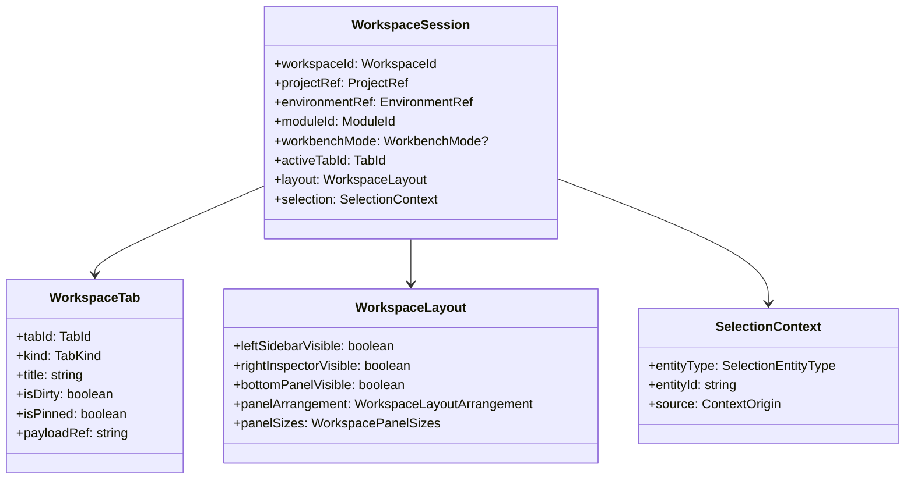
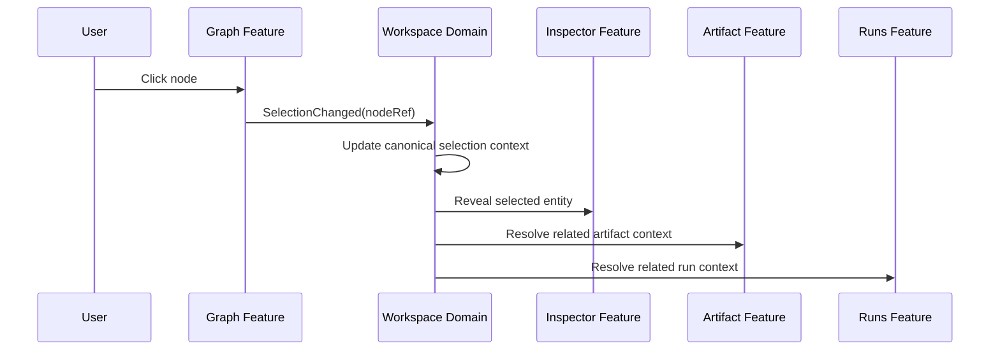

# Workspace Domain Specification

## 1. Purpose

This document defines the `Workspace Domain` for the DVT+ frontend.

Its purpose is to formalize the role of the workspace as a first-class frontend domain, describe its responsibilities and boundaries, and establish the initial conceptual model needed to support a workbench-oriented product architecture.

This document is intentionally focused on architectural definition. It does not yet prescribe implementation details for all components or stores, but it does define the domain shape that future implementation must follow.

---

## 2. Context

DVT+ is not a conventional page-based web application. It is evolving toward a frontend that behaves as a product workbench, where users can design, inspect, compare, and operate workflows from multiple synchronized surfaces.

This means the frontend must coordinate:

- multiple simultaneous views
- persistent user context
- shared selection across features
- panel composition
- tabbed work surfaces
- mode-dependent behavior
- relationships between graph, artifacts, runs, lineage, and git views

These concerns do not belong to any single feature such as graph, runs, or artifacts. They belong to the workspace itself.

For that reason, `workspace` must be treated as a domain rather than as a group of layout components.

---

## 3. Domain statement

The `Workspace Domain` is the frontend domain responsible for composing, coordinating, and preserving the user’s active working context across the DVT+ workbench.

It exists to ensure that the frontend behaves as a coherent tool rather than as a collection of unrelated views.

The workspace is therefore the coordination backbone of the frontend.

---

## 4. Why this domain exists

Without an explicit workspace domain, the frontend will tend to fragment in predictable ways:

- each feature owns its own local selection
- panels are opened directly by sibling features
- tabs behave as router artifacts instead of typed work surfaces
- shared context is duplicated or inconsistently updated
- graph, inspector, artifacts, runs, and git views drift apart semantically
- UI behavior becomes hard to reason about and difficult to test

In DVT+, where the same workflow element may need to appear in several projections at once, that fragmentation would become a structural problem.

The workspace domain exists to avoid that outcome.

---

## 5. Responsibilities

The `Workspace Domain` should own the following responsibilities.

### 5.1 Workspace session

The workspace owns the active workspace session as the canonical representation of the current working surface.

A workspace session may include:

- current project context
- current environment context
- active branch context
- active shell-level module identity
- active workbench interaction mode where applicable
- open tabs
- active tab
- current layout state
- shared selection context

A workspace session is not equivalent to being on a page. It represents an active working environment.

### 5.2 Tab and surface management

The workspace owns the lifecycle of work surfaces such as tabs or equivalent view instances.

Examples include:

- graph surface
- artifact surface
- run detail surface
- git diff surface
- lineage surface
- observer surface

A tab must be understood as a typed work surface instance, not as a visual label only.

### 5.3 Layout composition

The workspace owns layout composition across the workbench, including concerns such as:

- side panels
- bottom panels
- inspector visibility
- split arrangements
- docking behavior
- pinned surfaces
- layout presets
- module-driven composition changes
- workbench-mode-driven composition changes

This allows layout behavior to remain product-aware and not merely component-local.

### 5.4 Shared selection and context

The workspace owns the canonical shared selection and active context needed to synchronize multiple feature surfaces.

Examples of selectable entities include:

- graph node
- graph edge
- run
- step
- artifact
- git file
- lineage entity

The workspace should provide a stable, workbench-level representation of what is selected and from where that context originated.

### 5.5 Shell-level module selection

The workspace session owns the active shell-level module identity for the
current work surface:

- design
- dbt
- etl
- observer
- git
- run-analysis

This is the product perspective mounted by the shell. It selects which
workspace family is active.

### 5.6 Workbench interaction mode

When the active module exposes a graph workbench, the workspace also owns the
active interaction mode inside that workbench, such as:

- edit
- navigate
- validate
- lineage
- observe
- review
- domain

This is distinct from shell-level module identity. It affects commands,
permissions, overlays, and surface emphasis within the active workbench.

### 5.7 Cross-feature orchestration

The workspace coordinates interactions that span multiple frontend capabilities.

Examples include:

- selecting a graph node and synchronizing inspector, artifacts, and run context
- opening a run and synchronizing logs, step focus, and graph overlays
- opening a git diff and correlating changed files with graph entities
- switching module and recomposing the active surface set
- switching workbench mode inside the active module

This orchestration should be owned by the workspace rather than by any single feature module.

### 5.8 Coordination-state ownership

The workspace owns coordination state and explicit restorable workbench state.

Canonical owner:
[Frontend State Ownership And Persistence Policy](../frontend-state-ownership-and-persistence-policy.md)

That includes:

- shared selection and active work context
- active tabs and active tab identity
- layout composition and panel visibility
- active shell-level module identity
- active workbench interaction mode
- explicit restoration metadata for the current workbench session

It does not include query-backed runtime truth such as run snapshots, plan
payloads, observability metrics, or provider-enriched status payloads.

---

## 6. Non-responsibilities

The `Workspace Domain` must not absorb feature-specific logic.

It should not own:

- graph rendering logic
- artifact parsing or artifact-specific domain rules
- run retrieval or execution-specific interpretation
- git diff computation
- lineage computation
- backend transport logic for individual feature domains
- remote query caches for plan, run, artifact, lineage, or observability
  payloads
- persisted runtime truth copied from backend read models

These belong to their corresponding feature domains.

The workspace is responsible for coordination and composition, not for replacing feature internals.

---

## 7. Architectural principle

The main architectural rule for the workspace domain is:

> Feature modules should not directly control each other. They should collaborate through workspace-owned context and orchestration.

This means, for example:

- the graph feature should not directly mutate inspector state
- the inspector should not directly open artifact tabs by reaching into artifact internals
- the git feature should not directly control graph-local state
- cross-feature UI consequences should be mediated by workspace state and workspace use cases

This keeps feature boundaries explicit and avoids coupling by convenience.

---

## 8. Core concepts

The workspace domain appears to require, at minimum, the following core concepts.

### 8.1 Workspace Session

Represents the active workbench state for a user in a given project and environment context.

### 8.2 Workspace Tab

Represents a typed work surface instance. A tab is not merely a title; it has identity, kind, payload reference, lifecycle, and possibly dirty or pinned state.

Canonical contract:
[Workspace Tab Model Specification](workspace-tab-model-specification.md)

### 8.3 Workspace Layout

Represents the arrangement and visibility of panels and work surfaces.

Canonical contract:
[Workspace Layout Model Specification](workspace-layout-model-specification.md)

### 8.4 Selection Context

Represents the currently selected entity and the origin of that selection within the workbench.

Canonical contract:
[Selection Context Model Specification](selection-context-model-specification.md)

### 8.5 ModuleId

Represents the shell-level mounted product module.

### 8.6 WorkbenchMode

Represents the active interaction policy inside a mounted workbench.

---

## 9. Conceptual model



This diagram is conceptual. It defines the center of the domain without locking
the final code-level representation too early.

Important terminology decision:

- `moduleId` is the shell-level module identity
- `workbenchMode` is the interaction policy inside a mounted workbench

They are related, but they are not synonyms and must not collapse into one
field.

---

## 10. Suggested internal decomposition

To avoid turning `workspace` into a god module, the domain should be internally decomposed into focused areas.

### 10.1 Session Management

Owns:

- workspace identity
- project/environment/branch context
- session restoration
- preservation of active work context
- rehydration from persisted state where applicable
- explicit session/workbench persistence only, never runtime truth persistence

### 10.2 Tab Management

Owns:

- opening tabs
- closing tabs
- activating tabs
- pinning tabs
- deduplication rules
- tab restoration
- tab history

### 10.3 Layout Management

Owns:

- panel visibility
- split sizes
- docking state
- layout presets
- responsive layout constraints
- module-aware composition rules
- workbench-mode-aware composition rules

### 10.4 Context Management

Owns:

- current selection
- focused entity
- compare context
- active run context
- active artifact context
- active cross-surface context

### 10.5 Workspace Orchestration

Owns higher-level use cases such as:

- open entity in tab
- reveal entity in inspector
- synchronize related panels
- switch module
- switch workbench mode
- restore prior working context after navigation
- coordinate multi-feature reactions to user actions

---

## 11. Example interaction

The following sequence illustrates the intended role of the workspace domain when a user selects a graph node.



The important architectural property is that the graph feature does not directly control all downstream consequences of selection.

The workspace domain coordinates them.

---

## 12. Initial TypeScript direction

The following contracts are indicative and intentionally strict. They are not the final implementation, but they express the intended domain shape.

```ts
// See dedicated shared-kernel model specs for field-level authority:
// - selection-context-model-specification.md
// - workspace-tab-model-specification.md
// - workspace-layout-model-specification.md

export type ModuleId = 'design' | 'dbt' | 'etl' | 'observer' | 'git' | 'run-analysis';

export type WorkbenchMode =
  | 'edit'
  | 'navigate'
  | 'validate'
  | 'lineage'
  | 'observe'
  | 'review'
  | 'domain';

export type WorkspaceTabKind = 'graph' | 'artifact' | 'run' | 'git-diff' | 'lineage' | 'observer';

export type WorkspaceLayoutArrangement =
  | 'graph-focus'
  | 'analysis'
  | 'review'
  | 'observe'
  | 'single-surface';

export type SelectionEntityType =
  | 'node'
  | 'edge'
  | 'run'
  | 'artifact'
  | 'git-file'
  | 'lineage-entity';

export type ContextOrigin = 'graph' | 'runs' | 'artifacts' | 'git' | 'lineage' | 'inspector';

export interface WorkspaceSession {
  readonly workspaceId: string;
  readonly projectId: string;
  readonly environmentId: string | null;
  readonly moduleId: ModuleId;
  readonly workbenchMode: WorkbenchMode | null;
  readonly activeTabId: string | null;
  readonly tabs: readonly WorkspaceTab[];
  readonly layout: WorkspaceLayout;
  readonly selection: SelectionContext | null;
}

export interface WorkspaceTab {
  readonly tabId: string;
  readonly kind: WorkspaceTabKind;
  readonly title: string;
  readonly payloadRef: string;
  readonly isDirty: boolean;
  readonly isPinned: boolean;
}

export interface WorkspaceLayout {
  readonly panelArrangement: WorkspaceLayoutArrangement;
  readonly leftSidebarVisible: boolean;
  readonly rightInspectorVisible: boolean;
  readonly bottomPanelVisible: boolean;
  readonly panelSizes: {
    readonly leftSidebarWidth: number | null;
    readonly rightInspectorWidth: number | null;
    readonly bottomPanelHeight: number | null;
  };
}

export interface SelectionContext {
  readonly entityType: SelectionEntityType;
  readonly entityId: string;
  readonly source: ContextOrigin;
}
```

`workbenchMode` is nullable because not every mounted module exposes a graph
workbench.

This contract is deliberately conservative. It gives the domain a clear initial
shape without prematurely over-designing every reference type.

---

## 13. Suggested placement in the frontend architecture

The workspace should exist as a first-class area of the frontend, not as a secondary utility or purely presentational layer.

An indicative structure is the following:

```text
src/
  workspace/
    domain/
      model/
      events/
      services/
    application/
      open-tab/
      activate-tab/
      switch-module/
      switch-workbench-mode/
      update-selection/
      restore-session/
    infrastructure/
      persistence/
      mappers/
    ui/
      components/
      store/
```

This placement reflects the importance of the workspace domain as the coordination backbone of the workbench.

---

## 14. Initial boundaries

The following initial boundary definition is recommended.

### Workspace Domain owns

- workspace session model
- tab model
- layout model
- shared selection/context model
- orchestration rules between surfaces
- restoration rules for user work context

### Feature domains own

- graph-specific rendering and actions
- run-specific representation and behavior
- artifact-specific interpretation
- git-specific diff behavior
- lineage-specific behavior
- inspector-specific rendering and detail composition

This boundary should remain explicit in both code structure and architectural decisions.

---

## 15. Risks

### 15.1 Workspace becoming a god module

Because it coordinates many surfaces, the workspace domain can easily grow beyond its intended scope.

Mitigation:

- preserve strict non-responsibilities
- keep orchestration use-case based
- do not absorb feature-specific domain logic

### 15.2 Untyped selection drift

A weakly typed selection model will degrade quickly as the product adds more entity types.

Mitigation:

- introduce canonical entity references early
- evolve from generic selection payloads toward typed references

### 15.3 Weak tab semantics

If tabs are treated as visual labels or router aliases only, the workbench model becomes too thin.

Mitigation:

- model tabs as typed work surface instances
- preserve identity, payload, and lifecycle state

### 15.4 Layout state leaking into local component state

If layout behavior remains scattered across local React state, the workspace cannot act as a coherent coordination layer.

Mitigation:

- maintain layout as workspace-owned state
- render UI surfaces from explicit layout models

---

## 16. Conclusion

The `Workspace Domain` should be treated as the frontend coordination domain
that owns working context, tabbed surfaces, shared selection, shell-level
module identity, workbench interaction mode, mode-aware composition, and panel
orchestration across the DVT+ workbench.

It is therefore not an implementation detail and not a visual wrapper. It is a foundational part of the frontend architecture.

If the workspace domain is designed correctly, the rest of the frontend can evolve as modular feature domains coordinated through explicit context rather than through accidental coupling.

---

## 17. Companion documents

This document is refined by the following companion specifications:

1. [Workspace Session Model Specification](session/workspace-session-model-specification.md)
2. [Workspace Tab Model Specification](workspace-tab-model-specification.md)
3. [Selection Context Model Specification](selection-context-model-specification.md)
4. [Workspace Layout Model Specification](workspace-layout-model-specification.md)
5. [Workspace Orchestration - Cross-Feature Coordination Mechanism](workspace-orchestration.md)
6. [Frontend State Ownership And Persistence Policy](../frontend-state-ownership-and-persistence-policy.md)

These documents refine the domain without changing the architectural
boundaries established here.
