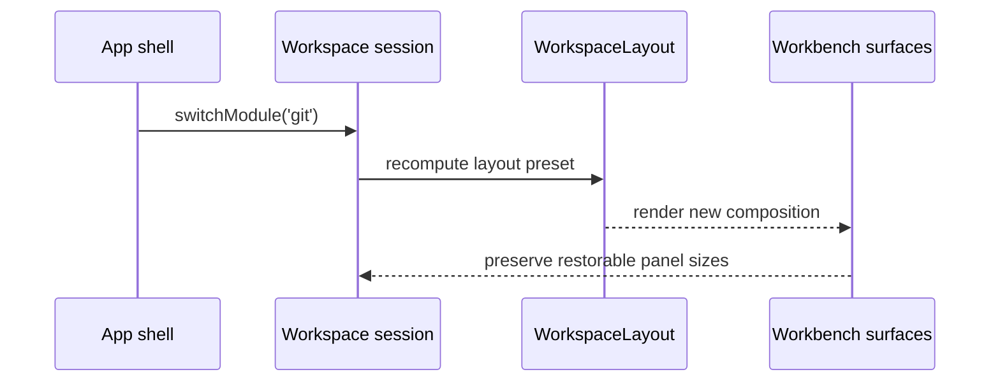

# Workspace Layout Model Specification

## 1. Purpose

This document defines the canonical `WorkspaceLayout` model for the frontend
shared kernel.

Its role is to keep workbench composition explicit, restorable, and
domain-meaningful without collapsing layout state into arbitrary local React
state.

## 2. Architectural role

`WorkspaceLayout` is a shared-kernel coordination contract used by Workspace
session management and any capability that renders into a multi-surface
workbench.

DDD role:

- one explicit model for workbench composition
- one stable language for visibility, arrangement, and restorable panel sizes
- one boundary between product layout semantics and component-local display
  mechanics

Hexagonal-compatible role:

- `WorkspaceLayout` is domain-side workbench state
- CSS details, DOM measurements, and framework widgets are adapter concerns
- backend payloads never define layout directly

SOLID note:

- SOLID is not Fowler's taxonomy
- the layout guidance here is SOLID-compatible and evidenced through Fowler's
  layering and separated-presentation sources

## 3. Canonical contract

```ts
export type WorkspaceLayoutArrangement =
  | 'graph-focus'
  | 'analysis'
  | 'review'
  | 'observe'
  | 'single-surface';

export interface WorkspacePanelSizes {
  readonly leftSidebarWidth: number | null;
  readonly rightInspectorWidth: number | null;
  readonly bottomPanelHeight: number | null;
}

export interface WorkspaceLayout {
  readonly panelArrangement: WorkspaceLayoutArrangement;
  readonly leftSidebarVisible: boolean;
  readonly rightInspectorVisible: boolean;
  readonly bottomPanelVisible: boolean;
  readonly panelSizes: WorkspacePanelSizes;
}
```

## 4. Invariants

### 4.1 Always-present invariant

A `WorkspaceSession` must always have a `WorkspaceLayout`.

Layout is not incidental UI residue. It is part of the active work context.

### 4.2 Composition invariant

`panelArrangement` describes workbench composition, not raw CSS layout.

The arrangement vocabulary is intentionally semantic and closed.

### 4.3 Restoration invariant

`panelSizes` exists to support restoration of meaningful workbench geometry.

If a panel is hidden, its saved size may remain present for future restoration.

### 4.4 No feature-payload invariant

`WorkspaceLayout` must not embed feature payloads, backend DTOs, or component
instances.

It describes composition only.

### 4.5 Module/mode relation invariant

Layout may be derived from `moduleId` and `workbenchMode`, but it is not
identical to either one.

Different modules or workbench modes may map to the same arrangement, and a
single arrangement may be reused across multiple modes.

## 5. Example interaction



## 6. Architectural precedents and evidence

### 6.1 Exact precedent: named workbench layouts and perspective composition

Primary official sources:

- Eclipse workbench guide,
  [Perspectives](https://help.eclipse.org/latest/topic/org.eclipse.platform.doc.isv/guide/workbench_perspectives.htm)
  - states that a perspective defines a collection of views and a layout for
    those views
- Eclipse Platform API,
  [IPageLayout](https://help.eclipse.org/latest/topic/org.eclipse.platform.doc.isv/reference/api/org/eclipse/ui/IPageLayout.html)
  - defines a page layout as the initial layout for a perspective within a
    workbench window
  - documents placement of editors and views, including folders and relative
    positioning
- Eclipse user guide,
  [Rearranging Views and Editors](https://help.eclipse.org/latest/topic/org.eclipse.platform.doc.user/gettingStarted/qs-39.htm)
  - documents customizing the workbench layout by rearranging, tiling, and
    tabbing views and editors
- Visual Studio documentation,
  [Customize window layouts and personalize tabs](https://learn.microsoft.com/en-us/visualstudio/ide/customizing-window-layouts-in-visual-studio?view=vs-2022)
  - documents docking, tab groups, floating windows, and switching/saving
    layouts in a professional IDE workbench

Precedent classification:

- `exact precedent` for treating workbench layout as a named, switchable, and
  restorable concern whose composition places editors and views into explicit
  regions or folders

### 6.2 Compatible precedent: domain-owned layout semantics

Primary sources:

- Martin Fowler, [Presentation Domain Data Layering](https://martinfowler.com/bliki/PresentationDomainDataLayering.html)
- Martin Fowler, [Separated Presentation](https://martinfowler.com/eaaDev/SeparatedPresentation.html)
- Martin Fowler, [Bounded Context](https://martinfowler.com/bliki/BoundedContext.html)
- Martin Fowler, [Inversion of Control Containers and the Dependency Injection pattern](https://martinfowler.com/articles/injection.html)

Precedent classification:

- `compatible precedent` for keeping layout semantics in the workbench/domain
  layer while leaving widget mechanics and framework details to adapters

### 6.3 Repository-local canonical policy

The exact repo contract name `WorkspaceLayout`, the arrangement vocabulary, and
the exact panel-size structure are repository-local canonical policy. They are
not claimed as source-authored fact.

That policy is anchored to documented workbench perspective/layout precedents
and constrained by the Fowler-compatible separation between coordination
semantics and presentation mechanics.

## 7. References

- [Frontend DDD Target Architecture](../frontend-ddd-target-architecture.md)
- [Workspace Domain Specification](workspace-domain-specification.md)
- [Workspace Session Model Specification](session/workspace-session-model-specification.md)
- [Workflow / Graph Workbench - Surfaces and Operating Modes](../views/workflow/workflow-graph-workbench-surfaces-and-operating-modes.md)
