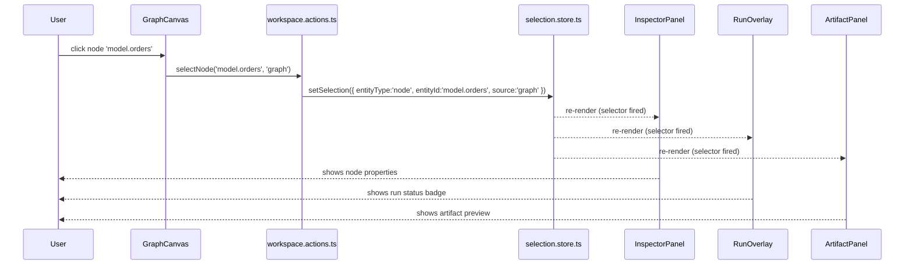

# Workspace Orchestration - Cross-Feature Coordination Mechanism

## 1. Purpose

This document specifies the concrete mechanism by which feature surfaces in the DVT+
workbench coordinate with each other through the workspace domain - without coupling
feature modules to one another directly.

It resolves the design gap identified in
`docs/architecture/frontend/review/frontend-architecture-review-and-critical-action-plan.md §3.10`.

---

## 2. The problem

The workspace domain specification (`workspace-domain-specification.md §11`) defines the
intent: when a user selects a graph node, the inspector, the artifact panel, and the run
overlay should all react. The graph feature should not call the inspector directly. The
workspace domain mediates.

But the _mechanism_ was left unspecified. Three candidates were evaluated:

| Candidate                                         | Verdict             |
| ------------------------------------------------- | ------------------- |
| Event bus (pub/sub)                               | Rejected - see §3.1 |
| Store subscriptions (`useEffect` + `subscribe`)   | Rejected - see §3.2 |
| Shared Zustand store + workspace action functions | **Chosen** - see §4 |

---

## 3. Rejected mechanisms and reasons

### 3.1 Event bus

An event bus decouples the publisher from subscribers. A graph component emits
`NodeSelected({ nodeId })` and multiple features subscribe independently.

**Rejected because:**

- Causality is invisible. To understand what happens when a node is selected, you must
  grep for all listeners of `NodeSelected` across the entire codebase. With a shared
  store, every consumer is visible via `useSelectionStore`.
- Event ordering becomes a problem as the number of listeners grows. Zustand store
  updates are synchronous and atomic by default.
- TypeScript typing of event payloads requires boilerplate. Zustand store fields are
  typed by their interface.
- Testing requires subscribing in tests and asserting side effects. Store state is
  directly assertable.
- Zustand is already a reactive event bus. An event bus built on top of Zustand is
  redundant infrastructure.

### 3.2 Store subscriptions via `useEffect` + `subscribe`

A feature component subscribes to another store's state and reacts imperatively:

```ts
// Pattern that appears reasonable but is a trap
useEffect(() => {
  return useAppStore.subscribe(
    (s) => s.selectedNodes,
    (nodes) => {
      setInspectorNode(nodes[0]);
    } // hidden reaction
  );
}, []);
```

**Rejected because:**

- Creates invisible reactive chains. A bug manifests as "inspector updated but I don't
  know why or from where." The chain of causality cannot be traced by reading the code.
- Subscription lifecycle depends on the component that owns the `useEffect`. If that
  component unmounts, the reaction stops silently.
- Stale closure bugs are common when the subscription callback captures component state.
- Cannot be tested without mounting the component.
- This is precisely the pattern that the introduction doc (`§13.2`) warns against as
  "monolithic global store" - it is the distributed version of the same problem.

---

## 4. Chosen mechanism: shared store + workspace action functions

### 4.1 Principle

```
Feature components READ from shared workspace stores via hooks.
Feature components NEVER write to shared workspace stores directly.
All mutations to shared workspace state go through workspace action functions.
```

This gives:

- **Traceability**: every change to shared state originates from a named action function.
- **Reactivity**: Zustand's hook-based subscriptions propagate changes automatically to
  all reading components, without manual subscription management.
- **Testability**: call an action function, assert the store state, assert component
  renders - no component mounting needed for logic tests.
- **Decoupling**: the graph component and the inspector never import each other. Both
  import from the workspace action layer.

### 4.2 Zustand as the propagation substrate

Every `create()` in Zustand is already a reactive bus:

- `set()` = publish
- `useStore(selector)` = subscribe + auto-unsubscribe on unmount

No additional infrastructure is needed. The "event bus" is the existing Zustand
primitive. The workspace action functions are the named, typed "events".

State ownership note:

- shared workspace stores are coordination state only
- run snapshots, plan payloads, artifact payloads, and observability payloads
  stay in capability-owned query caches
- browser persistence is limited to explicit workspace/session state, never to
  runtime truth

Canonical owner:
[Frontend State Ownership And Persistence Policy](../frontend-state-ownership-and-persistence-policy.md)

---

## 5. Component model

### 5.1 `selection.store.ts` - shared selection source of truth

```ts
// apps/web/src/app/stores/selection.store.ts

import type { SelectionContext } from '../types/selection-context';

interface SelectionState {
  selection: SelectionContext | null;
  setSelection: (ctx: SelectionContext | null) => void;
}

export const useSelectionStore = create<SelectionState>((set) => ({
  selection: null,
  setSelection: (ctx) => set({ selection: ctx }),
}));
```

This store is the only canonical representation of "what is currently selected in the
workbench." Replacing the dual `selectedNodes: string[]` + `inspectorNodeId: string | null`
in `appStore.ts` with a single typed `SelectionContext` is the first migration step.

### 5.2 `workspace.actions.ts` - the orchestrator

```ts
// apps/web/src/app/workspace/workspace.actions.ts

import { useSelectionStore } from '../stores/selection.store';
import { useSessionStore } from '../stores/sessionStore';
import { useShellStore } from '../stores/shell.store';
import type { WorkspaceTab } from '../types/WorkspaceTab';

/**
 * Select a workbench entity. All surfaces that display selection-sensitive content
 * will react automatically via their useSelectionStore hook.
 */
export function selectEntity(ctx: SelectionContext): void {
  useSelectionStore.getState().setSelection(ctx);
}

/**
 * Convenience overload for node selection from the graph canvas.
 */
export function selectNode(nodeId: string, source: SelectionContext['source'] = 'graph'): void {
  selectEntity({ entityType: 'node', entityId: nodeId, source });
  // Open inspector automatically on node selection.
  useShellStore.getState().setInspectorVisible(true);
}

/**
 * Clear the current selection across all surfaces.
 */
export function clearSelection(): void {
  useSelectionStore.getState().setSelection(null);
}

/**
 * Open a typed work surface as a tab in the session.
 */
export function openInTab(tab: WorkspaceTab): void {
  useSessionStore.getState().addTab(tab);
}

/**
 * Switch the active workbench mode.
 * Affects surface visibility and command availability.
 */
export function switchWorkbenchMode(mode: WorkbenchMode): void {
  useSessionStore.getState().setWorkbenchMode(mode);
}
```

**Rules for `workspace.actions.ts`:**

- Functions are plain exports - not a class, not a React hook.
- They call `getState()` directly (Zustand's imperative API), not through hooks.
- They may compose multiple store mutations that should happen atomically.
- They must not contain UI logic (no React imports, no JSX, no DOM access).
- They may be called from event handlers, keyboard shortcuts, command palette handlers,
  or other action functions - but never from render code.

### 5.3 Feature component pattern

```tsx
// GraphCanvas - emits action, does not own downstream effects
function GraphCanvas() {
  const handleNodeClick = (nodeId: string) => {
    selectNode(nodeId, 'graph');   // workspace action - not a store call
  };

  return <ReactFlow onNodeClick={...} />;
}

// InspectorPanel - reads selection, re-renders automatically
function InspectorPanel() {
  const selection = useSelectionStore((s) => s.selection);

  if (!selection || selection.entityType !== 'node') return <EmptyInspector />;
  return <NodeInspector nodeId={selection.entityId} />;
}

// RunOverlay - reads selection, drives its own query
function RunOverlay() {
  const selection = useSelectionStore((s) => s.selection);
  const { data: runStatus } = useQuery({
    queryKey: ['run-overlay', selection?.entityId],
    queryFn: () => fetchRunStatusForNode(selection!.entityId),
    enabled: selection?.entityType === 'node',
  });

  return runStatus ? <RunStatusBadge status={runStatus} /> : null;
}

// ArtifactPanel - same pattern
function ArtifactPanel() {
  const selection = useSelectionStore((s) => s.selection);
  // React Query + selection.entityId
}
```

No component imports another feature component. No component subscribes to another
feature's store. All coordination flows through `useSelectionStore`.

---

## 6. Interaction flow

The following sequence illustrates "user clicks a node in the graph":



The graph component (`G`) does not know that `InspectorPanel`, `RunOverlay`, or
`ArtifactPanel` exist. None of them know about each other. The only shared dependency
is `selection.store.ts`.

---

## 7. Action catalog

The following workspace actions should exist at minimum. They are the complete set of
cross-feature state transitions in the workbench.

| Action                | Signature                         | Effect                                      |
| --------------------- | --------------------------------- | ------------------------------------------- |
| `selectEntity`        | `(ctx: SelectionContext) => void` | Sets canonical selection                    |
| `selectNode`          | `(nodeId, source?) => void`       | Selects node, opens inspector               |
| `clearSelection`      | `() => void`                      | Clears selection across all surfaces        |
| `openInTab`           | `(tab: WorkspaceTab) => void`     | Adds tab to session                         |
| `activateTab`         | `(tabId: string) => void`         | Sets active tab                             |
| `closeTab`            | `(tabId: string) => void`         | Removes tab, activates nearest              |
| `switchWorkbenchMode` | `(mode: WorkbenchMode) => void`   | Sets workbench interaction mode             |
| `switchModule`        | `(moduleId: ModuleId) => void`    | Switches shell-level module                 |
| `openRunInTab`        | `(runId: string) => void`         | Convenience: creates run tab + activates it |
| `openArtifactInTab`   | `(artifactRef: string) => void`   | Convenience: creates artifact tab           |

---

## 8. Anti-patterns - what NOT to do

### 8.1 Direct store mutation from feature components

```ts
// BAD - feature component directly mutates shared selection
const setInspectorNode = useAppStore((s) => s.setInspectorNode);
const handleClick = () => setInspectorNode(nodeId);
```

**Why wrong:** the action logic (open inspector, update selection, trigger reactions) is
scattered across call sites. When the behavior needs to change, every call site must be
found and updated (Shotgun Surgery).

### 8.2 Cross-feature store imports

```ts
// BAD - runs feature reading canvas-internal state
import { useCanvasStore } from '../canvas/canvas.store';
const selectedNodes = useCanvasStore((s) => s.selectedNodes);
```

**Why wrong:** this creates direct coupling between two feature modules. Canvas-internal
state is not the same as canonical workspace selection. Feature internals must stay
inside the feature.

### 8.3 Reactive chains via `useEffect` + `subscribe`

```ts
// BAD - inspector subscribing to canvas selection changes
useEffect(() => {
  return useAppStore.subscribe(
    (s) => s.selectedNodes,
    (nodes) => {
      doSomethingWithNodes(nodes);
    }
  );
}, []);
```

**Why wrong:** see §3.2.

### 8.4 Putting orchestration logic inside a React component

```tsx
// BAD - orchestration logic inside a component
function GraphCanvas() {
  const handleNodeClick = (nodeId: string) => {
    setSelectedNodes([nodeId]); // canvas store
    setInspectorNode(nodeId); // shell store
    setInspectorPanelVisible(true); // shell store
    addRecentSelection(nodeId); // history store
  };
}
```

**Why wrong:** the component now owns the orchestration. Adding a fifth effect (e.g.,
"also update the artifact panel") requires editing the component. Using a workspace
action function, the component never changes.

---

## 9. Testing strategy

### 9.1 Unit testing workspace actions

Actions are plain functions that call Zustand's `getState()`. Test them without
mounting any React component:

```ts
import { selectNode, clearSelection } from './workspace.actions';
import { useSelectionStore } from '../stores/selection.store';

beforeEach(() => {
  useSelectionStore.setState({ selection: null });
});

it('selectNode sets canonical selection', () => {
  selectNode('model.orders', 'graph');
  expect(useSelectionStore.getState().selection).toEqual({
    entityType: 'node',
    entityId: 'model.orders',
    source: 'graph',
  });
});

it('clearSelection removes selection', () => {
  selectNode('model.orders', 'graph');
  clearSelection();
  expect(useSelectionStore.getState().selection).toBeNull();
});
```

### 9.2 Unit testing feature components

Render the component with a pre-populated store. No need to simulate the action:

```tsx
it('InspectorPanel renders node properties when node is selected', () => {
  useSelectionStore.setState({
    selection: { entityType: 'node', entityId: 'model.orders', source: 'graph' },
  });

  render(<InspectorPanel />);
  expect(screen.getByText('model.orders')).toBeInTheDocument();
});
```

### 9.3 Integration testing cross-feature coordination

Test that calling an action produces the expected rendered state across surfaces:

```tsx
it('selecting a node updates inspector and shows run overlay', async () => {
  render(
    <>
      <GraphCanvas />
      <InspectorPanel />
      <RunOverlay />
    </>
  );

  selectNode('model.orders', 'graph');

  await screen.findByText('model.orders'); // inspector updated
  await screen.findByTestId('run-status-badge'); // run overlay appeared
});
```

---

## 10. Relationship to workspace domain decomposition

The workspace domain specification (`workspace-domain-specification.md §10`) defines five
sub-domains. The orchestration mechanism maps to them as follows:

| Sub-domain              | Implementation                                                             |
| ----------------------- | -------------------------------------------------------------------------- |
| Session Management      | `sessionStore.ts` mutations via `openInTab`, `switchModule`, `activateTab` |
| Context Management      | `selection.store.ts` mutations via `selectEntity`, `clearSelection`        |
| Workspace Orchestration | `workspace.actions.ts` - composes the above                                |
| Tab Management          | `sessionStore.ts` - `addTab`, `closeTab`, `setActiveTab`                   |
| Layout Management       | `shell.store.ts` - `setInspectorVisible`, `setExplorerVisible`             |

The workspace action functions ARE the workspace orchestration sub-domain. They are not
a class, not a service container, not a hook - they are named, typed functions that
compose store mutations into named user-intent operations.

---

## 11. File placement

```text
apps/web/src/app/
  workspace/
    workspace.actions.ts       <- all cross-feature action functions
  stores/
    selection.store.ts         <- SelectionContext source of truth
    session.store.ts           <- WorkspaceSession (tabs, moduleId, workbenchMode, identity)
    shell.store.ts             <- shell layout (panels, nav)
    runs.queries.ts            <- query-backed run or plan truth, never workspace persistence
    runs.ui.store.ts           <- optional bounded Runs-local UI state only
```

Feature modules read from `stores/selection.store.ts` and call from
`workspace/workspace.actions.ts`. They do not import from each other.

---

## 12. Migration path from current code

The current `appStore.ts` has two overlapping selection fields:

- `selectedNodes: string[]` - canvas selection (array)
- `inspectorNodeId: string | null` - inspector binding (single node)

Migration sequence:

1. Create `selection.store.ts` with `SelectionContext | null`.
2. Create `workspace.actions.ts` with `selectNode` and `clearSelection`.
3. Update `GraphCanvas` to call `selectNode(nodeId)` instead of both
   `setSelectedNodes([nodeId])` and `setInspectorNode(nodeId)`.
4. Update `InspectorPanel` to read from `useSelectionStore` instead of `inspectorNodeId`.
5. Remove `selectedNodes` and `inspectorNodeId` from `appStore.ts`.
6. Verify characterization tests pass.

This is a seam-safe migration: at each step the system remains functional. No step
requires changing more than one module at a time.

---

## 13. Risks and constraints

| Risk                                               | Description                                                                    | Mitigation                                                                                                                            |
| -------------------------------------------------- | ------------------------------------------------------------------------------ | ------------------------------------------------------------------------------------------------------------------------------------- |
| Actions grow into god module                       | `workspace.actions.ts` accumulates every action                                | Split by concern: `selection.actions.ts`, `tab.actions.ts`, `mode.actions.ts`, `navigation.actions.ts` when count exceeds ~8 per file |
| Stores mutated outside of actions                  | Feature component calls `useSelectionStore.getState().setSelection()` directly | Lint rule: ban direct calls to `.getState().setXxx()` from component files                                                            |
| `SelectionContext` shape grows uncontrolled        | New entity types added without coordination                                    | `entityType` is a discriminated union - TypeScript enforces exhaustiveness at each consumer                                           |
| Action functions import from each other circularly | `tab.actions` imports `selection.actions` which imports `tab.actions`          | Actions may only import from stores, never from other action files                                                                    |

---

## 14. References

- `workspace-domain-specification.md §10.5` - Workspace Orchestration sub-domain definition
- `workspace-domain-specification.md §11` - cross-feature interaction sequence diagram (intent)
- `session/workspace-session-model-specification.md §14` - `WorkspaceSession` contract
- `selection-context-model-specification.md` - canonical `SelectionContext` contract
- `workspace-tab-model-specification.md` - canonical `WorkspaceTab` contract
- `workspace-layout-model-specification.md` - canonical `WorkspaceLayout` contract
- `../views/workflow/workflow-graph-workbench-surfaces-and-operating-modes.md §9` - state model for workbench surfaces
- `../review/frontend-architecture-review-and-critical-action-plan.md §3.10` - gap that this document resolves
- `apps/web/src/app/stores/appStore.ts` - current `selectedNodes` and `inspectorNodeId` (to be migrated)
- `apps/web/src/app/stores/selection.store.ts` - target implementation (to be created)
- `apps/web/src/app/workspace/workspace.actions.ts` - target implementation (to be created)
- `../frontend-state-ownership-and-persistence-policy.md` - canonical state ownership and persistence rules
