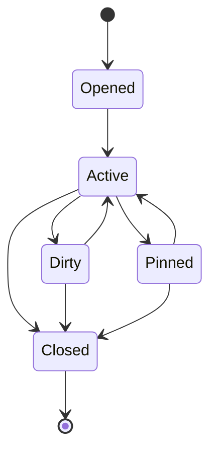

# Workspace Tab Model Specification

## 1. Purpose

This document defines the canonical `WorkspaceTab` model for the frontend
shared kernel.

Its role is to formalize a tab as a typed work surface instance rather than as
an untyped router artifact, label, or arbitrary UI container.

## 2. Architectural role

`WorkspaceTab` is a shared-kernel contract consumed by Workspace and by any
capability that opens or restores a work surface.

DDD role:

- one typed workbench surface identity shared across contexts
- one stable vocabulary for open/active/pinned work surfaces
- one boundary between tab semantics and feature-local rendering internals

Hexagonal-compatible role:

- `WorkspaceTab` is a domain-side workbench model
- router state, component state, and backend payloads are adapters around it
- a tab points to a feature-owned resource through `payloadRef`; it does not
  embed feature internals

SOLID note:

- SOLID is not authored by Fowler
- this document stays SOLID-compatible while grounding its evidence in Fowler's
  bounded-context, layering, mapper, and refactoring material

## 3. Canonical contract

```ts
export type WorkspaceTabKind = 'graph' | 'artifact' | 'run' | 'git-diff' | 'lineage' | 'observer';

export interface WorkspaceTab {
  readonly tabId: string;
  readonly kind: WorkspaceTabKind;
  readonly title: string;
  readonly payloadRef: string;
  readonly isDirty: boolean;
  readonly isPinned: boolean;
}
```

Field meanings:

- `tabId`: stable work-surface identity inside the active session
- `kind`: closed vocabulary for the surface family
- `title`: user-facing label, not semantic identity
- `payloadRef`: opaque reference resolved by the owning capability
- `isDirty`: unsaved local work exists for the surface
- `isPinned`: the tab should resist automatic displacement/closure rules

## 4. Invariants

### 4.1 Typed-surface invariant

Every tab must declare a `kind`.

Open tabs must not be represented as generic objects with free-form `type` or
`data` bags.

### 4.2 Stable identity invariant

`tabId` must be stable for the life of the tab instance.

It is not interchangeable with `payloadRef`.

### 4.3 Opaque payload invariant

`payloadRef` is an opaque reference, not embedded feature state.

Capabilities own resolution of that reference through their own selectors,
queries, and adapters.

### 4.4 No DTO invariant

`WorkspaceTab` must not carry backend DTOs or transport payloads.

That would collapse the shared kernel into an adapter boundary and violate the
frontend ACL direction.

### 4.5 Closed kind invariant

`WorkspaceTabKind` is a controlled vocabulary.

Adding a new kind is an architectural change because session restoration,
deduplication rules, and orchestration may all need to change.

## 5. Lifecycle model



This is a workbench lifecycle, not a browser-tab lifecycle.

## 6. Design rules

- A tab is a coordination object, not a rendered component instance.
- `title` may change without changing semantic identity.
- `payloadRef` resolution belongs to the owning capability context.
- Deduplication rules may depend on `kind` plus `payloadRef`, but the tab
  contract itself does not hard-code those rules.
- The shared kernel must never regress to `data?: any`.

## 7. Architectural precedents and evidence

### 7.1 Exact precedent: typed tabs and tab groups in a workbench

Primary official sources:

- VS Code API,
  [VS Code API](https://code.visualstudio.com/api/references/vscode-api)
  - the `Tab`, `TabGroup`, and `TabGroups` sections document a main editor area
    composed of multiple groups that contain tabs
  - the `Tab` section documents dirty tabs, pinned tabs, labels, and typed tab
    inputs
- Eclipse workbench guide,
  [Perspectives](https://help.eclipse.org/latest/topic/org.eclipse.platform.doc.isv/guide/workbench_perspectives.htm)
  - documents editor areas, views, and tabbed folders inside a workbench window
- Eclipse user guide,
  [Rearranging Views and Editors](https://help.eclipse.org/latest/topic/org.eclipse.platform.doc.user/gettingStarted/qs-39.htm)
  - documents rearranging editors, tiling editors, and rearranging tabbed views

Precedent classification:

- `exact precedent` for representing a workbench through explicit tab and
  tab-group concepts with active groups, active tabs, dirty tabs, pinned tabs,
  and typed tab inputs rather than through anonymous UI labels

### 7.2 Compatible precedent: domain-safe tab semantics

Primary sources:

- Martin Fowler, [Bounded Context](https://martinfowler.com/bliki/BoundedContext.html)
- Martin Fowler, [Presentation Domain Data Layering](https://martinfowler.com/bliki/PresentationDomainDataLayering.html)
- Martin Fowler, [Separated Presentation](https://martinfowler.com/eaaDev/SeparatedPresentation.html)
- Martin Fowler, [Data Mapper](https://martinfowler.com/eaaCatalog/dataMapper.html)
- Martin Fowler, [Data Transfer Object](https://martinfowler.com/eaaCatalog/dataTransferObject.html)
- Martin Fowler and Kent Beck, [Refactoring](https://martinfowler.com/books/refactoring.html)

Precedent classification:

- `compatible precedent` for keeping tab identity in the workbench/domain layer
  and for banning DTO-shaped payload bags from the shared kernel

### 7.3 Repository-local canonical policy

The exact repo contract name `WorkspaceTab`, the exact kind vocabulary, and the
field set:

- `tabId`
- `kind`
- `title`
- `payloadRef`
- `isDirty`
- `isPinned`

are repository-local canonical policy.

That policy is anchored to documented tab-group/editor-group workbench
precedents and constrained by the Fowler-compatible layering and DTO-isolation
sources above.

## 8. References

- [Frontend DDD Target Architecture](../frontend-ddd-target-architecture.md)
- [Workspace Domain Specification](workspace-domain-specification.md)
- [Workspace Session Model Specification](session/workspace-session-model-specification.md)
- [Frontend Architecture Review and Critical Action Plan](../review/frontend-architecture-review-and-critical-action-plan.md)
