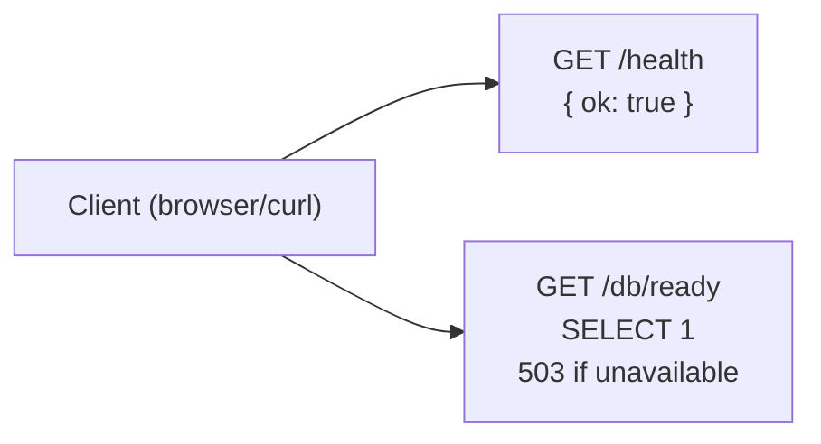
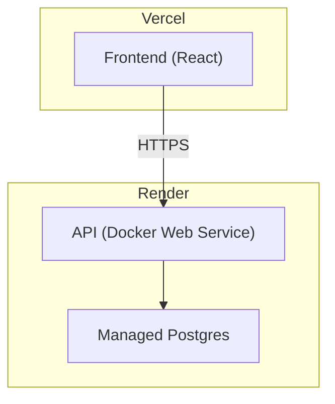
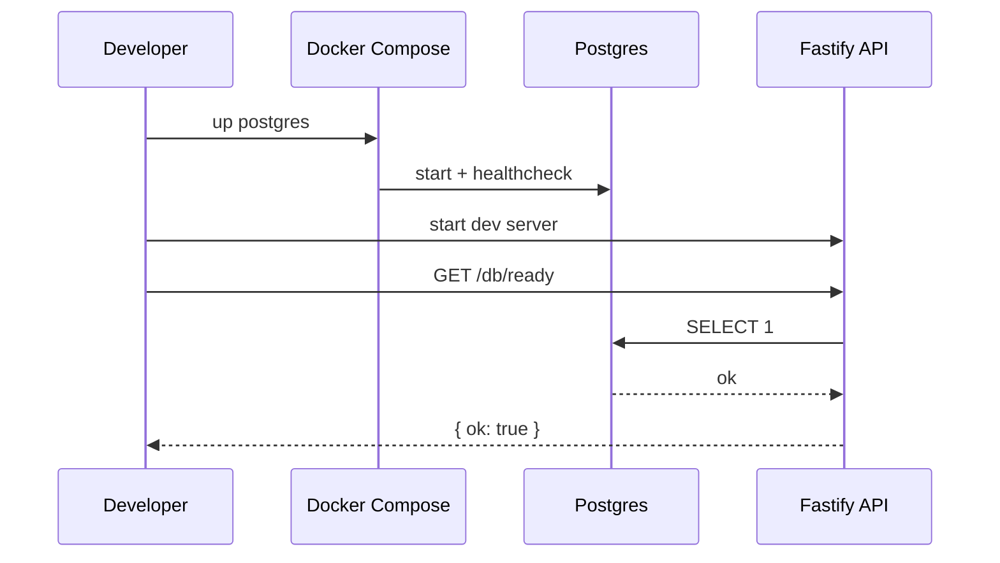

# DVT+ Local Infra + API Readiness (Dev Baseline)

## Scope

This document describes the **local development** baseline:

- PostgreSQL runs in Docker Compose.
- API exposes `/health` and `/db/ready`.
- Frontend remains decoupled and calls API over HTTP(S).

## Local runtime diagram

```mermaid
flowchart TB
  subgraph DevMachine["Developer Machine"]
    subgraph Docker["Docker Compose"]
      PG["Postgres 16\n(dvt-postgres)"]
    end

    API["Node.js API (Fastify)"]
    WEB["Frontend (React+TS)"]
  end

  WEB -->|HTTP(S)| API
  API -->|DATABASE_URL| PG
```

## API endpoints



## Deploy target mapping (unchanged)



## Sequence: local dev smoke



## Notes

- `/db/ready` returns **503** when `DATABASE_URL` is missing or the DB is unreachable.
- For production, use **Render Managed Postgres** and set `DATABASE_URL` in Render env vars.
