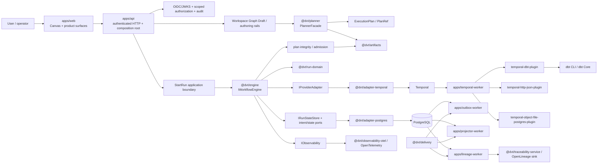
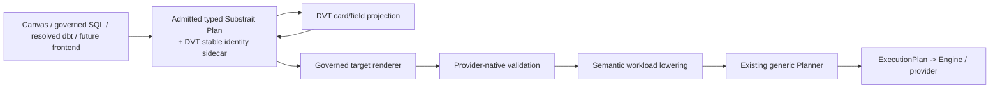

# Reference Architecture

Canonical authored reference for DVT architectural principles, authority boundaries,
and top-level runtime shape.

This page is intentionally small. Component-local detail belongs in
[`docs/architecture/components/`](./components/index.md), cross-component flows belong in
[`docs/architecture/system/`](./system/index.md), and executable source, tests, runtime
composition, accepted ADRs, and Planning DB architecture queries remain stronger evidence
than this prose when they disagree.

## Reading Rule

Distinguish these postures explicitly:

- **AS-IS**: implemented in current source/runtime composition.
- **PARTIAL**: a real boundary exists but product or operational coverage is incomplete.
- **TARGET**: accepted architecture that is not yet an end-to-end executable path.
- **EXTERNAL**: third-party runtime or standard actually used by current source.

Do not promote an accepted target to AS-IS without executable evidence, and do not keep an
implemented slice labeled purely target after it lands.

## Principles

- **Hexagonal boundaries:** domain/application logic depends on DVT-owned contracts and
  ports; infrastructure-specific behavior stays behind adapters or composition roots.
- **Deterministic planning and execution inputs:** plan identity and integrity are stable;
  workflow code remains replay-safe and side effects cross explicit runtime boundaries.
- **Planner / Engine / State / UI authority separation:** the Planner decides executable
  responsibilities, the Engine governs lifecycle, persisted run events record operational
  truth, and the UI authors/presents state through governed application boundaries.
- **Event-sourced run lifecycle:** ordered `RunEvents` are authoritative; snapshots are
  derived. Provider-native status cannot replace canonical DVT status.
- **One authority per kind of truth:** semantic meaning, stable authoring identity, runtime
  planning, lifecycle transitions, artifacts, provider execution, state, delivery, and
  presentation have distinct owners.
- **Replaceable infrastructure where a real boundary exists:** provider/runtime concerns
  stay behind `IProviderAdapter`; a hypothetical second implementation is not sufficient
  reason to create another abstraction.
- **Reuse before build:** use standards and mature libraries for commodity behavior and
  keep DVT-specific code focused on product semantics, governance, and integration.
- **Command/query rail governance:** externally observable behavior reuses named product
  rails instead of being redefined independently by routes, workers, plugins, adapters, or
  UI actions.
- **Mechanical enforcement where possible:** architecture tests, contract tests, CI,
  deterministic serialization, and generated/governed indexes are preferred over prose-only
  rules.
- **Target architecture must not become implementation evidence:** proposals and open PRs
  may inform direction, but `main` remains the source-first baseline.

## Current Authority Map

| Concern                                              | Current authority                                                | Posture      |
| ---------------------------------------------------- | ---------------------------------------------------------------- | ------------ |
| Cross-boundary vocabulary                            | `@dvt/contracts`                                                 | AS-IS        |
| Cryptographic/canonical primitives                   | `@dvt/crypto`                                                    | AS-IS        |
| Workspace/Canvas graph authoring                     | protected Workspace Graph Draft + Canvas authoring rails         | AS-IS        |
| Relational/expression/type/function meaning for VTX2 | pinned Substrait profile                                         | PARTIAL VTX2 |
| Stable VTX2 relation/field identity                  | DVT Substrait authoring sidecar                                  | PARTIAL VTX2 |
| Semantic capability governance                       | `DvtSubstraitCapabilityCatalog.v1`                               | PARTIAL VTX2 |
| Runtime responsibility planning                      | `@dvt/planner` through `PlannerFacade` / `ExecutionPlan`         | AS-IS        |
| Stored-plan parsing/config verification              | `@dvt/plan-verifier`                                             | AS-IS        |
| Execution DAG interpretation/layers                  | `@dvt/plan-interpreter`                                          | AS-IS        |
| Run lifecycle command/read boundary                  | `@dvt/engine` / `IWorkflowEngine`                                | AS-IS        |
| Legal run/step transitions                           | `@dvt/run-domain`                                                | AS-IS        |
| Provider execution translation                       | `IProviderAdapter` implementations                               | AS-IS        |
| Current workflow provider                            | Temporal via `@dvt/adapter-temporal`                             | AS-IS        |
| Operational run truth                                | persisted ordered run events + derived snapshots                 | AS-IS        |
| Immutable plan/code/bundle/context objects           | `@dvt/artifacts`                                                 | AS-IS        |
| Async fact movement and projection refresh           | `@dvt/delivery` + workers                                        | AS-IS        |
| Authentication/authorization/audit                   | `apps/api` protected security runtime                            | AS-IS        |
| Runtime telemetry                                    | `IObservability` + concrete operational metrics/OTel integration | PARTIAL      |
| Product presentation/editor                          | `apps/web` through governed API/application ports                | AS-IS        |

## Bounded Contexts And Runtime Responsibilities

| Context / subsystem          | Responsibility                                                                            | Current status                                      |
| ---------------------------- | ----------------------------------------------------------------------------------------- | --------------------------------------------------- |
| Authoring / Workspace        | protected graph draft, authoring authority, dbt/source-import rails                       | Implemented                                         |
| Planning                     | deterministic selection, policies, graph analysis, plan assembly and hashing              | Implemented and runtime-wired                       |
| Execution                    | admission, intent/recovery, lifecycle commands/queries, provider delegation               | Implemented                                         |
| Run Domain                   | event folding and legal run/step transition invariants                                    | Implemented                                         |
| State                        | run events, snapshots, intent/outbox persistence and operational reads                    | Implemented                                         |
| Artifacts                    | plan, compiled-code, bundle, execution-context and content-addressed artifact boundaries  | Implemented bounded context; storage profiles vary  |
| Delivery                     | outbox movement, sharding, backpressure and projection refresh                            | Implemented                                         |
| Provider Runtime             | Temporal workflow/worker plus capability-specific step plugins                            | Implemented for Temporal                            |
| Traceability / Lineage       | lineage/evidence processing and OpenLineage-facing integration                            | Implemented path; external sink availability varies |
| Observability                | traces, operational metrics/logging and correlation                                       | Partial coverage                                    |
| Security / API               | authenticated command/query boundary, scoped authorization, durable audit and composition | Implemented                                         |
| Web / UX                     | Canvas/workspace authoring and governed run/read surfaces                                 | Implemented surface; feature coverage evolves       |
| Semantic Transformation VTX2 | Substrait-centered semantic authoring/rendering/readiness path                            | bounded AS-IS authoring pilot + broader TARGET      |

## Top-Level AS-IS Runtime Shape



The arrows describe responsibility/runtime handoff, not TypeScript import edges.

### Current runtime facts that must remain explicit

- `apps/api/src/modules/buildProtectedRuntimeModule.ts` is the protected runtime
  composition root. DVT does not require a fictional generic DI/autodiscovery kernel to
  explain current composition.
- `PlannerFacade` is the stable public Planner entry. Planner-owned behavior ports remain
  separate from shared serializable contracts in `@dvt/contracts`.
- `IWorkflowEngine` and `IProviderAdapter` are different boundaries. `TemporalAdapter`
  implements the provider seam; it is not the product workflow-engine facade.
- `IWorkflowEngine.getRunStatus()` reads canonical status from DVT persisted state and must
  not query the provider adapter for canonical truth.
- provider workflows/workers may realize lifecycle facts, but those facts become canonical
  product truth through the DVT event/state rail.
- DBT is a concrete integration/execution capability composed by the Temporal worker DBT
  plugin profile; it is not engine-kernel semantics.
- delivery/outbox is not a universal message bus. Commands and queries retain explicit
  application rails.

## VTX2: Current Slice Versus Target Subsystem

ADR-0064 makes the pinned Substrait logical profile the semantic reference for VTX2 and
keeps DVT's sidecar limited to stable authoring identity/provenance.

### AS-IS on current `main`

The first deliberately bounded Canvas authoring pilot is implemented:

```text
customers(name, email, country)
name -> trim -> upper -> customer_name
```

The Web edits a generated typed Substrait `Plan` for that admitted shape, preserves stable
`RelationId` / `FieldId` through the DVT sidecar, serializes protobuf bytes with SHA-256,
uses the existing Workspace Graph Draft Apply/Cancel/reload rail, and fails closed for
unsupported shapes.

The capability catalog currently promotes only the pilot capabilities needed for that
slice to `supported-profile`: named-table `ReadRel`, `RelCommon.Emit`, `ProjectRel`, field
selection, scalar-function expressions, string type, `trim`, and `upper`. Catalog presence
for other relations/functions/types remains governance metadata, not execution or UI
support evidence.

### TARGET beyond that slice

The broader semantic transformation route is still target architecture:



A pending PR or accepted design may implement the next bounded cut, but it is not AS-IS
until merged and evidenced on `main`.

The invariant remains:

```text
Substrait logical operator count
!= Canvas card count
!= ExecutionPlan step count
```

Semantic validity also does not imply renderer support, provider readiness, or visual
exposure.

## External Systems Actually In The Current Architecture

- Temporal — current workflow provider.
- PostgreSQL — current operational persistence provider.
- dbt CLI / dbt Core — concrete dbt execution and analysis path where enabled.
- Filesystem and S3-compatible object storage — artifact/archive storage profiles.
- OIDC/JWKS identity provider — authentication boundary when protected runtime is enabled.
- OpenTelemetry — observability integration standard.
- OpenLineage-compatible sink — lineage publication boundary.
- React/Vite, `@xyflow/react`, Monaco, TanStack Query and Zustand — current Web foundations.

Conductor, BullMQ, Airflow, NATS, Kafka, RabbitMQ, SQLGlot and similar candidates are not
current runtime architecture merely because they have appeared in historical proposals or
open PR discussion.

## Known Documentation Drift To Avoid

- Do not use historical “dbt Cloud improved V2” diagrams as current component inventory.
- Do not describe `@dvt/canonical`, `@dvt/dungeon-master`, `@dvt/divination`, Conductor, or
  BullMQ as current workspaces/providers.
- Do not describe all catalogued Substrait capabilities as admitted; only explicit
  `supported-profile` entries have that status.
- Do not describe the complete SQL/Canvas/dbt -> Substrait -> renderer -> provider path as
  current merely because the semantic authority and first Canvas authoring pilot exist.
- Do not restore SQL as the universal semantic authority; VTX1 SQL-first structures are
  compatibility/current product paths where they still exist, not the VTX2 semantic center.

## Canonical Companions

- System architecture: [`docs/architecture/system/`](./system/index.md)
- Canonical run lifecycle: [`docs/architecture/system/subsystems/canonical-run-lifecycle/`](./system/subsystems/canonical-run-lifecycle/index.md)
- Semantic Transformation VTX2: [`docs/architecture/system/subsystems/semantic-transformation/`](./system/subsystems/semantic-transformation/index.md)
- API component: [`docs/architecture/components/api/`](./components/api/index.md)
- Engine component: [`docs/architecture/components/engine/`](./components/engine/index.md)
- Web graph architecture: [`docs/architecture/components/web/graph/graph-frontend-architecture.md`](./components/web/graph/graph-frontend-architecture.md)
- Planning/control authority: [`docs/planning/state/planning-control-tower.md`](../planning/state/planning-control-tower.md)
- ADRs: [`docs/adr/`](../adr/index.md)

## Source Anchors For This Reconciliation

- [`apps/api/src/modules/buildProtectedRuntimeModule.ts`](../../apps/api/src/modules/buildProtectedRuntimeModule.ts)
- [`packages/@dvt/planner/src/index.ts`](../../packages/@dvt/planner/src/index.ts)
- [`packages/@dvt/engine/src/ports/IWorkflowEngine.ts`](../../packages/@dvt/engine/src/ports/IWorkflowEngine.ts)
- [`packages/@dvt/engine/src/adapters/IProviderAdapter.ts`](../../packages/@dvt/engine/src/adapters/IProviderAdapter.ts)
- [`packages/@dvt/run-domain/src/index.ts`](../../packages/@dvt/run-domain/src/index.ts)
- [`packages/@dvt/artifacts/src/index.ts`](../../packages/@dvt/artifacts/src/index.ts)
- [`packages/@dvt/delivery/src/index.ts`](../../packages/@dvt/delivery/src/index.ts)
- [`apps/web/src/app/views/canvas/canvasDvtSubstraitPilot.ts`](../../apps/web/src/app/views/canvas/canvasDvtSubstraitPilot.ts)
- [`packages/@dvt/contracts/src/contracts/planner/DvtSubstraitCapabilityCatalog.v1.ts`](../../packages/@dvt/contracts/src/contracts/planner/DvtSubstraitCapabilityCatalog.v1.ts)
- [`docs/evidence/ED-20260826-vtx2-substrait-card-pilot.md`](../evidence/ED-20260826-vtx2-substrait-card-pilot.md)
