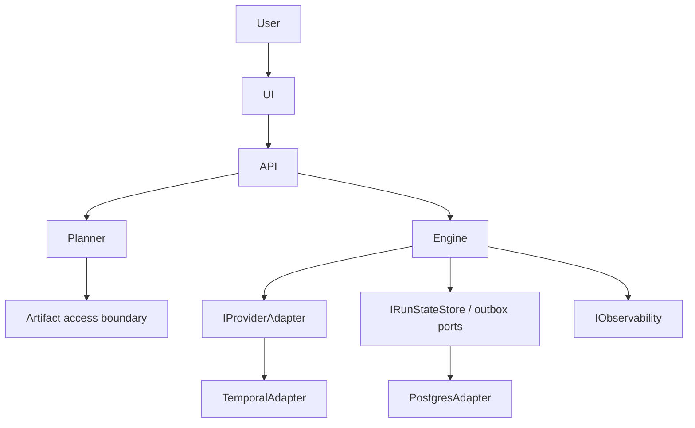

# Reference Architecture

Canonical reference for DVT architectural principles, bounded contexts, and top-level runtime shape.

## Principles

- Hexagonal architecture: domain logic depends on ports, adapters depend on the domain boundary.
- Deterministic execution: workflow orchestration must remain replay-safe and side effects must cross activity/adapter boundaries.
- Event-sourced run lifecycle: `Run` is reconstructed from ordered events and optional snapshots; snapshots are derived, never authoritative over events.
- Multi-tenant isolation: tenant context must be explicit in reads, writes, signals, and status queries.
- Replaceable infrastructure: provider/runtime concerns stay behind stable contracts such as `IProviderAdapter`.
- Boundary enforcement must be mechanical where the repo can enforce it: `@dvt/engine`
  source depends on ports and shared contracts, not on `@dvt/planner` or concrete
  provider adapters.

## Bounded Contexts

| Context       | Responsibility                                          | Current status                                   |
| ------------- | ------------------------------------------------------- | ------------------------------------------------ |
| Planner       | DAG generation, plan assembly, deterministic hashing    | Implemented in code, partial runtime integration |
| Execution     | Run orchestration, lifecycle state, provider delegation | Implemented in code                              |
| State         | Event persistence, outbox, snapshot reads               | Implemented in code                              |
| Artifacts     | Plan bytes and compiled-code storage/access             | Partial                                          |
| Observability | Metrics, traces, operational signals                    | Partial                                          |
| UX/API        | Runtime endpoints and product surface                   | Partial                                          |

## Core Domain Model

Entities:

- `ExecutionPlan`
- `Run`
- `Step`

Value objects:

- `PlanRef`
- `EngineRunRef`
- `RunId`
- `StepId`
- `RunContext`
- `SignalRequest`
- `CanonicalRunStatus`
- `ProviderRunStatusView`
- `RunStatusEnrichment`

Aggregate:

```text
Run
  |- RunMetadata
  |- RunEvent[]          ordered by runSeq
  |- WorkflowSnapshot    optional, derived
```

## Top-Level Runtime Shape



## Canonical Companions

- ADRs: [`docs/adr/`](../adr/index.md)
- Engine architecture: [`docs/architecture/components/engine/`](./components/engine/index.md)
- Delivery status: [`docs/architecture/system-delivery-status.md`](./system-delivery-status.md)
- Code-aligned snapshot atlas: [`docs/architecture/atlas/`](./atlas/index.md)
