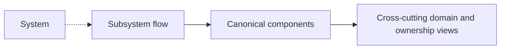

# Subsystem Architecture

Subsystem pages document end-to-end flows across components.

A subsystem is not a package and it is not a second home for a component.
Subsystem docs exist to explain how several canonical components cooperate to
serve a product capability.

## Rules

- `docs/architecture/components/<component>/` is the canonical home for a real
  workspace component.
- subsystem pages explain flow, source of truth, handoffs, and dependency
  direction;
- subsystem pages must link back to the canonical component pages they compose;
- domain pages remain a separate ownership view.

## Current Subsystem Entry Points

- [Read subsystem](read/index.md): operator read flows from browser to backend,
  read models, and engine-backed enrichment.
- [Frontend subsystem compatibility pack](../frontend/index.md): existing
  workbench and UX pack while its flow pages migrate under `subsystems/`.
- [Execution subsystem compatibility pack](../engine/index.md): existing
  WorkflowEngine subsystem pack while its flow pages migrate under
  `subsystems/`.

## Navigation Model

## Related Pages

- [System Architecture](../system/index.md)
- [Architecture Component Surfaces](../components/index.md)
- [DVT Domain Map](../domain-map.md)
