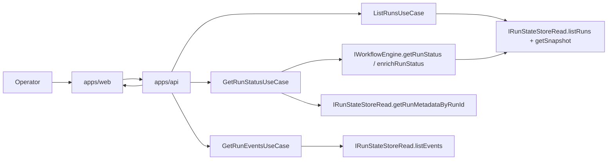

# Read subsystem

The read subsystem covers operator-facing retrieval of run lists, run detail,
run timeline, and the supporting workspace context needed to inspect runtime
state.

It is a cross-component flow. The subsystem does not own its own package.

## Primary Flow

## Source Of Truth Rules

- run-list summaries are read from state-store metadata plus snapshot status;
- run detail starts from run metadata and engine-backed snapshot status;
- timeline events come from event-store reads, not from the summary list path;
- the web shell renders read results, but it does not derive runtime truth by
  itself.

## Canonical Components In This Flow

- [web](../../components/web/index.md)
- [apps/api](../../components/api/index.md)
- [@dvt/engine](../../components/engine/index.md)
- [@dvt/delivery](../../components/delivery/index.md)

## Code Anchors

- web route and workspace wiring:
  [RunsView.tsx](../../../../apps/web/src/app/views/RunsView.tsx),
  [useRunWorkspace.ts](../../../../apps/web/src/app/views/runs/useRunWorkspace.ts),
  [runWorkspaceFacade.ts](../../../../apps/web/src/app/services/runs/runWorkspaceFacade.ts),
  [runsService.ts](../../../../apps/web/src/app/services/runs/runsService.ts)
- API entrypoints:
  [listRunsRoute.ts](../../../../apps/api/src/entrypoints/http/listRunsRoute.ts),
  [getRunRoute.ts](../../../../apps/api/src/entrypoints/http/getRunRoute.ts),
  [getRunEventsRoute.ts](../../../../apps/api/src/entrypoints/http/getRunEventsRoute.ts)
- API read services:
  [listRunsUseCase.ts](../../../../apps/api/src/application/services/listRunsUseCase.ts),
  [getRunStatusUseCase.ts](../../../../apps/api/src/application/services/getRunStatusUseCase.ts)
- engine read surface:
  [WorkflowEngine.ts](../../../../packages/@dvt/engine/src/core/WorkflowEngine.ts)

## Current Posture

The read subsystem is real and production-shaped, but it still mixes two read
patterns:

- snapshot-backed summary and detail reads;
- event-timeline reads for operator diagnostics.

The documentation rule is to explain those two paths as one subsystem while
keeping the source of truth explicit at each step.

## Related Pages

- [System Architecture](../../system/index.md)
- [Subsystem Architecture](../index.md)
- [DVT Component Map](../../component-map.md)
- [UI / Visualization Domain](../../domain-ui.md)
- [API / Entry Domain](../../domain-api.md)
