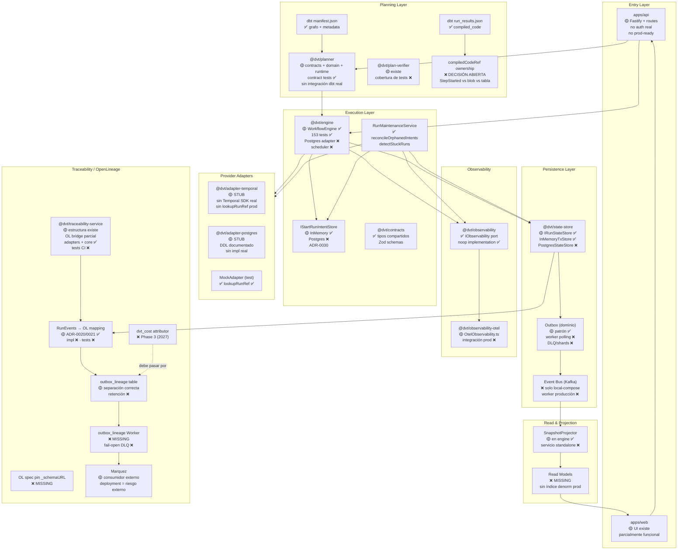

# DVT+ — Estado de Entrega del Sistema

- **Fecha**: 2026-03-04
- **Versión**: 1.0.0
- **Alcance**: Todos los módulos del monorepo (`packages/@dvt/*`, `apps/*`)
- **Tests engine**: 153/153 ✅

---

## Leyenda

| Símbolo | Significado                                                        |
| ------- | ------------------------------------------------------------------ |
| ✅      | Implementado y testeado — listo para producción                    |
| 🟡      | Parcial — puerto/contrato existe, implementación stub o incompleta |
| ❌      | Ausente — no existe implementación ni decisión firme               |

---

## Diagrama del sistema

---

## Estado por módulo

### Entry Layer

| Módulo     | Paquete    | Estado | Notas                                                                         |
| ---------- | ---------- | ------ | ----------------------------------------------------------------------------- |
| API Server | `apps/api` | 🟡     | Fastify + routes + plugins. Sin autenticación real. No production-ready       |
| Web UI     | `apps/web` | 🟡     | Frontend existe con UI parcialmente funcional. Documentación de sprint pesada |

---

### Planning Layer

| Módulo           | Paquete              | Estado | Notas                                                                                                |
| ---------------- | -------------------- | ------ | ---------------------------------------------------------------------------------------------------- |
| dbt manifest     | —                    | ✅     | Input canónico — grafo de nodos y metadata                                                           |
| dbt run_results  | —                    | ✅     | Fuente de `compiled_code` por nodo                                                                   |
| Planner          | `@dvt/planner`       | 🟡     | Contracts + domain + runtime existen. Contract tests con engine ✅. Sin integración real con dbt CLI |
| Plan Verifier    | `@dvt/plan-verifier` | 🟡     | Estructura existe. Cobertura de tests ❌                                                             |
| StepTypeRegistry | —                    | ❌     | No existe. `stepTypeConfig` permanece opaco (`Record<string, unknown>`)                              |
| compiledCodeRef  | —                    | ❌     | **Decisión abierta**: dónde y cuándo se adjunta el SQL compilado al evento/trazabilidad              |

---

### Execution Layer

| Módulo                | Paquete                 | Estado | Notas                                                                                                                       |
| --------------------- | ----------------------- | ------ | --------------------------------------------------------------------------------------------------------------------------- |
| WorkflowEngine        | `@dvt/engine`           | 🟡     | `startRun`, `cancelRun`, `signal`, `getRunStatus`, `enrichRunStatus` ✅ · 153 tests ✅ · Postgres adapter ❌ · Scheduler ❌ |
| IStartRunIntentStore  | `@dvt/engine`           | 🟡     | Puerto ✅ · InMemory ✅ · Postgres ❌ · Scheduler periódico ❌ (ADR-0030)                                                   |
| RunMaintenanceService | `@dvt/engine`           | ✅     | `reconcileOrphanedIntents`, `detectStuckRuns`, `detectStuckCancellingRuns`                                                  |
| Contracts             | `@dvt/contracts`        | ✅     | Tipos compartidos, Zod schemas, interfaces                                                                                  |
| Temporal Adapter      | `@dvt/adapter-temporal` | 🟡     | **Stub puro** — firmas completas, sin Temporal SDK, sin `lookupRunRef` real                                                 |
| Postgres Adapter      | `@dvt/adapter-postgres` | 🟡     | **Stub** — DDL documentado, sin implementación                                                                              |
| MockAdapter           | `@dvt/engine` (test)    | ✅     | Test adapter completo con `lookupRunRef`                                                                                    |

---

### Persistence Layer

| Módulo            | Paquete            | Estado | Notas                                                                       |
| ----------------- | ------------------ | ------ | --------------------------------------------------------------------------- |
| IRunStateStore    | `@dvt/state-store` | 🟡     | Puerto completo ✅ · `InMemoryTxStore` ✅ · `PostgresStateStoreAdapter` ❌  |
| Outbox (dominio)  | `@dvt/engine`      | 🟡     | Patrón `appendAndEnqueueTx` ✅ · Worker de polling ❌ · DLQ/shards ❌       |
| Event Bus (Kafka) | infra              | ❌     | `local-compose.yaml` existe · Worker producción ❌ · Ningún publicador real |

---

### Read & Projection

| Módulo            | Paquete       | Estado | Notas                                                                      |
| ----------------- | ------------- | ------ | -------------------------------------------------------------------------- |
| SnapshotProjector | `@dvt/engine` | 🟡     | Proyector in-process ✅ · Servicio standalone ❌                           |
| Read Models       | —             | ❌     | Sin índice denormalizado en producción. `listRuns` funciona solo in-memory |

---

### Observability

| Módulo              | Paquete                   | Estado | Notas                                                              |
| ------------------- | ------------------------- | ------ | ------------------------------------------------------------------ |
| IObservability port | `@dvt/observability`      | ✅     | Counters, histograms, traces, logs — puerto + noop                 |
| OTel implementation | `@dvt/observability-otel` | 🟡     | `OtelObservability.ts` existe · Integración producción no validada |

---

### Traceability / OpenLineage

| Módulo                   | Paquete                     | Estado | Notas                                                                    |
| ------------------------ | --------------------------- | ------ | ------------------------------------------------------------------------ |
| Traceability Service     | `@dvt/traceability-service` | 🟡     | `adapters/`, `core/`, `service.ts` existen · Tests de CI ❌              |
| RunEvents → OL mapping   | —                           | 🟡     | ADR-0020/ADR-0021 con mapping completo ✅ · Implementación TypeScript ❌ |
| OL spec pin `_schemaURL` | —                           | ❌     | Sin versión OL fijada en código — riesgo de drift silencioso             |
| `outbox_lineage` table   | —                           | 🟡     | Separación correcta vs outbox dominio ✅ · Retención ❌                  |
| `outbox_lineage` Worker  | —                           | ❌     | No existe. fail-open DLQ policy sin definir                              |
| `dvt_cost attributor`    | —                           | ❌     | Phase 3 (Q1 2027) · **invariante**: MUST usar `outbox_lineage`           |
| Marquez                  | externo                     | 🟡     | Consumidor externo de OpenLineage · Deployment = riesgo externo          |

---

## Gaps críticos por fase

| #   | Gap                                                               | Módulo afectado                    | Fase      |
| --- | ----------------------------------------------------------------- | ---------------------------------- | --------- |
| G1  | **Temporal Adapter real** (SDK, namespace, tasks, `lookupRunRef`) | `adapter-temporal`                 | Phase 1   |
| G2  | **PostgresStateStoreAdapter** completo                            | `state-store` / `adapter-postgres` | Phase 1   |
| G3  | **IStartRunIntentStore Postgres** + scheduler de reconciliación   | `engine`                           | Phase 1   |
| G4  | **compiledCodeRef ownership** — decisión de arquitectura          | planner / traceability             | Phase 1   |
| G5  | **Outbox Worker** (polling, DLQ, shards)                          | infra + engine                     | Phase 1.5 |
| G6  | **OL translation tests CI** + `_schemaURL` spec pin               | traceability-service               | Phase 1.5 |
| G7  | **Read Models** + proyector standalone                            | state-store / infra                | Phase 1.5 |
| G8  | **Auth real** en `apps/api`                                       | api                                | Phase 1.5 |
| G9  | **StepTypeRegistry** + tipado `stepTypeConfig`                    | planner / engine                   | Phase 2   |
| G10 | **outbox_lineage Worker** + fail-open DLQ                         | traceability-service               | Phase 2   |

---

## Referencias

- [ADR Index](../adr/ADR-Index.md)
- [ADR-0030 — Pre-Dispatch Intent Log](../adr/ADR-0030-pre-dispatch-intent-log.md)
- [ADR-0020/ADR-0021 — OpenLineage](../adr/)
- [engine-phases.md (roadmap)](engine/roadmap/engine-phases.md)
- [metrics-catalog.md](engine/metrics-catalog.md)
- [DVT Blueprint v0.6](vision/DVT_Docs_Pack_v0.6/docs/DVT_Blueprint_v0.6_MASTER.md)
