# DVT+ - System Delivery Status

<!-- markdownlint-disable MD060 -->

- **Fecha**: 2026-03-08 (revisado 2026-03-08 - G1 closed after runtime hardening)
- **Versión**: 1.2.0
- **Alcance**: Todos los módulos del monorepo (`packages/@dvt/*`, `apps/*`)
- **Tests engine**: 151/151 ✅ (153 → 151 tras limpieza de fixtures huérfanos)

---

## Traceability Anchors

This document is the cross-system status board, not the canonical behavioral spec.

Use it together with:

- [Glossary](../concepts/glossary.md) for shared meanings of terms like `run`,
  `plan`, `adapter`, `status`, and `roadmap`
- [Domain Language](../concepts/domain-language.md) for the naming discipline
  used across planning, code, and architecture
- [Canonical Doc Code Matrix](../planning/status/canonical-doc-code-matrix.md) for the curated topic -> doc -> code -> test -> command mapping
- [Gap Execution Plans](../planning/gaps/GAP_EXECUTION_PLANS.md) for the active execution-gap breakdown

Minimum tuple for this document:

- `canonical_spec`: topic-specific. See the matrix and linked specs.
- `status_doc`: [`docs/architecture/system-delivery-status.md`](system-delivery-status.md)
- `code_paths`: summarized by module here; curated paths live in [Canonical Doc Code Matrix](../planning/status/canonical-doc-code-matrix.md)
- `test_paths`: summarized by module here; exact tests live in [Canonical Doc Code Matrix](../planning/status/canonical-doc-code-matrix.md) and linked evidence docs
- `verification_cmd`: `pnpm test:engine`, `pnpm test:adapter-postgres`, `pnpm test:adapter-temporal`, `pnpm test:adapter-temporal:integration`, `pnpm validate:contracts`
- `evidence_or_risk`: use linked evidence docs for closed gaps and risk-register entries for open hardening debt

---

## Leyenda

| Símbolo | Significado                                                           |
| -------- | --------------------------------------------------------------------- |
| ✅      | Implementado y testeado — listo para producción                    |
| 🟡     | Parcial — puerto/contrato existe, implementación stub o incompleta |
| ❌       | Ausente — no existe implementación ni decisión firme              |

---

## Diagrama del sistema

```mermaid
flowchart TB

%% ─── ENTRY LAYER ──────────────────────────────────────────────────────────────
subgraph ENTRY["Entry Layer"]
  direction LR
  API["apps/api\n🟡 Fastify + routes\nno auth real\nno prod-ready"]
  WEB["apps/web\n🟡 UI existe\nparcialmente funcional"]
end

%% ─── PLANNING LAYER ───────────────────────────────────────────────────────────
subgraph PLANNING["Planning Layer"]
  direction TB
  MANIFEST["dbt manifest.json\n✅ grafo + metadata"]
  RUNRESULTS["dbt run_results.json\n✅ compiled_code"]
  PLANNER["@dvt/planner\n🟡 contracts + domain + runtime\ncontract tests ✅\nsin integración dbt real"]
  PLANVERIF["@dvt/plan-verifier\n🟡 existe\ncobertura de tests ❌"]
  COMPILED_DEC["compiledCodeRef ownership\n✅ ADR-0032 accepted\nimplemented end-to-end"]
end

%% ─── EXECUTION LAYER ──────────────────────────────────────────────────────────
subgraph EXEC["Execution Layer"]
  direction TB
  ENGINE["@dvt/engine\n🟡 WorkflowEngine ✅\n153 tests ✅\nPostgres adapter 🟡\nscheduler ❌"]
  INTENT["IStartRunIntentStore\n✅ InMemory + Postgres\nreconciler runtime ✅\nADR-0030"]
  MAINT["RunMaintenanceService\n✅ reconcileOrphanedIntents\ndetectStuckRuns"]
  CONTRACTS["@dvt/contracts\n✅ tipos compartidos\nZod schemas"]
end

subgraph ADAPTERS["Provider Adapters"]
  direction LR
  TEMPORAL["@dvt/adapter-temporal\n? SDK real + lookupRunRef ?\nintegration suite ?\noperational hardening ?"]
  POSTGRES_A["@dvt/adapter-postgres\n✅ IMPL 100%\nbootstrapRunTx ✅ outbox ✅\nDLQ ✅ listEvents(opts) ✅\nlistRuns status-filter ✅"]
  MOCK["MockAdapter (test)\n✅ lookupRunRef ✅"]
end

%% ─── PERSISTENCE LAYER ────────────────────────────────────────────────────────
subgraph PERSIST["Persistence Layer"]
  direction TB
  STATESTORE["@dvt/state-store\n✅ IRunStateStore ✅\nInMemoryTxStore ✅\nPostgresStateStore ✅ 100%"]
  OUTBOX["Outbox (dominio)\n🟡 patrón ✅\nlistPending + DLQ ✅\nworker polling ❌\nshards ❌"]
  KAFKA["Event Bus (Kafka)\n❌ solo local-compose\nworker producción ❌"]
end

%% ─── READ / PROJECTION ────────────────────────────────────────────────────────
subgraph READ["Read & Projection"]
  direction TB
  PROJECTOR["SnapshotProjector\n🟡 en engine ✅\nservicio standalone ❌"]
  READMODELS["Read Models\n❌ MISSING\nsin índice denorm prod"]
end

%% ─── OBSERVABILITY ────────────────────────────────────────────────────────────
subgraph OBS["Observability"]
  direction LR
  OBS_PORT["@dvt/observability\n✅ IObservability port\nnoop implementation ✅"]
  OBS_OTEL["@dvt/observability-otel\n🟡 OtelObservability.ts\nintegración prod ❌"]
end

%% ─── TRACEABILITY / OPENLINEAGE ───────────────────────────────────────────────
subgraph TRACE["Traceability / OpenLineage"]
  direction TB
  TRACSVC["@dvt/traceability-service\n🟡 service + lineage mapper\ncompiledCodeRef path ✅\nschema pin/delivery pending"]
  OL_MAP["RunEvents → OL mapping\n🟡 TypeScript impl ✅\npackage tests ✅\nCI/schema pin ❌"]
  OLSPEC["OL spec pin _schemaURL\n❌ MISSING"]
  OUTBOXL["outbox_lineage table\n❌ MISSING\nsolo intención de diseño"]
  OUTBOXLW["outbox_lineage Worker\n❌ MISSING\nfail-open DLQ ❌"]
  COST["dvt_cost attributor\n❌ Phase 3 (2027)"]
  MARQUEZ["Marquez\n🟡 consumidor externo\ndeployment = riesgo externo"]
end

%% ─── FLUJOS PRINCIPALES ──────────────────────────────────────────────────────
MANIFEST --> PLANNER
RUNRESULTS --> COMPILED_DEC
PLANNER --> ENGINE

API --> ENGINE
API --> PLANNER
WEB --> API

ENGINE --> ADAPTERS
ENGINE --> INTENT
ENGINE --> STATESTORE
MAINT --> INTENT
MAINT --> ADAPTERS
MAINT --> STATESTORE

STATESTORE --> OUTBOX
OUTBOX --> KAFKA
KAFKA --> PROJECTOR
PROJECTOR --> READMODELS
READMODELS --> WEB

ENGINE --> OBS_PORT
MAINT --> OBS_PORT
OBS_PORT --> OBS_OTEL

STATESTORE --> OL_MAP
OL_MAP --> OUTBOXL
OUTBOXL --> OUTBOXLW
OUTBOXLW --> MARQUEZ
COST -. "debe pasar por" .-> OUTBOXL
TRACSVC --> OL_MAP
```

---

## Estado por módulo

### Entry Layer

| Módulo    | Paquete    | Estado | Notas                                                                          |
| ---------- | ---------- | ------ | ------------------------------------------------------------------------------ |
| API Server | `apps/api` | 🟡   | Fastify + routes + plugins. Sin autenticación real. No production-ready       |
| Web UI     | `apps/web` | 🟡   | Frontend existe con UI parcialmente funcional. Documentación de sprint pesada |

---

### Planning Layer

| Módulo          | Paquete              | Estado | Notas                                                                                                  |
| ---------------- | -------------------- | ------ | ------------------------------------------------------------------------------------------------------ |
| dbt manifest     | —                  | ✅    | Input canónico — grafo de nodos y metadata                                                          |
| dbt run_results  | —                  | ✅    | Fuente de `compiled_code` por nodo                                                                     |
| Planner          | `@dvt/planner`       | 🟡   | Contracts + domain + runtime existen. Contract tests con engine ✅. Sin integración real con dbt CLI |
| Plan Verifier    | `@dvt/plan-verifier` | 🟡   | Estructura existe. Cobertura de tests ❌                                                               |
| StepTypeRegistry | —                  | ❌     | No existe. `stepTypeConfig` permanece opaco (`Record<string, unknown>`)                                |
| compiledCodeRef  | —                  | ✅    | ADR-0032 aceptado e implementado extremo a extremo; queda deuda separada por el transporte opaco       |

---

### Execution Layer

| Módulo               | Paquete                 | Estado | Notas                                                                                                                                                                                                                                   |
| --------------------- | ----------------------- | ------ | --------------------------------------------------------------------------------------------------------------------------------------------------------------------------------------------------------------------------------------- |
| WorkflowEngine        | `@dvt/engine`           | 🟡   | `startRun`, `cancelRun`, `signal`, `getRunStatus`, `enrichRunStatus` ✅ · 153 tests ✅ · usa Postgres adapter vía contrato · Scheduler ❌                                                                                         |
| IStartRunIntentStore  | `@dvt/engine`           | ✅    | Puerto ✅ · InMemory ✅ · Postgres ✅ · reconciler/runtime periódico ✅ (ADR-0030)                                                                                                                                              |
| RunMaintenanceService | `@dvt/engine`           | ✅    | `reconcileOrphanedIntents`, `detectStuckRuns`, `detectStuckCancellingRuns` · 151 tests ✅                                                                                                                                             |
| Contracts             | `@dvt/contracts`        | ✅    | Tipos compartidos, Zod schemas, interfaces                                                                                                                                                                                              |
| Temporal Adapter      | `@dvt/adapter-temporal` | ?      | Temporal SDK real + `lookupRunRef` ? + suite time-skipping ? ? connect timeout and runtime observability hardening landed                                                                                                               |
| Postgres Adapter      | `@dvt/adapter-postgres` | ✅    | **100% implementado** — `bootstrapRunTx`, `appendAndEnqueueTx`, `getSnapshot`, `listEvents(options)` con cursor/paginación ✅, `listRuns` con filtro `status` ✅, outbox completo, DLQ + `replayDeadLetters`, tenant isolation RLS |
| MockAdapter           | `@dvt/engine` (test)    | ✅    | Test adapter completo con `lookupRunRef`                                                                                                                                                                                                |

---

### Persistence Layer

| Módulo           | Paquete                 | Estado | Notas                                                                                                                                                          |
| ----------------- | ----------------------- | ------ | -------------------------------------------------------------------------------------------------------------------------------------------------------------- |
| IRunStateStore    | `@dvt/state-store`      | ✅    | Puerto completo ✅ · `InMemoryTxStore` ✅ · `PostgresStateStoreAdapter` ✅ 100% (G2 cerrado)                                                              |
| Outbox (dominio)  | `@dvt/adapter-postgres` | 🟡   | `appendAndEnqueueTx` ✅ · `listPending`/`markDelivered`/`markFailed` ✅ · DLQ + `replayDeadLetters` ✅ · Worker de polling independiente ❌ · shards ❌ |
| Event Bus (Kafka) | infra                   | ❌     | `local-compose.yaml` existe · Worker producción ❌ · Ningún publicador real                                                                                |

---

### Read & Projection

| Módulo           | Paquete       | Estado | Notas                                                                                                |
| ----------------- | ------------- | ------ | ---------------------------------------------------------------------------------------------------- |
| SnapshotProjector | `@dvt/engine` | 🟡   | Proyector in-process ✅ · Servicio standalone ❌                                                   |
| Read Models       | —           | ❌     | Sin servicio standalone ni índices denormalizados de producción; el proyector actual es in-process |

---

### Observability

| Módulo             | Paquete                   | Estado | Notas                                                                 |
| ------------------- | ------------------------- | ------ | --------------------------------------------------------------------- |
| IObservability port | `@dvt/observability`      | ✅    | Counters, histograms, traces, logs — puerto + noop                  |
| OTel implementation | `@dvt/observability-otel` | 🟡   | `OtelObservability.ts` existe · Integración producción no validada |

---

### Traceability / OpenLineage

| Módulo                  | Paquete                     | Estado | Notas                                                                                                   |
| ------------------------ | --------------------------- | ------ | ------------------------------------------------------------------------------------------------------- |
| Traceability Service     | `@dvt/traceability-service` | 🟡   | `service.ts` + lineage resolver/mapper existen · package tests ✅ · `_schemaURL`/delivery runtime ❌ |
| RunEvents → OL mapping | —                         | 🟡   | Mapping TypeScript ✅ + tests de paquete ✅ · CI/pin de spec ❌                                      |
| OL spec pin `_schemaURL` | —                         | ❌     | Sin versión OL fijada en código — riesgo de drift silencioso                                        |
| `outbox_lineage` table   | —                         | ❌     | No existe implementación en repo; solo intención de diseño                                           |
| `outbox_lineage` Worker  | —                         | ❌     | No existe. fail-open DLQ policy sin definir                                                             |
| `dvt_cost attributor`    | —                         | ❌     | Phase 3 (Q1 2027) · **invariante**: MUST usar `outbox_lineage`                                         |
| Marquez                  | externo                     | 🟡   | Consumidor externo de OpenLineage · Deployment = riesgo externo                                        |

---

## Gaps críticos por fase

| #   | Gap                                                               | Módulo afectado                   | Estado                                                                                                                               | Fase      |
| --- | ----------------------------------------------------------------- | ---------------------------------- | ------------------------------------------------------------------------------------------------------------------------------------ | --------- |
| G1  | **Temporal Adapter real** (SDK, namespace, tasks, `lookupRunRef`) | `adapter-temporal`                 | ? Closed ? runtime hardening implemented and verified by unit + time-skipping integration; residual load evidence tracked separately | Phase 1   |
| G2  | **PostgresStateStoreAdapter** completo                            | `state-store` / `adapter-postgres` | ✅ Cerrado — `listEvents(options)` con `afterSeq`/`limit` ✅ · `listRuns` con filtro `status` ✅                               | Phase 1   |
| G3  | **IStartRunIntentStore Postgres** + scheduler de reconciliación  | `engine`                           | ✅ Cerrado — store Postgres + reconciler worker + wiring runtime                                                                  | Phase 1   |
| G4  | **compiledCodeRef ownership** — decisión de arquitectura       | planner / traceability             | ✅ Cerrado — ADR-0032 implementado extremo a extremo                                                                              | Phase 1   |
| G5  | **Outbox Worker** (polling independiente, shards)                 | infra + engine                     | 🟡 Parcial — worker core y storage APIs existen; falta runtime standalone y shards                                               | Phase 1.5 |
| G6  | **OL translation tests CI** + `_schemaURL` spec pin               | traceability-service               | 🟡 Parcial — mapper/resolver/tests existen; falta pin de spec y hardening de CI                                                  | Phase 1.5 |
| G7  | **Read Models** + proyector standalone                            | state-store / infra                | 🟡 Parcial — `SnapshotProjector` in-process existe; faltan servicio/read models                                                  | Phase 1.5 |
| G8  | **Auth real** en `apps/api`                                       | api                                | ❌ Pendiente                                                                                                                         | Phase 1.5 |
| G9  | **StepTypeRegistry** + tipado `stepTypeConfig`                    | planner / engine                   | ❌ Pendiente                                                                                                                         | Phase 2   |
| G10 | **outbox_lineage Worker** + fail-open DLQ                         | traceability-service               | ❌ Pendiente                                                                                                                         | Phase 2   |

---

## Referencias

- [ADR Index](../adr/ADR-Index.md)
- [ADR-0030 — Pre-Dispatch Intent Log](../adr/ADR-0030-pre-dispatch-intent-log.md)
- [ADR-0020/ADR-0021 — OpenLineage](../adr/)
- [engine-phases.md (roadmap)](engine/roadmap/engine-phases.md)
- [metrics-catalog.md](engine/metrics-catalog.md)
- [Historical DVT Blueprint v0.6](vision/DVT_Docs_Pack_v0.6/docs/DVT_Blueprint_v0.6_MASTER.md)
