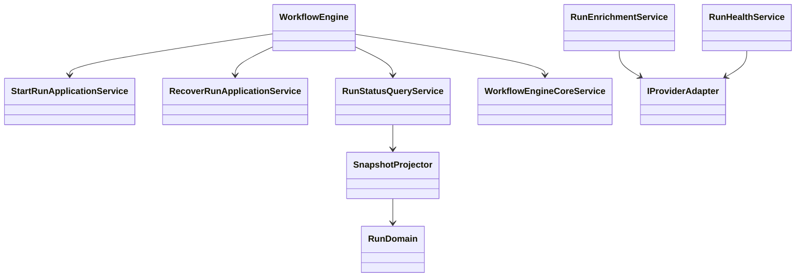
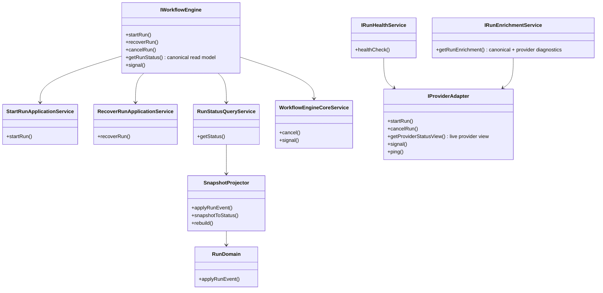
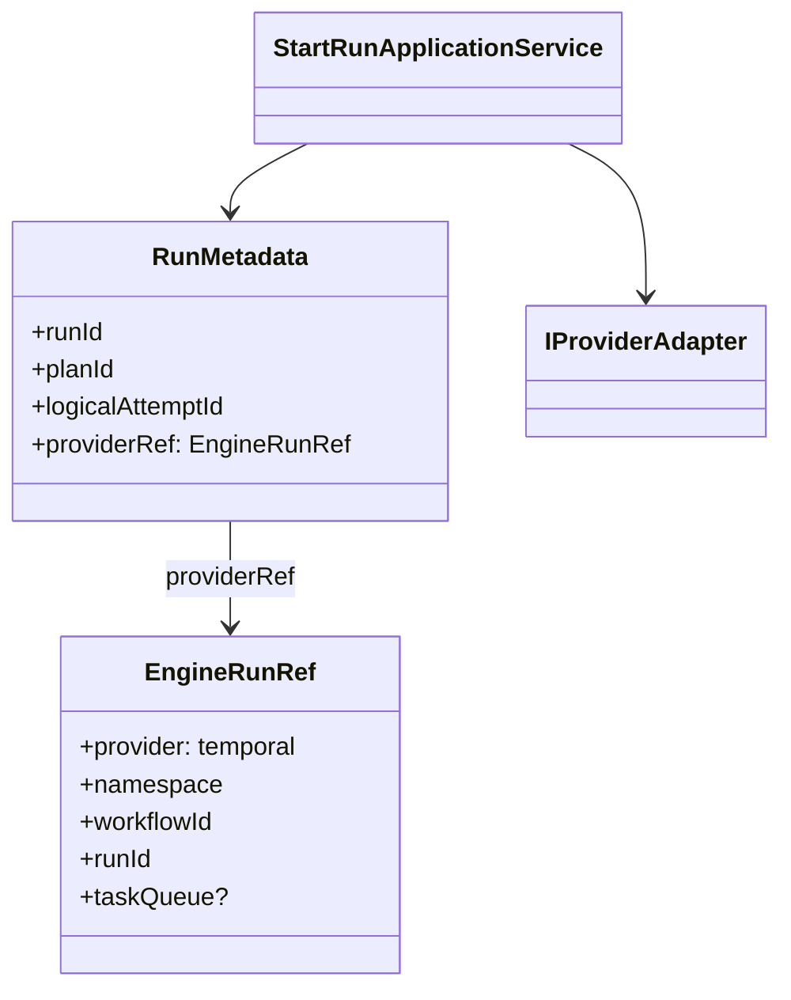
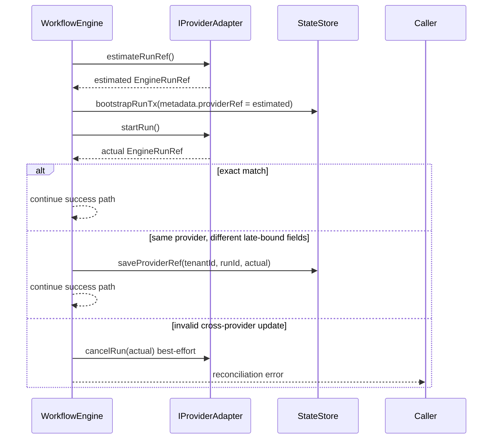

# Current Status

This page is the current implementation snapshot for the repository.

It is not the canonical behavioral spec for any one subsystem. Use it to answer
one practical question first: what is true in the codebase now, and where is
delivery work still open?

## Traceability Anchors

Use this page together with:

- [Glossary](../concepts/glossary.md) for shared meanings of `run`, `plan`,
  `adapter`, `status`, `gap`, and `canonical spec`
- [Domain Language](../concepts/domain-language.md) for the naming discipline
  shared across planning, architecture, contracts, and code
- [Canonical Doc Code Matrix](../planning/status/canonical-doc-code-matrix.md)
  for the curated topic -> doc -> code -> test -> command mapping
- [Planner Current State Assessment](../planning/status/planner-current-state-assessment.md)
  for the planner-specific current-state baseline and component map
- [GitHub MVP Issue Workflow](../planning/state/github-mvp-issue-workflow.md)
  for the sole MVP task lifecycle and the Planning DB architecture boundary
- [Strategic Product Roadmap](../planning/roadmap/strategic-product-roadmap.md)
  for the stable long-range product direction and current capability ladder
- [Roadmap Of Record](../planning/roadmap/index.md) for current planning
  sequencing
- [Generated Code State](../planning/status/generated-code-state.md) for the
  current workspace and test inventory

Minimum tuple for this document:

- `canonical_spec`: topic-specific. Follow the matrix and the linked specs.
- `status_doc`: [`docs/architecture/system-delivery-status.md`](./system-delivery-status.md)
- `code_paths`: summarized by area here; exact curated paths live in
  [Canonical Doc Code Matrix](../planning/status/canonical-doc-code-matrix.md)
- `test_paths`: summarized by area here; exact paths live in
  [Canonical Doc Code Matrix](../planning/status/canonical-doc-code-matrix.md)
- `verification_cmd`: `pnpm --filter dvt-api test`,
  `pnpm --filter dvt-api test:integration`, `pnpm --filter @dvt/web typecheck`,
  `pnpm --filter @dvt/web test`, `pnpm test:engine`,
  `pnpm test:adapter-postgres`, `pnpm test:adapter-temporal`,
  `pnpm test:adapter-temporal:integration`, `pnpm validate:contracts`
- `evidence_or_risk`: use linked evidence docs for closed work and linked risk
  records for residual hardening debt

Scope-specific adapter-temporal verification commands:

- `pnpm test:adapter-temporal:integration:transformation` for transformation
  runtime semantics
- `pnpm test:adapter-temporal:integration:postgres` for the relational
  Postgres capability path
- `pnpm test:adapter-temporal:integration:postgres:docker` for the canonical
  local Docker PostgreSQL proof wrapper

## Snapshot

- Review date: 2026-08-02
- Reviewed release: `0.5.3`
- Reviewed `main` commit: `efed6b9b8a4bc283de6d90472a1b4ee8d2cdafc0`
- Workspace inventory source:
  [Generated Code State](../planning/status/generated-code-state.md)
- Active workspaces: 25
- Source files: 1664
- Test files: 1085
- Workspaces with build scripts: 25 of 25
- Workspaces with test scripts: 24 of 25

## Reviewed MVP Baseline

The executable dbt vertical tracked by
[EPICA-V1](https://github.com/dunay2/dvt/issues/2106) is complete on this
baseline:

```text
supported dbt authoring
  -> atomic authority-specific publication
  -> accepted | selection-rejected | plan-invalid Preview
  -> StartRun(exact stored PlanRef)
  -> authoritative terminal run snapshot and ordered events
```

Product interpretation:

- DVT+ owns a heterogeneous plugin-qualified graph. dbt is the current native
  transformation vertical, not the whole product ontology.
- Canvas is the single primary Process Map. Code, source import, project
  exploration, and node details are contextual surfaces; Log, Problems, Runs,
  and Preview retain the bottom operational drawer.
- API Source Import implements protected connection list/create/test,
  provider-neutral source-object discovery, and source registration. Runtime
  plugin and route posture still gate whether the affordance is available.
- Preview returns one typed outcome. A built plan keeps its exact immutable
  stored `PlanRef`; later project changes require another Preview for new work
  but do not mutate or invalidate the stored artifact already referenced.
- `ObservePlanRunReadiness` is the single Canvas plan/run readiness query.
  Presentation does not derive a second gate.
- Code working-tree autosync and explicit flush both reuse
  `SaveWorkspaceFileContent`; there is no separate Save lifecycle.

The remaining product-facing control gap is
[US-F4.3](https://github.com/dunay2/dvt/issues/2103): expose backend-owned Run
cancellation and retry recovery through existing frontend surfaces.

## Executive Summary

| Area                       | Current posture    | What is true now                                                                                                                                                                                                                                                                                                                                                                                                                                                                                                                                                                                                                                                                                                                                                                                                                                                                                                           | Primary status source                                                                                                                                                                                                                                   |
| -------------------------- | ------------------ | -------------------------------------------------------------------------------------------------------------------------------------------------------------------------------------------------------------------------------------------------------------------------------------------------------------------------------------------------------------------------------------------------------------------------------------------------------------------------------------------------------------------------------------------------------------------------------------------------------------------------------------------------------------------------------------------------------------------------------------------------------------------------------------------------------------------------------------------------------------------------------------------------------------------------- | ------------------------------------------------------------------------------------------------------------------------------------------------------------------------------------------------------------------------------------------------------- |
| Entry layer                | Partial            | `apps/api` still owns the protected runtime command/query surface (`POST /runs/start`, `GET /runs`, `GET /runs/:runId`, `GET /runs/:runId/events`, `POST /runs/:runId/signal`) with OIDC auth and integration coverage, and `POST /plans/preview` now enforces explicit preview profiles plus request-boundary graph/provenance validation before returning a persisted `PlanRef`; the plan-compile seam now reuses the canonical `startRun` adapter truth instead of maintaining a second local adapter allowlist; `apps/web` now exposes explicit transformation authoring mode, persisted-preview gating before `Start run`, and run-detail rendering of executor identity, sink materialization evidence, timestamps, failed-step diagnostics, and caller-visible plan provenance from the snapshot surface, with package tests and a Cypress E2E lane (`pnpm --filter @dvt/web test:e2e`) for frontend runtime checks | [API and Admission](../planning/domains/api-and-admission.md), [Canonical Doc Code Matrix](../planning/status/canonical-doc-code-matrix.md)                                                                                                             |
| Planning layer             | Partial            | planner, verifier, DSL, and plan-interpreter packages exist; the stable strategic roadmap now lives under `docs/planning/roadmap/`; the transformation-flow proposal set now governs the shipped SQL-first design-graph, preview-persist boundary, and deterministic compiler mapping; `TF-A1-C` is now closed as the structural hardening follow-up that single-sourced step-kind authority and split the direct API or UI consumer seams without changing the frozen SQL-first semantics; stale standalone domain-cohesion draft packs were archived out of active planning surfaces; and the first caller-visible provenance chain is now delivered from Git-tracked authoring inputs through persisted plan identity to run outcome, while broader shared-kernel and plan-record hardening remain open                                                                                                                 | [Planner Current State Assessment](../planning/status/planner-current-state-assessment.md), [Strategic Product Roadmap](../planning/roadmap/strategic-product-roadmap.md), [Canonical Doc Code Matrix](../planning/status/canonical-doc-code-matrix.md) |
| Execution layer            | Partial            | engine, Postgres adapter, and Temporal adapter are implemented; `TF-C2` is accepted; native Temporal cancellation is converged; shared DBT artifact readers now live in `@dvt/artifacts`; and the repo now ships a standalone `apps/temporal-worker` with health/readiness/metrics plus an explicit DBT worker plugin profile. DBT stays out of engine-kernel semantics and out of the Temporal core activity registry; remaining DBT coupling is limited to package-level plugin/CLI surfaces and remains tracked as explicit risk. The compile/admission boundary and shared runtime-provider vocabulary now share one implemented-adapter truth: Temporal is the only active provider runtime. Second-runtime work requires a new ADR-backed contract line, adapter package, conformance suite, and production composition path before it can re-enter active docs or provider typing.                                  | [Execution Runtime](../planning/domains/execution-runtime.md), [GitHub Issues](https://github.com/dunay2/dvt/issues)                                                                                                                                    |
| Persistence layer          | Partial            | Postgres state store and outbox persistence primitives are implemented; standalone outbox runtime now exists; persisted preview uses immutable plan records via the plan store; and downstream contract hardening and default-retention enforcement remain open after the proof-environment lifecycle rules were codified for the first PostgreSQL transformation vertical                                                                                                                                                                                                                                                                                                                                                                                                                                                                                                                                                 | [Event Lifecycle and Retention](../planning/domains/event-lifecycle-and-retention.md), [Execution Runtime](../planning/domains/execution-runtime.md)                                                                                                    |
| Observability              | Partial            | observability contracts and the OTel binding exist; production validation remains incomplete                                                                                                                                                                                                                                                                                                                                                                                                                                                                                                                                                                                                                                                                                                                                                                                                                               | [Canonical Doc Code Matrix](../planning/status/canonical-doc-code-matrix.md)                                                                                                                                                                            |
| Traceability / OpenLineage | Closed for Phase 1 | mapper, package tests, `_schemaURL` pinning, repo-local facet artifacts, committed golden fixtures, and offline AJV schema validation all pass; delivery-runtime concerns continue as follow-up hardening work                                                                                                                                                                                                                                                                                                                                                                                                                                                                                                                                                                                                                                                                                                             | [Canonical Doc Code Matrix](../planning/status/canonical-doc-code-matrix.md), [Evidence Index](../evidence/index.md)                                                                                                                                    |

## Area Status

Active planning posture note:
planner-backed runtime ingress cleanup is now routed through a hard-cut,
no-retrocompatibility slice. The superseded compatibility-first proposal
remains historical rationale only and does not define the active execution
direction.

### Entry Layer

| Area       | Packages   | Status             | Notes                                                                                                                                                                                                                                                                                                                                                                                                                                                                                                                                                                       |
| ---------- | ---------- | ------------------ | --------------------------------------------------------------------------------------------------------------------------------------------------------------------------------------------------------------------------------------------------------------------------------------------------------------------------------------------------------------------------------------------------------------------------------------------------------------------------------------------------------------------------------------------------------------------------- |
| API server | `apps/api` | Closed for Phase 1 | Protected runtime routes are live with OIDC auth, tenant policy, backpressure admission, and query/signal endpoints; `POST /plans/preview` validates preview profile plus provenance before returning a persisted `PlanRef`; planner-backed protected runtime ingress is now hard-cut to canonical `graphSource`; `start-run` plus `preview` share one fail-closed source policy; and the API-to-engine `StartRunCommand`/`StartRunResult` boundary is now governed in `@dvt/contracts` instead of app-local shadow types                                                   |
| Web UI     | `apps/web` | Partial            | Canvas is the primary Process Map for heterogeneous DVT+ graphs; Code, Source Import, project exploration, and node detail open contextually while operational evidence remains in the bottom drawer. API Source Import uses protected list/create/test/discover/import rails. Preview publishes typed `accepted`, `selection-rejected`, or `plan-invalid` outcomes, and run admission consumes the exact persisted `PlanRef`. Package tests, typecheck, and protected Cypress verticals cover the current MVP; frontend Run cancel/recovery controls remain open in #2103. |

### Planning And Interpretation

| Area                | Packages                | Status      | Notes                                                                                                                                                                                                                                                                                                    |
| ------------------- | ----------------------- | ----------- | -------------------------------------------------------------------------------------------------------------------------------------------------------------------------------------------------------------------------------------------------------------------------------------------------------- |
| Planning core       | `@dvt/planner`          | Partial     | The planner package is real and exercised. The first SQL-first transformation pack and `TF-A1-C` seam hardening are implemented across contracts, API, and web, while planner output materializes governed per-step `retryPolicy` metadata and broader plan-record/shared-kernel hardening remains open. |
| Plan verification   | `@dvt/plan-verifier`    | Partial     | Package exists with tests; it remains a narrow verification utility, not a broad workflow policy layer.                                                                                                                                                                                                  |
| Plan interpretation | `@dvt/plan-interpreter` | Implemented | Deterministic DAG analysis package exists with test coverage and a canonical package page.                                                                                                                                                                                                               |
| DSL evaluation      | `@dvt/dsl`              | Implemented | Small deterministic DSL package exists with package-level tests and canonical docs.                                                                                                                                                                                                                      |

### Execution And Adapters

- `Workflow engine` — packages: `@dvt/engine` — status: `Closed for Phase 1`
  Core engine, in-process projector, and the pre-bootstrap `estimateRunRef`
  path are delivered; `RunMetadata` now persists a single discriminated
  `providerRef`, provider-ref reconciliation is constrained to a typed
  validated `saveProviderRef(...)` seam, and current hardening work is focused
  on the `WE-HX` boundary split plus recent signal-transition and
  stale-snapshot guard tightening. The cross-domain consistency story for
  `startRun`, snapshot freshness, outbox delivery, and reconciler repair is
  now explicit in the system architecture surfaces instead of being implicit
  across reviews and runbooks.

- `Temporal adapter` — packages: `@dvt/adapter-temporal` — status:
  `Closed for Phase 1`
  Real adapter primitives, worker host, lookup, and time-skipping integration
  coverage exist; step activities now resolve retry/backoff from canonical
  `ExecutionStep.retryPolicy` only and no longer interpret
  `stepTypeConfig.retries` as runtime retry policy; built-in DBT step configs
  no longer admit that field in the typed planner boundary; the runtime ships split
  baseline/transformation/Postgres capability lanes plus a canonical local
  Docker proof wrapper for the Postgres path; and native `cancelRun()` now
  preserves ordered canonical cancel events while converging provider-live
  terminal status on Temporal-native `CANCELLED` instead of settling on
  `COMPLETED` after workflow-local cleanup. The engine-kernel boundary is
  cleaner than before, and the Temporal core activity registry is now
  plugin-free by default. DBT step kinds are composed only by the worker DBT
  plugin profile when enabled; the generic step-plugin profile seam also proves
  SQL-shaped plugins can compose without core dispatch edits. Workflow artifact
  emission is now `compiledCodeRef`-driven and plugin-agnostic instead of
  DBT-kind gated. The adapter package exposes generic
  `TemporalStepPluginRunner` and `TemporalStepPluginProfile` ports only; the
  concrete DBT manifest, step activity registry, and CLI runner now live in
  `@dvt/temporal-dbt-plugin`. The remaining DBT risk is sandbox and
  dependency-isolation maturity, not package-level ownership inside the generic
  Temporal adapter.

- `Postgres adapter` — packages: `@dvt/adapter-postgres` — status:
  `Closed for Phase 1`
  State-store and outbox persistence implementation are present and operating
  as shipped foundations.

- `Mock/test adapter` — packages: `@dvt/engine` test surface — status:
  `Implemented`
  Exists as test-only support surface, not as a product runtime.

### Persistence, Read Models, And Delivery

| Area              | Packages                                                          | Status             | Notes                                                                                                                                                                                                                                                                                                                                                                                   |
| ----------------- | ----------------------------------------------------------------- | ------------------ | --------------------------------------------------------------------------------------------------------------------------------------------------------------------------------------------------------------------------------------------------------------------------------------------------------------------------------------------------------------------------------------- |
| State store       | `@dvt/state-store`, `@dvt/adapter-postgres`                       | Closed for Phase 1 | Canonical persistence boundary exists; see the state-store overview and Postgres adapter docs                                                                                                                                                                                                                                                                                           |
| Outbox runtime    | `@dvt/delivery`, `dvt-outbox-worker`, `@dvt/adapter-postgres`     | Closed for Phase 1 | Delivery runtime ownership now lives in `@dvt/delivery`, with `dvt-outbox-worker` acting as the composition root and local-docker canary evidence delivered; downstream contract hardening and `outbox_lineage` flow remain follow-up work; purge runtime (`DeliveryBufferPurgeRuntime`) was added to `dvt-outbox-worker` on 2026-03-21, gated by `DVT_PURGE_ENABLED` (default `false`) |
| Archive lifecycle | `@dvt/state-store`, `@dvt/adapter-postgres`, `dvt-outbox-worker`  | Partial            | Archive export/verifier, deferred deletion/restore, retention purge, and cold payload redaction are landed; regulated erasure approval/audit remains open                                                                                                                                                                                                                               |
| Read models       | `@dvt/delivery`, `apps/projector-worker`, `@dvt/adapter-postgres` | Closed for Phase 1 | `run_snapshots` migration `004`, `rebuildSnapshot`, `listStaleSnapshotRuns`, `ProjectorWorkerRuntime`, `apps/projector-worker`, and the discriminated `providerRef` metadata baseline are delivered                                                                                                                                                                                     |

### Observability And Traceability

- `@dvt/observability` (`Implemented`):
  port surface exists and is documented.
- `@dvt/observability-otel` (`Partial`):
  binding exists, but production validation is still incomplete.
- `@dvt/traceability-service` (`Closed for Phase 1`):
  mapper/resolver package with tests; `_schemaURL` pinned; repo-local contract
  artifacts committed; golden fixtures for all 3 mapper paths; offline AJV
  schema validation for both emitted facets; 13/13 tests pass (2026-03-12);
  runtime delivery hardening closed under G10 on 2026-03-15.
- `outbox_lineage` flow (`Closed for Phase 1`):
  G10 closed 2026-03-15: `lineage_outbox` + `lineage_dead_letter` migration,
  `ILineageSink` + `ILineageOutboxStore` contracts, `PostgresLineageOutboxStore`,
  `LineageOutboxObserver` (fail-soft bridge), `LineageWorkerRuntime` with
  per-record retry and DLQ, `HttpOpenLineageSink` (Marquez-compatible),
  `apps/lineage-worker` standalone process; validation passed for
  `LineageWorkerRuntime.test.ts` (14/14), `pnpm --filter @dvt/delivery test`
  (14/14), `pnpm --filter @dvt/adapter-postgres test` (13/13 with 23 skipped),
  `pnpm --filter @dvt/traceability-service build`, and
  `pnpm --filter dvt-lineage-worker typecheck`.

## Legacy Slice IDs

The historical `S-*` slice identifiers are not active execution authority.

Do not use `S01`, `S02`, `S03`, `S04`, `S05`, `S06`, `S07`, `S08`, `S09`,
`S10`, or `S11` as current backlog, active debt, roadmap lanes, or next-work
references.

Current task authority lives only in:

- [GitHub Issues](https://github.com/dunay2/dvt/issues) for backlog and task
  lifecycle;
- GitHub pull requests for implementation review and integration.

Planning DB remains architecture authority for components, capabilities,
relationships, command/query rails, feature mechanization, and governance
evidence. It does not own or mirror GitHub issue lifecycle.

The archived Phase 2 slice roadmap remains historical context only:

- [Phase 2 Architectural Debt Roadmap](../planning/archive/proposals/phase2-arch-debt-roadmap-20260315.md)

Interpretation rule:

- `System Delivery Status` describes implementation truth.
- GitHub Issues describe active work.
- Planning DB architecture records describe system structure, not task state.
- Legacy `S-*` identifiers must not be inferred as active work from this page.

## Reading Order

1. [Canonical Doc Code Matrix](../planning/status/canonical-doc-code-matrix.md)
2. [GitHub MVP Issue Workflow](../planning/state/github-mvp-issue-workflow.md)
3. [Generated Code State](../planning/status/generated-code-state.md)
4. Topic-specific specs under [Reference](./index.md)

## Topic Entry Points

- Engine and execution invariants:
  [Engine Architecture](./components/engine/index.md)
- State-store boundary:
  [State Store Overview](./components/engine/contracts/state-store/overview.md)
- Shared package surfaces:
  [Shared Package Architecture](./shared/index.md)
- Contracts:
  [Contracts Index](../contracts/index.md)
- Planning and execution debt: [GitHub Issues](https://github.com/dunay2/dvt/issues)

## System Element Diagrams (from Current Code)

### Workflow Engine Relationships

Reflects the current merged implementation:



Current-versus-target note:

- current code now exposes `WorkflowEngine.getRunStatus()` as the canonical
  read model, while `IRunEnrichmentService.getRunEnrichment()` is the explicit
  enrichment path
- `IRunHealthService.healthCheck()` is now an explicit non-facade operational
  boundary
- `IProviderAdapter.getProviderStatusView()` now returns the provider-live
  diagnostic surface instead of reusing the canonical status DTO
- `AR-A12-C` closeout added regression guards so enrichment and health do not
  silently reappear on `IWorkflowEngine`

### Engine Domain Structure

Reflects the current merged implementation:



### RunMetadata Field Relationships

Reflects the current metadata relationship in code:



### Estimated ProviderRef Protocol

Reflects the current estimated-provider-ref protocol in code:



---
