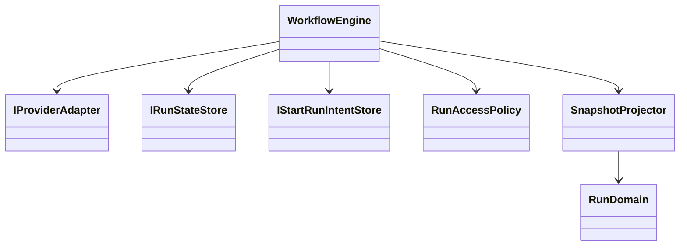
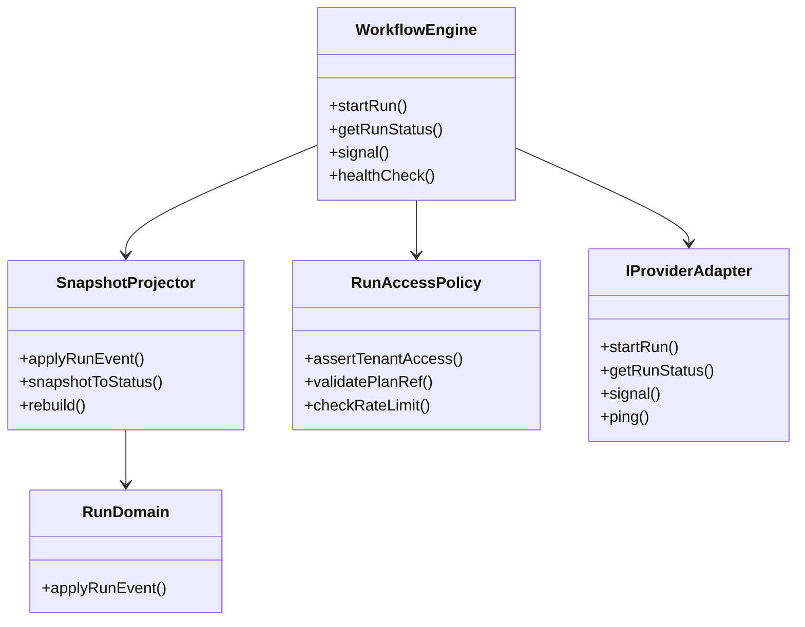
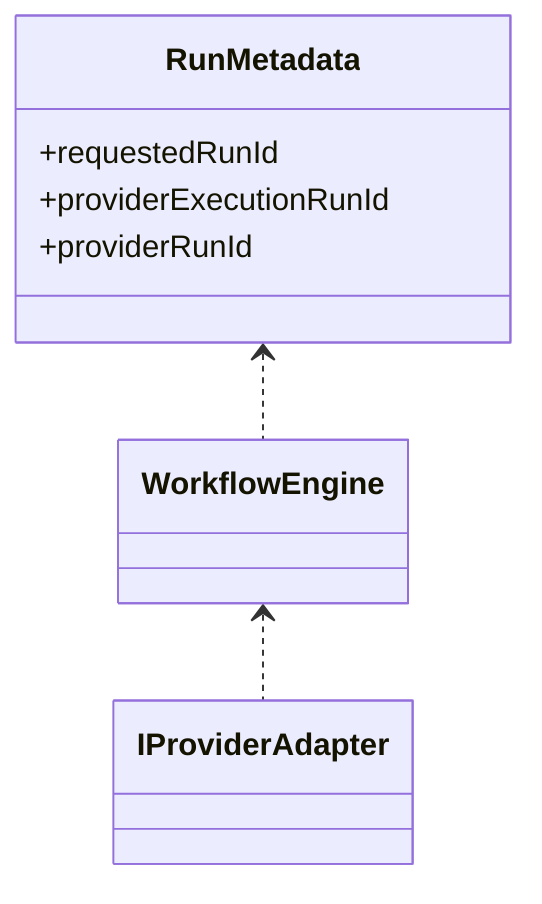
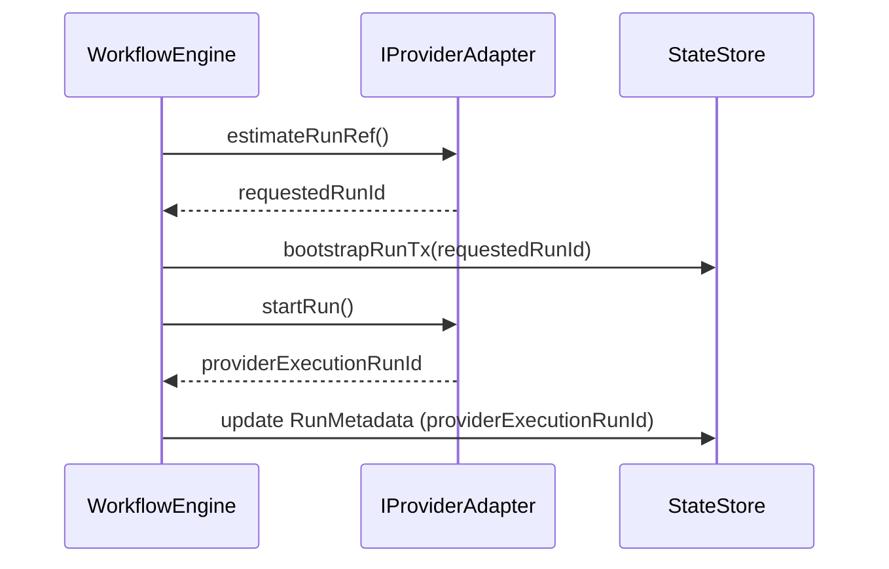

---
title: Current Status
status: Active
owner: Architecture / Delivery / Docs
last_reviewed: 2026-03-21
---

# Current Status

This page is the current implementation snapshot for the repository.

It is not the canonical behavioral spec for any one subsystem. Use it to answer
one practical question first: what is true in the codebase now, and where are
the remaining delivery gaps?

## Traceability Anchors

Use this page together with:

- [Glossary](../concepts/glossary.md) for shared meanings of `run`, `plan`,
  `adapter`, `status`, `gap`, and `canonical spec`
- [Domain Language](../concepts/domain-language.md) for the naming discipline
  shared across planning, architecture, contracts, and code
- [Canonical Doc Code Matrix](../planning/status/canonical-doc-code-matrix.md)
  for the curated topic -> doc -> code -> test -> command mapping
- [Planner Current State Assessment](../planning/status/planner-current-state-assessment-20260320.md)
  for the quantified planner-specific baseline and component scorecard
- [Gap Execution Plans](../planning/gaps/GAP_EXECUTION_PLANS.md) for the
  active gap-by-gap delivery posture
- [Generated Code State](../planning/status/generated-code-state.md) for the
  current workspace and test inventory

Minimum tuple for this document:

- `canonical_spec`: topic-specific. Follow the matrix and the linked specs.
- `status_doc`: [`docs/architecture/system-delivery-status.md`](system-delivery-status.md)
- `code_paths`: summarized by area here; exact curated paths live in
  [Canonical Doc Code Matrix](../planning/status/canonical-doc-code-matrix.md)
- `test_paths`: summarized by area here; exact paths live in
  [Canonical Doc Code Matrix](../planning/status/canonical-doc-code-matrix.md)
- `verification_cmd`: `pnpm --filter dvt-api test`,
  `pnpm --filter dvt-api test:integration`, `pnpm test:engine`,
  `pnpm test:adapter-postgres`, `pnpm test:adapter-temporal`,
  `pnpm test:adapter-temporal:integration`, `pnpm validate:contracts`
- `evidence_or_risk`: use linked evidence docs for closed work and linked risk
  records for residual hardening debt

## Snapshot

- Review date: 2026-03-21
- Workspace inventory source:
  [Generated Code State](../planning/status/generated-code-state.md)
- Active workspaces: 23
- Source files: 359
- Test files: 138
- Workspaces with test scripts: 20 of 23

## Executive Summary

| Area                       | Current posture    | What is true now                                                                                                                                                                                                                                                                                                                                                                                                                                                                                                              | Primary status source                                                                                                                                                             |
| -------------------------- | ------------------ | ----------------------------------------------------------------------------------------------------------------------------------------------------------------------------------------------------------------------------------------------------------------------------------------------------------------------------------------------------------------------------------------------------------------------------------------------------------------------------------------------------------------------------- | --------------------------------------------------------------------------------------------------------------------------------------------------------------------------------- |
| Entry layer                | Partial            | `apps/api` ships the protected runtime command/query surface (`POST /runs/start`, `GET /runs`, `GET /runs/:runId`, `GET /runs/:runId/events`, `POST /runs/:runId/signal`) with OIDC auth, tenant policy, package-level route coverage, a dedicated `pnpm --filter dvt-api test:integration` lane executed against local Docker PostgreSQL on 2026-03-20, and start-run backpressure acquisition now wrapped by low-TTL cache, circuit-breaker, and persisted last-known-good fallback logic; web still has no automated tests | [Gap Execution Plans](../planning/gaps/GAP_EXECUTION_PLANS.md), [Canonical Doc Code Matrix](../planning/status/canonical-doc-code-matrix.md)                                      |
| Planning layer             | Partial            | planner, verifier, DSL, and plan-interpreter packages exist; quantified planner baseline is linked (`71%` overall) and the typed graph-source boundary is now real, but lifecycle, productization, and broader product hardening remain open                                                                                                                                                                                                                                                                                  | [Planner Current State Assessment](../planning/status/planner-current-state-assessment-20260320.md), [Canonical Doc Code Matrix](../planning/status/canonical-doc-code-matrix.md) |
| Execution layer            | Partial            | engine, Postgres adapter, and Temporal adapter are implemented; delivery runtime ownership is now extracted into `@dvt/delivery`, while scheduler and further hardening remain gap-driven                                                                                                                                                                                                                                                                                                                                     | [Gap Execution Plans](../planning/gaps/GAP_EXECUTION_PLANS.md)                                                                                                                    |
| Persistence layer          | Partial            | Postgres state store and outbox persistence primitives are implemented; standalone outbox runtime now exists, but downstream contract hardening, canary rollout, and shard model remain open                                                                                                                                                                                                                                                                                                                                  | [Gap Execution Plans](../planning/gaps/GAP_EXECUTION_PLANS.md)                                                                                                                    |
| Observability              | Partial            | observability contracts and the OTel binding exist; production validation remains incomplete                                                                                                                                                                                                                                                                                                                                                                                                                                  | [Canonical Doc Code Matrix](../planning/status/canonical-doc-code-matrix.md)                                                                                                      |
| Traceability / OpenLineage | Closed for Phase 1 | mapper, package tests, `_schemaURL` pinning, repo-local facet artifacts, committed golden fixtures, and offline AJV schema validation all pass; delivery-runtime concerns remain Phase 2 under G10                                                                                                                                                                                                                                                                                                                            | [Gap Execution Plans](../planning/gaps/GAP_EXECUTION_PLANS.md), [Canonical Doc Code Matrix](../planning/status/canonical-doc-code-matrix.md)                                      |

## Area Status

### Entry Layer

| Area       | Packages   | Status             | Notes                                                                                                                                                                                                                                                                                                                                                                                                                                                                                                                                                                                                                                                  |
| ---------- | ---------- | ------------------ | ------------------------------------------------------------------------------------------------------------------------------------------------------------------------------------------------------------------------------------------------------------------------------------------------------------------------------------------------------------------------------------------------------------------------------------------------------------------------------------------------------------------------------------------------------------------------------------------------------------------------------------------------------ |
| API server | `apps/api` | Closed for Phase 1 | G8 closed 2026-03-12 and the protected runtime query slice is now merged: OIDC auth, tenant policy, dependency-cruiser arch rules, `EngineStartRunUseCase`, `GET /runs`, `GET /runs/:runId`, `GET /runs/:runId/events`, and `POST /runs/:runId/signal` are delivered; `startRun` admission now uses a resilient backpressure acquisition chain (cache + breaker + persisted fallback); `pnpm --filter dvt-api test` passes in the package baseline, and `pnpm --filter dvt-api test:integration` now proves the real JWKS-backed OIDC plus PostgreSQL path against local Docker on 2026-03-20 while still skipping cleanly when database env is absent |
| Web UI     | `apps/web` | Partial            | Client shell and routing exist; automated test coverage is still absent                                                                                                                                                                                                                                                                                                                                                                                                                                                                                                                                                                                |

### Planning And Interpretation

| Area                | Packages                | Status      | Notes                                                                                                                                         |
| ------------------- | ----------------------- | ----------- | --------------------------------------------------------------------------------------------------------------------------------------------- |
| Planning core       | `@dvt/planner`          | Partial     | Assessment-linked partial: `71%` average; typed graph-source boundary is closed, compile core `94%`, validation/storage `50%`, recovery `17%` |
| Plan verification   | `@dvt/plan-verifier`    | Partial     | Package exists with tests; it remains a narrow verification utility, not a broad workflow policy layer                                        |
| Plan interpretation | `@dvt/plan-interpreter` | Implemented | Deterministic DAG analysis package exists with test coverage and a canonical package page                                                     |
| DSL evaluation      | `@dvt/dsl`              | Implemented | Small deterministic DSL package exists with package-level tests and canonical docs                                                            |

### Execution And Adapters

| Area              | Packages                   | Status             | Notes                                                                                                                                                        |
| ----------------- | -------------------------- | ------------------ | ------------------------------------------------------------------------------------------------------------------------------------------------------------ |
| Workflow engine   | `@dvt/engine`              | Closed for Phase 1 | Core engine, in-process projector, pre-bootstrap `estimateRunRef` path, and provider run-id reconciliation for the pre-bootstrap path are delivered under G7 |
| Temporal adapter  | `@dvt/adapter-temporal`    | Closed for Phase 1 | Real adapter primitives, worker host, lookup, and time-skipping integration coverage exist; residual hardening is tracked separately                         |
| Postgres adapter  | `@dvt/adapter-postgres`    | Closed for Phase 1 | State-store and outbox persistence implementation are present and treated as closed in current gap tracking                                                  |
| Mock/test adapter | `@dvt/engine` test surface | Implemented        | Exists as test-only support surface, not as a product runtime                                                                                                |

### Persistence, Read Models, And Delivery

| Area              | Packages                                                          | Status             | Notes                                                                                                                                                                                                                                                                                                                                                                                                     |
| ----------------- | ----------------------------------------------------------------- | ------------------ | --------------------------------------------------------------------------------------------------------------------------------------------------------------------------------------------------------------------------------------------------------------------------------------------------------------------------------------------------------------------------------------------------------- |
| State store       | `@dvt/state-store`, `@dvt/adapter-postgres`                       | Closed for Phase 1 | Canonical persistence boundary exists; see the state-store overview and Postgres adapter docs                                                                                                                                                                                                                                                                                                             |
| Outbox runtime    | `@dvt/delivery`, `dvt-outbox-worker`, `@dvt/adapter-postgres`     | Closed for Phase 1 | Closed G5 2026-03-12; delivery runtime ownership now lives in `@dvt/delivery`, with `dvt-outbox-worker` acting as the composition root and local-docker canary evidence delivered; downstream contract hardening and `outbox_lineage` flow remain Phase 2 under G10; purge runtime (`DeliveryBufferPurgeRuntime`) added to `dvt-outbox-worker` 2026-03-21, gated by `DVT_PURGE_ENABLED` (default `false`) |
| Archive lifecycle | `@dvt/state-store`, `@dvt/adapter-postgres`, `dvt-outbox-worker`  | Partial            | G5-PR1 (archive export + verifier, migration 007, `RunArchiveCoordinator`, `PostgresRunArchiveStore`) and G5-PR3 (delivery buffer retention, migration 009, `DeliveryBufferPurger`, `PostgresDeliveryBufferPurgeStore`, purge runtime wiring) are closed 2026-03-21; G5-PR2 (deferred deletion and restore) and G5-PR4 (redaction ADR) remain open                                                        |
| Read models       | `@dvt/delivery`, `apps/projector-worker`, `@dvt/adapter-postgres` | Closed for Phase 1 | G7 is closed: `run_snapshots` migration `004`, `rebuildSnapshot`, `listStaleSnapshotRuns`, `ProjectorWorkerRuntime`, `apps/projector-worker`, and provider execution-ID reconciliation are delivered                                                                                                                                                                                                      |

### Observability And Traceability

- `@dvt/observability` (`Implemented`):
  port surface exists and is documented.
- `@dvt/observability-otel` (`Partial`):
  binding exists, but production validation is still incomplete.
- `@dvt/traceability-service` (`Closed for Phase 1`):
  mapper/resolver package with tests; `_schemaURL` pinned; repo-local contract
  artifacts committed; golden fixtures for all 3 mapper paths; offline AJV
  schema validation for both emitted facets; 13/13 tests pass (2026-03-12);
  runtime delivery hardening closed under G10 on 2026-03-15.
- `outbox_lineage` flow (`Closed for Phase 1`):
  G10 closed 2026-03-15: `lineage_outbox` + `lineage_dead_letter` migration,
  `ILineageSink` + `ILineageOutboxStore` contracts, `PostgresLineageOutboxStore`,
  `LineageOutboxObserver` (fail-soft bridge), `LineageWorkerRuntime` with
  per-record retry and DLQ, `HttpOpenLineageSink` (Marquez-compatible),
  `apps/lineage-worker` standalone process; validation passed for
  `LineageWorkerRuntime.test.ts` (14/14), `pnpm --filter @dvt/delivery test`
  (14/14), `pnpm --filter @dvt/adapter-postgres test` (13/13 with 23 skipped),
  `pnpm --filter @dvt/traceability-service build`, and
  `pnpm --filter dvt-lineage-worker typecheck`.

## Gap Summary

| Gap | Title                                        | Current state |
| --- | -------------------------------------------- | ------------- |
| G1  | Temporal adapter runtime                     | Closed        |
| G2  | Postgres state store complete                | Closed        |
| G3  | Intent store plus reconciler runtime         | Closed        |
| G4  | compiledCodeRef ownership                    | Closed        |
| G5  | Independent outbox worker runtime            | Closed        |
| G6  | OpenLineage mapping tests plus schema pin    | Closed        |
| G7  | Standalone projector and read models         | Closed        |
| G8  | API auth hardening                           | Closed        |
| G9  | StepTypeRegistry plus typed `stepTypeConfig` | Closed        |
| G10 | `outbox_lineage` worker plus fail-open DLQ   | Closed        |

For closure criteria, evidence, and exact verification commands, use
[Gap Execution Plans](../planning/gaps/GAP_EXECUTION_PLANS.md).

## Phase 2 Slice Debt

| Slice | Title                                | Status                    |
| ----- | ------------------------------------ | ------------------------- |
| S01   | Contract And Dead Code Cleanup       | Closed 2026-03-21         |
| S06   | Migration Version Table              | Closed 2026-03-21         |
| S10   | Typed Graph-Source Boundary          | Closed 2026-03-20         |
| S02   | IRunStateStore Split                 | Open (unblocked by S01)   |
| S03   | StartRunCoordinator Extraction       | Open (unblocked by S01)   |
| S05   | EventEnvelope.payloadVersion         | Open (unblocked by S01)   |
| S07   | OpenLineage Job Naming Fix           | Open                      |
| S09   | Retry Ownership ADR                  | Open                      |
| S04   | ProviderRefUpdated Event             | Open (blocked by S02+S05) |
| S08   | Plan Storage ADR + PostgresPlanStore | Open (blocked by S09)     |
| S11   | ILineageSink.jobFacets Tighten       | Open (blocked by S07)     |

See [Phase 2 Architectural Debt Roadmap](../planning/proposals/phase2-arch-debt-roadmap-20260315.md) for full details.

## Reading Order

1. [Gap Execution Plans](../planning/gaps/GAP_EXECUTION_PLANS.md)
2. [Canonical Doc Code Matrix](../planning/status/canonical-doc-code-matrix.md)
3. [Generated Code State](../planning/status/generated-code-state.md)
4. Topic-specific specs under [Reference](index.md)

## Topic Entry Points

- Engine and execution invariants:
  [Engine Architecture](engine/index.md)
- State-store boundary:
  [State Store Overview](engine/contracts/state-store/overview.md)
- Shared package surfaces:
  [Shared Package Architecture](shared/index.md)
- Contracts:
  [Contracts Index](../contracts/index.md)
- Planning and execution debt:
  [Planning](../planning/index.md)

## System Element Diagrams (from Current Code)

### Workflow Engine Relationships

Reflects the current merged implementation:

### Engine Domain Structure

Reflects the current merged implementation:

### RunMetadata Field Relationships

See [G7-AI-EXECUTION-TRACKER.md](../planning/gaps/G7-AI-EXECUTION-TRACKER.md):

### Reconciliation Flow

See [G7-AI-EXECUTION-TRACKER.md](../planning/gaps/G7-AI-EXECUTION-TRACKER.md):

---
