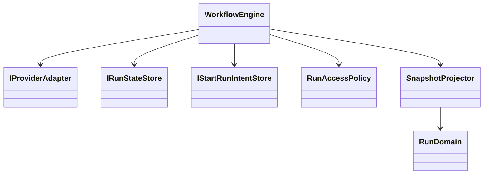
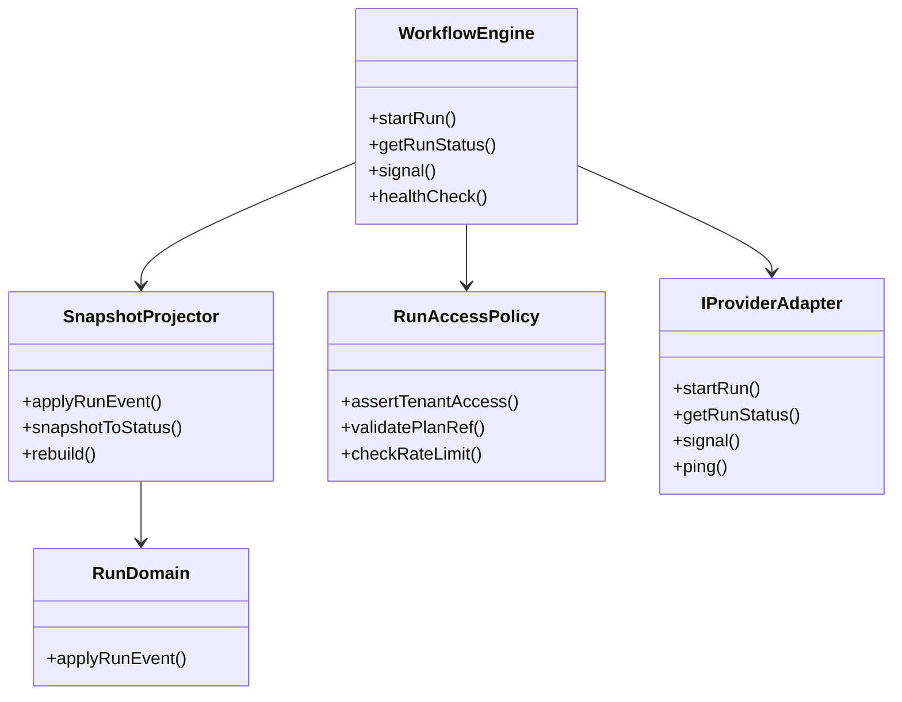
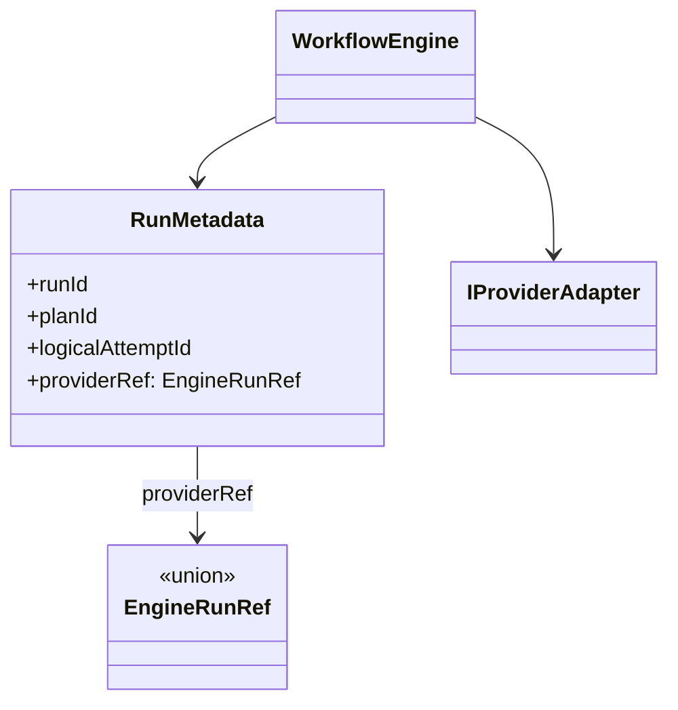
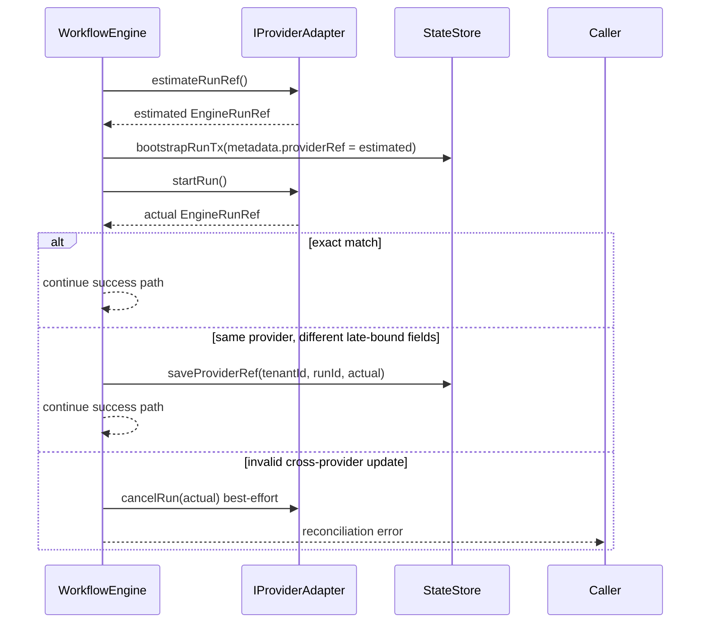

---
title: Current Status
status: Active
owner: Architecture / Delivery / Docs
last_reviewed: 2026-04-10
---

# Current Status

This page is the current implementation snapshot for the repository.

It is not the canonical behavioral spec for any one subsystem. Use it to answer
one practical question first: what is true in the codebase now, and where is
delivery work still open?

## Traceability Anchors

Use this page together with:

- [Glossary](../concepts/glossary.md) for shared meanings of `run`, `plan`,
  `adapter`, `status`, `gap`, and `canonical spec`
- [Domain Language](../concepts/domain-language.md) for the naming discipline
  shared across planning, architecture, contracts, and code
- [Canonical Doc Code Matrix](../planning/status/canonical-doc-code-matrix.md)
  for the curated topic -> doc -> code -> test -> command mapping
- [Planner Current State Assessment](../planning/status/planner-current-state-assessment.md)
  for the planner-specific current-state baseline and component map
- [Planning Control Tower](../planning/state/planning-control-tower.md) for the
  active task registry and lane posture
- [Strategic Product Roadmap](../planning/roadmap/strategic-product-roadmap.md)
  for the stable long-range product direction and current capability ladder
- [Roadmap Of Record](../planning/roadmap/index.md) for current planning
  sequencing
- [Generated Code State](../planning/status/generated-code-state.md) for the
  current workspace and test inventory

Minimum tuple for this document:

- `canonical_spec`: topic-specific. Follow the matrix and the linked specs.
- `status_doc`: [`docs/architecture/system-delivery-status.md`](./system-delivery-status.md)
- `code_paths`: summarized by area here; exact curated paths live in
  [Canonical Doc Code Matrix](../planning/status/canonical-doc-code-matrix.md)
- `test_paths`: summarized by area here; exact paths live in
  [Canonical Doc Code Matrix](../planning/status/canonical-doc-code-matrix.md)
- `verification_cmd`: `pnpm --filter dvt-api test`,
  `pnpm --filter dvt-api test:integration`, `pnpm --filter @dvt/web typecheck`,
  `pnpm --filter @dvt/web test`, `pnpm test:engine`,
  `pnpm test:adapter-postgres`, `pnpm test:adapter-temporal`,
  `pnpm test:adapter-temporal:integration`, `pnpm validate:contracts`
- `evidence_or_risk`: use linked evidence docs for closed work and linked risk
  records for residual hardening debt

Scope-specific adapter-temporal verification commands:

- `pnpm test:adapter-temporal:integration:transformation` for transformation
  runtime semantics
- `pnpm test:adapter-temporal:integration:postgres` for the relational
  Postgres capability path
- `pnpm test:adapter-temporal:integration:postgres:docker` for the canonical
  local Docker PostgreSQL proof wrapper

## Snapshot

- Review date: 2026-04-09
- Workspace inventory source:
  [Generated Code State](../planning/status/generated-code-state.md)
- Active workspaces: 23
- Source files: 743
- Test files: 285
- Workspaces with test scripts: 22 of 23

## Executive Summary

| Area                       | Current posture    | What is true now                                                                                                                                                                                                                                                                                                                                                                                                                                                                                                                                                                                                                              | Primary status source                                                                                                                                                                                                                                   |
| -------------------------- | ------------------ | --------------------------------------------------------------------------------------------------------------------------------------------------------------------------------------------------------------------------------------------------------------------------------------------------------------------------------------------------------------------------------------------------------------------------------------------------------------------------------------------------------------------------------------------------------------------------------------------------------------------------------------------- | ------------------------------------------------------------------------------------------------------------------------------------------------------------------------------------------------------------------------------------------------------- |
| Entry layer                | Partial            | `apps/api` still owns the protected runtime command/query surface (`POST /runs/start`, `GET /runs`, `GET /runs/:runId`, `GET /runs/:runId/events`, `POST /runs/:runId/signal`) with OIDC auth and integration coverage, and `POST /plans/preview` now enforces explicit preview profiles plus request-boundary graph/provenance validation before returning a persisted `PlanRef`; `apps/web` now exposes explicit transformation authoring mode, persisted-preview gating before `Start run`, snapshot-only result evidence rendering, package tests, and a Cypress E2E lane (`pnpm --filter @dvt/web test:e2e`) for frontend runtime checks | [API and Admission](../planning/domains/api-and-admission.md), [Canonical Doc Code Matrix](../planning/status/canonical-doc-code-matrix.md)                                                                                                             |
| Planning layer             | Partial            | planner, verifier, DSL, and plan-interpreter packages exist; the stable strategic roadmap now lives under `docs/planning/roadmap/`; the transformation-flow proposal set governs the design-graph, preview-persist, and compiler boundary; stale standalone domain-cohesion draft packs were archived out of active planning surfaces; executable Lane A/B contract and provenance work remain open                                                                                                                                                                                                                                           | [Planner Current State Assessment](../planning/status/planner-current-state-assessment.md), [Strategic Product Roadmap](../planning/roadmap/strategic-product-roadmap.md), [Canonical Doc Code Matrix](../planning/status/canonical-doc-code-matrix.md) |
| Execution layer            | Partial            | engine, Postgres adapter, and Temporal adapter are implemented; engine entry-point plan integrity remains centralized before adapter dispatch; recent slices hardened stale-snapshot signal handling, landed step-kind dispatch (`MW-C1`), split Temporal baseline/transformation/Postgres lanes, and proved the first provider-owned PostgreSQL capability path; remaining follow-up work is the final closure around the runtime vertical (`TF-C2`) rather than the existence of the executor seam itself                                                                                                                                   | [Execution Runtime](../planning/domains/execution-runtime.md), [Planning Control Tower](../planning/state/planning-control-tower.md)                                                                                                                    |
| Persistence layer          | Partial            | Postgres state store and outbox persistence primitives are implemented; standalone outbox runtime now exists; persisted preview uses immutable plan records via the plan store; and downstream contract hardening, default-retention enforcement, and proof-environment lifecycle rules remain open                                                                                                                                                                                                                                                                                                                                           | [Event Lifecycle and Retention](../planning/domains/event-lifecycle-and-retention.md), [Execution Runtime](../planning/domains/execution-runtime.md)                                                                                                    |
| Observability              | Partial            | observability contracts and the OTel binding exist; production validation remains incomplete                                                                                                                                                                                                                                                                                                                                                                                                                                                                                                                                                  | [Canonical Doc Code Matrix](../planning/status/canonical-doc-code-matrix.md)                                                                                                                                                                            |
| Traceability / OpenLineage | Closed for Phase 1 | mapper, package tests, `_schemaURL` pinning, repo-local facet artifacts, committed golden fixtures, and offline AJV schema validation all pass; delivery-runtime concerns continue as follow-up hardening work                                                                                                                                                                                                                                                                                                                                                                                                                                | [Canonical Doc Code Matrix](../planning/status/canonical-doc-code-matrix.md), [Planning Control Tower](../planning/state/planning-control-tower.md)                                                                                                     |

## Area Status

Active planning posture note:
planner-backed runtime ingress cleanup is now routed through a hard-cut,
no-retrocompatibility slice. The superseded compatibility-first proposal
remains historical rationale only and does not define the active execution
direction.

### Entry Layer

| Area       | Packages   | Status             | Notes                                                                                                                                                                                                                                                                                                                                                                                                                                                                                                                                 |
| ---------- | ---------- | ------------------ | ------------------------------------------------------------------------------------------------------------------------------------------------------------------------------------------------------------------------------------------------------------------------------------------------------------------------------------------------------------------------------------------------------------------------------------------------------------------------------------------------------------------------------------- |
| API server | `apps/api` | Closed for Phase 1 | Protected runtime routes are live with OIDC auth, tenant policy, backpressure admission, and query/signal endpoints; `POST /plans/preview` validates preview profile plus provenance before returning a persisted `PlanRef`; planner-backed protected runtime ingress is now hard-cut to canonical `graphSource`, and `start-run` plus `preview` share one fail-closed source policy                                                                                                                                                  |
| Web UI     | `apps/web` | Partial            | Client shell and routing exist; the Canvas now exposes explicit transformation authoring mode, preview gating is tied to persisted `PlanRef` proof, and run detail only renders result evidence from the governed snapshot surface; workspace-level frontend tests are wired (`pnpm --filter @dvt/web test`), typecheck coverage exists (`pnpm --filter @dvt/web typecheck`), and a Cypress E2E runtime-contract lane remains available (`pnpm --filter @dvt/web test:e2e`) while broader backend-backed coverage is still incomplete |

### Planning And Interpretation

| Area                | Packages                | Status      | Notes                                                                                                                                                                                                                                                                           |
| ------------------- | ----------------------- | ----------- | ------------------------------------------------------------------------------------------------------------------------------------------------------------------------------------------------------------------------------------------------------------------------------- |
| Planning core       | `@dvt/planner`          | Partial     | The planner package is real and exercised, but the live planning work is no longer governed by an old scorecard. The active contract work is the Lane A transformation pack (`DesignGraphDraft`, compiler mapping, preview-persist rules, and executable provenance alignment). |
| Plan verification   | `@dvt/plan-verifier`    | Partial     | Package exists with tests; it remains a narrow verification utility, not a broad workflow policy layer                                                                                                                                                                          |
| Plan interpretation | `@dvt/plan-interpreter` | Implemented | Deterministic DAG analysis package exists with test coverage and a canonical package page                                                                                                                                                                                       |
| DSL evaluation      | `@dvt/dsl`              | Implemented | Small deterministic DSL package exists with package-level tests and canonical docs                                                                                                                                                                                              |

### Execution And Adapters

| Area              | Packages                   | Status             | Notes                                                                                                                                                                                                                                                                                                                                                                                             |
| ----------------- | -------------------------- | ------------------ | ------------------------------------------------------------------------------------------------------------------------------------------------------------------------------------------------------------------------------------------------------------------------------------------------------------------------------------------------------------------------------------------------- |
| Workflow engine   | `@dvt/engine`              | Closed for Phase 1 | Core engine, in-process projector, and the pre-bootstrap `estimateRunRef` path are delivered; `RunMetadata` now persists a single discriminated `providerRef`, provider-ref reconciliation is constrained to a typed validated `saveProviderRef(...)` seam, and current hardening work is focused on the `WE-HX` boundary split plus recent signal-transition and stale-snapshot guard tightening |
| Temporal adapter  | `@dvt/adapter-temporal`    | Closed for Phase 1 | Real adapter primitives, worker host, lookup, and time-skipping integration coverage exist; the runtime now ships split baseline/transformation/Postgres capability lanes plus a canonical local Docker proof wrapper for the Postgres path; residual hardening is tracked separately                                                                                                             |
| Postgres adapter  | `@dvt/adapter-postgres`    | Closed for Phase 1 | State-store and outbox persistence implementation are present and operating as shipped foundations                                                                                                                                                                                                                                                                                                |
| Mock/test adapter | `@dvt/engine` test surface | Implemented        | Exists as test-only support surface, not as a product runtime                                                                                                                                                                                                                                                                                                                                     |

### Persistence, Read Models, And Delivery

| Area              | Packages                                                          | Status             | Notes                                                                                                                                                                                                                                                                                                                                                                                   |
| ----------------- | ----------------------------------------------------------------- | ------------------ | --------------------------------------------------------------------------------------------------------------------------------------------------------------------------------------------------------------------------------------------------------------------------------------------------------------------------------------------------------------------------------------- |
| State store       | `@dvt/state-store`, `@dvt/adapter-postgres`                       | Closed for Phase 1 | Canonical persistence boundary exists; see the state-store overview and Postgres adapter docs                                                                                                                                                                                                                                                                                           |
| Outbox runtime    | `@dvt/delivery`, `dvt-outbox-worker`, `@dvt/adapter-postgres`     | Closed for Phase 1 | Delivery runtime ownership now lives in `@dvt/delivery`, with `dvt-outbox-worker` acting as the composition root and local-docker canary evidence delivered; downstream contract hardening and `outbox_lineage` flow remain follow-up work; purge runtime (`DeliveryBufferPurgeRuntime`) was added to `dvt-outbox-worker` on 2026-03-21, gated by `DVT_PURGE_ENABLED` (default `false`) |
| Archive lifecycle | `@dvt/state-store`, `@dvt/adapter-postgres`, `dvt-outbox-worker`  | Partial            | Archive export plus verifier, migration `007`, `RunArchiveCoordinator`, `PostgresRunArchiveStore`, retention migration `009`, `DeliveryBufferPurger`, `PostgresDeliveryBufferPurgeStore`, and purge runtime wiring are landed; deferred deletion/restore and redaction policy remain open                                                                                               |
| Read models       | `@dvt/delivery`, `apps/projector-worker`, `@dvt/adapter-postgres` | Closed for Phase 1 | `run_snapshots` migration `004`, `rebuildSnapshot`, `listStaleSnapshotRuns`, `ProjectorWorkerRuntime`, `apps/projector-worker`, and the discriminated `providerRef` metadata baseline are delivered                                                                                                                                                                                     |

### Observability And Traceability

- `@dvt/observability` (`Implemented`):
  port surface exists and is documented.
- `@dvt/observability-otel` (`Partial`):
  binding exists, but production validation is still incomplete.
- `@dvt/traceability-service` (`Closed for Phase 1`):
  mapper/resolver package with tests; `_schemaURL` pinned; repo-local contract
  artifacts committed; golden fixtures for all 3 mapper paths; offline AJV
  schema validation for both emitted facets; 13/13 tests pass (2026-03-12);
  runtime delivery hardening closed under G10 on 2026-03-15.
- `outbox_lineage` flow (`Closed for Phase 1`):
  G10 closed 2026-03-15: `lineage_outbox` + `lineage_dead_letter` migration,
  `ILineageSink` + `ILineageOutboxStore` contracts, `PostgresLineageOutboxStore`,
  `LineageOutboxObserver` (fail-soft bridge), `LineageWorkerRuntime` with
  per-record retry and DLQ, `HttpOpenLineageSink` (Marquez-compatible),
  `apps/lineage-worker` standalone process; validation passed for
  `LineageWorkerRuntime.test.ts` (14/14), `pnpm --filter @dvt/delivery test`
  (14/14), `pnpm --filter @dvt/adapter-postgres test` (13/13 with 23 skipped),
  `pnpm --filter @dvt/traceability-service build`, and
  `pnpm --filter dvt-lineage-worker typecheck`.

## Phase 2 Slice Debt

| Slice | Title                            | Status                       |
| ----- | -------------------------------- | ---------------------------- |
| S01   | Contract And Dead Code Cleanup   | Closed 2026-03-21            |
| S06   | Migration Version Table          | Closed 2026-03-21            |
| S10   | Typed Graph-Source Boundary      | Closed 2026-03-20            |
| S02   | IRunStateStore Split             | Open (unblocked by S01)      |
| S03   | StartRunCoordinator Extraction   | Open (unblocked by S01)      |
| S05   | EventEnvelope.payloadVersion     | Open (unblocked by S01)      |
| S07   | OpenLineage Job Naming Fix       | Open                         |
| S09   | Retry Ownership ADR              | Closed 2026-03-24            |
| S04   | ProviderRefUpdated Event         | Retired 2026-04-09           |
| S08   | Plan record and plan store model | Open (unblocked by ADR-0040) |
| S11   | ILineageSink.jobFacets Tighten   | Open (blocked by S07)        |

See [Phase 2 Architectural Debt Roadmap](../planning/archive/proposals/phase2-arch-debt-roadmap-20260315.md) for full details.

## Reading Order

1. [Canonical Doc Code Matrix](../planning/status/canonical-doc-code-matrix.md)
2. [Planning Control Tower](../planning/state/planning-control-tower.md)
3. [Generated Code State](../planning/status/generated-code-state.md)
4. Topic-specific specs under [Reference](./index.md)

## Topic Entry Points

- Engine and execution invariants:
  [Engine Architecture](./components/engine/index.md)
- State-store boundary:
  [State Store Overview](./components/engine/contracts/state-store/overview.md)
- Shared package surfaces:
  [Shared Package Architecture](./shared/index.md)
- Contracts:
  [Contracts Index](../contracts/index.md)
- Planning and execution debt:
  [Planning Control Tower](../planning/state/planning-control-tower.md)

## System Element Diagrams (from Current Code)

### Workflow Engine Relationships

Reflects the current merged implementation:

### Engine Domain Structure

Reflects the current merged implementation:

### RunMetadata Field Relationships

Reflects the current metadata relationship in code:

### Estimated ProviderRef Protocol

Reflects the current estimated-provider-ref protocol in code:

---
