# DVT — System Architecture

## What DVT Is

DVT is a **workflow execution assurance layer**. It sits between a caller (CLI,
API, scheduler) and a workflow runtime (Temporal, Conductor, or anything else)
and takes ownership of three things that workflow engines deliberately do not
provide:

1. **Execution sovereignty** — the domain owns the lifecycle state machine and
   its valid transitions, independent of what the underlying engine does or
   does not report.
2. **Self-auditing** — every state change is an immutable, ordered, signed
   fact. The full history of a run is always reconstructable from first
   principles.
3. **Runtime portability** — the execution contract is expressed in DVT terms.
   Adapters translate those terms into provider APIs. Swapping Temporal for
   Conductor — or for a custom engine — does not change business logic.

The primary use case today is **dbt workflow orchestration**, but the contract
is deliberately generic. A run is any unit of work described by an immutable
`PlanRef`. That plan could describe dbt node execution, a data ingestion
pipeline, a multi-step game loop, or arbitrary async task graphs. DVT does not
parse the plan; adapters do.

> **Architectural view**: DVT is not a workflow engine. It is the authority
> layer that sits above engines and enforces consistency, auditability, and
> portability guarantees that engines cannot or do not provide.

---

## System Modules

### Top-Level Map

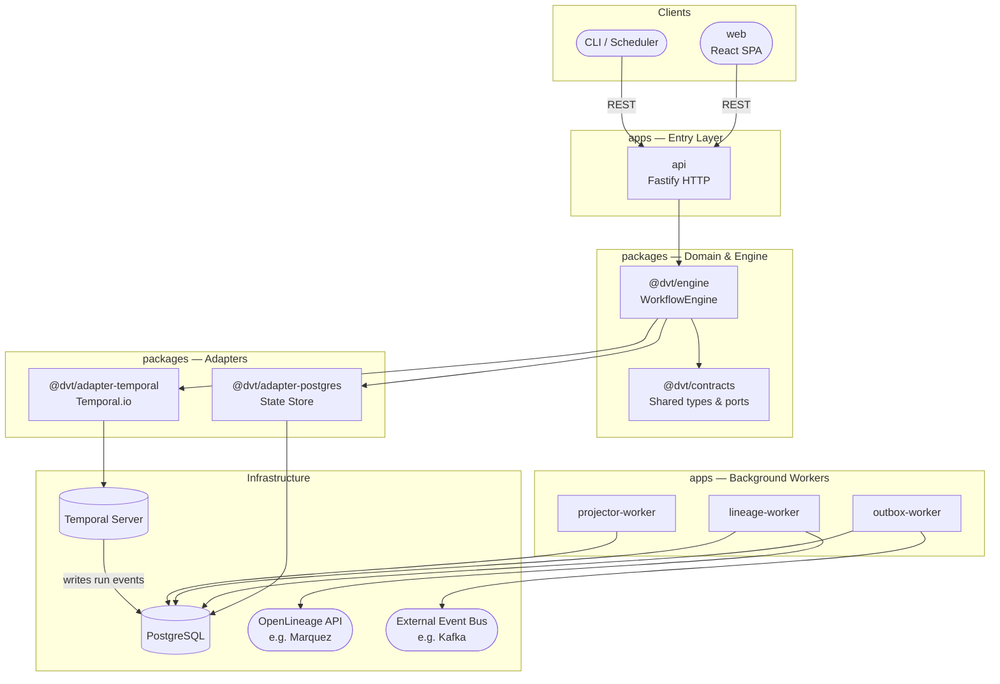

### Module Responsibilities

| Module                  | Kind              | Owns                                                         |
| ----------------------- | ----------------- | ------------------------------------------------------------ |
| `apps/api`              | HTTP entry point  | Route handling, auth, backpressure, readiness                |
| `apps/web`              | Frontend          | Run explorer, workflow DAG visualization (plugin-extensible) |
| `apps/outbox-worker`    | Background worker | At-least-once delivery of outbox records to external bus     |
| `apps/lineage-worker`   | Background worker | OpenLineage event emission from lineage outbox               |
| `apps/projector-worker` | Background worker | Snapshot projection maintenance (keeps read model fresh)     |
| `@dvt/engine`           | Core domain       | Lifecycle state machine, orchestration, invariants           |
| `@dvt/contracts`        | Shared kernel     | Types, port interfaces, event schemas — no logic             |
| `@dvt/adapter-temporal` | Provider adapter  | Translates DVT semantics → Temporal workflow API             |
| `@dvt/adapter-postgres` | State adapter     | Implements `IRunStateStore`, `IStartRunIntentStore`          |
| `@dvt/observability`    | Technical         | Structured logs, distributed traces, metrics facades         |

---

## Architecture Layers

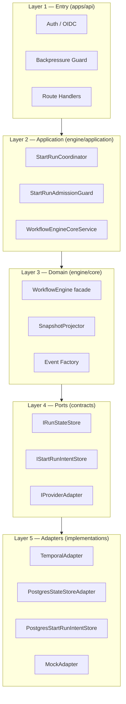

**Rule**: Dependencies flow strictly downward. Layer 3 (domain) never imports
Layer 5 (implementations). Layer 5 never imports Layer 2 (application). This
is enforced by package boundaries and the ESLint determinism scan in CI.

---

## Core Domain Contract

### WorkflowEngine — Public API

The `WorkflowEngine` is the single entry point for the domain. All
application-layer code talks to it through `IWorkflowEngine`.

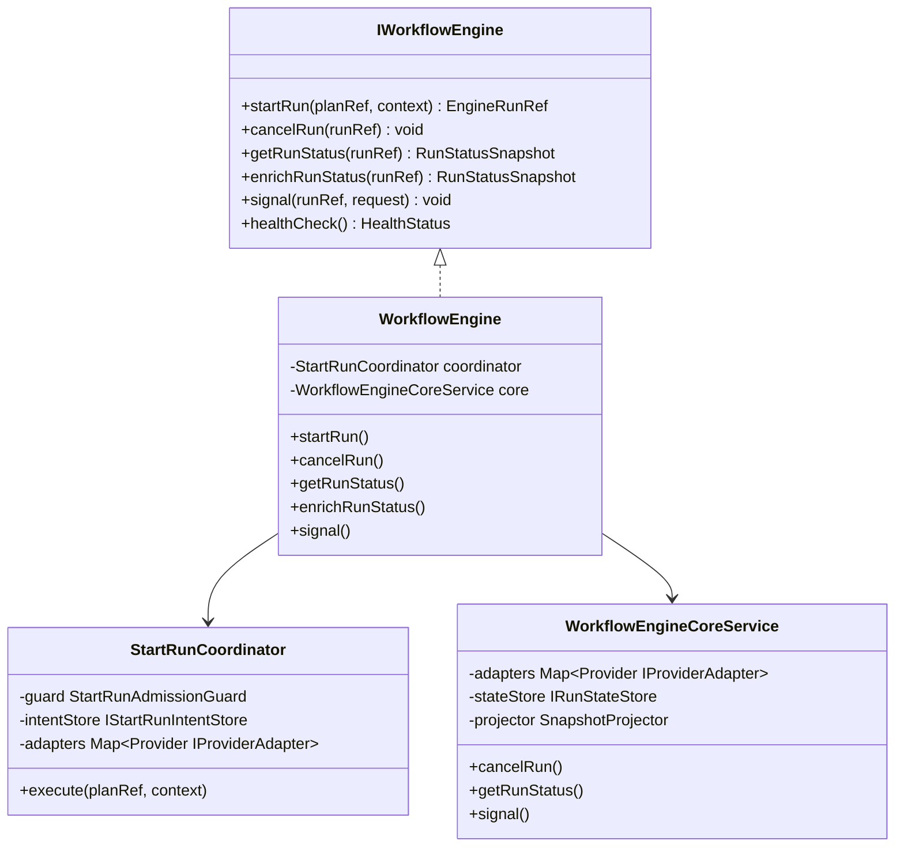

**`getRunStatus` vs `enrichRunStatus`** (ADR-0015):

- `getRunStatus` — reads from the local event log and materialized snapshot.
  Never calls the adapter. Latency is independent of provider availability.
- `enrichRunStatus` — additionally calls the adapter for real-time substatus.
  Use for UI polling; acceptable latency.

### Provider Adapter Contract

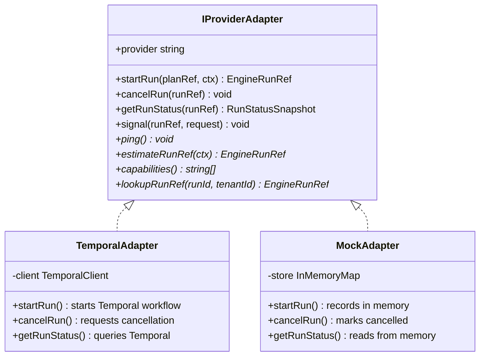

**Plan integrity boundary** (ADR-0012): The engine passes a `PlanRef` (URI +
SHA-256 hash) to the adapter. The adapter owns fetching the plan bytes,
validating the hash, and validating schema version. The engine never fetches
plan bytes.

---

## Key Domain Types

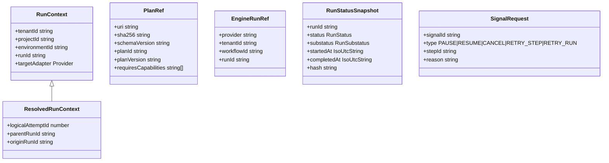

`EngineRunRef` is a **discriminated union** — each provider variant carries its
own addressing fields (Temporal: `namespace + workflowId + runId`, Conductor:
`conductorUrl + workflowId`, etc.).

---

## Sequence Diagrams

### 1 — Start a Run (happy path)

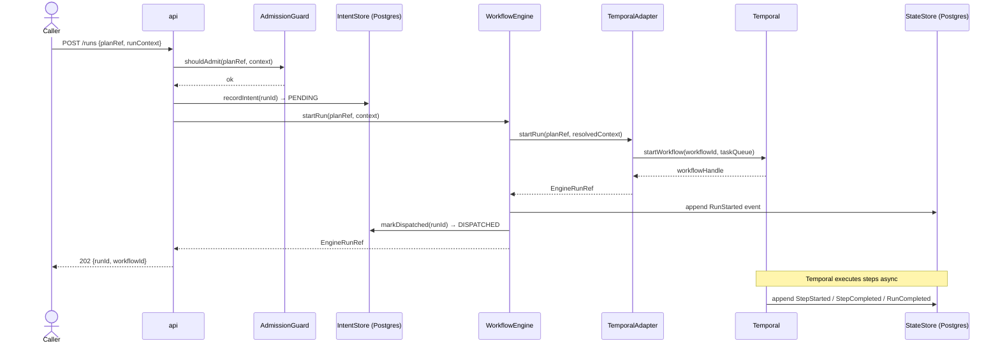

### 2 — Crash-safe startRun (intent durability, ADR-0030)

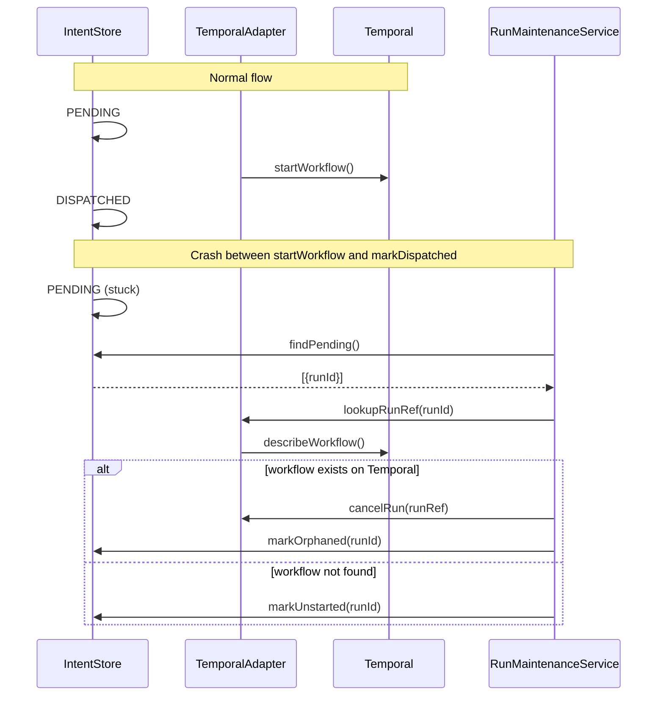

### 3 — Read run status (ADR-0015)

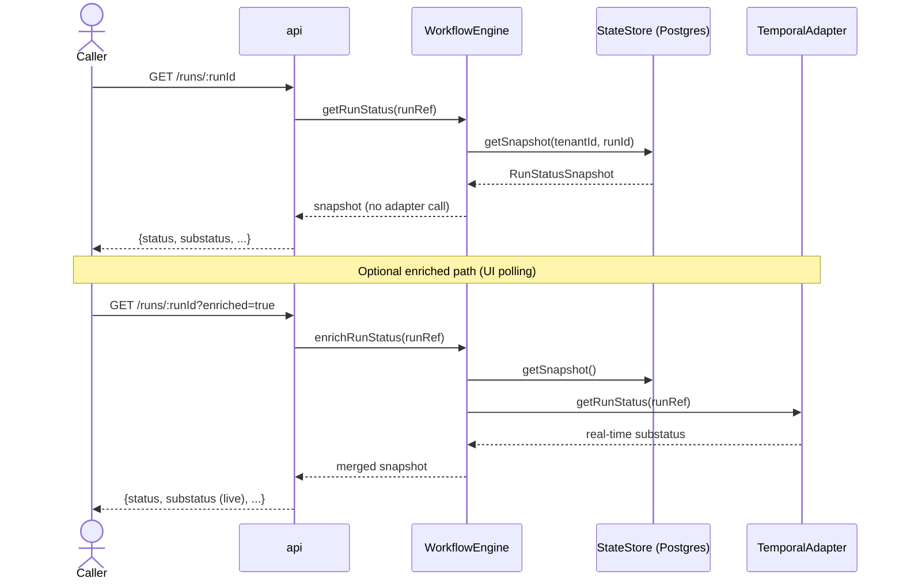

### 4 — Outbox delivery

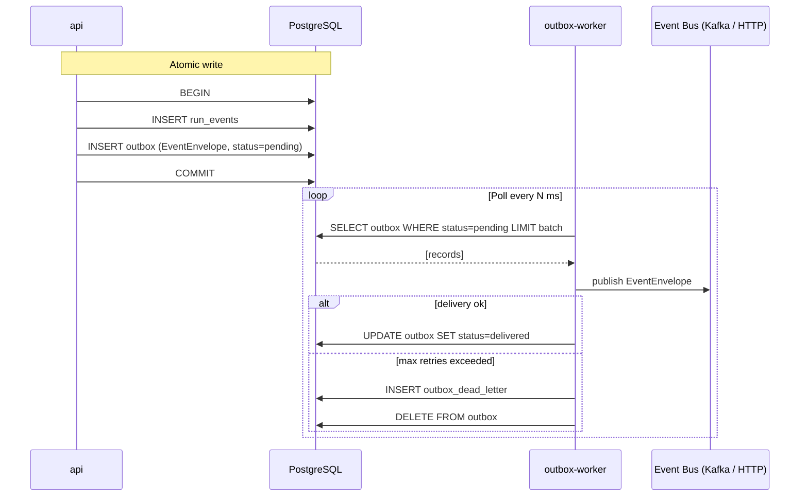

### 5 — Lineage + projection workers

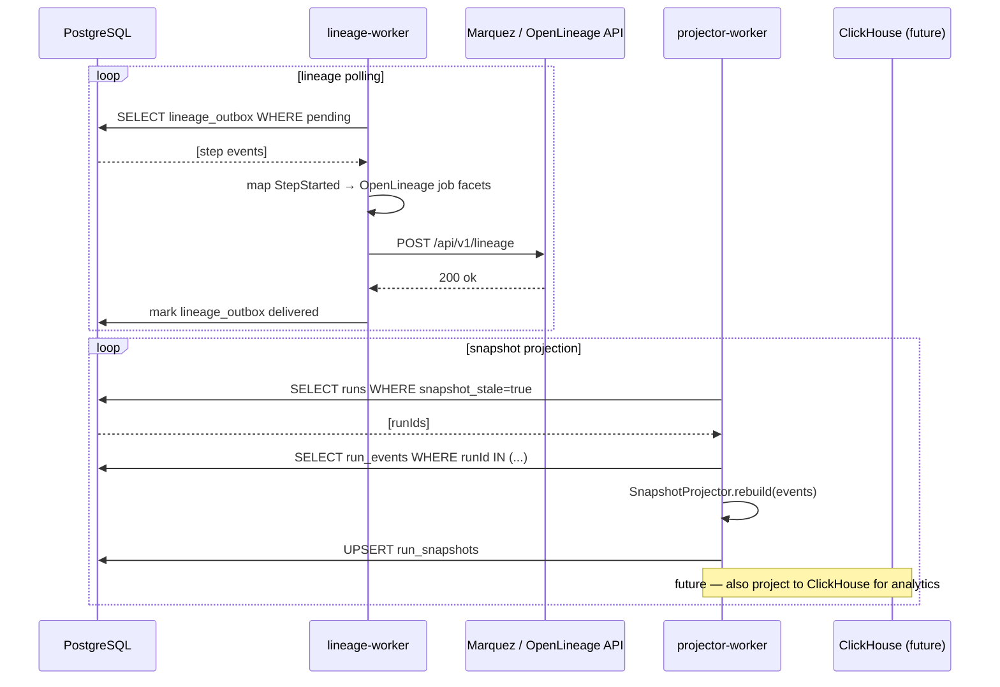

### 6 — Readiness probe chain

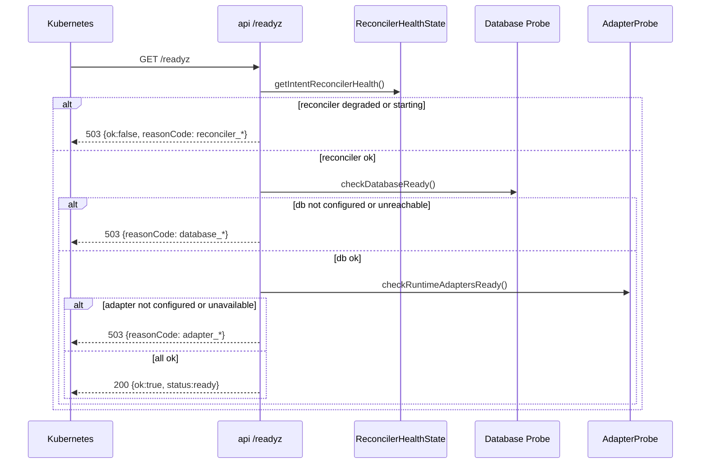

---

## Subsystem Communication

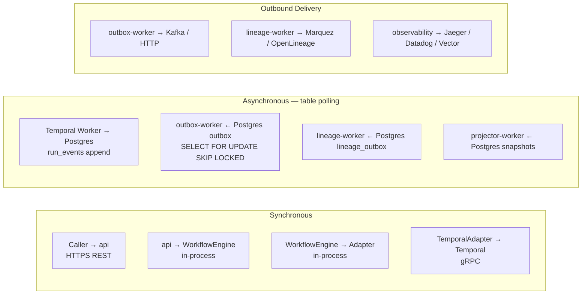

| Pair                        | Protocol                                     | Notes                                             |
| --------------------------- | -------------------------------------------- | ------------------------------------------------- |
| Caller → api                | HTTPS REST                                   | OIDC-protected for write operations               |
| api → WorkflowEngine        | In-process                                   | No serialization overhead                         |
| WorkflowEngine → Adapter    | In-process `Map<Provider, IProviderAdapter>` | Selected by `targetAdapter`                       |
| TemporalAdapter → Temporal  | gRPC (Temporal SDK)                          | Timeout-wrapped by engine                         |
| Temporal Worker → Postgres  | Direct SQL                                   | Writes `run_events`; bypasses engine on read path |
| Postgres → outbox-worker    | `SELECT FOR UPDATE SKIP LOCKED`              | Sharded by `shard_id`                             |
| Postgres → lineage-worker   | Table polling                                | Separate `lineage_outbox` table                   |
| Postgres → projector-worker | Table polling                                | Detects stale snapshots                           |
| outbox-worker → Kafka       | Kafka producer                               | At-least-once; dead-letter on max retries         |
| outbox-worker → HTTP        | HTTP POST                                    | Alternative delivery mode (configurable)          |
| lineage-worker → Marquez    | HTTP POST OpenLineage v1                     | `DVT_LINEAGE_API_URL`                             |

---

## Integration Landscape

DVT is designed to be the assurance and audit layer in the center of a broader
data platform. Each integration plugs into a specific layer of the system.

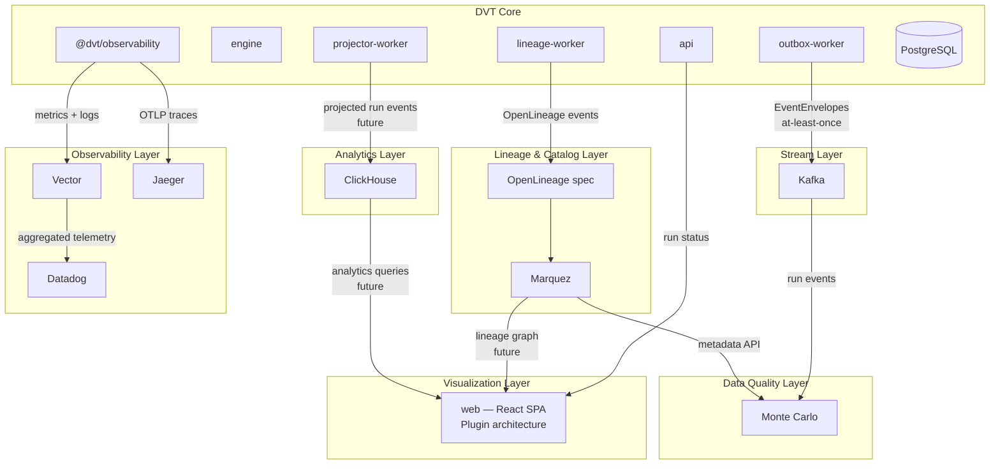

### Integration points by tool

| Tool            | Layer                | Plugs into DVT at                               | Status                                                            |
| --------------- | -------------------- | ----------------------------------------------- | ----------------------------------------------------------------- |
| **Kafka**       | Stream               | `outbox-worker` delivery target                 | Planned — outbox-worker already supports pluggable delivery modes |
| **Marquez**     | Lineage catalog      | `lineage-worker` → `DVT_LINEAGE_API_URL`        | Active — lineage-worker emits OpenLineage v1                      |
| **OpenLineage** | Lineage spec         | `lineage-worker` event schema                   | Active — StepStarted events mapped to OpenLineage job facets      |
| **Monte Carlo** | Data quality         | Consumes from Marquez API + Kafka events        | Planned — Monte Carlo has native Marquez integration              |
| **Jaeger**      | Distributed tracing  | `@dvt/observability` OTLP exporter              | Planned — observability facade is backend-agnostic                |
| **Datadog**     | APM + metrics + logs | `@dvt/observability` → Vector → Datadog agent   | Planned — metrics/logs/traces via OTLP                            |
| **Vector**      | Telemetry pipeline   | Collects from all DVT apps, routes to sinks     | Planned — sits between DVT and Datadog/other sinks                |
| **ClickHouse**  | Analytics            | `projector-worker` additional projection target | Planned — projector can target multiple sinks                     |

### Why these integrations make sense architecturally

**Kafka** replaces or augments the HTTP delivery mode in `outbox-worker`. The
outbox pattern already provides at-least-once semantics; Kafka adds durable
replay, consumer group fanout, and schema registry support for the event stream.

**Marquez + OpenLineage** is the lineage catalog. `lineage-worker` already
speaks OpenLineage v1. Marquez is the server. Together they build the full
lineage graph of what ran, what produced what, and what consumed what — across
all workflow domains, not just dbt.

**Monte Carlo** sits above the lineage layer and adds data quality observability
— anomaly detection, freshness checks, schema drift. It can consume the lineage
graph from Marquez and correlate it with run events from Kafka to identify which
DVT run produced a dataset that later failed a quality check.

**Jaeger** receives distributed traces from `@dvt/observability`. Each DVT
operation (startRun, signal, step execution) emits OTLP spans. Jaeger provides
the trace explorer for debugging latency and failure propagation across the
system.

**Vector** is the telemetry aggregation pipeline. It collects logs, metrics, and
traces from all DVT apps and routes them to the appropriate sinks (Datadog,
Jaeger, ClickHouse, S3). This avoids hard-coupling DVT apps to specific
observability vendors.

**Datadog** is the operational monitoring platform. It receives the aggregated
telemetry from Vector and provides dashboards, alerting, and APM for DVT
operations.

**ClickHouse** is the analytics store. The `projector-worker` can be extended to
project run events into ClickHouse alongside PostgreSQL. This enables fast OLAP
queries over run history, step latency distributions, failure rate trends, and
tenant-level analytics — without impacting the transactional Postgres database.

---

## Web Frontend — Plugin Architecture

The `apps/web` frontend is a React SPA built on React Flow (graph visualization)
and Zustand (state management). Its current state and roadmap:

### Current State

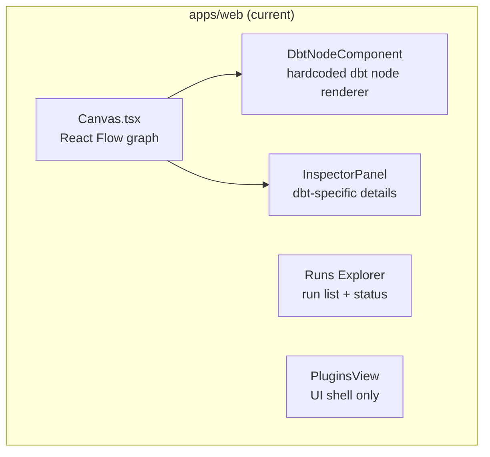

- **Graph rendering**: React Flow + Dagre layout — generic and reusable
- **Node logic**: `DbtNodeComponent` and edge validation are 100% dbt-specific today
- **Plugin system**: `Plugin` type is defined (`custom_nodes | validators | panels | cost_policies`)
  with a marketplace UI shell, but **no runtime plugin loading** — mock data only
- **Node type registry**: Single entry `{ dbtNode: DbtNodeComponent }` — no plugin-based registry yet

### Target Architecture (plugin model)

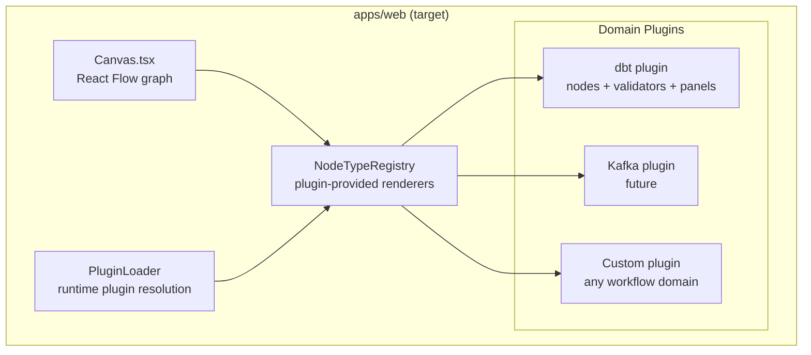

The plugin contract maps cleanly onto what `PlanRef` already provides: a plan
describes a workflow domain. The web frontend can use the plan's `schemaVersion`
or a `domain` tag to select the correct rendering plugin. A dbt plan gets the
dbt node renderer; a data ingestion plan gets a source/sink renderer; a custom
plan gets whatever plugin is registered for that domain.

**This means the frontend plugin model mirrors the backend adapter model**: just
as the engine selects an adapter by `targetAdapter`, the frontend selects a
renderer by plan domain.

---

## Extensibility Model

### Adding a New Workflow Engine (backend)

1. Implement `IProviderAdapter` from `@dvt/contracts`
2. Register in `buildProviderAdapters()` behind an env flag
3. Write run events to `IRunStateStore` from the adapter/worker
4. Handle plan fetch + SHA-256 validation inside the adapter
5. Map provider errors to DVT `RunStatus` transitions

Engine, API, state store, and all workers remain unchanged.

### Adding a New Workflow Domain (frontend)

1. Define a plan schema for the domain (JSON Schema, `schemaVersion`)
2. Register a `PlanRef` with the appropriate URI and schema version
3. Implement a frontend plugin: node renderer + validators + inspector panel
4. Register the plugin in the `NodeTypeRegistry`

The backend is already domain-agnostic. The frontend plugin is the only
domain-specific artifact.

### Adding a New Delivery Target

1. Implement a delivery adapter in `outbox-worker` (alongside HTTP and log modes)
2. Select it via env configuration (`DVT_OUTBOX_DELIVERY_MODE=kafka`)
3. Outbox guarantees (at-least-once, dead-letter) are inherited automatically

---

## Outbox Pattern

```
┌──────────────────────────────────┐
│         BEGIN TRANSACTION        │
│  INSERT run_events (domain fact) │
│  INSERT outbox    (delivery cue) │
│         COMMIT                   │
└──────────────────────────────────┘
              │
              ▼ (async, retried, sharded)
        outbox-worker
              │
        ┌─────┴─────┐
        ▼           ▼
      Kafka       HTTP target
              │
              ▼ (on max retries)
        outbox_dead_letter
```

The outbox pattern solves the dual-write problem: write to the database and
publish an event in a single atomic operation, then deliver asynchronously with
retries. Consistency is guaranteed at the cost of latency and eventual delivery.

---

## Design Decisions (ADR Index)

| ADR       | Decision                                                                                      |
| --------- | --------------------------------------------------------------------------------------------- |
| ADR-0003  | Domain owns the lifecycle state machine; engines do not define DVT transitions                |
| ADR-0004  | Event sourcing — immutable ordered event log is source of truth                               |
| ADR-0007  | Intent/terminal event split — engine emits `RunCancelRequested`; adapter emits `RunCancelled` |
| ADR-0012  | Adapters own plan fetch and SHA-256 validation; engine never fetches plan bytes               |
| ADR-0013  | `bootstrapRunTx` — atomic run state initialization including `runRef`                         |
| ADR-0014  | Run-driven adapter model — `startRun(planRef)`, not `executeStep(stepId)`                     |
| ADR-0015  | `getRunStatus` reads from local snapshot only; no adapter call on default path                |
| ADR-0018  | `@dvt/contracts` is the authoritative shared kernel; no type duplication                      |
| ADR-0030  | Pre-dispatch intent log for crash-consistent `startRun`                                       |
| ADR-0034  | Seven bounded contexts with explicit one-way dependency rules                                 |
| ADR-0040  | Engine owns `logicalAttemptId` and retry lineage; adapters do not manage retries              |
| ADR-0041  | Contract-first taxonomy: `engine / planner / shared` ownership model                          |
| ADR-0041A | Tri-state readiness probes: `ready \| unavailable \| not_configured`                          |

---

## Health & Operational Endpoints

| Endpoint        | Returns                         | When 503                                                             |
| --------------- | ------------------------------- | -------------------------------------------------------------------- |
| `GET /healthz`  | `{ok:true, status, components}` | Never — always 200                                                   |
| `GET /readyz`   | `{ok, status, reasonCode}`      | Reconciler degraded/starting; DB unreachable; adapter not configured |
| `GET /version`  | `{version, commit}`             | Never                                                                |
| `GET /db/ready` | `{ok}`                          | DB unreachable                                                       |

`/healthz` is liveness (process alive?). `/readyz` is readiness (safe to receive
traffic?). Kubernetes should only route traffic after `/readyz` returns 200. The
reconciler starts in `starting` state — `/readyz` returns 503 until the first
successful sweep confirms the runtime is operational.
