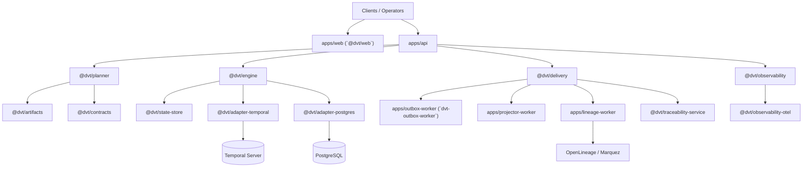

# DVT System Architecture

This document is the broad supporting overview for repository-wide
architecture.

It is grounded in the current system shape, but it is still not the canonical
source for runtime truth or architectural invariants. Read these pages first:

1. [Reference Architecture](reference-architecture.md)
2. [System Delivery Status](system-delivery-status.md)
3. [Architecture Surface Inventory 2026-04-02](architecture-surface-inventory-20260402.md)
4. [Canonical Doc Code Matrix](../planning/status/canonical-doc-code-matrix.md)

## How To Use This Page

- use it for the broad system walkthrough;
- use [System Delivery Status](system-delivery-status.md) to confirm what is
  shipped now;
- use [Reference Architecture](reference-architecture.md) to confirm
  principles, boundaries, and invariants;
- use [DVT Component Map](component-map.md) and [DVT Domain Map](domain-map.md)
  for finer-grained ownership and dependency views.

## Repository-Wide Shape

DVT is an execution-assurance system built around six active layers:

1. UI and entry surfaces that accept or visualize work;
2. planning surfaces that derive and verify executable plans;
3. execution surfaces that own lifecycle semantics and provider interaction;
4. delivery surfaces that project, publish, retain, and trace emitted facts;
5. shared-boundary surfaces for contracts, telemetry, hashing, and lineage;
6. infra and automation surfaces that operate the repository and runtimes.

## Supporting Topology

## Responsibility Summary

| Area                   | Primary surfaces                                                                                              | Role                                                                     |
| ---------------------- | ------------------------------------------------------------------------------------------------------------- | ------------------------------------------------------------------------ |
| UI and entry           | `apps/web`, `apps/api`                                                                                        | expose client UX, auth, admission, commands, queries, and runtime health |
| Planning and artifacts | `@dvt/planner`, `@dvt/plan-verifier`, `@dvt/plan-interpreter`, `@dvt/dsl`, `@dvt/artifacts`                   | derive, verify, and prepare execution plans and compiled-code artifacts  |
| Execution and state    | `@dvt/engine`, `@dvt/state-store`, `@dvt/adapter-temporal`, `@dvt/adapter-postgres`                           | own run lifecycle semantics and state/persistence boundaries             |
| Delivery and retention | `@dvt/delivery`, `apps/outbox-worker`, `apps/projector-worker`, `apps/lineage-worker`                         | publish, project, retain, purge, and trace emitted facts                 |
| Shared boundary        | `@dvt/contracts`, `@dvt/observability`, `@dvt/observability-otel`, `@dvt/traceability-service`, `@dvt/crypto` | define reusable contracts and cross-cutting technical concerns           |

## Reading Route

- [Reference Architecture](reference-architecture.md)
- [System Delivery Status](system-delivery-status.md)
- [DVT Component Map](component-map.md)
- [DVT Domain Map](domain-map.md)
- [Architecture Component Surfaces](components/index.md)
