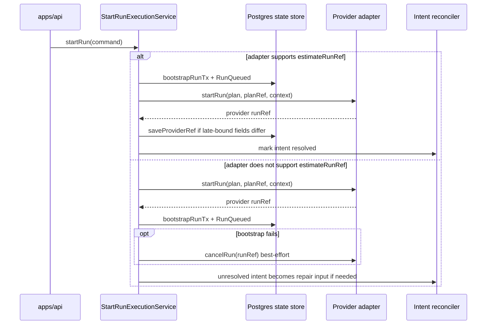

# Distributed consistency model

## Purpose

This document makes the shipped DVT consistency model explicit.

It answers four practical questions:

1. Which consistency domains exist today.
2. Which subsystem is authoritative while a cross-domain window is open.
3. What steady-state duration or threshold source exists for each window.
4. What failure mode and operator signal apply when that window is exceeded.

This is an architecture document, not a new behavioral contract. It binds the
already-shipped model to current code and runbooks so operators do not need to
reconstruct guarantees from source.

## Governing anchors

- [ADR-0003: Execution model](../../adr/ADR-0003-execution-model.md)
- [ADR-0004: Event sourcing strategy](../../adr/ADR-0004-event-sourcing-strategy.md)
- [ADR-0013: Atomic bootstrapRunTx ownership](../../adr/ADR-0013-run-state-store-bootstrapRunTx.md)
- [ADR-0015: getRunStatus read-model separation](../../adr/ADR-0015-getRunStatus-read-model-separation.md)
- [Backend MVP Control-Plane Runbook](../../runbooks/backend-mvp-control-plane-runbook-20260329.md)
- [Outbox Worker Runbook](../../runbooks/outbox-worker-g5.md)
- [API Runtime SLA Canonical](../../runbooks/api-runtime-sla-canonical-20260404.md)
- [Read-Your-Writes Freshness SLO](../../runbooks/read-your-writes-freshness-slo-20260330.md)

## Model lineage

The DVT model follows the same mature pattern used by production CQRS and
event-sourced systems:

- one authoritative write model;
- asynchronous publication through an outbox bridge;
- durable provider execution that is real but not semantically authoritative;
- explicit no-goals instead of pretending to offer global linearizability.

DVT adapts that pattern to its own runtime:

- Postgres owns canonical persisted lifecycle state;
- Temporal or another adapter owns provider-native execution;
- the outbox bridge owns downstream delivery progress;
- caller-visible reads expose canonical truth first and optional provider-live
  enrichment second.

## Consistency domains

```mermaid
flowchart LR
    Caller[Caller] --> API[apps/api]
    API --> Engine[@dvt/engine]
    Engine --> PG[(Postgres<br/>run_metadata + run_events + outbox)]
    Engine --> Adapter[Provider adapter]
    Adapter --> Provider[Temporal or provider runtime]
    PG --> Snapshot[Canonical snapshot read path]
    PG --> Worker[dvt-outbox-worker]
    Worker --> Bus[Downstream event consumers]
    Provider --> Enrichment[Provider-live enrichment]
    Snapshot --> API
    Enrichment --> API
```

### Domain A: Postgres canonical write domain

This domain includes `run_metadata`, `run_events`, `run_snapshots`, and
`outbox` rows written inside Postgres transactions.

Authority:

- canonical lifecycle state;
- ordered event history;
- downstream delivery intent;
- persisted plan or run metadata ownership.

Guarantee:

- ACID per transaction;
- event authority comes from the append-only log, not from provider state;
- outbox enqueue happens in the same write-side transaction as the canonical
  mutation it represents.

### Domain B: Provider execution domain

This domain includes Temporal workflow state and any other adapter-backed
provider-native runtime state.

Authority:

- provider-native workflow handle;
- provider diagnostics;
- provider terminal token such as Temporal `CANCELLED`.

Guarantee:

- durable provider execution;
- provider state may lead or lag canonical state during cross-domain windows;
- provider state is diagnostic, not the canonical lifecycle authority.

### Domain C: Asynchronous outbox delivery domain

This domain starts once an outbox row is committed and ends when the worker
delivers the row, retries it, or dead-letters it.

Authority:

- downstream delivery progress;
- retry or dead-letter disposition;
- shard ownership for delivery workers.

Guarantee:

- at-least-once delivery;
- no global exactly-once guarantee;
- downstream consumers must deduplicate by `eventId` and/or `idempotencyKey`.

### Domain D: Caller read domain

This domain serves `GET /runs` and `GET /runs/:runId`.

Authority:

- canonical snapshot path for caller-visible lifecycle state;
- optional provider-live enrichment for diagnostic fields only.

Guarantee:

- canonical read is authoritative even when provider-live differs;
- enriched reads fail rather than fabricating partial provider data;
- caller-visible freshness is surfaced as `FRESH`, `STALE`, or `UNKNOWN`.

## Authority matrix

| Question                                            | Authority                                  | Why                                                      |
| --------------------------------------------------- | ------------------------------------------ | -------------------------------------------------------- |
| What is the canonical run lifecycle state?          | Postgres event log and snapshot projection | ADR-0003 and ADR-0004 keep semantic authority inside DVT |
| Did a provider-native workflow start?               | Provider adapter plus provider runtime     | Provider owns the external workflow handle               |
| Has a downstream consumer definitely seen an event? | Outbox worker delivery domain              | Enqueue and delivery are separate phases                 |
| What should the API return to callers by default?   | Canonical snapshot path                    | ADR-0015 separates canonical read state from enrichment  |
| What should operators use for live diagnostics?     | Provider enrichment plus delivery metrics  | These are observational, not semantic authority          |

## Start-run consistency paths



## Eventual consistency windows

### Window W1: `RunQueued` persisted before provider start on the estimated-ref path

- Boundary: `bootstrapRunTx(...)` commits canonical `RunQueued`, then
  `adapter.startRun(...)` executes.
- Authority while open: Postgres is authoritative for the canonical fact that
  the run was admitted and queued; provider state may still be absent.
- Steady-state expectation: bounded by the engine adapter-call timeout of
  `30_000ms`.
- Threshold source:
  `packages/@dvt/engine/src/services/startRun/StartRunExecutionService.ts`
- Failure mode when exceeded: the start call times out or fails and the run
  stays canonically queued until intent resolution or reconciliation completes.
- Signal and operator route:
  - `dvt.api.run_start.latency_ms`
  - [API Runtime SLA Canonical](../../runbooks/api-runtime-sla-canonical-20260404.md)
  - [Backend MVP Control-Plane Runbook](../../runbooks/backend-mvp-control-plane-runbook-20260329.md)

### Window W2: provider start acknowledged before canonical bootstrap on the non-estimated path

- Boundary: `adapter.startRun(...)` returns first, then `bootstrapRunTx(...)`
  persists canonical metadata and `RunQueued`.
- Authority while open: provider runtime owns the live workflow handle; DVT has
  not yet completed canonical bootstrap.
- Steady-state expectation: one local Postgres write transaction in the same
  request path.
- Maximum expected open duration before incident posture: `300_000ms`, using
  the orphan-intent threshold as the explicit repair boundary for this path.
- Operational guardrail:
  - best-effort `cancelRun(runRef)` fires immediately if bootstrap fails;
  - unresolved intents become operator-visible once they cross the orphan
    threshold of `300_000ms`.
- Threshold source:
  - `apps/api/src/plugins/env.ts`
  - `apps/api/src/runtime/intentReconcilerRuntime.ts`
- Failure mode when exceeded: provider run may exist without committed DVT
  metadata; compensation can fail and the repair path becomes the intent
  reconciler plus maintenance service once the unresolved intent crosses the
  orphan threshold.
- Signal and operator route:
  - reconciler orphan threshold `300_000ms`
  - reconciler watchdog stale threshold `90_000ms` by default
  - [Backend MVP Control-Plane Runbook](../../runbooks/backend-mvp-control-plane-runbook-20260329.md)

### Window W3: canonical event append before the persisted snapshot row catches up

- Boundary: `run_events` contains newer `run_seq` values than
  `run_snapshots.last_run_seq`.
- Authority while open: event log remains authoritative; snapshot is a derived
  read model.
- Steady-state expectation: the caller read path can apply the event tail in
  memory during `getSnapshot(...)`, so a fresh caller-visible snapshot does not
  require the background projector to finish first.
- Threshold source:
  - `packages/@dvt/adapter-postgres/src/PostgresRunSnapshotStore.ts`
  - `packages/@dvt/adapter-postgres/src/PostgresSnapshotStalenessQuery.ts`
- Failure mode when exceeded: the freshness classification can degrade to
  `STALE` or `UNKNOWN`, but semantic truth still lives in the event log and the
  read path may still reconstruct a fresh canonical snapshot by replaying the
  event tail in memory.
- Signal and operator route:
  - `snapshot_staleness_result_total`
  - stale ratio `<= 5%` over `15m`
  - unknown ratio `<= 0.1%` over `24h`
  - [Read-Your-Writes Freshness SLO](../../runbooks/read-your-writes-freshness-slo-20260330.md)

### Window W4: canonical snapshot and provider-live enrichment temporarily disagree

- Boundary: canonical status is served from DVT state while provider-live
  diagnostics are fetched separately.
- Authority while open: canonical snapshot always wins for lifecycle semantics;
  provider view is observational only.
- Maximum expected duration: bounded by the same engine adapter-call timeout
  used for provider status enrichment, `30_000ms`.
- Threshold source:
  - `apps/api/src/application/services/getRunStatusUseCase.ts`
  - `packages/@dvt/engine/src/services/RunEnrichmentService.ts`
  - `packages/@dvt/engine/src/core/lifecycle/coreDomainConstants.ts`
- Failure mode when exceeded: enriched reads fail closed instead of returning a
  fake hybrid response; non-enriched reads still return canonical state.
- Signal and operator route:
  - caller-visible `snapshotStaleness`
  - provider enrichment errors in API logs
  - [Backend MVP Control-Plane Runbook](../../runbooks/backend-mvp-control-plane-runbook-20260329.md)

### Window W5: outbox row committed before a worker claims it

- Boundary: canonical write transaction commits an outbox row, but no worker
  has claimed it yet.
- Authority while open: Postgres has recorded the delivery obligation; the
  worker has not taken ownership of execution yet.
- Steady-state expectation:
  - poll interval default `1000ms`
  - drain-lag SLO p95 `<= 30s` over `15m`
- Threshold source:
  - `apps/outbox-worker/src/plugins/env.ts`
  - [API Runtime SLA Canonical](../../runbooks/api-runtime-sla-canonical-20260404.md)
- Failure mode when exceeded: downstream consumers lag behind canonical truth
  while outbox backlog accumulates; admission control may eventually block new
  starts based on outbox lag.
- Signal and operator route:
  - `dvt_delivery_outbox_drain_lag_seconds`
  - `dvt_outbox_oldest_claimed_lag_seconds`
  - [Outbox Worker Runbook](../../runbooks/outbox-worker-g5.md)

### Window W6: claimed outbox row before delivery, retry, or dead-letter outcome

- Boundary: worker has claimed the row and is attempting downstream delivery.
- Authority while open: worker runtime owns progress; canonical state already
  reflects the need to deliver.
- Steady-state expectation:
  - HTTP delivery timeout default `10_000ms`
  - event-delivery latency p95 `<= 1500ms`, p99 `<= 5000ms` over `15m`
  - retry schedule exponential with base `1s` and cap `60s`
  - claims older than `5 minutes` become stale and claimable again
  - dead-letter bound stays at `MAX_OUTBOX_ATTEMPTS = 10`
- Threshold source:
  - `apps/outbox-worker/src/plugins/env.ts`
  - `packages/@dvt/adapter-postgres/src/PostgresOutboxStore.ts`
  - [Outbox Worker Runbook](../../runbooks/outbox-worker-g5.md)
- Failure mode when exceeded: delivery becomes at-least-once with retries and
  possible duplicate downstream observations; persistent failure ends in
  dead-letter.
- Signal and operator route:
  - `dvt_delivery_event_delivery_latency_ms`
  - `dvt_outbox_retried_records_total`
  - `dvt_outbox_dead_lettered_records_total`
  - [Outbox Worker Runbook](../../runbooks/outbox-worker-g5.md)

### Window W7: orphaned or unresolved start-run intent before repair

- Boundary: a start intent is recorded but dispatch, bootstrap, or resolution
  did not close the intent cleanly.
- Authority while open: canonical intent log is the source of repair truth; the
  provider may or may not already have a live run.
- Steady-state expectation:
  - reconciler interval default `30_000ms`
  - orphan threshold default `300_000ms`
  - watchdog stale threshold default `90_000ms`
- Threshold source:
  - `apps/api/src/plugins/env.ts`
  - `apps/api/src/runtime/reconcilerHealthPolicy.ts`
- Failure mode when exceeded: the system enters a repair-required posture and
  operators must treat unresolved intent as an incident candidate.
- Signal and operator route:
  - reconciler health endpoints and logs
  - [Backend MVP Control-Plane Runbook](../../runbooks/backend-mvp-control-plane-runbook-20260329.md)

## External delivery guarantee

The guarantee delivered to downstream consumers is:

- canonical state mutation and outbox enqueue are atomic inside Postgres;
- downstream publication is asynchronous after that commit;
- delivery is at-least-once;
- downstream consumers must deduplicate;
- dead-letter is the bounded terminal failure path for repeated delivery
  failures.

This repository does not claim exactly-once external delivery.

## Non-goals and explicit limits

- No global linearizability across Postgres, provider runtime, and downstream
  consumers.
- No atomic cross-domain commit spanning Postgres and Temporal.
- No guarantee that provider-live terminal tokens and canonical run status are
  identical at every instant.
- No rollback of already-executed external effects such as completed
  transformations.
- No promise that a stale or unknown snapshot classification can always be
  hidden from callers.

## Operator reading order

1. Use this document to understand which domain is authoritative while a window
   is open.
2. Use [Backend MVP Control-Plane Runbook](../../runbooks/backend-mvp-control-plane-runbook-20260329.md)
   for API or reconciler incidents.
3. Use [Outbox Worker Runbook](../../runbooks/outbox-worker-g5.md) for
   delivery ownership, retry, and dead-letter incidents.
4. Use [API Runtime SLA Canonical](../../runbooks/api-runtime-sla-canonical-20260404.md)
   and [Read-Your-Writes Freshness SLO](../../runbooks/read-your-writes-freshness-slo-20260330.md)
   for threshold and alert interpretation.

## Current code anchors

- `packages/@dvt/engine/src/services/startRun/StartRunExecutionService.ts`
- `packages/@dvt/engine/src/services/runMaintenance/DispatchedIntentReconciliationPolicy.ts`
- `apps/api/src/application/services/getRunStatusUseCase.ts`
- `apps/api/src/runtime/intentReconcilerRuntime.ts`
- `apps/api/src/runtime/reconcilerHealthPolicy.ts`
- `packages/@dvt/adapter-postgres/src/PostgresRunSnapshotStore.ts`
- `packages/@dvt/adapter-postgres/src/PostgresSnapshotStalenessQuery.ts`
- `packages/@dvt/adapter-postgres/src/PostgresOutboxStore.ts`
- `apps/outbox-worker/src/ops/OutboxWorkerMonitor.ts`
- `apps/outbox-worker/src/ops/resolveReadyStaleAfterMs.ts`
