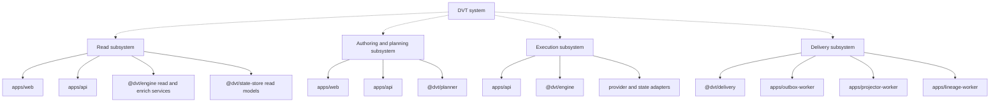

# System Architecture

This is the entrypoint for repository-wide system structure.

Use it when the question is:

- which subsystems exist today;
- how those subsystems compose real components;
- where to jump next for flow, component, or domain detail.

## Read This With

1. [Reference Architecture](../reference-architecture.md)
2. [System Delivery Status](../system-delivery-status.md)
3. [Subsystem Architecture](../subsystems/index.md)
4. [DVT Component Map](../component-map.md)
5. [DVT Domain Map](../domain-map.md)

## System To Subsystem Topology

## Routing Rule

- System pages explain composition and handoff between subsystems.
- Subsystem pages explain end-to-end flows across components.
- Component pages under `docs/architecture/components/` are the canonical home
  for a repo workspace and its public surface.
- Domain pages remain the ownership view; they do not replace subsystem or
  component docs.

## Current Active Routes

- [Subsystem Architecture](../subsystems/index.md)
- [DVT Component Map](../component-map.md)
- [DVT Domain Map](../domain-map.md)
- [DVT System Architecture](../system-overview.md)

## Related Pages

- [Architecture Surface Inventory 2026-04-02](../architecture-surface-inventory-20260402.md)
- [Architecture Component Surfaces](../components/index.md)
