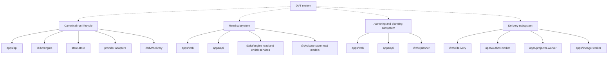
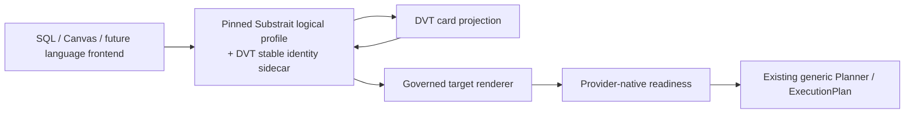

# System Architecture

This is the entrypoint for repository-wide system structure.

Use it when the question is:

- which subsystems exist today;
- how those subsystems compose real components;
- where to jump next for flow, component, or domain detail;
- which accepted target subsystem boundaries are being introduced without
  claiming they are already implemented AS-IS.

## Read This With

1. [Reference Architecture](../reference-architecture.md)
2. [System Delivery Status](../system-delivery-status.md)
3. [Subsystem Architecture](./subsystems/index.md)
4. [DVT Component Map](../component-map.md)
5. [DVT Domain Map](../domain-map.md)
6. [Semantic Transformation Subsystem - VTX2 Target](./subsystems/semantic-transformation/index.md)

## System To Subsystem Topology

The following remains the current AS-IS system composition. Target VTX2
semantic transformation is documented separately below so accepted design does
not become false implementation evidence.



## Target VTX2 Semantic Transformation Route

ADR-0064 adds an accepted target subsystem boundary inside authoring/planning
without replacing the existing Flow/Execution architecture.



See [Semantic Transformation Subsystem - VTX2 Target](./subsystems/semantic-transformation/index.md).

The accepted boundary keeps these concepts independent:

```text
Substrait logical operator count
!= Canvas card count
!= ExecutionPlan step count
```

## Routing Rule

- System pages explain composition and handoff between subsystems.
- Subsystem pages explain end-to-end flows across components.
- Component pages under `docs/architecture/components/` are the canonical home
  for a repo workspace and its public surface.
- Domain pages remain the ownership view; they do not replace subsystem or
  component docs.
- Target subsystem pages MUST identify themselves as target architecture until
  implementation evidence closes the gap to AS-IS.

## Current Active Routes

- [Canonical run lifecycle subsystem](./subsystems/canonical-run-lifecycle/index.md)
- [Distributed consistency model](./distributed-consistency-model.md)
- [Subsystem Architecture](./subsystems/index.md)
- [DVT Component Map](../component-map.md)
- [DVT Domain Map](../domain-map.md)
- [DVT System Architecture](../system-overview.md)

## Accepted Target Routes

- [Semantic Transformation Subsystem - VTX2 Target](./subsystems/semantic-transformation/index.md)

## Related Pages

- [Architecture Surface Inventory 2026-04-02](../architecture-surface-inventory-20260402.md)
- [Architecture Component Surfaces](../components/index.md)
- [ADR-0064 - Substrait semantic reference and bounded logical profile](../../adr/ADR-0064-substrait-semantic-reference-and-bounded-logical-profile.md)
