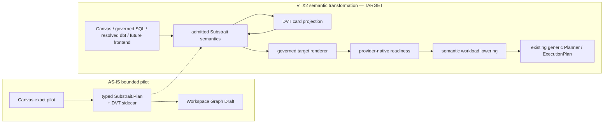

# System Architecture

This is the entrypoint for repository-wide system structure.

Use it when the question is:

- which subsystems exist today;
- how those subsystems compose real components;
- where to jump next for flow, component, domain, or authority detail;
- which accepted target subsystem boundaries are being introduced without claiming they are
  already implemented end to end.

Executable source, tests, current composition roots, contracts, accepted ADRs, and Planning
DB architecture queries outrank this page when they conflict.

## Read This With

1. [Reference Architecture](../reference-architecture.md)
2. [Planning Control Tower](../../planning/state/planning-control-tower.md)
3. [Subsystem Architecture](./subsystems/index.md)
4. [DVT Component Map](../component-map.md)
5. [DVT Domain Map](../domain-map.md)
6. [Semantic Transformation Subsystem - VTX2 Target](./subsystems/semantic-transformation/index.md)

The former `docs/architecture/system-delivery-status.md` route is not present on current
`main`; do not recreate it as another manual status snapshot. Current task/delivery state is
owned by GitHub Issues/PRs, while component/capability/relationship architecture authority is
owned by Planning DB as described by the Planning Control Tower.

## System To Subsystem Topology

The following is the current high-level AS-IS composition. It deliberately stays coarser than
component-local documentation.

```mermaid
flowchart TB
  System["DVT system"] -.-> Lifecycle["Canonical run lifecycle"]
  System -.-> Read["Read subsystem"]
  System -.-> Authoring["Authoring and planning subsystem"]
  System -.-> Delivery["Delivery subsystem"]
  System -.-> Evidence["Traceability / observability"]

  Lifecycle --> ApiExecution["apps/api"]
  Lifecycle --> Engine["@dvt/engine"]
  Lifecycle --> RunDomain["@dvt/run-domain"]
  Lifecycle --> State["state-store / Postgres adapter"]
  Lifecycle --> Provider["IProviderAdapter / Temporal"]

  Read --> Web["apps/web"]
  Read --> Api["apps/api"]
  Read --> EngineRead["engine read/enrichment services"]
  Read --> StateRead["persisted state/read models"]

  Authoring --> WebAuthoring["apps/web / Canvas"]
  Authoring --> ApiAuthoring["apps/api / protected authoring rails"]
  Authoring --> Workspace["Workspace Graph Draft"]
  Authoring --> Planner["@dvt/planner"]
  Authoring --> Artifacts["@dvt/artifacts"]

  Delivery --> DeliveryLib["@dvt/delivery"]
  Delivery --> Outbox["apps/outbox-worker"]
  Delivery --> Projector["apps/projector-worker"]
  Delivery --> Lineage["apps/lineage-worker"]

  Evidence --> Trace["@dvt/traceability-service"]
  Evidence --> Obs["@dvt/observability / observability-otel"]
```



For provider/plugin detail and the exact top-level handoffs, use the
[Reference Architecture](../reference-architecture.md).

## VTX2 Current Slice And Target Route

ADR-0064 establishes Substrait as the VTX2 semantic reference without replacing the existing
flow/execution architecture.

A bounded part is now AS-IS on current `main`: the existing DVT transform card can author one
exact generated typed Substrait `Plan` fixture (`customers.name -> trim -> upper ->
customer_name`) through the existing Canvas/Workspace Graph Draft Apply/Cancel/reload rail,
with stable DVT identity and explicit capability admission.

The broader route remains TARGET:



The currently admitted pilot subset is intentionally small. A capability merely appearing in
the broader Substrait catalog does not mean it is `supported-profile`, executable, rendered,
or exposed in the UI.

See [Semantic Transformation Subsystem - VTX2 Target](./subsystems/semantic-transformation/index.md)
for the exact current/target split.

The architectural invariant remains:

```text
Substrait logical operator count
!= Canvas card count
!= ExecutionPlan step count
```

## Routing Rule

- Reference Architecture owns repository-wide principles, authority boundaries, and the
  top-level runtime shape.
- System pages explain composition and handoff between subsystems.
- Subsystem pages explain end-to-end flows across components.
- Component pages under `docs/architecture/components/` are the authored home for a concrete
  repo component and its public surface.
- Planning DB owns current component identities, capabilities, relations, rails, and
  architecture evidence projections.
- Domain pages are an ownership/readability view; they do not replace system, subsystem,
  component, or Planning DB authority.
- Target pages must identify target behavior explicitly until executable evidence on `main`
  closes the gap.
- Open PRs are review inputs, not AS-IS architecture.

## Current Active Routes

- [Reference Architecture](../reference-architecture.md)
- [Canonical run lifecycle subsystem](./subsystems/canonical-run-lifecycle/index.md)
- [Distributed consistency model](./distributed-consistency-model.md)
- [Subsystem Architecture](./subsystems/index.md)
- [Architecture Component Surfaces](../components/index.md)
- [DVT Component Map](../component-map.md)
- [DVT Domain Map](../domain-map.md)

## Accepted Target Route

- [Semantic Transformation Subsystem - VTX2 Target](./subsystems/semantic-transformation/index.md)

The target page now records its bounded shipped Canvas/Substrait pilot internally instead of
forcing the entire subsystem into either a false `AS-IS` or a false `not implemented` label.

## Historical / Supporting Routes

- [DVT System Architecture](../system-overview.md) is a supporting overview, not the canonical
  reference.
- [Architecture Surface Inventory 2026-04-02](../architecture-surface-inventory-20260402.md)
  is a dated inventory and must not be treated as a current work queue.
- accepted ADRs remain decision history and are not mechanically archived when implementation
  evolves.

## Related Decisions

- [ADR-0064 - Substrait semantic reference and bounded logical profile](../../adr/ADR-0064-substrait-semantic-reference-and-bounded-logical-profile.md)
- [Planning Control Tower](../../planning/state/planning-control-tower.md)
