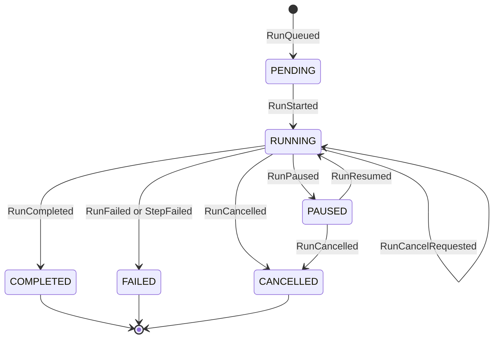
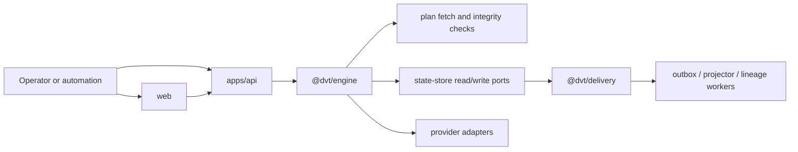

# Canonical run lifecycle subsystem

This subsystem documents the implemented run lifecycle and the component flow
that turns runtime commands into persisted events, snapshots, and downstream
delivery.

It is not a component. It is the end-to-end lifecycle flow across the engine,
API, state-store, and delivery surfaces.

## Implemented Contract

## Flow Across Components

## Source Of Truth Rules

- lifecycle truth comes from persisted run events and derived snapshots;
- the engine owns lifecycle semantics and provider dispatch;
- the API owns authenticated command and query entrypoints;
- delivery consumes emitted runtime facts downstream and does not redefine the
  lifecycle model.

## Canonical Components In This Flow

- [@dvt/engine](../../../components/engine/index.md)
- [apps/api](../../../components/api/index.md)
- [@dvt/delivery](../../../components/delivery/index.md)
- [web](../../../components/web/index.md)

## Code Anchors

- engine lifecycle facade and core:
  [WorkflowEngine.ts](../../../../../packages/@dvt/engine/src/core/WorkflowEngine.ts),
  [WorkflowEngineCoreService.ts](../../../../../packages/@dvt/engine/src/core/WorkflowEngineCoreService.ts)
- API runtime command/query surface:
  [startRunRoute.ts](../../../../../apps/api/src/entrypoints/http/startRunRoute.ts),
  [getRunRoute.ts](../../../../../apps/api/src/entrypoints/http/getRunRoute.ts),
  [getRunEventsRoute.ts](../../../../../apps/api/src/entrypoints/http/getRunEventsRoute.ts)
- delivery path:
  [OutboxWorkerRuntime.ts](../../../../../packages/@dvt/delivery/src/application/OutboxWorkerRuntime.ts),
  [ProjectorWorkerRuntime.ts](../../../../../packages/@dvt/delivery/src/application/ProjectorWorkerRuntime.ts)

## Related Pages

- [System Architecture](../../index.md)
- [Subsystem Architecture](../index.md)
- [@dvt/engine](../../../components/engine/index.md)
- [Execution Domain](../../../domain-execution.md)
