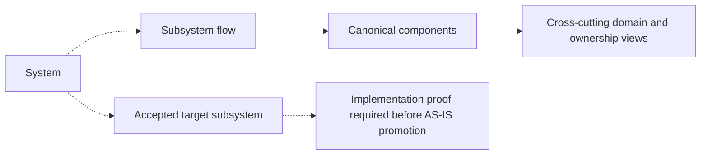

# Subsystem Architecture

Subsystem pages document end-to-end flows across components.

A subsystem is not a package and it is not a second home for a component.
Subsystem docs exist to explain how several canonical components cooperate to
serve a product capability.

A target subsystem may also document an accepted boundary that is not yet fully
implemented, but it MUST be marked `Target` and MUST NOT be cited as AS-IS
implementation evidence until the delivery proof exists.

## Rules

- `docs/architecture/components/<component>/` is the canonical home for a real
  workspace component.
- subsystem pages explain flow, source of truth, handoffs, and dependency
  direction;
- subsystem pages must link back to the canonical component pages they compose;
- domain pages remain a separate ownership view;
- target subsystem pages must distinguish accepted design from implemented
  source truth.

## Current Subsystem Entry Points

- [Canonical run lifecycle](./canonical-run-lifecycle/index.md): the
  implemented run-state machine and the end-to-end command to event flow.
- [Read subsystem](./read/index.md): operator read flows from browser to backend,
  read models, and engine-backed enrichment.
- [Runtime subsystem](./runtime/index.md): governed runtime component grouping
  across engine, run domain, state-store, delivery, interpretation,
  verification, DSL, deterministic utilities, and CLI validation.

## Accepted Target Subsystem Entry Points

- [Semantic transformation - VTX2 Target](./semantic-transformation/index.md):
  language-neutral card semantics over a pinned Substrait logical profile plus
  stable DVT authoring identity/provenance, with SQL/visual adapters and an
  explicit handoff to provider readiness and the existing generic planner.

## Navigation Model

## Related Pages

- [System Architecture](../index.md)
- [Architecture Component Surfaces](../../components/index.md)
- [DVT Domain Map](../../domain-map.md)
- [ADR-0064 - Substrait semantic reference and bounded logical profile](../../../adr/ADR-0064-substrait-semantic-reference-and-bounded-logical-profile.md)
