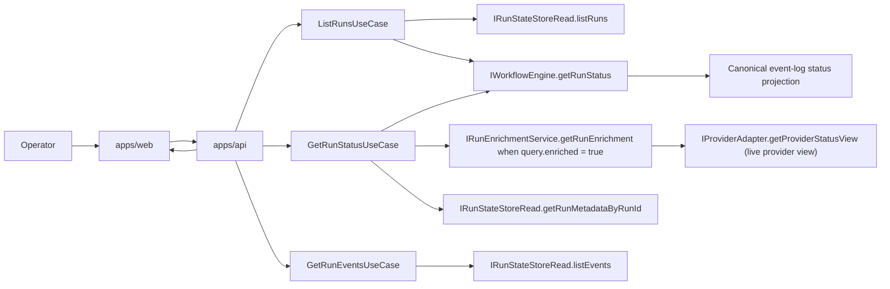

# Read subsystem

The read subsystem covers operator-facing retrieval of run lists, run detail,
run timeline, and the supporting workspace context needed to inspect runtime
state.

It is a cross-component flow. The subsystem does not own its own package.

## Primary Flow

## Source Of Truth Rules

- run-list summaries combine state-store metadata with engine-backed canonical
  event-log status through one shared operational projection;
- run detail starts from the same run metadata and canonical status projection;
- provider live status can enrich operator detail, but it must not override the
  canonical event-log-backed status returned by `getRunStatus`;
- timeline events come from event-store reads, not from the summary list path;
- the web shell renders read results, but it does not derive runtime truth by
  itself.

## Canonical Components In This Flow

- [web](../../../components/web/index.md)
- [apps/api](../../../components/api/index.md)
- [@dvt/engine](../../../components/engine/index.md)
- [@dvt/delivery](../../../components/delivery/index.md)

## Code Anchors

- web route and workspace wiring:
  [RunsView.tsx](../../../../../apps/web/src/app/views/RunsView.tsx),
  [useRunWorkspace.ts](../../../../../apps/web/src/app/views/runs/useRunWorkspace.ts),
  [runWorkspaceFacade.ts](../../../../../apps/web/src/app/services/runs/runWorkspaceFacade.ts),
  [runsService.ts](../../../../../apps/web/src/app/services/runs/runsService.ts)
- API entrypoints:
  [listRunsRoute.ts](../../../../../apps/api/src/entrypoints/http/listRunsRoute.ts),
  [getRunRoute.ts](../../../../../apps/api/src/entrypoints/http/getRunRoute.ts),
  [getRunEventsRoute.ts](../../../../../apps/api/src/entrypoints/http/getRunEventsRoute.ts)
- API read services:
  [listRunsUseCase.ts](../../../../../apps/api/src/application/services/listRunsUseCase.ts),
  [getRunStatusUseCase.ts](../../../../../apps/api/src/application/services/getRunStatusUseCase.ts),
  [runOperationalTruth.ts](../../../../../apps/api/src/application/services/runOperationalTruth.ts)
- engine read surface:
  [WorkflowEngine.ts](../../../../../packages/@dvt/engine/src/core/WorkflowEngine.ts),
  [RunEnrichmentService.ts](../../../../../packages/@dvt/engine/src/services/RunEnrichmentService.ts)

## Current Posture

The read subsystem is real and production-shaped. It exposes two complementary
read patterns without allowing them to disagree on shared operational fields:

- metadata plus canonical event-log-backed summary and detail reads;
- event-timeline reads for operator diagnostics.

`RunOperationalTruthDto` is the shared list/detail projection. Persisted
metadata owns platform identity and creation time. Canonical status owns
lifecycle status, start/completion times, execution evidence, and duration.
Missing lifecycle evidence stays absent through the HTTP and browser adapters;
neither `createdAt` nor a local clock is substituted for `startedAt`.

Active run detail and run-list queries use separate refresh budgets. Detail is
the operator's focused surface and refreshes quickly enough to converge after a
terminal event; the list retains a lower-frequency budget so one active run
does not turn a broad status projection into a high-rate fan-out query. Both
budgets stop once their observed runs are terminal.

The current API shape keeps canonical status and optional enrichment inside one
use case:

- `GetRunStatusUseCase` calls `engine.getRunStatus(...)` by default;
- the same use case switches to
  `runEnrichmentService.getRunEnrichment(...)` when `query.enriched = true`;
- the enriched response keeps canonical status at the top level and exposes
  provider diagnostics under `providerView`;
- there is no separate `EnrichRunStatusUseCase` in the current code.

The documentation rule is to explain those two paths as one subsystem while
keeping the source of truth explicit at each step and avoiding target-state
interactors on active/current pages.

The contract reset under `AR-A12-B` is now reflected in the active boundary:
`CanonicalRunStatus`, `RunStatusEnrichment`, and `ProviderRunStatusView` are
explicit models. `AR-A12-C` is now closed with regression guards that keep
enrichment on `IRunEnrichmentService` and keep the narrowed
`IWorkflowEngine` facade from silently regrowing provider-backed read
responsibilities.

## Related Pages

- [System Architecture](../../index.md)
- [Subsystem Architecture](../index.md)
- [DVT Component Map](../../../component-map.md)
- [UI / Visualization Domain](../../../domain-ui.md)
- [API / Entry Domain](../../../components/api/index.md)
