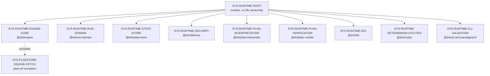

# Runtime Subsystem

The runtime subsystem groups the packages that execute, validate, interpret,
persist, move, and inspect run-time behavior. It is not a second component home
for `@dvt/engine` or `@dvt/delivery`; those remain canonical package component
pages. This page explains how the runtime governance module composes those
components.

## Entry Points

- [Runtime root subdivision component guide](./runtime-root-subdivision-component.md)
- [Runtime root subdivision user stories](./runtime-root-subdivision-user-stories.md)

## Current Runtime Component Model

## Canonical Component Homes

- `@dvt/engine`: [component page](../../../components/engine/index.md)
- `@dvt/delivery`: [component page](../../../components/delivery/index.md)
- `@dvt/cli`: [shared CLI page](../../../shared/cli.md)

The remaining runtime package component pages should be added only when a
package needs a single active component home with its own API, invariants, and
consumer map. Until then, this subsystem guide is the authoritative governance
grouping surface.
