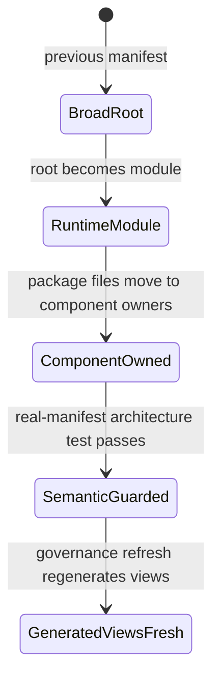
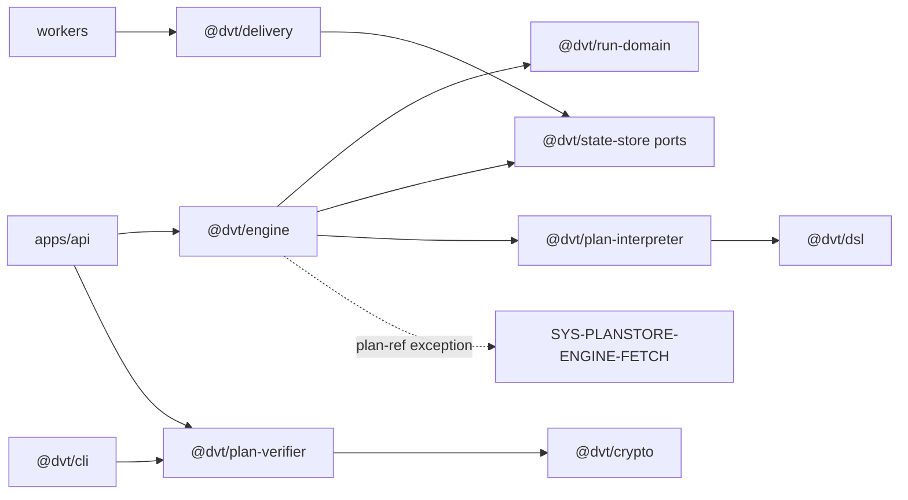

# Runtime Root Subdivision Component Guide

## Purpose

`SYS-RUNTIME-ROOT` exists to group runtime components, not to own runtime files.
The contract is: every tracked runtime package file must belong to exactly one
runtime subcomponent, except plan-store engine-fetch files that remain owned by
`SYS-PLANSTORE-ENGINE-FETCH`.

## Why This Exists

The previous runtime root mixed engine orchestration, run-domain invariants,
state-store lifecycle, event delivery, plan interpretation, plan verification,
DSL parsing, deterministic utilities, and CLI validation. That shape made the
component registry answer "runtime owns this" instead of answering the useful
question: "which component owns this API, invariant, consumer, and test?"

## Public API And Consumers

| Component                           | Public API                                                                            | Main consumers                                             |
| ----------------------------------- | ------------------------------------------------------------------------------------- | ---------------------------------------------------------- |
| `SYS-RUNTIME-ENGINE-CORE`           | `@dvt/engine` entrypoint, `IWorkflowEngine`, run use cases, runtime services          | API composition, workers, Temporal adapter, tests          |
| `SYS-RUNTIME-RUN-DOMAIN`            | `applyRunEvent`, transition policy exports, projectable event mapper                  | Engine projector, state-store tests, lifecycle projections |
| `SYS-RUNTIME-STATE-STORE`           | `RunStateCommandPort`, archive lifecycle services, object-store adapters              | Engine/state adapters, retention jobs, archive workflows   |
| `SYS-RUNTIME-DELIVERY`              | `OutboxWorkerRuntime`, `ProjectorWorkerRuntime`, shard assignment, backpressure guard | outbox/projector workers, API admission support            |
| `SYS-RUNTIME-PLAN-INTERPRETATION`   | DAG validation and execution layer calculation                                        | Temporal adapter, planner/runtime validation paths         |
| `SYS-RUNTIME-PLAN-VERIFICATION`     | plan version admission, verification, hash and step-type checks                       | API, CLI validation, CI contract checks                    |
| `SYS-RUNTIME-DSL`                   | DSL v1 parse/evaluate API                                                             | planner/runtime expression handling                        |
| `SYS-RUNTIME-DETERMINISM-UTILITIES` | JCS canonicalization and SHA-256 digest helpers                                       | contract hashing, artifact hashing, verifier paths         |
| `SYS-RUNTIME-CLI-VALIDATION`        | script-backed validation metadata plus contract/golden-path scripts                   | contributors, CI, release checks                           |

## Invariants

- `SYS-RUNTIME-ROOT` is a `module` and must not own files.
- Runtime file ownership belongs to component units only.
- `packages/@dvt/engine/src/security/planRefPolicy.ts` and related plan-ref
  files remain owned by `SYS-PLANSTORE-ENGINE-FETCH`.
- Component entrypoints must state their `@ownedConcern`.
- No runtime package should reintroduce a placeholder export to satisfy build
  tooling.
- Semantic architecture tests must use real tracked files, not only synthetic
  manifest fixtures.

## State And Transition Model



## Dependency Direction



## Error Model

This slice does not add runtime errors. Its error model is governance failure:

- manifest coverage fails when a tracked file has zero or multiple owners;
- semantic architecture test fails when runtime root owns files again;
- CLI test fails if `@dvt/cli` falls back to an unnamed placeholder export;
- generated docs checks fail when component/file indexes are stale.

## Security Rules

- Engine plan-ref policy stays in the plan-store component boundary because it
  protects scoped plan artifact access.
- Runtime component splitting must not grant a package authority over another
  package's data path.
- CLI validation metadata is descriptive; it does not authorize commands.

## Configuration

The manifest source is:

- `docs/planning/status/system-governance-unit-index.units.yaml`

Generated projections are refreshed by:

- `pnpm governance:refresh`
- `pnpm docs:governance:unit-coverage`

## Observability And Runtime Evidence

This is an architecture/governance slice. Runtime observability is unchanged.
Evidence is provided by:

- semantic architecture test:
  `node --test scripts/check-governance-unit-coverage.test.cjs`;
- manifest coverage:
  `pnpm docs:governance:unit-coverage`;
- generated governance views after refresh;
- package-level CLI test:
  `pnpm --filter @dvt/cli test`.

## Traceability

```text
Requirement
  Runtime components must answer ownership, API, invariant, consumer, and test questions.
Decision
  Runtime root is a module; runtime files move to component units.
Design
  Runtime subsystem guide plus component manifest split.
Contract
  Real tracked runtime files must resolve to exact runtime component IDs.
Code
  system-governance-unit-index.units.yaml
Test
  check-governance-unit-coverage.test.cjs
Runtime evidence
  docs:governance:unit-coverage and governance refresh outputs
```

## Tests

- `node --test scripts/check-governance-unit-coverage.test.cjs`
- `pnpm docs:governance:unit-coverage`
- `pnpm --filter @dvt/cli test`

## Lifecycle Policy

Runtime subcomponents may be split further only when the planning surface names
the parent chain, DDD owner, command/query posture, owned paths, dependency
rules, negative tests, and drift removed. Broad runtime roots must not regain
file ownership.
