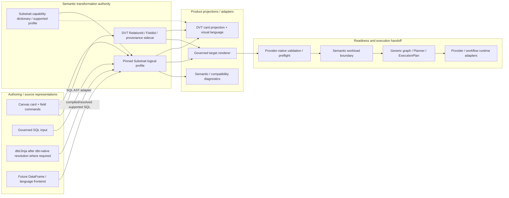

# Semantic Transformation Subsystem - VTX2 Target

## Purpose

This subsystem describes how DVT will author, project, translate, validate, and
lower language-neutral transformation semantics without turning SQL syntax,
Canvas presentation, or workflow execution into the semantic authority.

It is a **target VTX2 architecture**. It does not claim that the current main
branch already implements the complete flow.

Governing decision: [ADR-0064](../../../../adr/ADR-0064-substrait-semantic-reference-and-bounded-logical-profile.md).
Detailed design: [VTX2 Substrait Semantic Reference Design](../../../../planning/proposals/mandatory/runtime-and-contracts/vtx2-substrait-semantic-reference-design-20260824.md).

## System Boundary



## Core Separation

Three counts are intentionally independent:

```text
Substrait logical operators
!= Canvas cards
!= ExecutionPlan steps
```

- Substrait logical operators describe transformation meaning.
- Canvas cards describe user-authored semantic flow boundaries.
- ExecutionPlan steps describe real runtime responsibilities.

A join, set, aggregate, window, project, or scalar function does not become a
runtime step by existing in the semantic plan.

## Authorities

| Concern                                       | Authority                                 |
| --------------------------------------------- | ----------------------------------------- |
| relational/expression/type/function meaning   | pinned Substrait profile                  |
| supported/candidate semantic capability state | #2639 capability dictionary               |
| stable editable relation/field identity       | DVT binding sidecar                       |
| Canvas/workflow topology                      | Workspace Graph Draft / canonical graph   |
| card vocabulary and interaction               | DVT visual projection / #2635             |
| SQL syntax representation                     | selected SQL parser AST adapter           |
| canonical SQL architecture/style              | project query policy + renderer           |
| provider/catalog/type/function readiness      | provider-native preflight                 |
| runtime dependency/selection/steps            | generic planner / ExecutionPlan           |
| persistence/materialization mechanics         | provider/materialization adapter boundary |

No downstream projection may silently replace an upstream authority.

## Semantic Profile

The first admitted VTX2 profile is bounded to capabilities proven by product
fixtures and draws from Substrait's standard logical semantics, including the
families required for:

```text
Read/Input
Project
Filter
Join
Set
Aggregate
Sort
Fetch
scalar / aggregate / window expressions
cast / conditional expressions
required portable type/function identities
```

The full upstream Substrait universe is a **reference dictionary**, not an
automatic DVT feature list.

A new semantic operation enters DVT only through the standard-first admission
owned by #2639/#2641.

## Stable DVT Bindings

Substrait structural/positional field references are not sufficient as
interactive product identity.

DVT therefore binds stable authoring identity to the semantic plan:

```text
RelationId
FieldId
source/provenance identity
semantic field/relation path or ordinal binding
```

These bindings survive supported rename/reorder/reload operations and allow
lineage and presentation to refer to identity without embedding display names
or Canvas coordinates in semantic meaning.

The binding layer must not duplicate Substrait relation/expression semantics.

## Authoring Flow

### Visual -> semantic -> code

```text
field/relation card command
 -> admitted capability lookup
 -> semantic plan mutation
 -> stable binding mutation if identity changes
 -> card projection
 -> governed target renderer
 -> provider-native validation
```

Dragging a function onto a field is one possible interaction. Keyboard/menu
commands must reach the same semantic mutation.

### SQL -> semantic -> card

```text
SQL input
 -> dialect parser AST
 -> supported semantic mapping
 -> DVT stable binding resolution
 -> card projection
 -> optional visual semantic edit
 -> canonical project-governed SQL renderer
```

The supported roundtrip preserves semantic meaning, not arbitrary source
whitespace or formatting.

### dbt/Jinja

```text
dbt/Jinja source
 -> dbt-native resolution/compile when required
 -> supported SQL/AST
 -> semantic mapping
```

Unresolved arbitrary macros are not silently interpreted as relational
semantics.

## Multi-Input Composition

A relation composition can collapse visible input cards in one branch into one
resulting semantic card while retaining source/provenance identity internally.

For example:

```text
Orders + Customers + Countries
       -> one semantic relation card
```

may contain a recursive logical join structure without producing synthetic
`Orders step`, `Customers step`, or `Join step` runtime work.

Explicit materialization, provider-transfer, control/check, or reusable semantic
boundaries remain separate when they have real product/runtime meaning.

## Capability Dictionary

Epic #2639 establishes Substrait as the semantic operation dictionary DVT
consults before defining any DVT-specific operation.

The catalog distinguishes:

```text
supported-profile
candidate-standard
candidate-extension
gap
out-of-scope
```

and separately projects:

```text
renderer/provider support
visual exposure
```

This lets DVT use a broad standard vocabulary without exposing or executing
capabilities before the product admits them.

## Versioning and Compatibility

The product pins an exact Substrait profile/version/tool boundary.

Profile upgrades must test:

- semantic capability delta;
- protobuf/serialization delta;
- type/function extension delta;
- producer/consumer/validator compatibility;
- target renderer/provider behavior;
- stable DVT binding compatibility.

Known risk areas from #2638 include protobuf normalization, function extension
identities, timestamp/interval/UDT details, ordering/decimal/null portability,
validator version lag, consumer skew, and generated TypeScript binding changes.

A version mismatch is not automatically an invalid semantic plan. Diagnostics
must distinguish compatibility, semantic, renderer, and provider failures.

## Current-To-Target Convergence

VTX2 reuses the proven current rails but removes duplicate semantic authorities.

Target convergence includes:

- `VisualTransformRecipeV1` becomes a bounded compatibility input or is retired
  after deterministic translation to the semantic profile;
- `selectedColumns` ceases to be current authoring truth;
- current recipe/compiler/UI operation catalogs converge on one semantic
  capability catalog/projection;
- SQL-specific `groupBy/having/join/window` top-level recipe growth is avoided;
- fixed exactly-three-node SQL-first validation is removed from current product
  admission under #2524;
- provider validation, generic planning, run state, and materialization ownership
  remain in their current bounded contexts.

## Delivery Owners

- #2594 - VTX2 parent semantic-card direction
- #2595 - pinned Substrait profile + DVT stable identity sidecar
- #2597 - SQL AST mapping and governed target SQL renderer
- #2598 - card/field semantic authoring
- #2599 - SQL <-> semantic profile/bindings <-> Card E2E proof
- #2634 - multi-input composition
- #2635 - DVT visual language
- #2639 - Substrait capability dictionary
- #2640 - machine-readable capability catalog
- #2641 - standard-first admission/conformance
- #2642 - UI capability projection
- #2643 - profile upgrade governance
- #2524 - semantic workload lowering / rigid topology retirement

## Non-Goals

- Substrait physical-plan adoption as DVT runtime planning;
- query optimization or join reordering;
- exposing all upstream capabilities in the UI;
- a second DVT relational/type/function hierarchy;
- provider support inferred from semantic validity;
- another graph or planner abstraction;
- a bespoke TypeScript Substrait framework unless measured needs justify it.

## References

- https://substrait.io/spec/specification/
- https://substrait.io/relations/logical_relations/
- https://substrait.io/expressions/field_references/
- https://substrait.io/types/type_system/
- https://substrait.io/extensions/
