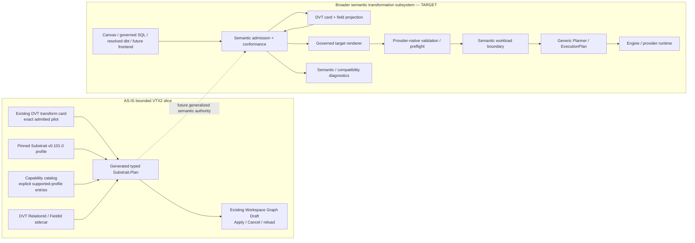
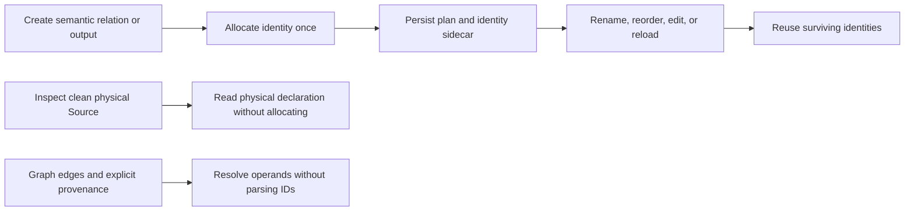

# Semantic Transformation Subsystem - VTX2 Target

## Purpose

This subsystem describes how DVT authors, projects, translates, validates, and lowers
language-neutral transformation semantics without turning SQL syntax, Canvas presentation,
or workflow execution into the semantic authority.

The **complete subsystem remains target architecture**. Since the original target was
written, however, one deliberately bounded Canvas -> typed Substrait authoring slice has
landed on `main`. This page therefore separates the implemented slice from the still-target
end-to-end route.

Governing decision: [ADR-0064](../../../../adr/ADR-0064-substrait-semantic-reference-and-bounded-logical-profile.md).
Detailed design: [VTX2 Substrait Semantic Reference Design](../../../../planning/proposals/mandatory/runtime-and-contracts/vtx2-substrait-semantic-reference-design-20260824.md).
Accepted pilot evidence: [ED-20260826 VTX2 typed Substrait card pilot](../../../../evidence/ED-20260826-vtx2-substrait-card-pilot.md).

## Posture

| Slice                                                                                 | Current posture                                           |
| ------------------------------------------------------------------------------------- | --------------------------------------------------------- |
| Pinned Substrait profile, semantic document, SHA binding and DVT identity sidecar     | AS-IS                                                     |
| Machine-readable Substrait capability catalog                                         | AS-IS governance surface                                  |
| Exact Canvas typed-authoring pilot `customers.name -> trim -> upper -> customer_name` | AS-IS                                                     |
| General Canvas semantic authoring grammar                                             | TARGET                                                    |
| Governed SQL -> Substrait mapping                                                     | TARGET                                                    |
| Resolved dbt -> Substrait mapping                                                     | TARGET                                                    |
| Substrait -> governed target renderer                                                 | TARGET; bounded PostgreSQL work may exist in unmerged PRs |
| Provider-native readiness after semantic rendering                                    | TARGET for the VTX2 semantic route                        |
| Semantic workload lowering into the generic Planner                                   | TARGET                                                    |
| General joins/sets/aggregates/windows authoring                                       | TARGET unless separately admitted and merged              |

Open PRs and accepted proposals can refine target direction but do not change these AS-IS
labels until their executable evidence is merged to `main`.

## System Boundary



## Core Separation

Three counts are intentionally independent:

```text
Substrait logical operators
!= Canvas cards
!= ExecutionPlan steps
```

- Substrait logical operators describe transformation meaning.
- Canvas cards describe user-authored semantic/product flow boundaries.
- `ExecutionPlan` steps describe real runtime responsibilities.

A join, set, aggregate, window, project, or scalar function does not become a runtime step
merely by existing in the semantic plan.

Semantic validity is also independent from renderer support, provider readiness, and visual
exposure.

## Authorities

| Concern                                      | Authority                                                   |
| -------------------------------------------- | ----------------------------------------------------------- |
| relational/expression/type/function meaning  | pinned Substrait profile                                    |
| admitted/candidate semantic capability state | `DvtSubstraitCapabilityCatalog.v1`                          |
| stable editable relation/field identity      | DVT Substrait authoring sidecar                             |
| Canvas/workflow topology                     | protected Workspace Graph Draft / canonical authoring graph |
| card vocabulary and interaction              | DVT visual projection                                       |
| SQL syntax representation                    | selected SQL parser/AST adapter when implemented            |
| canonical target SQL style                   | governed renderer + project query policy                    |
| provider/catalog/type/function readiness     | provider-native validation/preflight                        |
| runtime dependency/selection/steps           | generic Planner / `ExecutionPlan`                           |
| run lifecycle                                | Engine / Run Domain / persisted run-event rail              |
| persistence/materialization mechanics        | existing artifact/provider/materialization boundaries       |

No downstream projection may silently replace an upstream authority.

## AS-IS: First Typed Substrait Authoring Pilot

Current `main` contains one narrow production-entry fixture implemented in the existing Web
Canvas authoring rail:

```text
customers(name, email, country)
name -> trim -> upper -> customer_name
```

The implementation:

- constructs and edits generated Substrait v0.101.0 protobuf types directly;
- uses a `ReadRel -> ProjectRel` shape with field selection and scalar functions;
- keeps stable DVT relation/field identity in the existing sidecar;
- requires exact `supported-profile` capability admission before authoring a pilot function;
- re-encodes protobuf bytes, recomputes SHA-256, and binds the sidecar to that SHA on Apply;
- reuses the existing Workspace Graph Draft Apply/Cancel/reload path;
- fails closed for hidden or unsupported semantic shapes;
- rejects removed VTX1 and editable-SQL authoring metadata instead of admitting a second
  semantic authority.

This proves a semantic-authoring pattern. It does **not** prove a general semantic editor,
SQL rendering, provider execution, joins, aggregates, windows, or a universal visual grammar.

## AS-IS: Exact Admitted Capability Set

The capability catalog contains a broader standard-first candidate dictionary, but only a
small pilot subset is currently promoted to `supported-profile` on `main`:

| Category        | Supported pilot semantic identity                   |
| --------------- | --------------------------------------------------- |
| relation        | `substrait.ReadRel` / `read_type.named_table`       |
| relation        | `substrait.RelCommon` / `emit_kind.emit`            |
| relation        | `substrait.ProjectRel`                              |
| expression form | `substrait.Expression` / `rex_type.selection`       |
| expression form | `substrait.Expression` / `rex_type.scalar_function` |
| type            | `substrait.Type` / `kind.string`                    |
| scalar function | `extension:io.substrait:functions_string` / `trim`  |
| scalar function | `extension:io.substrait:functions_string` / `upper` |

Entries such as Filter, Join, Set, Aggregate, Sort, Fetch, additional types, aggregate/window
functions, and other scalar functions may exist in the catalog as `candidate-standard` or
product needs. Their presence is **not** evidence that DVT currently admits, renders,
executes, or exposes them.

This corrects the earlier broad wording that could be read as if all of those families were
already inside the first admitted profile.

## Stable DVT Bindings

Substrait structural/positional field references are not sufficient as interactive product
identity.

DVT therefore binds stable authoring identity to the semantic plan:

```text
RelationId
FieldId
source/provenance identity
display identity where required by the product
semantic field/relation ordinal binding
```

New relation and output identities are assigned once by `allocateDvtRelationId()` and
`allocateDvtFieldId()` from `@dvt/contracts`, backed by the existing `@dvt/crypto`
UUIDv7 primitive. They do not encode names, graph node IDs, ordinals, expressions, or
physical bindings. Existing persisted IDs remain opaque values and are never mass-rekeyed.



A physical Source inspection does not manufacture a semantic projection. A new or duplicated
semantic object receives fresh identity; editing or reopening an existing object preserves
its surviving identities. JOIN and SET operand resolution uses graph context and explicit
provenance, independently of identifier text. Creating an output returns its actual allocated
`createdFieldId` to the existing authoring command caller.

These bindings support rename/reload identity guarantees without duplicating Substrait
relation/expression semantics. The sidecar must not grow into a second relational IR.

## TARGET: General Authoring And Translation Flow

### Visual -> semantic -> code

```text
field/relation card command
 -> admitted capability lookup
 -> semantic plan mutation
 -> stable binding mutation if identity changes
 -> card projection
 -> governed target renderer
 -> provider-native validation
```

The current pilot proves only one field-function chain inside this direction. General
operations remain separately admitted slices.

### SQL -> semantic -> card

```text
SQL input
 -> selected dialect parser AST
 -> supported semantic mapping
 -> DVT stable binding resolution
 -> card projection
 -> optional semantic edit
 -> canonical governed target renderer
```

The supported roundtrip preserves semantic meaning, not arbitrary source whitespace or
formatting.

A concrete parser/renderer library is an implementation choice, not semantic authority.
Current V0 work may deliberately reuse PostgreSQL-native tooling already in the repository;
SQLGlot remains a candidate rather than current architecture until code adopts it for a real
need.

### dbt/Jinja

```text
dbt/Jinja source
 -> dbt-native resolution/compile when required
 -> supported SQL/source representation
 -> semantic mapping
```

Unresolved arbitrary macros are not silently interpreted as relational semantics.

## TARGET: Multi-Input Composition

A relation composition may collapse visible input cards in one branch into one resulting
semantic card while retaining source/provenance identity internally.

For example:

```text
Orders + Customers + Countries
       -> one semantic relation card
```

may contain a recursive Substrait join structure without producing synthetic source or join
runtime steps.

An open or stacked PR that demonstrates one exact join fixture is useful evidence for the
next slice, but it remains target until merged and accepted on `main`.

## TARGET: Renderer, Readiness And Workload Lowering

The target keeps three concerns separate:

```text
semantic validity
  -> governed target rendering
  -> provider-native validation / preflight
  -> semantic workload lowering
  -> generic Planner
```

Only real operational responsibilities enter the existing Planner. Logical operators do not
become steps mechanically.

Generated SQL/Python or other target text is a derived projection, not recipe authority.
Storage/caching/versioning of generated projections should reuse existing artifact boundaries
and be introduced only when executable evidence requires it.

## Current-To-Target Convergence

VTX2 removes duplicate semantic authorities rather than adding another framework:

- canonical Substrait authoring is the only writable DVT Transform authority;
- VTX1 recipes, editable DVT SQL, their mirror, and the visual-to-SQL compiler are retired;
- existing workspace SQL files remain readable artifacts, not an authoring fallback;
- one Substrait capability governance surface replaces parallel operation catalogs;
- provider validation, generic planning, run lifecycle, state and artifact ownership remain in
  their existing bounded contexts;
- no new store, service, builder framework, renderer framework, graph abstraction, or private
  relational hierarchy is justified merely to make the first pilots look more generic.

## Non-Goals

- a private DVT relational IR parallel to Substrait;
- one DVT class/node/step per relational operator;
- a DVT-owned type or function system parallel to Substrait;
- Substrait physical plans as DVT runtime planning;
- query optimization or join reordering;
- automatic UI exposure of all upstream Substrait capabilities;
- provider support inferred from semantic validity;
- another graph/planner abstraction;
- a bespoke TypeScript Substrait framework without measured need.

## Completion Criteria For The Broader Target

The complete subsystem should not be promoted from TARGET until executable evidence proves,
at minimum:

1. supported source/authoring inputs map deterministically into the pinned semantic profile;
2. unsupported semantics fail closed with useful diagnostics;
3. stable `RelationId` / `FieldId` identity survives all supported edit/roundtrip cases;
4. card projection and target rendering consume the same admitted semantic authority;
5. provider-native validation remains distinct from semantic validation;
6. semantic workload lowering produces generic Planner input without one-step-per-operator
   expansion;
7. the accepted SQL/semantic/card roundtrip profile is demonstrated end to end;
8. runtime execution continues to use existing Planner, Engine, State and Artifacts
   authorities.

## Delivery State

- #2598 / PR #2658 — **merged and accepted**: first typed Canvas/Substrait authoring pilot.
- #2597 / PR #2659 — pending: bounded PostgreSQL projection from the typed pilot; not AS-IS
  until merged.
- #2634 / PR #2686 — stacked/draft: first bounded inner-join composition slice; not AS-IS.
- #2640 — capability catalog exists on `main`; the admitted subset changed with #2658.
- remaining VTX2 slices continue under their owning issues/PRs and must be re-evaluated from
  `main` before their status is reflected here.

## References

- [ADR-0064](../../../../adr/ADR-0064-substrait-semantic-reference-and-bounded-logical-profile.md)
- [Typed Substrait pilot evidence](../../../../evidence/ED-20260826-vtx2-substrait-card-pilot.md)
- [`DvtSubstraitProfile.v1.ts`](../../../../../packages/@dvt/contracts/src/contracts/planner/DvtSubstraitProfile.v1.ts)
- [`DvtSubstraitCapabilityCatalog.v1.ts`](../../../../../packages/@dvt/contracts/src/contracts/planner/DvtSubstraitCapabilityCatalog.v1.ts)
- [`canvasDvtSubstraitPilot.ts`](../../../../../apps/web/src/app/views/canvas/canvasDvtSubstraitPilot.ts)
- https://substrait.io/spec/specification/
- https://substrait.io/relations/logical_relations/
- https://substrait.io/expressions/field_references/
- https://substrait.io/types/type_system/
- https://substrait.io/extensions/

### Multi-input Canvas lineage

The existing ProjectCanvasAuthoringViewportGraph query projects JOIN and UNION ALL
column lineage from admitted Substrait semantics and sidecar references. UNION ALL
connects each selected output to its corresponding field in every input. Grouping
and grouped windows retain direct lineage for the group field; count and row-number
outputs are derived and must not invent direct field mappings. Binding requires an
exact, unambiguous incoming graph closure and explicit connected-source references.
Disconnected, ambiguous, or invalid authority yields no lineage.
