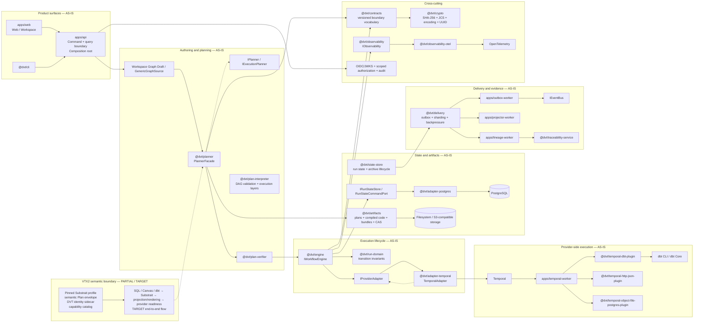

# DVT Current Component Architecture

This page is a source-first derived view of the executable DVT architecture at
`main@da5b97b4376789cc561d54fcdf6663c062727ece`.

It does not replace the canonical [System Architecture](../index.md),
[Reference Architecture](../../reference-architecture.md), component pages, or
accepted ADRs. If this view conflicts with current source, tests, runtime wiring,
or a newer canonical architecture page, the executable system wins.

## Scope

This view answers one question: **which first-class components exist today and
how do they compose at runtime?**

Classification:

- **AS-IS**: implemented in current source/runtime composition.
- **PARTIAL**: a real contract or implementation exists, but product coverage is incomplete.
- **TARGET**: accepted direction that is not yet an end-to-end executable subsystem.
- **EXTERNAL**: third-party runtime or library actually used by current code.

## Current runtime shape

The arrows above show responsibility and runtime handoff, not TypeScript import
edges. For package dependency enforcement use repository architecture tests and
package-level component documentation.

## What is deliberately central

### API composition root

`apps/api/src/modules/buildProtectedRuntimeModule.ts` is the current protected
runtime composition root. It binds planner, validation, execution, storage,
security, workspace authoring, dbt import and provider adapters.

This is more accurate than a generic "thin core + DI container" diagram. DVT
uses explicit composition; the composition root is not itself domain authority.

### Planning and execution are separate

`PlannerFacade` is the stable public entry to `@dvt/planner`. The planner builds
deterministic execution responsibilities. `IWorkflowEngine` governs run
lifecycle and delegates provider-specific execution through `IProviderAdapter`.

`TemporalAdapter` implements `IProviderAdapter`, not `IWorkflowEngine`.

### State and provider status are different truths

Canonical DVT run status is derived from the persisted event log and materialized
snapshot. Provider-native status may be used for diagnostics/enrichment, but it
does not replace canonical DVT state.

### State and artifacts are separate bounded concerns

- **State** answers: what happened to the run?
- **Artifacts** answer: which exact immutable plan, compiled object, bundle or
  execution context was used or produced?

### Delivery is not a universal bus

`@dvt/delivery` owns outbox movement, projection refresh, sharding and
start-run backpressure. `IEventBus` is a delivery boundary. Current runtime
implementations include HTTP and logging delivery; the architecture does not
require all commands or queries to pass through a message bus.

## Current component catalog

| Component | Status | Primary source | Responsibility |
| --- | --- | --- | --- |
| Web / Workspace | AS-IS | `apps/web` | Product UI, Canvas/workbench, projected plugin contributions |
| API | AS-IS | `apps/api` | Authenticated command/query rails and composition root |
| Planner | AS-IS | `packages/@dvt/planner` | Deterministic graph selection and `ExecutionPlan` construction |
| Plan Verifier | AS-IS | `packages/@dvt/plan-verifier` | Admission, version/integrity/configuration validation |
| Plan Interpreter | AS-IS | `packages/@dvt/plan-interpreter` | Adapter-agnostic DAG validation and execution layering |
| Engine | AS-IS | `packages/@dvt/engine` | Run lifecycle, provider delegation, status/control/recovery |
| Run Domain | AS-IS | `packages/@dvt/run-domain` | Event folding and legal state transitions |
| State Store | AS-IS | `packages/@dvt/state-store` | Run-state boundary plus archive/retention/restore lifecycle |
| Postgres Adapter | AS-IS | `packages/@dvt/adapter-postgres` | PostgreSQL implementations of current persistence boundaries |
| Artifacts | AS-IS | `packages/@dvt/artifacts` | Plan/artifact/bundle/context persistence and integrity |
| Temporal Adapter | AS-IS | `packages/@dvt/adapter-temporal` | `IProviderAdapter` implementation for Temporal |
| Temporal Worker | AS-IS | `apps/temporal-worker` | Provider-side activity execution and plugin composition |
| DBT step plugin | AS-IS | `packages/@dvt/temporal-dbt-plugin` | DBT execution outside the generic Temporal adapter |
| HTTP JSON step plugin | AS-IS | `packages/@dvt/temporal-http-json-plugin` | HTTP JSON artifact acquisition |
| Object→Postgres step plugin | AS-IS | `packages/@dvt/temporal-object-file-postgres-plugin` | Content-addressed object/file materialization into PostgreSQL |
| Delivery | AS-IS | `packages/@dvt/delivery` | Outbox, sharding, retry/DLQ/replay rails and backpressure |
| Outbox Worker | AS-IS | `apps/outbox-worker` | Async outbox delivery |
| Projector Worker | AS-IS | `apps/projector-worker` | Derived projections/read models |
| Lineage Worker | AS-IS | `apps/lineage-worker` | Lineage/evidence downstream processing |
| Traceability | AS-IS | `packages/@dvt/traceability-service` | ADR/code traceability, validation and lineage evidence |
| Observability | PARTIAL | `packages/@dvt/observability*` | Metrics, traces, logs and OTel integration |
| Substrait semantic contract | PARTIAL | `packages/@dvt/contracts/src/substrait.ts` | Pinned semantic profile, DVT identity sidecar and capability catalog |
| VTX2 semantic transformation E2E | TARGET | `docs/architecture/system/subsystems/semantic-transformation/` | Source languages → Substrait → projection/rendering → readiness → Planner |

## External systems actually represented

- Temporal: current workflow provider.
- PostgreSQL: current operational persistence provider.
- dbt CLI/dbt Core: concrete DBT execution/integration path.
- Filesystem/S3-compatible object storage: artifact and archive storage options.
- OIDC/JWKS identity provider: authentication boundary.
- OpenTelemetry: observability standard integration.
- React, Vite, `@xyflow/react`, Monaco, TanStack Query and Zustand: current web foundations.

Candidates such as Conductor, BullMQ, Airflow, NATS, Kafka or RabbitMQ are not
shown because they are not current runtime implementations at this baseline.

## Sources

- [`apps/api/src/modules/buildProtectedRuntimeModule.ts`](../../../apps/api/src/modules/buildProtectedRuntimeModule.ts)
- [`packages/@dvt/planner/src/index.ts`](../../../../packages/@dvt/planner/src/index.ts)
- [`packages/@dvt/engine/src/ports/IWorkflowEngine.ts`](../../../../packages/@dvt/engine/src/ports/IWorkflowEngine.ts)
- [`packages/@dvt/engine/src/adapters/IProviderAdapter.ts`](../../../../packages/@dvt/engine/src/adapters/IProviderAdapter.ts)
- [`packages/@dvt/adapter-temporal/src/TemporalAdapter.ts`](../../../../packages/@dvt/adapter-temporal/src/TemporalAdapter.ts)
- [`packages/@dvt/run-domain/src/index.ts`](../../../../packages/@dvt/run-domain/src/index.ts)
- [`packages/@dvt/state-store/src/index.ts`](../../../../packages/@dvt/state-store/src/index.ts)
- [`packages/@dvt/artifacts/src/index.ts`](../../../../packages/@dvt/artifacts/src/index.ts)
- [`packages/@dvt/delivery/src/index.ts`](../../../../packages/@dvt/delivery/src/index.ts)
- [`docs/architecture/reference-architecture.md`](../../reference-architecture.md)
- [`docs/architecture/system/subsystems/semantic-transformation/index.md`](../subsystems/semantic-transformation/index.md)
