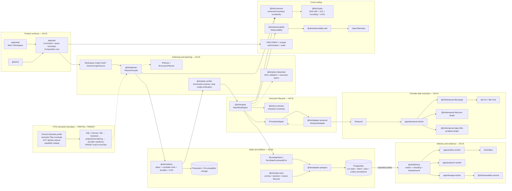

# DVT Current Component Architecture

This page is a source-first derived view of the executable DVT architecture at
`main@da5b97b4376789cc561d54fcdf6663c062727ece`.

It does not replace the canonical [System Architecture](../index.md),
[Reference Architecture](../../reference-architecture.md), component pages, the
Planning DB component model, or accepted ADRs. If this view conflicts with
current source, tests, runtime wiring, or a newer canonical architecture page,
the executable system wins.

## Scope

This view answers one question: **which major runtime and bounded-context
components explain the current system composition?**

It is deliberately **not** a complete component inventory. Repository governance
keeps the structured component inventory and exact directed relations outside
this authored system view; component pages remain the single authored home for
component-specific responsibilities.

Classification:

- **AS-IS**: implemented in current source/runtime composition.
- **PARTIAL**: a real contract or implementation exists, but product coverage is incomplete.
- **TARGET**: accepted direction that is not yet an end-to-end executable subsystem.
- **EXTERNAL**: third-party runtime or library actually used by current code.

## Current runtime shape

The arrows above show responsibility and runtime handoff, not TypeScript import
edges. For package dependency enforcement use repository architecture tests and
package-level component documentation.

## What is deliberately central

### API composition root

`apps/api/src/modules/buildProtectedRuntimeModule.ts` is the current protected
runtime composition root. It binds planner, validation, execution, storage,
security, workspace authoring, dbt import and provider adapters.

This is more accurate than a generic "thin core + DI container" diagram. DVT
uses explicit composition; the composition root is not itself domain authority.

### Planning and execution are separate

`PlannerFacade` is the stable public entry to `@dvt/planner`. The planner builds
deterministic execution responsibilities. `IWorkflowEngine` governs run
lifecycle and delegates provider-specific execution through `IProviderAdapter`.

`TemporalAdapter` implements `IProviderAdapter`, not `IWorkflowEngine`.

### API executability validation and Engine integrity admission are distinct

The current StartRun rail contains an API-side stored-plan executability gate and
an Engine-owned start-run admission/integrity gate. The first prevents obviously
unexecutable stored plans from reaching the Engine; the Engine still performs
its own scoped plan-integrity and capability checks before provider side effects.

The `@dvt/plan-verifier` package participates in parsing and step-type
configuration verification of stored executable plans; it is not the sole owner
of every runtime admission rule.

### State and provider status are different truths

Canonical DVT run status is derived from the persisted event log and materialized
snapshot. Provider-native status may be used for diagnostics/enrichment, but it
does not replace canonical DVT state.

Provider runtimes may originate realized lifecycle facts once work reaches the
provider; those facts become canonical product truth only through the persisted
DVT event/state rail.

### State and artifacts are separate bounded concerns

- **State** answers: what happened to the run?
- **Artifacts** answer: which exact immutable plan, compiled object, bundle or
  execution context was used or produced?

`@dvt/state-store` also owns archive, retention, verification and restore
lifecycle. The live operational PostgreSQL implementation is composed through
`@dvt/adapter-postgres` and Engine-owned state ports.

### Delivery is not a universal bus

`@dvt/delivery` owns outbox movement, projection refresh, sharding and
start-run backpressure. `IEventBus` is a delivery boundary. Current runtime
implementations include HTTP and logging delivery; the architecture does not
require all commands or queries to pass through a message bus.

## Key components shown in this view

This is a **reading guide, not the repository component inventory**:

- `apps/web` and `apps/api` form the primary product/API surface.
- `@dvt/planner` owns deterministic execution planning.
- `@dvt/engine` and `@dvt/run-domain` own lifecycle/control and transition rules.
- `@dvt/artifacts`, Engine state ports and `@dvt/adapter-postgres` preserve exact
  plan/context artifacts and operational persistence through separate boundaries.
- `@dvt/adapter-temporal`, Temporal and `apps/temporal-worker` form the current
  provider execution path.
- concrete Temporal step plugins keep workload-specific behavior outside the
  generic provider adapter.
- `@dvt/delivery` plus outbox/projector/lineage workers move facts and build
  downstream evidence/read models.
- `@dvt/observability*`, security, contracts and crypto are cross-cutting
  boundaries, not replacement domain authorities.
- the Substrait profile/sidecar/catalog is implemented, while the full VTX2
  semantic transformation route remains TARGET.

For a complete component inventory use the repository's structured architecture
publication/Planning DB model and the canonical component pages under
`docs/architecture/components/`.

## External systems actually represented

- Temporal: current workflow provider.
- PostgreSQL: current operational persistence provider.
- dbt CLI/dbt Core: concrete DBT execution/integration path.
- Filesystem/S3-compatible object storage: artifact and archive storage options.
- OIDC/JWKS identity provider: authentication boundary.
- OpenTelemetry: observability standard integration.
- React, Vite, `@xyflow/react`, Monaco, TanStack Query and Zustand: current web foundations.

Candidates such as Conductor, BullMQ, Airflow, NATS, Kafka or RabbitMQ are not
shown because they are not current runtime implementations at this baseline.

## Sources

- [`apps/api/src/modules/buildProtectedRuntimeModule.ts`](../../../../apps/api/src/modules/buildProtectedRuntimeModule.ts)
- [`apps/api/src/application/services/storedExecutablePlan.ts`](../../../../apps/api/src/application/services/storedExecutablePlan.ts)
- [`packages/@dvt/planner/src/index.ts`](../../../../packages/@dvt/planner/src/index.ts)
- [`packages/@dvt/engine/src/ports/IWorkflowEngine.ts`](../../../../packages/@dvt/engine/src/ports/IWorkflowEngine.ts)
- [`packages/@dvt/engine/src/adapters/IProviderAdapter.ts`](../../../../packages/@dvt/engine/src/adapters/IProviderAdapter.ts)
- [`packages/@dvt/adapter-temporal/src/TemporalAdapter.ts`](../../../../packages/@dvt/adapter-temporal/src/TemporalAdapter.ts)
- [`packages/@dvt/run-domain/src/index.ts`](../../../../packages/@dvt/run-domain/src/index.ts)
- [`packages/@dvt/state-store/src/index.ts`](../../../../packages/@dvt/state-store/src/index.ts)
- [`packages/@dvt/artifacts/src/index.ts`](../../../../packages/@dvt/artifacts/src/index.ts)
- [`packages/@dvt/delivery/src/index.ts`](../../../../packages/@dvt/delivery/src/index.ts)
- [`docs/architecture/reference-architecture.md`](../../reference-architecture.md)
- [`docs/architecture/system/subsystems/canonical-run-lifecycle/index.md`](../subsystems/canonical-run-lifecycle/index.md)
- [`docs/architecture/system/subsystems/semantic-transformation/index.md`](../subsystems/semantic-transformation/index.md)
