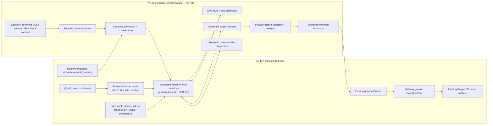

# DVT Current versus Target VTX2 Architecture

This page separates the VTX2 architecture that is **already implemented** from
the accepted semantic-transformation architecture that is still **TARGET** at
`main@da5b97b4376789cc561d54fcdf6663c062727ece`.

The distinction is intentional: accepted design is not implementation evidence.

## Executive summary

VTX2 has already crossed an important architectural threshold:

- Substrait is the accepted semantic reference.
- DVT pins an exact Substrait profile.
- A production contract persists serialized Substrait Plan bytes plus integrity.
- DVT owns a small stable identity/provenance sidecar.
- A machine-readable semantic capability catalog exists.
- The runtime `ExecutionPlan` remains independent from relational operator count.

What is **not** yet complete is the end-to-end product path:

```text
SQL / Canvas / resolved dbt
  -> source/parser adapter
  -> admitted Substrait semantics
  -> stable DVT bindings
  -> card projection
  -> governed renderer
  -> provider-native readiness
  -> semantic workload lowering
  -> generic Planner
  -> ExecutionPlan
```

That flow remains target architecture and must not be presented as fully AS-IS.

## Current and target boundary



## AS-IS: implemented semantic contract

### Pinned Substrait profile

At the inspected baseline the contract pins:

```text
profileId   = dvt.vtx2.substrait.v1
Substrait   = 0.101.0
tag          = v0.101.0
spec commit  = 2653e55516c8c07529cde9bc81c64e4ae3537515
encoding     = substrait-plan-protobuf-base64
```

The pin is explicit so profile skew can be diagnosed rather than silently
changing semantic meaning.

### Semantic Plan envelope

`DvtSubstraitSemanticPlanV1` stores:

- canonical serialized Substrait Plan bytes encoded as base64;
- SHA-256 of those exact bytes.

The contract verifies the digest. Semantic validation/decoding belongs to the
adapter/tooling that understands the pinned proto; the envelope does not invent a
second relational model.

### Stable DVT authoring identity

`DvtSubstraitAuthoringSidecarV1` binds stable DVT identity to Substrait structure:

- `RelationId` -> `rel_anchor`;
- `FieldId` -> relation + output ordinal;
- optional source/provenance and display metadata.

The sidecar is bound to the exact semantic Plan SHA-256.

Its purpose is interactive identity, not relational semantics.

### Semantic capability catalog

The VTX2 catalog records selected semantic identities and product governance
state across categories such as:

- relation;
- expression form;
- scalar function;
- aggregate function;
- window function;
- type.

A catalog entry by itself does **not** imply:

- execution support;
- provider support;
- UI exposure;
- semantic admission.

Those are distinct decisions.

### ExecutionPlan separation already exists

The existing runtime `ExecutionPlan` remains generic and does not model every
Substrait relation/expression/type/function as a runtime step.

The architectural invariant is:

```text
Substrait logical operator count
!= Canvas card count
!= ExecutionPlan step count
```

This is already the required runtime boundary; VTX2 must preserve it.

## TARGET: semantic transformation subsystem

The accepted target adds a source-to-semantics path before the existing generic
Planner/runtime boundary.

### Source representations

Target frontends include:

- Canvas card/field commands;
- governed SQL;
- dbt/Jinja after dbt-native resolution where required;
- future language/DataFrame frontends when justified.

No source language is the universal semantic model.

### Source/parser adapters

A source adapter maps syntax/authoring operations into the supported semantic
profile.

For SQL the target architecture deliberately says **selected SQL parser AST
adapter**. A specific parser such as SQLGlot must not be presented as current DVT
runtime truth until source code commits to it.

### Semantic admission

The broad Substrait universe is a reference dictionary, not an automatic DVT
feature list. Capabilities must be admitted with conformance evidence and remain
separate from provider/rendering/UI support.

### Card projection

The product projects semantic meaning into DVT cards and fields. Presentation
metadata must not become a second semantic registry.

A recursive Substrait relation tree may appear as one semantic card when that is
the appropriate product boundary.

### Governed renderer and provider readiness

Semantic validity is not enough to guarantee that a concrete target provider can
accept generated code.

Target flow therefore keeps these checks separate:

```text
semantic validity
  -> target rendering
  -> provider-native validation / preflight
```

### Semantic workload lowering

Only real runtime responsibilities enter the existing generic Planner. Logical
operators do not become steps mechanically.

Examples of real runtime boundaries may include materialization, external
transfer, control/check work or another explicitly executable responsibility.

## Convergence from current product structures

The target architecture should remove duplicate semantic authorities rather than
add a new parallel framework.

Current-to-target convergence includes:

- existing visual/recipe structures becoming bounded compatibility inputs or
  retiring after deterministic translation;
- one semantic capability authority rather than parallel UI/compiler catalogs;
- avoiding SQL-specific growth of a private DVT relational type hierarchy;
- preserving provider validation, generic planning, run-state and materialization
  ownership in their existing bounded contexts.

## What must not be built

VTX2 explicitly does **not** require:

- a private DVT relational IR parallel to Substrait;
- one DVT class per relational operator;
- a DVT-owned type system where Substrait provides the semantic identity;
- a DVT-owned function system parallel to standard extensions;
- query optimization or join reordering;
- Substrait physical plans as DVT runtime planning;
- automatic exposure of all Substrait capabilities in the UI;
- automatic provider support inferred from semantic validity;
- a second graph/planner abstraction.

## Decision matrix

| Concern | AS-IS authority | VTX2 target change |
| --- | --- | --- |
| Runtime plan | Generic `ExecutionPlan` | Keep unchanged as runtime responsibility model |
| Runtime planner | `@dvt/planner` | Consume lowered semantic workload; do not absorb relational semantics |
| Run lifecycle | `@dvt/engine` | No semantic-authority change |
| State | RunEvents + snapshots | No semantic-authority change |
| Provider execution | `IProviderAdapter` / Temporal | Add readiness after rendering; no provider authority inversion |
| Relational semantics | Pinned Substrait profile contract exists | Complete source mapping/admission/projection/rendering path |
| Stable editable identity | DVT sidecar exists | Use it through roundtrip and visual editing |
| Capability governance | Machine-readable catalog exists | Add conformance/admission and product projections |
| SQL | Existing SQL/dbt paths are not semantic authority | Map governed SQL through selected AST adapter into Substrait |
| Canvas | Existing authoring model | Project/mutate admitted semantic model without second registry |
| dbt | Concrete import/execution integration | Resolve dbt-native syntax before supported semantic mapping where required |

## Completion criteria for the target flow

The semantic subsystem should only be promoted from TARGET when executable
evidence demonstrates, at minimum:

1. source/authoring input maps deterministically into the pinned semantic profile;
2. unsupported semantics fail closed with useful diagnostics;
3. stable `RelationId` / `FieldId` identity survives supported edit/roundtrip cases;
4. card projection and target rendering consume one admitted semantic authority;
5. provider-native validation is distinct from semantic validation;
6. semantic workload lowering produces generic Planner input without one-step-per-operator expansion;
7. SQL -> semantic -> card -> governed SQL roundtrip is proven for the admitted profile;
8. runtime execution still uses existing Planner/Engine/State/Artifacts authorities.

## Sources

- [`docs/adr/ADR-0064-substrait-semantic-reference-and-bounded-logical-profile.md`](../../../adr/ADR-0064-substrait-semantic-reference-and-bounded-logical-profile.md)
- [`docs/architecture/system/subsystems/semantic-transformation/index.md`](../subsystems/semantic-transformation/index.md)
- [`packages/@dvt/contracts/src/substrait.ts`](../../../../packages/@dvt/contracts/src/substrait.ts)
- [`packages/@dvt/contracts/src/contracts/planner/DvtSubstraitProfile.v1.ts`](../../../../packages/@dvt/contracts/src/contracts/planner/DvtSubstraitProfile.v1.ts)
- [`packages/@dvt/contracts/src/contracts/planner/DvtSubstraitCapabilityCatalog.v1.ts`](../../../../packages/@dvt/contracts/src/contracts/planner/DvtSubstraitCapabilityCatalog.v1.ts)
- [`packages/@dvt/contracts/src/contracts/planner/ExecutionPlan.v1.ts`](../../../../packages/@dvt/contracts/src/contracts/planner/ExecutionPlan.v1.ts)
