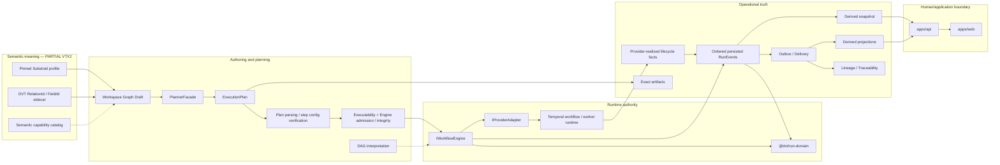

# DVT Runtime and Authority Map

This page identifies **who owns each kind of truth in DVT** at
`main@da5b97b4376789cc561d54fcdf6663c062727ece`.

It is a derived architectural view. Code, tests, composition roots, current
contracts and accepted canonical architecture remain authoritative.

## Why this map exists

DVT deliberately separates semantic meaning, execution planning, runtime
lifecycle, provider execution, persisted state, artifacts, delivery and
presentation. Most serious architecture drift in this system would come from one
boundary silently taking authority from another.

The rule is:

> One kind of truth, one owning boundary.

## Authority map

| Question                                                                | Authority                                  | Current owner                                           | Status                       |
| ----------------------------------------------------------------------- | ------------------------------------------ | ------------------------------------------------------- | ---------------------------- |
| What relational/expression/type/function semantics mean                 | Pinned Substrait profile                   | `@dvt/contracts/substrait` + upstream Substrait         | PARTIAL VTX2                 |
| Which DVT relation/field is this across supported rename/reorder/reload | Stable authoring identity sidecar          | `DvtSubstraitAuthoringSidecarV1`                        | PARTIAL VTX2                 |
| Which semantic capabilities are candidates/admitted/out of scope        | Substrait capability catalog               | `DvtSubstraitCapabilityCatalog.v1`                      | PARTIAL VTX2                 |
| What graph/topology did the user author                                 | Workspace graph authoring boundary         | `apps/api` workspace graph draft + Web authoring        | AS-IS                        |
| What runtime responsibilities should execute                            | Planner / `ExecutionPlan`                  | `@dvt/planner` through `PlannerFacade`                  | AS-IS                        |
| Does a stored plan parse and satisfy step-type configuration rules      | Plan verifier                              | `@dvt/plan-verifier`                                    | AS-IS                        |
| May the current runtime execute the stored plan                         | Executability + Engine admission/integrity | API stored-plan validation + Engine start-run admission | AS-IS                        |
| What are the execution DAG layers/downstream steps                      | Plan interpretation                        | `@dvt/plan-interpreter`                                 | AS-IS                        |
| What run lifecycle commands/status are exposed                          | Engine                                     | `@dvt/engine` / `IWorkflowEngine`                       | AS-IS                        |
| Which run/step transition is legal                                      | Run domain                                 | `@dvt/run-domain`                                       | AS-IS                        |
| Which lifecycle facts are realized once provider execution begins       | Provider runtime / worker                  | Temporal workflow + worker/plugin runtime               | AS-IS                        |
| What happened operationally in DVT                                      | Ordered persisted run events               | `IRunStateStore` / state persistence                    | AS-IS                        |
| What is the canonical run status                                        | Event log + derived snapshot               | Engine read rail over persisted state                   | AS-IS                        |
| What provider-native execution status exists                            | Provider adapter                           | `IProviderAdapter` / `TemporalAdapter`                  | AS-IS, diagnostic/enrichment |
| Which exact immutable object was used/produced                          | Artifact boundary                          | `@dvt/artifacts`                                        | AS-IS                        |
| How facts propagate asynchronously                                      | Delivery/outbox                            | `@dvt/delivery` + `apps/outbox-worker`                  | AS-IS                        |
| What read model/projection is derived                                   | Projector                                  | `apps/projector-worker` / projector boundary            | AS-IS                        |
| How lineage/evidence is processed                                       | Lineage/traceability                       | `apps/lineage-worker` + `@dvt/traceability-service`     | AS-IS                        |
| Who authenticates and authorizes commands                               | API security boundary                      | OIDC/JWKS + scoped authorization + audit                | AS-IS                        |
| How runtime telemetry is emitted                                        | Observability contract                     | `IObservability` + `@dvt/observability-otel`            | PARTIAL coverage             |
| How product state is presented and edited                               | Web/application rails                      | `apps/web` through governed API boundaries              | AS-IS                        |
| Which workflow provider currently executes start-run                    | Start-run adapter truth                    | `StartRunBoundary.v1`                                   | AS-IS: Temporal only         |

## Authority relationships



The VTX2 semantic path is not yet an end-to-end AS-IS implementation; the
profile, semantic document, identity sidecar and capability catalog are real,
while full source-language mapping/rendering/readiness remains target
architecture.

## Non-negotiable authority rules

### Planner versus Engine

- Planner decides runtime responsibilities and constructs the plan.
- Engine accepts a plan reference/context and governs the run lifecycle.
- Engine must not become a second planner.

### Plan Verifier versus runtime admission

`@dvt/plan-verifier` owns reusable plan parsing and step-type configuration
verification. The API and Engine then apply runtime-specific executability,
policy, capability, context and integrity gates.

No single verifier package should be described as the owner of every StartRun
admission rule.

### Engine versus provider

- `IWorkflowEngine` is a DVT-owned application/domain boundary.
- `IProviderAdapter` is the provider execution seam.
- `TemporalAdapter` implements `IProviderAdapter`.
- Temporal is infrastructure, not the source of DVT execution semantics.

### Realized provider facts versus canonical product truth

The canonical run-lifecycle subsystem distinguishes two moments:

1. provider runtimes own the **realized lifecycle facts** once execution reaches
   them;
2. persisted ordered DVT `RunEvents` plus derived snapshots own canonical product
   truth and canonical status.

This lets a worker/runtime originate a fact without making provider memory the
DVT system of record.

### State versus provider status

`IWorkflowEngine.getRunStatus()` returns canonical status from persisted DVT
state. It must not query the provider adapter for canonical status.

Provider status is a separate provider-native view useful for liveness,
diagnostics, reconciliation and enrichment.

### Run Domain versus persistence

Persistence records facts. `@dvt/run-domain` owns legal state transition and
event-folding rules. The database adapter must not invent state semantics.

### State versus Artifacts

State and artifacts deliberately answer different questions:

```text
State     = what happened?
Artifacts = what exact object was used or produced?
```

A plan, compiled object or bundle does not become canonical run state merely
because it is persisted.

### Delivery versus commands/queries

Delivery moves persisted facts downstream. It does not replace explicit
command/query rails. The existence of `IEventBus` does not mean the UI, Planner
or Engine communicate exclusively through a message bus.

### Web versus backend capability truth

The Web plugin registry is statically composed, while runtime availability for
backend-backed plugins is server-projected and fail-closed. The frontend cannot
declare a backend capability available by itself.

### Substrait versus DVT identity

Substrait owns relational/expression/type/function meaning. DVT adds stable
identity/provenance required for interactive authoring.

The sidecar must not grow into a second DVT relational algebra.

```text
Substrait logical operator count
!= Canvas card count
!= ExecutionPlan step count
```

## Forbidden authority inversions

| Invalid design                                                   | Why it is wrong                                                  |
| ---------------------------------------------------------------- | ---------------------------------------------------------------- |
| Temporal status becomes canonical run status                     | Provider availability/state must not replace persisted DVT truth |
| `TemporalAdapter` implements product planning                    | Provider adapters translate/delegate; Planner owns decisions     |
| dbt becomes DVT semantic kernel                                  | dbt is a concrete integration/execution capability               |
| SQL AST becomes universal semantic authority                     | VTX2 assigns semantic meaning to the pinned Substrait profile    |
| Canvas card becomes one runtime step by definition               | Authoring scale and runtime-responsibility scale are independent |
| Substrait operator becomes one runtime step                      | Logical semantics and execution responsibilities are independent |
| Postgres adapter defines legal transitions                       | Run Domain owns transition semantics                             |
| Outbox/event bus replaces command/query boundaries               | Events propagate facts; commands/queries keep explicit rails     |
| Web registry claims backend runtime availability                 | Backend capability truth is server-projected                     |
| New SHA/JCS/UUID implementation appears outside crypto authority | Repository crypto primitives are centralized in `@dvt/crypto`    |

## Ownership summary

```text
Semantic meaning             -> Substrait
Stable interactive identity  -> DVT Substrait sidecar
Boundary vocabulary          -> @dvt/contracts
Crypto primitives            -> @dvt/crypto
Execution decisions          -> @dvt/planner
Plan parsing/config verify   -> @dvt/plan-verifier
Runtime executability        -> API + Engine admission policies
Execution layering           -> @dvt/plan-interpreter
Lifecycle command/read rail  -> @dvt/engine
Transition legality          -> @dvt/run-domain
Provider-realized facts      -> provider workflow / workers / plugins
Operational product truth    -> persisted RunEvents / state store
Exact immutable objects      -> @dvt/artifacts
Provider translation         -> IProviderAdapter implementations
Current workflow provider    -> Temporal
Async fact propagation       -> @dvt/delivery
Read-model derivation        -> projector
Lineage/evidence             -> lineage + traceability
Authentication/authorization -> apps/api security boundary
Presentation                 -> apps/web
```

## Sources

- [`docs/architecture/system/subsystems/canonical-run-lifecycle/index.md`](../subsystems/canonical-run-lifecycle/index.md)
- [`packages/@dvt/engine/src/ports/IWorkflowEngine.ts`](../../../../packages/@dvt/engine/src/ports/IWorkflowEngine.ts)
- [`packages/@dvt/engine/src/adapters/IProviderAdapter.ts`](../../../../packages/@dvt/engine/src/adapters/IProviderAdapter.ts)
- [`packages/@dvt/run-domain/src/index.ts`](../../../../packages/@dvt/run-domain/src/index.ts)
- [`packages/@dvt/planner/src/index.ts`](../../../../packages/@dvt/planner/src/index.ts)
- [`packages/@dvt/plan-interpreter/src/index.ts`](../../../../packages/@dvt/plan-interpreter/src/index.ts)
- [`apps/api/src/application/services/storedExecutablePlan.ts`](../../../../apps/api/src/application/services/storedExecutablePlan.ts)
- [`packages/@dvt/artifacts/src/index.ts`](../../../../packages/@dvt/artifacts/src/index.ts)
- [`packages/@dvt/delivery/src/contracts.ts`](../../../../packages/@dvt/delivery/src/contracts.ts)
- [`packages/@dvt/contracts/src/contracts/engine/StartRunBoundary.v1.ts`](../../../../packages/@dvt/contracts/src/contracts/engine/StartRunBoundary.v1.ts)
- [`packages/@dvt/contracts/src/contracts/planner/DvtSubstraitProfile.v1.ts`](../../../../packages/@dvt/contracts/src/contracts/planner/DvtSubstraitProfile.v1.ts)
- [`apps/web/src/app/plugins/registry.ts`](../../../../apps/web/src/app/plugins/registry.ts)
